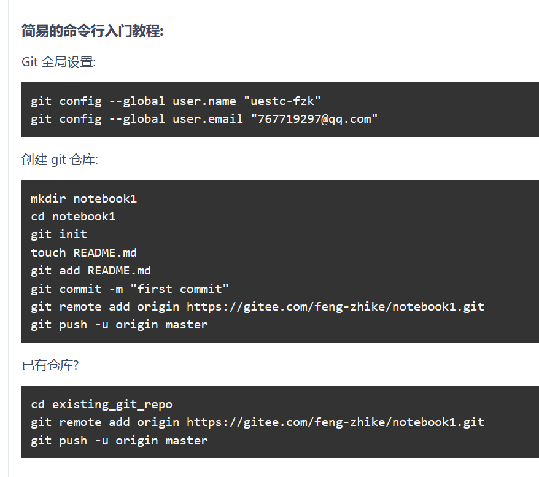
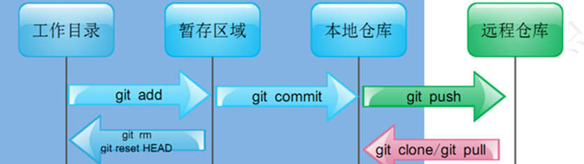

# 资料

> 权威Git书籍：http://git.oschina.net/progit/
>
> Git入门教程：https://www.liaoxuefeng.com/wiki/896043488029600/896067008724000
>
> Gitee帮助指南：https://gitee.com/help#article-header0


# 版本控制工具简介

## 1.1什么是版本控制工具

版本控制工具提供完备的版本管理功能，用于存储、追踪目录（文件夹）和文件的修改历史，是软件开发者的必备工具，是软件公司的基础设施。

版本控制**最主要的功能就是追踪文件的变更**。它将什么时候、什么人更改了文件的什么内容等信息忠实地了已录下来。每一次文件的改变，文件的版本号都将增加。除了记录版本变更外，版本控制的另一个重要功能是并行开发。软件开发往往是多人协同作业，版本控制可以有效地解决版本的同步以及不同开发者之间的开发通信问题，提高协同开发的效率。并行开发中最常见的不同版本软件的错误(Bug)修正问题也可以通过版本控制中分支与合并的方法有效地解决。


版本控制工具的作用：

    （1）协同开发
            团队协作共同完成同一个项目
    （2）版本管理
            以不断提升项目版本的方式逐步完成项目。
    （3）数据备份
            开发中以版本控制的形式保存每一个历史版本。
    （4）权限控制
            对团队开发人员进行不同的权限分配。
    （5）分支管理
            允许开发团队在工作过程中多条生产线同时推进任务，进一步提高效率。

## 1.2 市场上常见的版本控制工具及分类

    a. 集中式版本控制工具
        CVS、SVN、VSS……
        
    不同的客户端直接跟服务器端交互工作，可以进行提交操作、克隆操作等。
    不同客户端之间是相互独立的。
    
    b. 分布式版本控制工具
        Git、Mercurial、Bazaar、Darcs……


    每个用户都有自己在本地的仓库，用来管理版本控制，每个客户端也同时是一个服务器。
    同时也可以用一个专门的服务器的仓库用来管理。 


## Git简介

### 2.1 Git概述
Git 是一个开源的分布式版本控制系统，用于敏捷高效地处理任何或小或大的项目。

Git 是 Linus Torvalds 为了帮助管理 Linux 内核开发而开发的一个开放源码的版本控制软件。

Git 与常用的版本控制工具 CVS, Subversion 等不同，它采用了分布式版本库的方式，不必服务器端软件支持。

### 2.2 Git历史简介

	Git创建历史解读：
	时间				事件
	
	1991年				Linus在1991年创建了开源的Linux，从此，Linux系统不断发展，已经成为最大的服务器系统软件了
	2002年以前			世界各地的志愿者把源代码文件通过diff的方式发给Linus（Linus坚定地反对CVS和SVN，这些集中式的版本控制系统不但速度慢，而且必须联网才能使用。有一些商用的版本控制系统，虽然比CVS、SVN好用，但那是付费的，和Linux的开源精神不	符）
	2002年				Linux系统已经发展了十年了，代码库之大让Linus很难继续通过手工方式管理了。Linus选择了一个商业的版本控制系统BitKeeper，BitKeeper的东家BitMover公司出于人道主义精神，授权Linux社区免费使用这个版本控制系统
	2005年				开发Samba（Samba是在Linux和UNIX系统上实现SMB协议的一个免费软件）的Andrew试图破解BitKeeper的协议，被BitMover公司发现了，于是BitMover公司在愤怒中收回了Linux社区对于BitKeeper的免费使用权
	同是2005年			Linus在没有版本控制系统的窘境下，自己用C语言写了一个分	布式版本控制系统，这就是Git
					值得一提的是，Linus仅仅使用两周时间就完成了Git的创建
					Git创建完毕的一个月后，Linux系统的源码正式由Git管理
	2008年				GitHub网站上线了，它为开源项目免费提供Git存储，无数开源项目开始迁移至GitHub，包括jQuery，PHP，Ruby等等
	
	如今，GitHub+Git的开发模式已经被全世界所认可，已然成为了全世界应用最广泛的分布式版本控制管理工具。

### 2.3 Git官网
	官网地址：https://git-scm.com/

### 2.4 Git的优点
（1）适合分布式开发，强调个体。
（2）公共服务器压力和数据量都不会太大。
（3）速度快、灵活。
（4）相对容易的解决冲突。
（5）大部分操作在本地完成，不需要联网。


# 快速开始



1. 先在Gitee上建立新仓库
2. 在本地找个文件夹，然后Git Bash here，git config user.name 'uestc-fzk'   git config user.email 'xxx';
3. Git clone：复制仓库结构
4. 将需要上传的文件复制到出现的新文件夹下
5. `git add .`：将所有文件都加入到暂存区
6. git commit -m '第1次提交'
7. git push -u origin master

> 也可以按照上面图片的步骤来。

# Git 学习

## Git工作流程

一般工作流程如下：

1. 克隆 Git 资源作为工作目录。
2. 在克隆的资源上添加或修改文件。
3. 如果其他人修改了，你可以更新资源。
4. 在提交前查看修改。
5. 提交修改。
6. 在修改完成后，如果发现错误，可以撤回提交并再次修改并提交。


## Git 工作区、暂存区和版本库


### 基本概念
我们先来理解下 Git 工作区、暂存区和版本库概念：

>工作区：就是你在电脑里能看到的目录。

>暂存区：英文叫 stage 或 index。一般存放在 .git 目录下的 index 文件（.git/index）中，所以我们把暂存区有时也叫作索引（index）。

>版本库：工作区有一个隐藏目录 .git，这个不算工作区，而是 Git 的版本库。


- 图中左侧为工作区，右侧为版本库。在版本库中标记为 "index" 的区域是暂存区（stage/index），标记为 "master" 的是 master 分支所代表的目录树。

- 图中我们可以看出此时 "HEAD" 实际是指向 master 分支的一个"游标"。所以图示的命令中出现 HEAD 的地方可以用 master 来替换。

- 图中的 objects 标识的区域为 Git 的对象库，实际位于 ".git/objects" 目录下，里面包含了创建的各种对象及内容。

- 当对工作区修改（或新增）的文件执行 git add 命令时，暂存区的目录树被更新，同时工作区修改（或新增）的文件内容被写入到对象库中的一个新的对象中，而该对象的ID被记录在暂存区的文件索引中。

- 当执行提交操作（git commit）时，暂存区的目录树写到版本库（对象库）中，master 分支会做相应的更新。即 master 指向的目录树就是提交时暂存区的目录树。

- 当执行 git reset HEAD 命令时，暂存区的目录树会被重写，被 master 分支指向的目录树所替换，但是工作区不受影响。

- 当执行 git rm --cached <file> 命令时，会直接从暂存区删除文件，工作区则不做出改变。

- 当执行 git checkout . 或者 git checkout -- <file> 命令时，会用暂存区全部或指定的文件替换工作区的文件。这个操作很危险，会清除工作区中未添加到暂存区的改动。

- 当执行 git checkout HEAD . 或者 git checkout HEAD <file> 命令时，会用 HEAD 指向的 master 分支中的全部或者部分文件替换暂存区和以及工作区中的文件。这个命令也是极具危险性的，因为不但会清除工作区中未提交的改动，也会清除暂存区中未提交的改动。

### 基本操作

将工作目录的代码先提交到暂存区，然后再由暂存区提交到本地仓库


# Git 常用命令

## 仓库
```git
# 在当前目录新建一个Git代码库
$ git init

# 新建一个目录，将其初始化为Git代码库
$ git init [project-name]

# 下载一个项目和它的整个代码历史
$ git clone [url]
```

## 配置
```git
# 显示当前的Git配置
$ git config --list

# 编辑Git配置文件
$ git config -e [--global]

# 设置提交代码时的用户信息
$ git config [--global] user.name "[name]"
$ git config [--global] user.email "[email address]"
```
## 增加/删除文件
```git
# 添加指定文件到暂存区
$ git add [file1] [file2] ...

# 添加指定目录到暂存区，包括子目录
$ git add [dir]

# 添加当前目录的所有文件到暂存区
$ git add .

# 添加每个变化前，都会要求确认
# 对于同一个文件的多处变化，可以实现分次提交
$ git add -p

# 删除工作区文件，并且将这次删除放入暂存区
$ git rm [file1] [file2] ...

# 停止追踪指定文件，但该文件会保留在工作区
$ git rm --cached [file]

# 改名文件，并且将这个改名放入暂存区
$ git mv [file-original] [file-renamed]
```
## 代码提交
```git
# 提交暂存区到仓库区
$ git commit -m [message]

# 提交暂存区的指定文件到仓库区
$ git commit [file1] [file2] ... -m [message]

# 提交工作区自上次commit之后的变化，直接到仓库区
$ git commit -a

# 提交时显示所有diff信息
$ git commit -v

# 使用一次新的commit，替代上一次提交
# 如果代码没有任何新变化，则用来改写上一次commit的提交信息
$ git commit --amend -m [message]

# 重做上一次commit，并包括指定文件的新变化
$ git commit --amend [file1] [file2] ...
```
## 分支
```git
# 列出所有本地分支
$ git branch

# 列出所有远程分支
$ git branch -r

# 列出所有本地分支和远程分支
$ git branch -a

# 新建一个分支，但依然停留在当前分支
$ git branch [branch-name]

# 新建一个分支，并切换到该分支
$ git checkout -b [branch]

# 新建一个分支，指向指定commit
$ git branch [branch] [commit]

# 新建一个分支，与指定的远程分支建立追踪关系
$ git branch --track [branch] [remote-branch]

# 切换到指定分支，并更新工作区
$ git checkout [branch-name]

# 切换到上一个分支
$ git checkout -

# 建立追踪关系，在现有分支与指定的远程分支之间
$ git branch --set-upstream [branch] [remote-branch]

# 合并指定分支到当前分支
$ git merge [branch]

# 选择一个commit，合并进当前分支
$ git cherry-pick [commit]

# 删除分支
$ git branch -d [branch-name]

# 删除远程分支
$ git push origin --delete [branch-name]
$ git branch -dr [remote/branch]
```
## 标签
```git
# 列出所有tag
$ git tag

# 新建一个tag在当前commit
$ git tag [tag]

# 新建一个tag在指定commit
$ git tag [tag] [commit]

# 删除本地tag
$ git tag -d [tag]

# 删除远程tag
$ git push origin :refs/tags/[tagName]

# 查看tag信息
$ git show [tag]

# 提交指定tag
$ git push [remote] [tag]

# 提交所有tag
$ git push [remote] --tags

# 新建一个分支，指向某个tag
$ git checkout -b [branch] [tag]
```
## 查看信息
```git
# 显示有变更的文件
$ git status

# 显示当前分支的版本历史
$ git log

# 显示commit历史，以及每次commit发生变更的文件
$ git log --stat

# 搜索提交历史，根据关键词
$ git log -S [keyword]

# 显示某个commit之后的所有变动，每个commit占据一行
$ git log [tag] HEAD --pretty=format:%s

# 显示某个commit之后的所有变动，其"提交说明"必须符合搜索条件
$ git log [tag] HEAD --grep feature

# 显示某个文件的版本历史，包括文件改名
$ git log --follow [file]
$ git whatchanged [file]

# 显示指定文件相关的每一次diff
$ git log -p [file]

# 显示过去5次提交
$ git log -5 --pretty --oneline

# 显示所有提交过的用户，按提交次数排序
$ git shortlog -sn

# 显示指定文件是什么人在什么时间修改过
$ git blame [file]

# 显示暂存区和工作区的差异
$ git diff

# 显示暂存区和上一个commit的差异
$ git diff --cached [file]

# 显示工作区与当前分支最新commit之间的差异
$ git diff HEAD

# 显示两次提交之间的差异
$ git diff [first-branch]...[second-branch]

# 显示今天你写了多少行代码
$ git diff --shortstat "@{0 day ago}"

# 显示某次提交的元数据和内容变化
$ git show [commit]

# 显示某次提交发生变化的文件
$ git show --name-only [commit]

# 显示某次提交时，某个文件的内容
$ git show [commit]:[filename]

# 显示当前分支的最近几次提交
$ git reflog
远程同步
# 下载远程仓库的所有变动
$ git fetch [remote]

# 显示所有远程仓库
$ git remote -v

# 显示某个远程仓库的信息
$ git remote show [remote]

# 增加一个新的远程仓库，并命名
$ git remote add [shortname] [url]

# 取回远程仓库的变化，并与本地分支合并
$ git pull [remote] [branch]

# 上传本地指定分支到远程仓库
$ git push [remote] [branch]

# 强行推送当前分支到远程仓库，即使有冲突
$ git push [remote] --force

# 推送所有分支到远程仓库
$ git push [remote] --all
```
## 撤销
```git
# 恢复暂存区的指定文件到工作区
$ git checkout [file]

# 恢复某个commit的指定文件到暂存区和工作区
$ git checkout [commit] [file]

# 恢复暂存区的所有文件到工作区
$ git checkout .

# 重置暂存区的指定文件，与上一次commit保持一致，但工作区不变
$ git reset [file]

# 重置暂存区与工作区，与上一次commit保持一致
$ git reset --hard

# 重置当前分支的指针为指定commit，同时重置暂存区，但工作区不变
$ git reset [commit]

# 重置当前分支的HEAD为指定commit，同时重置暂存区和工作区，与指定commit一致
$ git reset --hard [commit]

# 重置当前HEAD为指定commit，但保持暂存区和工作区不变
$ git reset --keep [commit]

# 新建一个commit，用来撤销指定commit
# 后者的所有变化都将被前者抵消，并且应用到当前分支
$ git revert [commit]

暂时将未提交的变化移除，稍后再移入
$ git stash
$ git stash pop
```
## 其他
```git
# 生成一个可供发布的压缩包
$ git archive
```

# git提交注意

https://www.oschina.net/news/69705/git-commit-message-and-changelog-guide