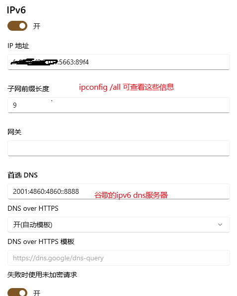

# 资料

> 权威Git书籍：http://git.oschina.net/progit/
>
> Gitee帮助指南：https://gitee.com/help#article-header0


# 版本控制工具简介

## 1.1什么是版本控制工具

版本控制工具提供完备的版本管理功能，用于存储、追踪目录（文件夹）和文件的修改历史，是软件开发者的必备工具，是软件公司的基础设施。

版本控制**最主要的功能就是追踪文件的变更**。它将什么时候、什么人更改了文件的什么内容等信息忠实地了已录下来。每一次文件的改变，文件的版本号都将增加。除了记录版本变更外，版本控制的另一个重要功能是并行开发。软件开发往往是多人协同作业，版本控制可以有效地解决版本的同步以及不同开发者之间的开发通信问题，提高协同开发的效率。并行开发中最常见的不同版本软件的错误(Bug)修正问题也可以通过版本控制中分支与合并的方法有效地解决。


版本控制工具的作用：

    （1）协同开发
            团队协作共同完成同一个项目
    （2）版本管理
            以不断提升项目版本的方式逐步完成项目。
    （3）数据备份
            开发中以版本控制的形式保存每一个历史版本。
    （4）权限控制
            对团队开发人员进行不同的权限分配。
    （5）分支管理
            允许开发团队在工作过程中多条生产线同时推进任务，进一步提高效率。

## 1.2 市场上常见的版本控制工具及分类

    a. 集中式版本控制工具
        CVS、SVN、VSS……
        
    不同的客户端直接跟服务器端交互工作，可以进行提交操作、克隆操作等。
    不同客户端之间是相互独立的。
    
    b. 分布式版本控制工具
        Git、Mercurial、Bazaar、Darcs……


    每个用户都有自己在本地的仓库，用来管理版本控制，每个客户端也同时是一个服务器。
    同时也可以用一个专门的服务器的仓库用来管理。 


## Git简介

### 2.1 Git概述
Git 是一个开源的分布式版本控制系统，用于敏捷高效地处理任何或小或大的项目。

Git 是 Linus Torvalds 为了帮助管理 Linux 内核开发而开发的一个开放源码的版本控制软件。

Git 与常用的版本控制工具 CVS, Subversion 等不同，它采用了分布式版本库的方式，不必服务器端软件支持。

### 2.2 Git历史简介

	Git创建历史解读：
	时间				事件
	
	1991年				Linus在1991年创建了开源的Linux，从此，Linux系统不断发展，已经成为最大的服务器系统软件了
	2002年以前			世界各地的志愿者把源代码文件通过diff的方式发给Linus（Linus坚定地反对CVS和SVN，这些集中式的版本控制系统不但速度慢，而且必须联网才能使用。有一些商用的版本控制系统，虽然比CVS、SVN好用，但那是付费的，和Linux的开源精神不	符）
	2002年				Linux系统已经发展了十年了，代码库之大让Linus很难继续通过手工方式管理了。Linus选择了一个商业的版本控制系统BitKeeper，BitKeeper的东家BitMover公司出于人道主义精神，授权Linux社区免费使用这个版本控制系统
	2005年				开发Samba（Samba是在Linux和UNIX系统上实现SMB协议的一个免费软件）的Andrew试图破解BitKeeper的协议，被BitMover公司发现了，于是BitMover公司在愤怒中收回了Linux社区对于BitKeeper的免费使用权
	同是2005年			Linus在没有版本控制系统的窘境下，自己用C语言写了一个分	布式版本控制系统，这就是Git
					值得一提的是，Linus仅仅使用两周时间就完成了Git的创建
					Git创建完毕的一个月后，Linux系统的源码正式由Git管理
	2008年				GitHub网站上线了，它为开源项目免费提供Git存储，无数开源项目开始迁移至GitHub，包括jQuery，PHP，Ruby等等
	
	如今，GitHub+Git的开发模式已经被全世界所认可，已然成为了全世界应用最广泛的分布式版本控制管理工具。

### 2.3 Git官网
	官网地址：https://git-scm.com/

### 2.4 Git的优点
（1）适合分布式开发，强调个体。
（2）公共服务器压力和数据量都不会太大。
（3）速度快、灵活。
（4）相对容易的解决冲突。
（5）大部分操作在本地完成，不需要联网。

# Git 学习

## Git工作流程

一般工作流程如下：

1. 克隆 Git 资源作为工作目录。
2. 在克隆的资源上添加或修改文件。
3. 如果其他人修改了，你可以更新资源。
4. 在提交前查看修改。
5. 提交修改。
6. 在修改完成后，如果发现错误，可以撤回提交并再次修改并提交。


## Git 工作区、暂存区和版本库


### 基本概念
我们先来理解下 Git 工作区、暂存区和版本库概念：

>工作区：就是你在电脑里能看到的目录。

>暂存区：英文叫 stage 或 index。一般存放在 .git 目录下的 index 文件（.git/index）中，所以我们把暂存区有时也叫作索引（index）。

>版本库：工作区有一个隐藏目录 .git，这个不算工作区，而是 Git 的版本库。


- 图中左侧为工作区，右侧为版本库。在版本库中标记为 "index" 的区域是暂存区（stage/index），标记为 "master" 的是 master 分支所代表的目录树。

- 图中我们可以看出此时 "HEAD" 实际是指向 master 分支的一个"游标"。所以图示的命令中出现 HEAD 的地方可以用 master 来替换。

- 图中的 objects 标识的区域为 Git 的对象库，实际位于 ".git/objects" 目录下，里面包含了创建的各种对象及内容。

- 当对工作区修改（或新增）的文件执行 git add 命令时，暂存区的目录树被更新，同时工作区修改（或新增）的文件内容被写入到对象库中的一个新的对象中，而该对象的ID被记录在暂存区的文件索引中。

- 当执行提交操作（git commit）时，暂存区的目录树写到版本库（对象库）中，master 分支会做相应的更新。即 master 指向的目录树就是提交时暂存区的目录树。

- 当执行 git reset HEAD 命令时，暂存区的目录树会被重写，被 master 分支指向的目录树所替换，但是工作区不受影响。

- 当执行 git rm --cached <file> 命令时，会直接从暂存区删除文件，工作区则不做出改变。

- 当执行 git checkout . 或者 git checkout -- <file> 命令时，会用暂存区全部或指定的文件替换工作区的文件。这个操作很危险，会清除工作区中未添加到暂存区的改动。

- 当执行 git checkout HEAD . 或者 git checkout HEAD <file> 命令时，会用 HEAD 指向的 master 分支中的全部或者部分文件替换暂存区和以及工作区中的文件。这个命令也是极具危险性的，因为不但会清除工作区中未提交的改动，也会清除暂存区中未提交的改动。

### 基本操作

将工作目录的代码先提交到暂存区，然后再由暂存区提交到本地仓库


# Git 常用命令

图源: https://github.com/521xueweihan/git-tips


# git提交消息格式

https://www.oschina.net/news/69705/git-commit-message-and-changelog-guide

# git配置代理

github不太稳定，可以搞个vpn，然后git配置代理:

```shell
git config --global http.proxy http://127.0.0.1:{port}
git config --global https.proxy https://127.0.0.1:{port}
git config --global -l
```

**这个端口就是VPN的代理端口，不同vpn软件各不相同。**
git配置代理后所有git流量都从该端口转发, 如果vpn没开会出错, 此时需要关闭git代理。
取消git的代理配置: 

```shell
git config --global --unset http.proxy
git config --global --unset https.proxy
git config --global -l
```


# dns污染github

https://blog.csdn.net/hjy_mysql/article/details/131596257

当开不开代理都出现无法连接时，有两个办法：

```
PS C:\Users\76771> git clone git@github.com:uestc-fzk/notebook.git
Cloning into 'notebook'...
ssh: connect to host github.com port 22: Connection refused
fatal: Could not read from remote repository.

Please make sure you have the correct access rights
and the repository exists.
```

办法1：从git协议改用https协议，但git push需要登录。

无本地仓库直接git clone远程仓库https链接。

有本地仓库则在其目录执行 git config --local -e，将url配置项改为https格式的即可。

这个其实就是修改的本地仓库目录下.git/config文件。

办法2：判断DNS污染

既然是与github建立ssh连接时报错，看一下ssh日志：

```
PS C:\Users\76771> ssh -vT git@github.com
OpenSSH_for_Windows_9.5p1, LibreSSL 3.8.2
debug1: Reading configuration data C:\\Users\\76771/.ssh/config
debug1: Connecting to github.com [127.0.0.1] port 22.
debug1: connect to address 127.0.0.1 port 22: Connection refused
ssh: connect to host github.com port 22: Connection refused
```

蚌埠住了，github.com被DNS解析为127本机地址了。

用nslookup命令查一下dns解析情况：

```
PS C:\Users\76771> nslookup github.com
服务器:  UnKnown
Address:  fe80::36ca:81ff:fee8:d7b

非权威应答:
名称:    github.com
Address:  127.0.0.1

PS C:\Users\76771> nslookup github.com 8.8.8.8
服务器:  dns.google
Address:  8.8.8.8

非权威应答:
名称:    github.com
Address:  20.205.243.166
```

可以看到默认dns解析被污染了，而指定谷歌dns服务器(8.8.8.8)则能正常解析。

那么此时要么按照方法1改为https链接，要么去hosts文件手动指定github.com的ip地址(治标不治本)。

还有个办法解决dns污染：设置静态ip并设置谷歌dns：




这样就在开代理情况下就可以正常通过git协议push仓库了。

此时再nslookup命令解析一下就正确了：

```
PS C:\Users\76771> nslookup github.com
服务器:  dns.google
Address:  8.8.8.8

非权威应答:
名称:    github.com
Address:  20.205.243.166
```


感觉这样好麻烦，还是改回DHCP和自动DNS，然后使用https协议访问远程仓库吧。