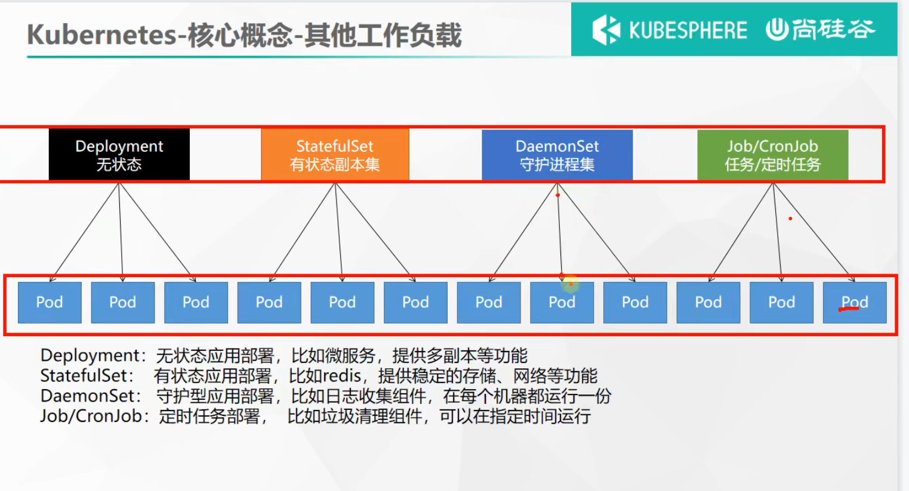

#  资料

官网(有中文文档)：https://kubernetes.io/zh/

Kubernetes：https://www.orchome.com/1333

尚硅谷语雀笔记：https://www.yuque.com/leifengyang/oncloud

# 环境搭建(Kubeadm)

Kubeadm 是一个提供了 `kubeadm init` 和 `kubeadm join` 的工具， 作为创建 Kubernetes 集群的 “快捷途径” 的最佳实践。
这个工具能通过两条指令完成一个kubernetes集群的部署：

```shell
# 创建一个 Master 节点
kubeadm init --<args>

# 将一个 Node 节点加入到当前集群中
kubeadm join <Master节点的IP和端口 >
```

kubeadm 通过执行必要的操作来启动和运行最小可用集群。 按照设计，它只关注启动引导，而非配置机器。同样的， 安装各种 “锦上添花” 的扩展，例如 Kubernetes Dashboard、 监控方案、以及特定云平台的扩展，都不在讨论范围内

## 环境说明

这里我的系统环境和软件版本选择如下：

| 系统或软件    | 版本号     |
| ------------- | ---------- |
| 操作系统Linux | CentOS 7.6 |
| kubernetes    | 1.20.9     |
| docker-ce     | 18.06.1-ce |

对于版本说明：虽然说查看kubernetes在GitHub上的CHANGELOG可以看到最新的1.23.x已经支持到docker 20.10.7以下了，但是我特么跑出来有问题。

最终多次尝试，甚至将centos从8.2降到了7.6，终于在上面这个版本配置下成功了。

在3台轻量云服务器上进行环境配置：

| 服务器      | 角色       | 公网IP         |
| ----------- | ---------- | -------------- |
| 腾讯云4核8G | k8s-master | 124.223.192.8  |
| 腾讯云2核4G | k8s-node1  | 101.34.5.36    |
| 阿里云2核2G | k8s-node2  | 106.15.235.113 |

## 安装kubeadm

从官方文档的这里开始：https://kubernetes.io/zh/docs/reference/setup-tools/kubeadm/，按照这里一步一步的搭建，在其中的某些步骤需要更改到国内的阿里云镜像。

### 准备开始

首先有一些机器的要求如下：

> - 一台兼容的 Linux 主机。Kubernetes 项目为基于 Debian 和 Red Hat 的 Linux 发行版以及一些不提供包管理器的发行版提供通用的指令
> - 每台机器 2 GB 或更多的 RAM （如果少于这个数字将会影响你应用的运行内存)
> - 2 CPU 核或更多
> - 集群中的所有机器的网络**彼此均能相互连接**(公网和内网都可以)
> - **节点之中不可以有重复的主机名**、MAC 地址或 product_uuid。请参见[这里](https://kubernetes.io/zh/docs/setup/production-environment/tools/kubeadm/install-kubeadm/#verify-mac-address)了解更多详细信息。
> - **开启机器上的某些端口**。请参见[这里](https://kubernetes.io/zh/docs/setup/production-environment/tools/kubeadm/install-kubeadm/#check-required-ports) 了解更多详细信息。
> - 禁用交换分区。为了保证 kubelet 正常工作，你 **必须禁用交换分区**。

我的3台服务器均满足前4点，接下从剩下来的一条条配置：

#### 设置不同主机名

```shell
#各个机器设置自己的主机名
hostnamectl set-hostname k8s-xxx
```

分别设置k8s-master，k8s-node1，k8s-node2

然后修改3台服务器的/etc/hosts文件，将这几个主机名增加到域名映射规则，结果如下：

```shell
[root@k8s-master ~]# cat /etc/hosts
127.0.0.1 VM-4-15-centos VM-4-15-centos
127.0.0.1 localhost.localdomain localhost
127.0.0.1 localhost4.localdomain4 localhost4

::1 VM-4-15-centos VM-4-15-centos
::1 localhost.localdomain localhost
::1 localhost6.localdomain6 localhost6

124.223.192.8 k8s-master
101.34.5.36 k8s-node1
106.15.235.113 k8s-node2
```

此时，这3台服务器互相ping主机名要求能ping通，命令`ping -c 2 k8s-master`等

#### 检查所需端口

启用这些[必要的端口](https://kubernetes.io/zh/docs/reference/ports-and-protocols/)后才能使 Kubernetes 的各组件相互通信：


这个必要的端口，有点多啊，为了方便，直接关掉3台服务器的防火墙(这里需要注意的是，像阿里云腾讯云这种云服务器，不仅仅有机器本身的防火墙，云厂商那边还有一个防火墙，云厂商的防火墙需要配置开放规则)

```shell
systemctl stop firewalld # 停止防火墙
systemctl disable firewalld # 关闭开机自启动
```

#### 禁用swap分区

Swap分区在系统的物理内存不够用的时候，把硬盘内存中的一部分空间释放出来，以供当前运行的程序使用。那些被释放的空间可能来自一些很长时间没有什么操作的程序，这些被释放的空间被临时保存到Swap分区中，等到那些程序要运行时，再从Swap分区中恢复保存的数据到内存中。

```shell
swapoff -a   # 临时关闭
sed -ri 's/.*swap.*/#&/' /etc/fstab  # 永久关闭
```

可以使用 free命令查看

```shell
[root@k8s-master ~]# free -m
              total        used        free      shared  buff/cache   available
Mem:           7820        1137        3656           2        3027        6374
Swap:             0           0           0
```

可以看到swap部分全是0。

#### 时间同步

```shell
yum install ntpdate -y
# 都同步到阿里云时间服务器
ntpdate ntp1.aliyun.com
```

### 允许 iptables 检查桥接流量

确保 `br_netfilter` 模块被加载。这一操作可以通过运行 `lsmod | grep br_netfilter` 来完成。若要显式加载该模块，可执行 `sudo modprobe br_netfilter`。

为了让你的 Linux 节点上的 iptables 能够正确地查看桥接流量，你需要确保在你的 `sysctl` 配置中将 `net.bridge.bridge-nf-call-iptables` 设置为 1。例如：

```bash
cat <<EOF | sudo tee /etc/modules-load.d/k8s.conf
br_netfilter
EOF

cat <<EOF | sudo tee /etc/sysctl.d/k8s.conf
net.bridge.bridge-nf-call-ip6tables = 1
net.bridge.bridge-nf-call-iptables = 1
EOF
sudo sysctl --system
```

更多的相关细节可查看[网络插件需求](https://kubernetes.io/zh/docs/concepts/extend-kubernetes/compute-storage-net/network-plugins/#network-plugin-requirements)页面。

### 安装runtime

为了在 Pod 中运行容器，Kubernetes 使用 [容器运行时（Container Runtime）](https://kubernetes.io/zh/docs/setup/production-environment/container-runtimes)。
默认情况下，Kubernetes 使用 [容器运行时接口（Container Runtime Interface，CRI）](https://kubernetes.io/zh/docs/concepts/overview/components/#container-runtime) 来与你所选择的容器运行时交互。

说白了，就是要安装像docker这样的容器。

#### 安装docker

k8s关于安装容器的文档：https://kubernetes.io/zh/docs/setup/production-environment/container-runtimes/
但是呢，安装docker这部分的话，还是得去参考阿里云的docker镜像进行安装https://developer.aliyun.com/mirror/docker-ce，因为国内需要配置阿里云的docker镜像进行加速才能正常下载容器镜像。

在阿里云这边进行安装的时候需要注意，k8s对于docker版本很严格(或者说兼容性很差)，这里可以去k8s的GitHub找到CHANGELOG，
查看k8s某个版本支持的docker版本。在确定k8s版本是1.20的情况下，我选择的docker版本是18.06.1-ce。

#### 配置cgroup 驱动

配置 Docker 守护程序，尤其是使用 systemd 来管理容器的 cgroup。这里顺便再配置个阿里云的镜像加速器：

```shell
sudo mkdir /etc/docker
cat <<EOF | sudo tee /etc/docker/daemon.json
{
  "registry-mirrors": ["https://b9pmyelo.mirror.aliyuncs.com"],
  "exec-opts": ["native.cgroupdriver=systemd"],
  "log-driver": "json-file",
  "log-opts": {
    "max-size": "100m"
  },
  "storage-driver": "overlay2"
}
EOF


sudo systemctl enable docker
sudo systemctl daemon-reload
sudo systemctl restart docker
```

这里第一个是加速器，其它的是配置守护程序的。

> **警告：**
> 你需要确保容器运行时和 kubelet 所使用的是相同的 cgroup 驱动，否则 kubelet 进程会失败。相关细节可参见[配置 cgroup 驱动](https://kubernetes.io/zh/docs/tasks/administer-cluster/kubeadm/configure-cgroup-driver/)。

### 安装 kubeadm、kubelet 和 kubectl

你需要在每台机器上安装以下的软件包：

- `kubeadm`：用来初始化集群的指令。
- `kubelet`：在集群中的每个节点上用来启动 Pod 和容器等。
- `kubectl`：用来与集群通信的命令行工具。

kubeadm **不能** 帮你安装或者管理 `kubelet` 或 `kubectl`，所以你需要 确保它们与通过 kubeadm 安装的控制平面的版本相匹配。 如果不这样做，则存在发生版本偏差的风险，可能会导致一些预料之外的错误和问题。

由于官方配置的yum源地址在国外，所以又去阿里云找到了kubernetes的镜像：https://developer.aliyun.com/mirror/kubernetes，然后按照阿里云教程进行下载如下：

```shell
cat <<EOF | sudo tee /etc/yum.repos.d/kubernetes.repo
[kubernetes]
name=Kubernetes
baseurl=http://mirrors.aliyun.com/kubernetes/yum/repos/kubernetes-el7-x86_64
enabled=1
gpgcheck=1
repo_gpgcheck=1
gpgkey=http://mirrors.aliyun.com/kubernetes/yum/doc/yum-key.gpg
   http://mirrors.aliyun.com/kubernetes/yum/doc/rpm-package-key.gpg
EOF

# 将 SELinux 设置为 permissive 模式（相当于将其禁用）
sudo setenforce 0
sudo sed -i 's/^SELINUX=enforcing$/SELINUX=permissive/' /etc/selinux/config
# 这里一定要指定下载版本为1.20.9
sudo yum install -y kubelet-1.20.9 kubeadm-1.20.9 kubectl-1.20.9

# 设置开启自启动并立刻启动kubelet
sudo systemctl enable kubelet && systemctl start kubelet
```

kubelet 现在每隔几秒就会重启，因为它陷入了一个等待 kubeadm 指令的死循环。

### 配置 cgroup 驱动程序

> **警告：**你需要确保容器运行时和 kubelet 所使用的是相同的 cgroup 驱动，否则 kubelet 进程会失败。相关细节可参见[配置 cgroup 驱动](https://kubernetes.io/zh/docs/tasks/administer-cluster/kubeadm/configure-cgroup-driver/)。

只要docker那边配好了，kubelet这边可以不用配置，因为默认就是以systemd作为cgroup驱动。

那么至此，环境就算是安装好了，接下来是配置环境。

## kubeadm init

文档地址：https://kubernetes.io/zh/docs/reference/setup-tools/kubeadm/kubeadm-init/#config-file

此命令初始化一个 Kubernetes 控制平面节点。

"init" 命令执行很多个阶段，其中第一个阶段为`preflight       Run pre-flight checks`，这个阶段特别容易出错，几乎只要前面有任何地方配置错误什么的，这里必warning甚至error。

在init命令执行的时候，要时刻注意出现的什么warning和error，然后上网找到解决方法，也可以去k8s的GitHub的issue页面搜索这些问题，90%情况有。

参数选项常用的：

```shell
--apiserver-advertise-address string # API 服务器所公布的其正在监听的 IP 地址。如果未设置，则使用默认网络接口。
--apiserver-bind-port int32    # API 服务器绑定的端口，默认值：6443
--config string	# kubeadm 配置文件的路径。
--control-plane-endpoint string   # 为控制平面指定一个稳定的 IP 地址或 DNS 名称
--image-repository string    # 选择用于拉取控制平面镜像的容器仓库，默认值："k8s.gcr.io"
--kubernetes-version string  # 为控制平面选择一个特定的 Kubernetes 版本。   默认值："stable-1"
--pod-network-cidr string # pod 网络可以使用的 IP 地址段。如果设置了这个参数，控制平面将会为每一个节点自动分配 CIDRs
--service-cidr string     默认值："10.96.0.0/12"
```

### 初始化主节点

对于目前这个案例，初始化一个控制平面结点，即初始化主节点：**只对主节点执行以下命令**

```shell
kubeadm init \
--image-repository registry.aliyuncs.com/google_containers \
--kubernetes-version v1.20.9
# 这里必须指定下载的镜像地址，不然默认是`k8s.gcr.io`，下载半天都不动的，k8s的版本也要指定，这将用于选择下载的k8s的组件的版本。
```

如果出现了任何warning或者error，可以查查资料解决。
如果在这一步卡住很久，直至它提示超时：则去看看docker日志

```shell
[wait-control-plane] Waiting for the kubelet to boot up the control plane as static Pods from directory "/etc/kubernetes/manifests". This can take up to 4m0s
```

> 因为这一步是启动docker容器的，如果说一直超时，说明有一些容器启动失败了，则会一直重启尝试到超时，这个时候可以用命令`docker logs 容器id`查看这个容器启动失败的原因，一般都是网络配置问题，kubeadm init目录似乎在指定`--apiserver-advertise-address master的公网ip`的时候，容器启动会一直报连接不上2379端口？

如果顺利的话，会看到这个页面：


从图中可以看到control-plane初始化成功，然后需要使用集群还需要经过一些步骤的。接下来就按照这些步骤机芯kubectl工具的配置，pod network网络组件的安装，以及node的加入。

现在立刻先把这些内容复制下来保存着：因为这些内容对后面的步骤很重要

```shell
Your Kubernetes control-plane has initialized successfully!

To start using your cluster, you need to run the following as a regular user:

  mkdir -p $HOME/.kube
  sudo cp -i /etc/kubernetes/admin.conf $HOME/.kube/config
  sudo chown $(id -u):$(id -g) $HOME/.kube/config

Alternatively, if you are the root user, you can run:

  export KUBECONFIG=/etc/kubernetes/admin.conf

You should now deploy a pod network to the cluster.
Run "kubectl apply -f [podnetwork].yaml" with one of the options listed at:
  https://kubernetes.io/docs/concepts/cluster-administration/addons/

Then you can join any number of worker nodes by running the following on each as root:

kubeadm join 10.0.4.15:6443 --token 7q37gw.bazsiukli3dzpdjs \
    --discovery-token-ca-cert-hash sha256:928a0596140de3a90041e6756ff2ba626f7472b8dd78acf9d714c325adfa7e09 
```

#### 使用kubectl工具

kubectl在未进行如下配置的时候，是无法使用的，按照上面的提示继续在主节点进行如下配置：

```shell
mkdir -p $HOME/.kube 
sudo cp -i /etc/kubernetes/admin.conf $HOME/.kube/config
sudo chown $(id -u):$(id -g) $HOME/.kube/config
```

#### 安装pod网络插件

在上面图中，还需要在主节点安装一个网络插件，在找到给出的网页后，选择Calico插件

```shell
curl https://docs.projectcalico.org/manifests/calico.yaml -O

kubectl apply -f calico.yaml
```

在安装了网络插件后，使用`kubectl get nodes`命令可以看到当前集群中有哪些结点，当前只有k8s-master；用`kubectl get pods -A`可以查看集群中部署了哪些应用

```shell
[root@VM-4-15-centos ~]# kubectl get nodes
NAME         STATUS     ROLES                  AGE    VERSION
k8s-master   NotReady   control-plane,master   2m9s   v1.20.9
[root@VM-4-15-centos ~]# kubectl get pods -A
NAMESPACE     NAME                                       READY   STATUS    RESTARTS   AGE
kube-system   calico-kube-controllers-858c9597c8-qkkbl   1/1     Running   0          9m7s
kube-system   calico-node-tb87m                          1/1     Running   0          9m7s
kube-system   coredns-7f89b7bc75-q7snq                   1/1     Running   0          10m
kube-system   coredns-7f89b7bc75-s42x7                   1/1     Running   0          10m
kube-system   etcd-k8s-master                            1/1     Running   0          10m
kube-system   kube-apiserver-k8s-master                  1/1     Running   0          10m
kube-system   kube-controller-manager-k8s-master         1/1     Running   0          10m
kube-system   kube-proxy-fjcwx                           1/1     Running   0          11m
kube-system   kube-scheduler-k8s-master                  1/1     Running   0          10m
```

### join 工作节点

按照上面的提示，在非主节点的从节点中执行下面这一行即可加入集群：

```shell
kubeadm join 10.0.4.15:6443 --token 7q37gw.bazsiukli3dzpdjs \
    --discovery-token-ca-cert-hash sha256:928a0596140de3a90041e6756ff2ba626f7472b8dd78acf9d714c325adfa7e09
```

现在腾讯云2核4G的从节点k8s-node1执行如下：

```shell
[root@k8s-node1 ~]# kubeadm join 10.0.4.15:6443 --token 7q37gw.bazsiukli3dzpdjs \
>     --discovery-token-ca-cert-hash sha256:928a0596140de3a90041e6756ff2ba626f7472b8dd78acf9d714c325adfa7e09
[preflight] Running pre-flight checks
[preflight] Reading configuration from the cluster...
[preflight] FYI: You can look at this config file with 'kubectl -n kube-system get cm kubeadm-config -o yaml'
[kubelet-start] Writing kubelet configuration to file "/var/lib/kubelet/config.yaml"
[kubelet-start] Writing kubelet environment file with flags to file "/var/lib/kubelet/kubeadm-flags.env"
[kubelet-start] Starting the kubelet
[kubelet-start] Waiting for the kubelet to perform the TLS Bootstrap...

This node has joined the cluster:
* Certificate signing request was sent to apiserver and a response was received.
* The Kubelet was informed of the new secure connection details.

Run 'kubectl get nodes' on the control-plane to see this node join the cluster.
```

可以看到加入成功。最后一行提示可以去control-plane即主节点查看集群情况，那么去看看情况如下：

```shell
[root@VM-4-15-centos ~]# kubectl get nodes
NAME         STATUS   ROLES                  AGE     VERSION
k8s-master   Ready    control-plane,master   26m     v1.20.9
k8s-node1    Ready    <none>                 4m51s   v1.20.9
```

但是！！！**这个10.0.4.15是内网地址**，master节点是腾讯云，因此这个腾讯云的从节点可以根据内网地址加入成功，这个阿里云的怎么加入啊？

试了一下直接加入，果然不行。那么再试试直接用公网ip或者说之前修改过主机映射规则的主机名k8s-master能不能行呢？

```shell
[root@k8s-node2 ~]# kubeadm join k8s-master:6443 --token 7q37gw.bazsiukli3dzpdjs     --discovery-token-ca-cert-hash sha256:928a0596140de3a90041e6756ff2ba626f7472b8dd78acf9d714c325adfa7e09
[preflight] Running pre-flight checks
[preflight] Reading configuration from the cluster...
[preflight] FYI: You can look at this config file with 'kubectl -n kube-system get cm kubeadm-config -o yaml'
error execution phase preflight: unable to fetch the kubeadm-config ConfigMap: failed to get config map: Get "https://10.0.4.15:6443/api/v1/namespaces/kube-system/configmaps/kubeadm-config?timeout=10s": net/http: request canceled while waiting for connection (Client.Timeout exceeded while awaiting headers)
To see the stack trace of this error execute with --v=5 or higher
[root@k8s-node2 ~]# kubeadm join 124.223.192.8:6443 --token 7q37gw.bazsiukli3dzpdjs     --discovery-token-ca-cert-hash sha256:928a0596140de3a90041e6756ff2ba626f7472b8dd78acf9d714c325adfa7e09
[preflight] Running pre-flight checks
error execution phase preflight: couldn't validate the identity of the API Server: Get "https://124.223.192.8:6443/api/v1/namespaces/kube-public/configmaps/cluster-info?timeout=10s": x509: certificate is valid for 10.96.0.1, 10.0.4.15, not 124.223.192.8
To see the stack trace of this error execute with --v=5 or higher
```

可以看到都不行。而且最后提示了证书只对10.96.0.1和 10.0.4.15有效。

不过这个问题可以解决！看下面。

### 指定控制平面初始化

其实在kubeadm init指令中有个参数`--control-plane-endpoint string`可以指定控制平面的IP或者DNS名称。

这里只要在主节点初始化的时候指定控制平面的DNS名称即可：把主节点的名称作为控制平面名称

```shell
kubeadm reset # 先把集群reset了
rm -rf $HOME/.kube   # 这里必须删掉这个目录，否则kubectl报错
# 再重新init
kubeadm init \
--image-repository registry.aliyuncs.com/google_containers \
--kubernetes-version v1.20.9 \
--control-plane-endpoint=k8s-master
```

在初始化成功之后，依旧会出现那个提示信息，不过此时的关于kubeadm join的部分发生了一些变化，从内网ip变成了指定的k8s-master这个主机名称了：

```shell
Then you can join any number of worker nodes by running the following on each as root:

kubeadm join k8s-master:6443 --token 593cdf.z241rw97gh363165 \
    --discovery-token-ca-cert-hash sha256:395d56bbd609e6cafff2f96f79ac43d550923f05a336a34f304e77a539e7cbbe
```

再次将这两个从节点加入到集群中，只要两个从节点在/etc/hosts配置了k8s-master到主节点的ip的DNS解析，那么从节点就能访问到主节点，且证书也不会报错了。

主节点在完成了对kubectl的配置之后，使用命令查看当前集群：

```shell
[root@VM-4-15-centos ~]# kubectl get nodes
NAME         STATUS     ROLES                  AGE     VERSION
k8s-master   Ready      control-plane,master   6m25s   v1.20.9
k8s-node1    Ready      <none>                 2m49s   v1.20.9
k8s-node2    NotReady   <none>                 2m21s   v1.20.9
```

啊，好像还是有问题，可以看到3个节点状态只有k8s-node2的status是NotReady，此时用`kubectl get pods -A`查看：

```shell
[root@VM-4-15-centos ~]# kubectl get pods -A
NAMESPACE     NAME                                       READY   STATUS     RESTARTS   AGE
kube-system   calico-kube-controllers-858c9597c8-phbdm   1/1     Running    0          7m27s
kube-system   calico-node-68pbd                          1/1     Running    0          7m27s
kube-system   calico-node-s5l56                          0/1     Init:0/3   0          7m27s
kube-system   calico-node-xjlmb                          1/1     Running    0          7m27s
kube-system   coredns-7f89b7bc75-6kjg2                   1/1     Running    0          11m
kube-system   coredns-7f89b7bc75-xh2vp                   1/1     Running    0          11m
kube-system   etcd-k8s-master                            1/1     Running    0          11m
kube-system   kube-apiserver-k8s-master                  1/1     Running    0          11m
kube-system   kube-controller-manager-k8s-master         1/1     Running    0          11m
kube-system   kube-proxy-hkjcj                           1/1     Running    0          11m
kube-system   kube-proxy-q9r87                           1/1     Running    0          7m28s
kube-system   kube-proxy-vzqdw                           1/1     Running    0          7m56s
kube-system   kube-scheduler-k8s-master                  1/1     Running    0          11m
```

可以看到里面有个玩意一直init步骤处于0的状态啊。当我正在寻找是不是又在哪用了内网ip的时候，它已经通了：

```shell
[root@VM-4-15-centos ~]# kubectl get nodes
NAME         STATUS   ROLES                  AGE   VERSION
k8s-master   Ready    control-plane,master   19m   v1.20.9
k8s-node1    Ready    <none>                 15m   v1.20.9
k8s-node2    Ready    <none>                 15m   v1.20.9
```

所以可以多等一会，看上面的AGE栏大概需要10分钟？

### 验证集群自恢复能力

前提：3台服务器都已经设置过开机自启动docker和kubelet了

将3台服务器都reboot重启，查看恢复情况。

先看从节点：docker ps -a ，是可以看到很多容器exit，也有很多容器刚刚up。

然后主节点：docker ps -a也能看到容器新up。并用kubectl命令查看pod情况：

```shell
[root@k8s-master ~]# kubectl get pod -A
NAMESPACE     NAME                                       READY   STATUS    RESTARTS   AGE
kube-system   calico-kube-controllers-858c9597c8-phbdm   0/1     Error     1          25m
kube-system   calico-node-68pbd                          0/1     Running   1          25m
kube-system   calico-node-s5l56                          0/1     Running   3          25m
kube-system   calico-node-xjlmb                          0/1     Running   2          25m
kube-system   coredns-7f89b7bc75-6kjg2                   1/1     Running   1          29m
kube-system   coredns-7f89b7bc75-xh2vp                   1/1     Running   1          29m
kube-system   etcd-k8s-master                            1/1     Running   1          29m
kube-system   kube-apiserver-k8s-master                  1/1     Running   1          29m
kube-system   kube-controller-manager-k8s-master         1/1     Running   1          29m
kube-system   kube-proxy-hkjcj                           1/1     Running   1          29m
kube-system   kube-proxy-q9r87                           1/1     Running   2          25m
kube-system   kube-proxy-vzqdw                           0/1     Error     1          25m
kube-system   kube-scheduler-k8s-master                  1/1     Running   1          29m
```

可以看到有些pod已经error了，但是没关系，等一等...大概几分钟就能看到全部恢复running

```shell
[root@k8s-master ~]# kubectl get pod -A
NAMESPACE     NAME                                       READY   STATUS    RESTARTS   AGE
kube-system   calico-kube-controllers-858c9597c8-phbdm   1/1     Running   2          26m
kube-system   calico-node-68pbd                          1/1     Running   1          26m
kube-system   calico-node-s5l56                          0/1     Running   3          26m
kube-system   calico-node-xjlmb                          1/1     Running   2          26m
kube-system   coredns-7f89b7bc75-6kjg2                   1/1     Running   1          29m
kube-system   coredns-7f89b7bc75-xh2vp                   1/1     Running   1          29m
kube-system   etcd-k8s-master                            1/1     Running   1          29m
kube-system   kube-apiserver-k8s-master                  1/1     Running   1          29m
kube-system   kube-controller-manager-k8s-master         1/1     Running   1          29m
kube-system   kube-proxy-hkjcj                           1/1     Running   1          29m
kube-system   kube-proxy-q9r87                           1/1     Running   2          26m
kube-system   kube-proxy-vzqdw                           1/1     Running   2          26m
kube-system   kube-scheduler-k8s-master                  1/1     Running   1          29m
```

## kubeadm 命令

在上面中，已经出现了kubeadm init和kubeadm join和kubeadm reset命令了，接下来详细介绍一下其他命令

### kubeadm reset

在init失败了的情况下，直接又进行init是会失败的，需要使用reset命令尽力还原由 `kubeadm init` 或 `kubeadm join` 所做的更改。

在init完成后，还需要进行的步骤中创建了一些关于kubectl的配置，这个也需要删除，即` rm -rf  $HOME/.kube `，否则kubectl命令执行会报错。

### kubeadm token

如[使用引导令牌进行身份验证](https://kubernetes.io/zh/docs/reference/access-authn-authz/bootstrap-tokens/)所描述的，引导令牌用于在即将加入集群的节点和主节点间建立双向认证。

`kubeadm init` 创建了一个有效期为 24 小时的令牌，下面的命令允许你管理令牌，也可以创建和管理新的令牌

> 生成新令牌：kubeadm token create --print-join-command
>
> 查看所有令牌：kubeadm token list

### kubeadm join

待续...


## Dashboard

在官网找到关于Dashboard这类其它工具的安装教程：https://kubernetes.io/zh/docs/reference/tools/、

Dashboard 是基于网页的 Kubernetes 用户界面，可以使用kubectl命令管理k8s集群，也能使用dashboard，那必然是用dashboard了。

其部署步骤如下：

1、应用dashboard的yaml文件来部署

```shell
kubectl apply -f https://raw.githubusercontent.com/kubernetes/dashboard/v2.3.1/aio/deploy/recommended.yaml
```

2、设置访问端口

```shell
kubectl edit svc kubernetes-dashboard -n kubernetes-dashboard
```

在文件中找到`type=ClusterIP`，将其改为`type=NodePort`；然后执行`kubectl get svc -A |grep kubernetes-dashboard`，如下：

```shell
[root@k8s-master ~]# kubectl edit svc kubernetes-dashboard -n kubernetes-dashboard
service/kubernetes-dashboard edited
[root@k8s-master ~]# kubectl get svc -A |grep kubernetes-dashboard
kubernetes-dashboard   dashboard-metrics-scraper   ClusterIP   10.104.160.128   <none>        8000/TCP                 11m
kubernetes-dashboard   kubernetes-dashboard        NodePort    10.99.165.218    <none>        443:31982/TCP            11m
```

此时就可以访问这个随机分配的端口了，访问集群中除了主节点外的：https://非maste的ip:31982，此时还需要登录验证：


3、创建访问账号

新建一个yaml文件：

```shell
vim dash.yaml
# 然后将以下内容复制进去

apiVersion: v1
kind: ServiceAccount
metadata:
  name: admin-user
  namespace: kubernetes-dashboard
---
apiVersion: rbac.authorization.k8s.io/v1
kind: ClusterRoleBinding
metadata:
  name: admin-user
roleRef:
  apiGroup: rbac.authorization.k8s.io
  kind: ClusterRole
  name: cluster-admin
subjects:
- kind: ServiceAccount
  name: admin-user
  namespace: kubernetes-dashboard
```

应用此yaml配置

```shell
kubectl apply -f dash.yaml
```

4、获取访问Token令牌

```shell
#获取访问令牌
kubectl -n kubernetes-dashboard get secret $(kubectl -n kubernetes-dashboard get sa/admin-user -o jsonpath="{.secrets[0].name}") -o go-template="{{.data.token | base64decode}}"
```

结果如下：此处一定要非常注意这整个token，**复制的话，一定要复制到最末尾，即`[root@k8s-master ~]#`的前面**

```shell
[root@k8s-master ~]# kubectl -n kubernetes-dashboard get secret $(kubectl -n kubernetes-dashboard get sa/admin-user -o jsonpath="{.secrets[0].name}") -o go-template="{{.data.token | base64decode}}"
eyJhbGciOiJSUzI1NiIsImtpZCI6ImhsNXczQUpxWl8xMFgxS09CSmdER040eW9ZZ25LY19UUGc5bnBTMzFBWEEifQ.eyJpc3MiOiJrdWJlcm5ldGVzL3NlcnZpY2VhY2NvdW50Iiwia3ViZXJuZXRlcy5pby9zZXJ2aWNlYWNjb3VudC9uYW1lc3BhY2UiOiJrdWJlcm5ldGVzLWRhc2hib2FyZCIsImt1YmVybmV0ZXMuaW8vc2VydmljZWFjY291bnQvc2VjcmV0Lm5hbWUiOiJhZG1pbi11c2VyLXRva2VuLXhzcGY1Iiwia3ViZXJuZXRlcy5pby9zZXJ2aWNlYWNjb3VudC9zZXJ2aWNlLWFjY291bnQubmFtZSI6ImFkbWluLXVzZXIiLCJrdWJlcm5ldGVzLmlvL3NlcnZpY2VhY2NvdW50L3NlcnZpY2UtYWNjb3VudC51aWQiOiI5Y2M0M2FlYi0zY2FlLTQzYzItOTVjOS01MTg1M2Q3ZDAxMzMiLCJzdWIiOiJzeXN0ZW06c2VydmljZWFjY291bnQ6a3ViZXJuZXRlcy1kYXNoYm9hcmQ6YWRtaW4tdXNlciJ9.XC-VMXYzWy5wHQHRbjLj5Q4DPtc7P8k8sWVBSWPDO4HuXhlEUdr7MC1TDR1U_rnKPcsTvbpWhDT8uTf40jhDQEKN7WFRe00ug-ouL4b5j8-NAUTuXXP0Bs1sP9TVZQ0kmK8r75TZ_WLcDh0lfN--piFZplVcYSCkD3wfUUkacUalT709wyy6LnY42MvuwevGJmUdfINdCUrKHwRzNbIQ47WvaTyWB5ir6PxFdC2rB5H12CvVFjtUCkiYVORGosQKJl8RfP4XHSGWH9mgbpaxrN9LaNCuUFC58vOyz5W_rlv4-H9AKXj7kwA5ULoAaZRivgadcAIr1Ku0UASW6eWLdA[root@k8s-master ~]# 
```

拿着这个token去登录：


# kubectl 命令

## 常用

```shell
# 使用 example-service.yaml 中的定义创建服务。
kubectl apply -f example-service.yaml


########### kubectl get ###############
kubectl get pods -owide # 以纯文本输出格式列出所有 pod，并包含附加信息(如节点名IP等)。
kubectl get ns # 查出所有名称空间

########### kubectl describe ###############
kubectl describe nodes <node-name> # 显示名称为 <node-name> 的节点的详细信息。
kubectl describe pod名 # 显示名为 <pod-name> 的 pod 的详细信息。

########### kubectl delete ###############
kubectl delete -f example-service.yaml  # 删除又yaml文件定义的资源
# 删除所有带有 '<label-key>=<label-value>' 标签的 Pod 和服务
kubectl delete pods,services -l <label-key>=<label-value>
kubectl delete pods --all # 删除所有 pod，包括未初始化的 pod


```


## 名称空间

```shell
kubectl create ns my-namespace  # 直接创建namespace
kubectl delete ns my-namespace  # 直接删除namespace

# 用文件配置进行名称空间相关操作
cat <<EOF | sudo tee myNamespace.yaml
apiVersion: v1
kind: Namespace
metadata:
  name: hello
EOF

kubectl apply -f myNamespace.yaml  # 以文件方式定义名称空间，-f指以文件方式
kubectl delete -f myNamespace.yaml # 最好也已文件方式删除
```


## pod

```shell
kubectl run mynginx --image=nginx # 创建并运行一个 image in a pod

kubectl get pod  # 查看default名称空间的Pod
kubectl describe pod 你自己的Pod名字 # 显示名为 <pod-name> 的 pod 的详细信息
kubectl delete pod Pod名字 # 删除pod
kubectl logs Pod名字 # 查看Pod的运行日志

# 每个Pod - k8s都会分配一个ip
kubectl get pod -owide
curl 172.16.36.73 # 使用Pod的ip+pod里面运行容器的端口，如果访问不了，说明这个内网ip只能部署它的机器访问(公网不方便的地方)

# 获取一个交互 TTY 并运行 /bin/bash <pod-name >。默认情况下，输出来自第一个容器。
kubectl exec -it <pod-name> -- /bin/bash
```

使用yaml文件创建pod

```shell
cat <<EOF | sudo tee pod-mynginx.yaml
apiVersion: v1
kind: Pod
metadata:
  labels:
    run: mynginx
  name: mynginx
  namespace: default
spec:
  containers:
  - image: nginx
    name: mynginx
EOF

kubectl apply -f pod-mynginx.yaml  # 应用yaml文件，创建pod
kubectl delete -f pod-mynginx.yaml # 删除此yaml创建的pod
```

## Deployment

Deployment的好处是如果一个pod发生了故障，还会再调度生成一个新的pod。

### 多副本

一个pod的deploy

```shell
kubectl create deployment mytomcat --image=tomcat:8.5.68 # 创建一个deploy
# 这个命令执行后会启动一个pod，即使用命令将这个pod删除，很快又会启动一个新的pod

kubectl get deploy # 获取当前的deploy
kubectl delete deploy mytomcat # 删除这个mytomcat的deploy
```

创建多份副本pod的deploy，以下示例一次将会创建3个pod

```shell
kubectl create deployment mynginx3 --image=nginx --replicas=3 # 3份副本pod
```

以yaml文件创建，这里要注意apiVersion需要选择`apps/v1`

```shell
cat <<EOF | sudo tee pod-mynginx5.yaml
apiVersion: apps/v1
kind: Deployment
metadata:
  labels:
    app: mynginx5
  name: mynginx5
spec:
  replicas: 5
  selector:
    matchLabels:
      app: mynginx5
  template:
    metadata:
      labels:
        app: mynginx5
    spec:
      containers:
      - image: nginx
        name: nginx
EOF

kubectl apply -f pod-mynginx5.yaml # 部署
```

### 扩缩容

通过kubectl scale命令指定副本数量

```shell
kubectl scale --replicas=5 deployment/mynginx5
```

还可以通过kubectl edit命令修改replica数量实现扩容缩容

```shell
kubectl edit deployment mynginx5 # 这命令会返回该的deploy的yaml配置，直接修改即可
```

### 滚动更新/版本回退

```shell
# 将deploy中的镜像替换成其它版本的镜像，pod将会杀死一个旧的，启动一个新的image的pod
kubectl set image deployment/mynginx5 nginx=nginx:1.16.1 --record
```

同时也具有版本回退功能

```shell
#历史记录
kubectl rollout history deploy/mynginx5
#查看某个历史详情
kubectl rollout history deployment/mynginx5 --revision=2
#回滚(回到上次)
kubectl rollout undo deployment/mynginx5
#回滚(回到指定版本)
kubectl rollout undo deployment/mynginx5 --to-revision=2
```



# Kubernetes概述


## Pod

Pod 是 k8s 系统中可以**创建和管理的最小单元**，其他的资源对象都是用来支撑或者扩展 Pod 对象功能的，比如控制器对象是用来管控 Pod 对象的，Service 或者 Ingress 资源对象是用来暴露 Pod 引用对象的，PersistentVolume 资源对象是用来为 Pod 提供存储等等，k8s 不会直接处理容器，而是 Pod，Pod 是由一个或多个 container 组成 

Pod 是 Kubernetes 的最重要概念，每一个 Pod 都有一个特殊的被称为**”根容器“的 Pause 容器**。Pause 容器对应的镜像属于 Kubernetes 平台的一部分，除了 Pause 容器，每个 Pod 还包含一个或多个紧密相关的用户业务容器。

### pod联网

每个 Pod 都在每个地址族中获得一个唯一的 IP 地址。 Pod 中的每个容器共享网络名字空间，包括 IP 地址和网络端口。 ***Pod 内* 的容器可以使用 `localhost` 互相通信**。 当 Pod 中的容器与 *Pod 之外* 的实体通信时，它们必须协调如何使用共享的网络资源 （例如端口）。

在同一个 Pod 内，所有容器共享一个 IP 地址和端口空间，并且可以通过 `localhost` 发现对方。 他们也能通过如 SystemV 信号量或 POSIX 共享内存这类标准的进程间通信方式互相通信。 不同 Pod 中的容器的 IP 地址互不相同，没有 [特殊配置](https://kubernetes.io/zh/docs/concepts/policy/pod-security-policy/) 就不能使用 IPC 进行通信。 如果某容器希望与运行于其他 Pod 中的容器通信，可以通过 IP 联网的方式实现。

Pod 中的容器所看到的系统主机名与为 Pod 配置的 `name` 属性值相同。 [网络](https://kubernetes.io/zh/docs/concepts/cluster-administration/networking/)部分提供了更多有关此内容的信息。

**Pod分类**：

1、普通pod

普通 Pod 一旦被创建，就会被放入到 etcd 中存储，随后会被 Kubernetes Master 调度到某个具体的 Node 上并进行绑定，随后该 Pod 对应的 Node 上的 kubelet 进程实例化成一组相关的 Docker 容器并启动起来。在默认情 况下，当 Pod 里某个容器停止时，Kubernetes 会自动检测到这个问题并且重新启动这个 Pod 里某所有容器， 如果 Pod 所在的 Node 宕机，则会将这个 Node 上的所有 Pod 重新调度到其它节点上。 

2、静态pod

静态 Pod 是由 kubelet 进行管理的仅**存在于特定 Node** 上的 Pod,它们不能通过 API Server 进行管理，无法与 ReplicationController、Deployment 或 DaemonSet 进行关联，并且kubelet 也无法对它们进行健康检查。

### pod定义

用yaml定义pod：

```yaml
apiVersion: v1 #版本号
kind: Pod #类型
metadata:
  name: string, #pod的名称
  namespace: string, #pod所属的命名空间,默认为default
  labels: #自定义标签列表
    - name: string
  annotations: #自定义注解列表
    - name: string
spec: #开始详细定义
  containers: #定义容器列表
  - name: string #容器名称
    image: string #镜像名称
    imagePullPolicy: [Always | Never | IfNotPresent] #镜像拉取策略(Always:每次都尝试重新拉取镜像;IfNotPresent:如果本地有该镜像就用本地的,本地不存在就下载镜像;Never:仅使用本地镜像)
    command: [string] #容器的启动命令列表,如果不指定,则使用镜像打包时使用的启动命令
    args: [string] #容器启动命令参数列表
    workingDir: string #容器的工作目录
    volumeMounts: #挂载到容器内部的存储卷配置
    - name: string #引用pod定义的共享存储卷的名称,需要使用volumes[]部分中定义的共享存储卷名称
      mountPath: string #存储卷在容器内Mount的绝对路径,应少于512个字符
      readOnly: boolean #是否为只读模式,默认为读写模式
    ports: #容器需要暴露的端口号列表
    - name: string #端口的名称
      containerPort: int #容器需要监听的端口号
      hostPort: int #容器所在主机需要监听的端口号,默认与ports[0].containerPort相同.设置hostPort时,同一台宿主机将无法启动该容器的第2份副本(端口冲突)
      protocol: string #端口协议,支持TCP和UDP,默认TCP
    env: #容器运行前需要设置的环境变量列表
    - name: string #环境变量名称
      value: string #环境变量的值
    resources: #资源限制和资源请求的设置
      limits: #资源限制设置
        cpu: string #CPU限制,单位为core数,将用于docker run --cpu-shares 参数
        memory: string #内存限制,单位可以为MiB/GiB等,将用于docker run --memory 参数
      requests: #资源请求限制
        cpu: string #CPU请求,单位为core数,容器启动的初始可用数量
        memory: string #内存请求,单位可以为MiB/GiB等,容器启动的初始可用大小
  volumes: #在该pod上定义的共享存储卷列表
    - name: string #共享存储卷名称,容器定义部分的containers[].volumeMounts[].name将应用该共享存储卷的名称.而volume的类型包括(emptyDir,hostPath,gitRepo,nfs,glusterfs,persistentVolumeClaim,flocker,configMap,rdb,gcePersistentDisk,awsElasticBlockStore等),可以定义多个volume,每个volume的name必须唯一
      emptyDir: {} #此为类型是emptyDir的存储卷,与pod同生命周期的一个临时目录,值是空对象
      hostPath: #类型为hostPath的存储卷,标识挂载pod所在宿主机的目录,通过volumes[].hostPath.path指定
        path: string #pod所在主机的目录,将被用于容器中mount的目录
      secret: #类型为secret的存储卷,标识挂载集群预定义的secret对象到容器内部
        secretName: string 
        items:
        - key: string
          path: string
      configMap: #类型为configMap的存储卷,标识挂载集群预定义的configMap对象到容器内部
        name: string #configMap的名称
        items:
        - key: string
          path: string
    livenessProbe: #对pod内各个容器健康检查的设置,如果探测无响应几次后,系统将自动重启该容器.主要方式有三种(exec,httpGet,tcpSocket)
      exec: #以exec的方式检查pod内各个容器的健康状况
        command: [string] #exec方式需要指定的命令或脚本
      httpGet: #对pod内各个容器健康检查的设置,使用httpGet的方式
        path: string #get的路径
        port: number #get的端口号
        host: string #get的主机ip
        scheme: string #get的协议 http/https
        httpHeaders: #get的请求头
        - name: string #get请求头的key
          value: string #get请求头的值
      tcpSocket: #对pod内各个容器健康检查的设置,使用tcpSocket的方式
        port: number #检测number端口是否在使用
      initialDelaySeconds: 0 #容器启动完成后进行首次探测的时间,单位是秒
      timeoutSeconds: 1 #对容器健康检查的探测等待响应的超时时间设置,单位是秒,默认1秒.超过该超时时间时,将认为该容器不健康,并重启该容器.
      periodSeconds: 10 #对容器健康检查的定期探测时间设置,单位是秒,默认10秒探测一次
      successThreshold: 1 #探测成功的阈值,默认1次,达到该次数时,表示容器正常/健康
      failureThreshold: 3 #探测失败的阈值,达到该次数时,表示容器异常/不健康
      securityContext: #安全上下文,用于定义Pod或Container的权限和访问控制,用的少
        privileged: false
  restartPolicy: [Always | Never | onFailure] #pod的重启策略(Always:pod一旦终止运行,无论pod中的容器是如何终止的,kubelet都将重启它;OnFailure:只有pod以非0退出码终止时,kubelet才会重启该容器,如果容器正常结束,即退出码为0,kubelet则不会重启它
  nodeSelector: object #设置nodeSelector,表示将pod调度到包涵这些label的node节点上,以key:value格式指定{status:dev}
  imagePullSecrets: #拉取镜像时使用secret名称,以name:secretkey的格式指定
  - name: string
  hostNetwork: false #是否使用主机网络模式,默认false.如果设置为true,则表示容器使用宿主机网络,不在使用Docker网桥,该pod将无法在同一台宿主机上启动第二个相同副本
```

### pod的生命周期和重启策略

**Pod的status**

Pod 的阶段（Phase）是 Pod 在其生命周期中所处位置的简单宏观概述。

| 取值                | 描述                                                         |
| :------------------ | :----------------------------------------------------------- |
| `Pending`（悬决）   | Pod 已被 Kubernetes 系统接受，但有一个或者多个容器尚未创建亦未运行。此阶段包括等待 Pod 被调度的时间和通过网络下载镜像的时间。 |
| `Running`（运行中） | Pod 已经绑定到了某个节点，Pod 中所有的容器都已被创建。至少有一个容器仍在运行，或者正处于启动或重启状态。 |
| `Succeeded`（成功） | Pod 中的所有容器都已成功终止，并且不会再重启。               |
| `Failed`（失败）    | Pod 中的所有容器都已终止，并且至少有一个容器是因为失败终止。也就是说，容器以非 0 状态退出或者被系统终止。 |
| `Unknown`（未知）   | 因为某些原因无法取得 Pod 的状态。这种情况通常是因为与 Pod 所在主机通信失败。 |

如果某节点死掉或者与集群中其他节点失联，Kubernetes 会实施一种策略，将失去的节点上运行的所有 Pod 的 `phase` 设置为 `Failed`

**pod重启策略**

Pod 的 `spec` 中包含一个 `restartPolicy` 字段，其可能取值包括 Always、OnFailure 和 Never。默认值是 Always。

| 重启策略  | 说明                                             |
| --------- | ------------------------------------------------ |
| Always    | 容器失效时，kubelet自动重启该pod的容器           |
| OnFailure | 容器终止运行且退出码不为0，kubelet自动重启该容器 |
| Never     | 容器终止，kubelet不会重启该容器                  |