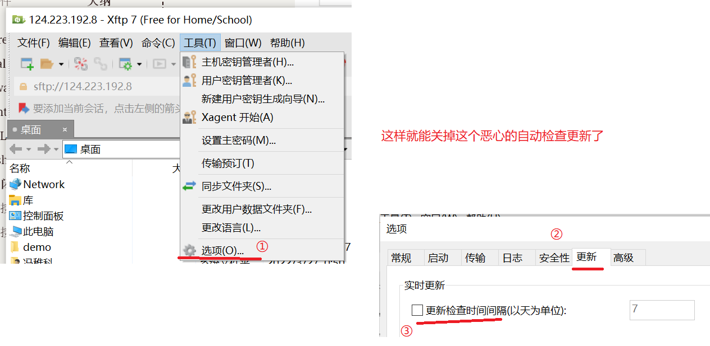

# Xshell与Xftp免费版

官网地址：https://www.xshell.com

点击所有下载，来到产品页面


点击xshell下载即可。


在邮箱中收到下载地址后，进去下载即可。

## 关闭xshell自动更新

免费版的一个很恶心的问题，就是只要打开xshell或者xftp，它就会去检查更新，还很离谱的是，这个检查会新开一个窗口，还特么一直是卡死，必须手动去杀死它才行。

但是这个玩意是可以关闭的：



## 连接ubuntu

> 需要下载两个服务：ssh和vsftpd。
>
> ubuntu的root用户被锁住了，因此很多操作都必须加上sudo，以root身份执行。

1. 查看是否开启了ssh服务
    `sudo ps -e |grep ssh`
    
    如果只有ssh-agent表示还没启动,需要通过`sudo /etc/init.d/ssh start`启动ssh server.
    如果提醒找不到该命令，说明没有安装openssh-server。（跳到步骤2）

      
      可通过以下进行Ubuntu内部测试连接SSH服务器
      输入命令：ssh -l 用户名 host，其中用户名为Ubuntu用户名，host为主机名

2. 安装openssh-server

   1. 更新源列表
       `sudo apt-get update`，之后输入管理员密码。
       
   
   2. 安装openssh-server
      `sudo apt-get install openssh-server`
   
   3. 查看ssh服务是否启动
      `sudo ps -e |grep ssh`
      
      
      如果还是没有shhd服务，则需要手动开启
      `sudo service ssh start`
   
3. 查看ip地址
      `sudo ifconfig`
      
      如果提示没有该命令，则：`sudo apt install net-tools `
      

4. Xshell连接

   

出现的协议保护点接受即可。

5. 查看是否安装了 vsftpd

   ```bash
   vsftpd --version 
   ```

   1. 如果没有安装，则
      ```bash
      sudo apt-get install vsftpd
      ```

   2. 修改配置文件：vim命令也可以

      ```bash
      sudo gedit /etc/vsftpd.conf
      # 将下列内容加入文件末尾
   anonymous_enable=NO
      local_enable=YES
   write_enable=YES
      ```
   
   3. 启动服务

      ```bash
      service vsftpd start 
      ```
   
6. 开启22号端口

   开启防火墙

    ```bash
    sudo ufw status 
    ```
    打开22端口

    ```bash
    sudo ufw allow 22
    ```

7. Xftp连接到ubuntu

   同上面xshell连接。

8. 修改权限

   此时如果直接拖拽文件到ubuntu中，会上传错误。原因是权限问题。(ubuntu锁住了root用户，普通用户权限不足)

   假设要上传的目录是/usr/local/test

   ```bash
   sudo chmod 775 /usr/local/test
   ```

   此时上传到test文件夹必成功。

# Linux

## Linux目录说明


1.	bin -> usr/bin : 这个目录存放最经常使用的命令
2.	boot : 这个目录存放启动Linux时使用的一些核心文件，包括一些连接文件以及镜像文件
3.	dev: dev是Device(设备)的缩写, 该目录下存放的是Linux的外部设备，Linux中的设备也是以文件的形式存在
4.	**etc : 这个目录存放所有的系统管理所需要的配置文件**,配置环境变量。
5.	**home：用户的主目录，在Linux中，每个用户都有一个自己的目录，一般该目录名以用户的账号命名**
6.	lib->user/lib: 这个目录存放着系统最基本的动态连接共享库，其作用类似于Windows里的DLL文件，几乎所有的应用程序都需要用到这些共享库。
7.	mnt : 系统提供该目录是为了让用户临时挂载别的文件系统，我们可以将光驱挂载在/mnt/上，然后进入该目录就可以查看光驱里的内容
8.	opt: 这是给linux额外安装软件所存放的目录。比如你安装一个Oracle数据库则就可以放到这个目录下，默认为空。
9.	root : 该目录为系统管理员目录，root是具有超级权限的用户(只有root用户可以进)
10.	tmp: 这个目录是用来存放一些临时文件的。
11.	**usr: 这是一个非常重要的目录，用户的很多应用程序和文件都放在这个目录下，类似与windows下的program files目录**。存放文件。
12.	**var** : 这个目录存放着在不断扩充着的东西，我们习惯将那些经常被修改的文件存放在该目录下，比如运行的各种**日志文件**。

> 在 Linux 系统中，有几个目录是比较重要的，平时需要注意不要误删除或者随意更改内部文件。
>- **/etc**： 上边也提到了，这个是**系统中的配置文件**，如果你更改了该目录下的某个文件可能会导致系统不能启动。
>- **/bin, /sbin, /usr/bin, /usr/sbin**: 这是系统预设的**执行文件的放置目录**，比如 ls 就是在 /bin/ls 目录下的。
>  值得提出的是，/bin, /usr/bin 是给系统用户使用的指令（除root外的通用户），而/sbin, /usr/sbin 则是给 root 使用的指令。
>- **/var**： 这是一个非常重要的目录，系统上跑了很多程序，那么每个程序都会有相应的**日志**产生，而这些日志就被记录到这个目录下，具体在 /var/log 目录下，另外 mail 的预设放置也是在这里。

**系统启动必须：**

- **/boot：**存放的启动Linux 时使用的内核文件，包括连接文件以及镜像文件。

- **/etc：**存放**所有**的系统需要的**配置文件**和**子目录列表，**更改目录下的文件可能会导致系统不能启动。

- **/lib**：存放基本代码库（比如c++库），其作用类似于Windows里的DLL文件。几乎所有的应用程序都需要用到这些共享库。

- **/sys**： 这是linux2.6内核的一个很大的变化。该目录下安装了2.6内核中新出现的一个文件系统 sysfs 。sysfs文件系统集成了下面3种文件系统的信息：针对进程信息的proc文件系统、针对设备的devfs文件系统以及针对伪终端的devpts文件系统。该文件系统是内核设备树的一个直观反映。当一个内核对象被创建的时候，对应的文件和目录也在内核对象子系统中

**指令集合：**

- **/bin：**存放着最常用的程序和指令

- **/sbin：**只有系统管理员能使用的程序和指令。

**外部文件管理：**

- **/dev ：**Device(设备)的缩写, 存放的是Linux的外部设备。**注意：**在Linux中访问设备和访问文件的方式是相同的。

- **/media**：类windows的**其他设备，**例如U盘、光驱等等，识别后linux会把设备放到这个目录下。

- **/mnt**：临时挂载别的文件系统的，我们可以将光驱挂载在/mnt/上，然后进入该目录就可以查看光驱里的内容了。

**临时文件：**

- **/run**：是一个临时文件系统，存储系统启动以来的信息。当系统重启时，这个目录下的文件应该被删掉或清除。如果你的系统上有 /var/run 目录，应该让它指向 run。

- **/lost+found**：一般情况下为空的，系统非法关机后，这里就存放一些文件。

- **/tmp**：这个目录是用来存放一些临时文件的。

**账户：**

- **/root**：系统管理员的用户主目录。

- **/home**：用户的主目录，以用户的账号命名的。

- **/usr**：用户的很多应用程序和文件都放在这个目录下，类似于windows下的program files目录。

- **/usr/bin：**系统用户使用的应用程序与指令。

- **/usr/sbin：**超级用户使用的比较高级的管理程序和系统守护程序。

- **/usr/src：**内核源代码默认的放置目录。

**运行过程中要用：**

- **/var**：存放经常修改的数据，比如程序运行的日志文件（/var/log 目录下）。

- **/proc**：管理**内存空间！**虚拟的目录，是系统内存的映射，我们可以直接访问这个目录来，获取系统信息。这个目录的内容不在硬盘上而是在内存里，我们也可以直接修改里面的某些文件来做修改。

**扩展用的：**

- **/opt**：默认是空的，我们安装额外软件可以放在这个里面。

- **/srv**：存放服务启动后需要提取的数据**（不用服务器就是空）**

## Linux常用命令
>菜鸟教程命令大全：https://www.runoob.com/linux/linux-command-manual.html

>Linux命令手册:https://www.runoob.com/linux/linux-tutorial.html

Linux服务器端一般是命令行界面，通过命令和linux系统交互。通过命令进行各种操作。

命令分类：目录管理；文件管理；系统设置；压缩/解压；网络通讯；网络访问；权限管理；管道和重定向；vi/vim 编辑命令；安装软件命令等。

### 联机手册

```shell
man [选项] 命令
man who
-f：查看命令拥有哪个级别的帮助
-k: 查看和命令相关的所有帮助	
```

### 快捷键

#### Ctrl+c

如果在Linux 底下输入了错误的指令或参数，想让当前的程序『停掉』的话，可以输入:

ctrl+c退回命令行状态

#### Tab

**[Tab]     有『命令补全』与『文件补齐』的功能**

```shell
[Tab]      ## 接在一串指令的第一个字的后面，则为『命令补全』
[Tab]      ## 接在一串指令的第二个字以后时，则为『文件补齐』
```

#### Ctrl+d

**[Ctrl]-d     『键盘输入结束(End Of File, EOF 或 End Of Input)』的意思**

另外，他也可以用来取代 exit 的输入。

例如你想要直接离开文字接口，可以直接按下：

```shell
[Ctrl] + d   ## 相当于输入 exit
```

#### shift+PageUp

**[shift]+{[PageUP]|[Page Down]}**

```shell
[Shift]+[Page Up]    ## 往前翻页 

[Shift]+[Page Down] ## 往后翻页
```

#### Ctrl+h

BackSpace键和Ctrl+H都可以删除已经输入的字符，推荐Ctrl+H，该键兼容性更好。

要删除一整行的话，可按`Ctrl+U`

### 目录管理
我们知道Linux的目录结构为树状结构，最顶级的目录为根目录 /。

其他目录通过挂载可以将它们添加到树中，通过解除挂载可以移除它们。

- 绝对路径：
路径的写法，由根目录 / 写起，例如： /usr/share/doc 这个目录。

- 相对路径：
路径的写法，不是由 / 写起，例如由 /usr/share/doc 要到 /usr/share/man 底下时，可以写成： cd ../man 这就是相对路径的写法。

#### 路劲自动补全
在Linux命令行中，可以敲文件夹的第一个字母，再按下tab键，如果只有一个匹配的文件夹，则自动补全，如果有多个，则会列出匹配的所有文件夹来提示接下里的输入。


#### 常用命令
- ls（英文全拼：list files）: 列出目录及文件名
- cd（英文全拼：change directory）：切换目录
- pwd（英文全拼：print work directory）：显示目前的目录
- mkdir（英文全拼：make directory）：创建一个新的目录
- rmdir（英文全拼：remove directory）：删除一个空的目录
- cp（英文全拼：copy file）: 复制文件或目录
- rm（英文全拼：remove）: 删除文件或目录
- mv（英文全拼：move file）: 移动文件与目录，或修改文件与目录的名称

可以使用 man [命令] 来查看各个命令的使用文档，如 ：man cp。

##### cd
① 由当前目录切换到 /usr/local
例如：cd  /usr/local
② 回到根目录（类似于我的电脑）
例如：cd  /
② 回到上一级目录
例如：cd ..
```
#使用 mkdir 命令创建 runoob 目录
[root@www ~]# mkdir runoob

#使用绝对路径切换到 runoob 目录
[root@www ~]# cd /root/runoob/

#使用相对路径切换到 runoob 目录
[root@www ~]# cd ./runoob/

# 表示回到自己的家目录，亦即是 /root 这个目录
[root@www runoob]# cd ~

# 表示去到目前的上一级目录，亦即是 /root 的上一级目录的意思；
[root@www ~]# cd ..
```

##### pwd 
显示目前所在的目录
```
[root@www ~]# pwd [-P]
```
选项与参数：

- -P ：显示出确实的路径，而非使用连结 (link) 路径。

实例显示出实际的工作目录，而非连结档本身的目录名而已。
```
[root@www ~]# cd /var/mail   <==注意，/var/mail是一个连结档
[root@www mail]# pwd
/var/mail         <==列出目前的工作目录
[root@www mail]# pwd -P
/var/spool/mail   <==怎么回事？有没有加 -P 差很多～
[root@www mail]# ls -ld /var/mail
lrwxrwxrwx 1 root root 10 Sep  4 17:54 /var/mail -> spool/mail
# 看到这里应该知道为啥了吧？因为 /var/mail 是连结档，连结到 /var/spool/mail 
# 所以，加上 pwd -P 的选项后，会不以连结档的数据显示，而是显示正确的完整路径啊！
```

##### ls 
(列出目录)
在Linux系统当中， ls 命令可能是最常被运行的。

语法：
```shell
[root@www ~]# ls [-aAdfFhilnrRSt] 目录名称
[root@www ~]# ls [--color={never,auto,always}] 目录名称
[root@www ~]# ls [--full-time] 目录名称
```
选项与参数：

- -a ：全部的文件，连同隐藏文件( 开头为 . 的文件) 一起列出来(常用)
- -d ：仅列出目录本身，而不是列出目录内的文件数据(常用)
- -l ：长数据串列出，包含文件的属性与权限等等数据；(常用)

将家目录下的所有文件列出来(含属性与隐藏档)
```
[root@www ~]# ls -al ~
```

##### ll
列出目录下的详细内容（相当于Windows的列表查看）


### 文件管理
- mkdir（英文全拼：make directory）：创建一个新的目录
- rmdir（英文全拼：remove directory）：删除一个空的目录
- cp（英文全拼：copy file）: 复制文件或目录
- rm（英文全拼：remove）: 删除文件或目录
- mv（英文全拼：move file）: 移动文件与目录，或修改文件与目录的名称

#### mkdir
(创建新目录)

语法：
```
mkdir [-mp] 目录名称
```
选项与参数：

- -m ：配置文件的权限喔！直接配置，不需要看默认权限 (umask) 的脸色～
- -p ：帮助你直接将所需要的目录(包含上一级目录)递归创建起来！

#### rm 
(移除文件或目录)
语法：
```
 rm [-fir] 文件或目录
```
选项与参数：
```
-f ：就是 force 的意思，忽略不存在的文件，不会出现警告信息；
-i ：互动模式，在删除前会询问使用者是否动作
-r ：递归删除啊！最常用在目录的删除了！这是非常危险的选项！！！
```
删文件夹必须加-r参数。

#### cp 
(复制文件或目录)
cp 即拷贝文件和目录。

语法:
```shell
[root@www ~]# cp [-adfilprsu] 来源档(source) 目标档(destination)
[root@www ~]# cp [options] source1 source2 source3 .... directory
```
选项与参数：
```shell
-a：相当於 -pdr 的意思，至於 pdr 请参考下列说明；(常用)

-d：若来源档为连结档的属性(link file)，则复制连结档属性而非文件本身；

-f：为强制(force)的意思，若目标文件已经存在且无法开启，则移除后再尝试一次；

-i：若目标档(destination)已经存在时，在覆盖时会先询问动作的进行(常用)

-l：进行硬式连结(hard link)的连结档创建，而非复制文件本身；

-p：连同文件的属性一起复制过去，而非使用默认属性(备份常用)；

-r：递归持续复制，用於目录的复制行为；(常用)

-s：复制成为符号连结档 (symbolic link)，亦即『捷径』文件；

-u：若 destination 比 source 旧才升级 destination ！
```
复制文件夹必须有-r参数

用 root 身份，将 root 目录下的 .bashrc 复制到 /tmp 下，并命名为 bashrc
```
[root@www ~]# cp ~/.bashrc /tmp/bashrc
[root@www ~]# cp -i ~/.bashrc /tmp/bashrc
cp: overwrite `/tmp/bashrc'? n  <==n不覆盖，y为覆盖
```

#### mv 
(移动文件与目录，或修改名称)
语法：
```
[root@www ~]# mv [-fiu] source destination
[root@www ~]# mv [options] source1 source2 source3 .... directory
```
选项与参数：
```
-f ：force 强制的意思，如果目标文件已经存在，不会询问而直接覆盖；
-i ：若目标文件 (destination) 已经存在时，就会询问是否覆盖！
-u ：若目标文件已经存在，且 source 比较新，才会升级 (update)
```

### 文件内容查看(日志查看)
Linux系统中使用以下命令来查看文件的内容：

- cat  由第一行开始显示文件内容
- tac  从最后一行开始显示，可以看出 tac 是 cat 的倒着写！
- nl   显示的时候，顺道输出行号！
- more 一页一页的显示文件内容
- less 与 more 类似，但是比 more 更好的是，他可以往前翻页！
- head 只看头几行
- tail 只看尾巴几行

#### cat
由第一行开始显示文件内容

语法：
`cat [-AbEnTv]`
选项与参数：
```shell
-A ：相当於 -vET 的整合选项，可列出一些特殊字符而不是空白而已；
-b ：列出行号，仅针对非空白行做行号显示，空白行不标行号！
-E ：将结尾的断行字节 $ 显示出来；
-n ：列印出行号，连同空白行也会有行号，与 -b 的选项不同；
-T ：将 [tab] 按键以 ^I 显示出来；
-v ：列出一些看不出来的特殊字符
```

#### head/tail

参数：

- -n ：后面接数字，代表显示几行的意思，默认10行。

例子：

```shell
# 读前20行
head -n 20 hello.txt
# 读后20行
tail -n 20 hello.txt

# 读文件末尾并一直等待读取新内容
tail -f hello.txt
tailf hello.txt
```

#### grep
文件内搜索: 用于查找文件里符合条件的字符串的一行。

在文件中(可以多个文件同时)搜索字符串，可以使用**正则表达式**

若不指定任何文件名称，或是所给予的文件名为 `-`，则 grep 指令会从标准输入设备读取数据。

参数：
```
-A: 除了显示符合范本样式的那一列之外，并显示该行之后的内容。
-B: 除了显示符合样式的那一行之外，并显示该行之前的内容。
-c: 计算符合样式的列数。

-e<范本样式> 或 --regexp=<范本样式> : 指定字符串做为查找文件内容的样式。

-F 或 --fixed-regexp : 将样式视为固定字符串的列表。
-G 或 --basic-regexp : 将样式视为普通的表示法来使用。

-i: 忽略字符大小写的差别。
-v: 显示不包含匹配文本的所有行。
```
例子：

```shell
# 查文件中包含 字符串INFO 的行数
grep hello.log -e 'INFO' -c 

# 查文件中 字符串INFO 所在行 及其后10行，前5行
cat hello.txt |grep INFO -A 10 -B 5
```


#### awk

参数：

- -F：指定分隔符

```shell
# 输出分割后的第一列，第二列
tail -n 2 hello.log | awk -F '=' '{print $1,$2}'
# $0是整行，$n是分割后第n列
```


### 链接概念

Linux 链接分两种，一种被称为硬链接（Hard Link），另一种被称为符号链接（Symbolic Link）。默认情况下，ln 命令产生硬链接。

#### 硬连接

硬连接指通过索引节点来进行连接。在 Linux  的文件系统中，保存在磁盘分区中的文件不管是什么类型都给它分配一个编号，称为索引节点号(Inode Index)。在 Linux  中，多个文件名指向同一索引节点是存在的。比如：A 是 B 的硬链接（A 和 B 都是文件名），则 A 的目录项中的 inode 节点号与 B  的目录项中的 inode 节点号相同，即一个 inode 节点对应两个不同的文件名，两个文件名指向同一个文件，A 和 B  对文件系统来说是完全平等的。删除其中任何一个都不会影响另外一个的访问。

硬连接的作用是允许一个文件拥有多个有效路径名，这样用户就可以建立硬连接到重要文件，以防止“误删”的功能。其原因如上所述，因为对应该目录的索引节点有一个以上的连接。只删除一个连接并不影响索引节点本身和其它的连接，只有当最后一个连接被删除后，文件的数据块及目录的连接才会被释放。也就是说，文件真正删除的条件是与之相关的所有硬连接文件均被删除。

#### 软连接

另外一种连接称之为符号连接（Symbolic Link），也叫软连接。软链接文件有类似于 Windows  的快捷方式。它实际上是一个特殊的文件。在符号连接中，文件实际上是一个文本文件，其中包含的有另一文件的位置信息。比如：A 是 B 的软链接（A 和 B 都是文件名），A 的目录项中的 inode 节点号与 B 的目录项中的 inode 节点号不相同，A 和 B 指向的是两个不同的  inode，继而指向两块不同的数据块。但是 A 的数据块中存放的只是 B 的路径名（可以根据这个找到 B 的目录项）。A 和 B  之间是“主从”关系，如果 B 被删除了，A 仍然存在（因为两个是不同的文件），但指向的是一个无效的链接。

#### 测试

```shell
[oracle@Linux]$ touch f1          #创建一个测试文件f1
[oracle@Linux]$ ln f1 f2          #创建f1的一个硬连接文件f2
[oracle@Linux]$ ln -s f1 f3       #创建f1的一个符号连接文件f3
[oracle@Linux]$ ls -li            # -i参数显示文件的inode节点信息
total 0
9797648 -rw-r--r--  2 oracle oinstall 0 Apr 21 08:11 f1
9797648 -rw-r--r--  2 oracle oinstall 0 Apr 21 08:11 f2
9797649 lrwxrwxrwx  1 oracle oinstall 2 Apr 21 08:11 f3 -> f1
```

从上面的结果中可以看出，硬连接文件 f2 与原文件 f1 的 inode 节点相同，均为 9797648，然而符号连接文件的 inode 节点不同。

```shell
[oracle@Linux]$ echo "I am f1 file" >>f1
[oracle@Linux]$ cat f1
I am f1 file
[oracle@Linux]$ cat f2
I am f1 file
[oracle@Linux]$ cat f3
I am f1 file
[oracle@Linux]$ rm -f f1
[oracle@Linux]$ cat f2
I am f1 file
[oracle@Linux]$ cat f3
cat: f3: No such file or directory
```

通过上面的测试可以看出：当删除原始文件 f1 后，硬连接 f2 不受影响，但是符号连接 f1 文件无效

**总结**

依此您可以做一些相关的测试，可以得到以下全部结论：

- 1).删除符号连接f3,对f1,f2无影响；
- 2).删除硬连接f2，对f1,f3也无影响；
- 3).删除原文件f1，对硬连接f2没有影响，导致符号连接f3失效；
- 4).同时删除原文件f1,硬连接f2，整个文件会真正的被删除。

### 系统命令

1. 显示系统日期和时间：date
2. 切换用户：su 用户名
3. 清楚屏幕：clear 或者快捷键ctrl+L
4. 重启系统：reboot
5. 关机：shutdown -h now
6. 查看系统进程： ps -ef 
    ```shell
    常用参数：
    -e :显示当前所有进程
    -f :显示UID,PPID,C与STIME栏位信息
        UID:拥有改程序的用户
        PID:程序的进程id
        PPID:父进程的id
        C: CPU使用的资源百分比
        STIME :系统启动时间
        TTY：登录系统的终端位置（客户端的标识）
        TIME:使用掉的CPU时间
        CMD:进程是有哪些程序启动的
    ```
7. kill进程：kill
    ```shell
    kill pid：杀掉进程
    kill -9 pid 强制杀掉进程
    
    例如：先使用 ps -ef 查询进程id ， 然后再使用 kill pid ， 这是例子不要真的执行
    ````

#### 关机与重启

在linux领域内大多用在服务器上，很少遇到关机的操作。毕竟服务器上跑一个服务是永无止境的，除非特殊情况下，不得已才会关机。

正确的关机流程为：sync > shutdown > reboot > halt

```shell
sync # 将数据由内存同步到硬盘中。 
shutdown # 关机指令，你可以man shutdown 来看一下帮助文档。例如你可以运行如下命令关机： 
shutdown –h 10 # 这个命令告诉大家，计算机将在10分钟后关机 
shutdown –h now # 立马关机 1234567
shutdown –h 20:25 # 系统会在今天20:25关机 
shutdown –h +10 # 十分钟后关机 
shutdown –r now # 系统立马重启 
shutdown –r +10 # 系统十分钟后重启 
reboot # 就是重启，等同于 shutdown –r now 
halt # 关闭系统，等同于shutdown –h now 和 poweroff
```

最后总结一下，不管是重启系统还是关闭系统，首先要运行 **sync** 命令，把内存中的数据写到磁盘中.

shutdown 会给系统计划一个时间关机。它可以被用于停止、关机、重启机器。shutdown 会给系统计划一个时间关机。它可以被用于停止、关机、重启机器。

```shell
# shutdown -p now  ### 关闭机器
# shutdown -H now  ### 停止机器      
# shutdown -r 09:35 ### 在 09:35am 重启机器
```

要取消即将进行的关机，只要输入下面的命令：

```shell
# shutdown -c
```

halt 命令通知硬件来停止所有的 CPU 功能，但是仍然保持通电。你可以用它使系统处于低层维护状态。注意在有些情况会它会完全关闭系统。

```shell
# halt             ### 停止机器
# halt -p          ### 关闭机器、关闭电源
# halt --reboot    ### 重启机器
```

poweroff 会发送一个 ACPI 信号来通知系统关机。

```shell
# poweroff           ### 关闭机器、关闭电源
# poweroff --halt    ### 停止机器
# poweroff --reboot  ### 重启机器
```

reboot 命令 reboot 通知系统重启。

```shell
# reboot           ### 重启机器
# reboot --halt    ### 停止机器
# reboot -p        ### 关闭机器
```


### 压缩/解压

#### tar
压缩（归档）
tar用来压缩和解压文件, tar压缩后的文件也叫归档文件。

语法: `tar 参数 要压缩或解压的文件或目录`
常用参数：

>z : 使用压缩，生成的文件名是 xxx.tar.gz 这是linux中常用的压缩格式。(必须有压缩格式)
**c : 创建压缩文档**
v : 显示压缩，解压过程中处理的文件名
f : 指定归档文件名, tar参数后面是归档文件名
**x : 从归档文件中释放文件，就是解压。**
t : 列出归档文件内容，查看文件内容
C: 解压到指定目录，使用方式 -C 目录 ， C 是大写的。


压缩
 `tar -czvf test.tar.gz a.c   //压缩 a.c文件为test.tar.gz`
解压缩
 `tar -xzvf test.tar.gz `

显示压缩文件的内容。
```
语法：tar -tf 归档文件名
  t : 列出归档（压缩）文件的内容
  f : 归档文件名
例如：tar  -tf  file2.tar.gz
```


### 网络
#### 网络通讯
1. 查看ip信息： ifconfig
2. 测试网络连通： 
    ```
    语法： ping  ip或者域名
    例如：ping  www.baidu.com
    
    查看之后，ctrl+C，退出查看，回到Linux命令行
    ```
#### 网络访问
1. curl ：使用url访问网络的文件传输工具。
curl是利用URL语法在命令行方式下工作的开源文件传输工具
常用来①：测试网络访问；②：模拟用户访问

抓取百度的首页内容
例如：curl  www.baidu.com

2. wget :下载
wget linux上下载资源的工具，比如下载软件的安装包。一般软件都会给出一个下载地址

语法：wget 下载的资源的地址
例如：下载一个tomcat软件。
首先要得到tomcat的下载地址，同浏览器下载tomcat，得到下载地址
`wget https://mirrors.bfsu.edu.cn/apache/tomcat/tomcat-9/v9.0.44/bin/apache-tomcat-9.0.44.tar.gz`

### 文件基本属性
Linux 系统是一种典型的多用户系统，不同的用户处于不同的地位，拥有不同的权限。

为了保护系统的安全性，Linux 系统对不同的用户访问同一文件（包括目录文件）的权限做了不同的规定。

在 Linux 中我们通常使用以下两个命令来修改文件或目录的所属用户与权限：
- chown (change ownerp) ： 修改所属用户与组。
- chmod (change mode) ： 修改用户的权限。

下图中通过 chown 来授权用户，通过 chmod 为用户设置可以开门的权限。


#### 基本属性查看
权限指用户或程序能够对目录，文件执行的操作。
执行ll 或 ls -l 显示文件和目录详细信息


前10个字符的含义：
```shell
在 Linux 中第一个字符代表这个文件是目录、文件或链接文件等等。

当为 d 则是目录
当为 - 则是文件；
若是 l 则表示为链接文档(link file)；
若是 b 则表示为装置文件里面的可供储存的接口设备(可随机存取装置)；
若是 c 则表示为装置文件里面的串行端口设备，例如键盘、鼠标(一次性读取装置)。

接下来的字符中，以三个为一组，且均为 rwx 的三个参数的组合。
其中， r 代表可读(read)、 w 代表可写(write)、 x 代表可执行(execute)。 
要注意的是，这三个权限的位置不会改变，如果没有权限，就会出现减号 - 而已。
```

#### 文件类型

| **标识** | **文件类型** |
| -------- | ------------ |
| -        | 普通文件     |
| d        | 目录文件     |
| c        | 字符设备文件 |
| b        | 块设备文件   |
| p        | 管道或FIFO   |
| l        | 符号链接     |
| s        | 套接字       |

#### 文件访问权限

linux权限机制采用UGO模式。其中 u(user)表示所属用户、g(group)表示所属组、o(other)表示除了所属用户、所属组之外的情况。


```
A、	读权限：读取文件内容，对文件执行cat ,more ,less这样的查看命令，对目录来说可以读取目录中文件列表
r--read 读权限 4 
B、	写权限：编辑、新增、修改文件内容
w--write 写权限 2
C、	执行权限：进入目录，访问目录中的文件内容。
x--execute 执行权限 1
D、	常见权限设置
rwx= 4 + 2 + 1 = 7
rw-= 4+2=6
r-x= 4+1=5
r--= 4
-wx= 2+1=3
-w-= 2
--x=1
常见644、755、777三种权限
创建文件用户就是文件的拥有者， 用户所在的组就是文件的所在组。
除了创建文件的用户都是其他用户。root有最高的权限。

```

- 读取权限：浏览文件/目录中内容的权限；
- 写入权限：
	- 对文件而言是修改文件内容的权限
	- 对目录而言是删除、添加和重命名目录内文件的权限；
- 执行权限：
	- 对可执行文件而言是允许执行的权限
	- 对目录而言是进入目录的权限。

#### 文件属主和属组

```
对于文件来说，它都有一个特定的所有者，也就是对该文件具有所有权的用户。

同时，在Linux系统中，用户是按组分类的，一个用户属于一个或多个组。

文件所有者以外的用户又可以分为文件所有者的同组用户和其他用户。

因此，Linux系统按文件所有者、文件所有者同组用户和其他用户来规定了不同的文件访问权限。

在以上实例中，mysql 文件是一个目录文件，
属主和属组都为 mysql，属主有可读、可写、可执行的权限；
与属主同组的其他用户有可读和可执行的权限；
其他用户也有可读和可执行的权限。

对于 root 用户来说，一般情况下，文件的权限对其不起作用。
```

#### 更改文件属性
##### 1.chgrp
更改文件属组
语法：
`chgrp [-R] 属组名 文件名`
参数选项
`-R：递归更改文件属组，就是在更改某个目录文件的属组时，如果加上-R的参数，那么该目录下的所有文件的属组都会更改。`
##### 2.chown
更改文件拥有者，也可以同时更改文件属组
语法：
```shell
chown [–R] 属主名 文件名
chown [-R] 属主名：属组名 文件名
```
进入 /root 目录（~）将install.log的拥有者改为bin这个账号：
```shell
[root@www ~] cd ~
[root@www ~]# chown bin install.log
[root@www ~]# ls -l
-rw-r--r--  1 bin  users 68495 Jun 25 08:53 install.log
```
将install.log的拥有者与群组改回为root：
```shell
[root@www ~]# chown root:root install.log
[root@www ~]# ls -l
-rw-r--r--  1 root root 68495 Jun 25 08:53 install.log
```

##### 3.chmod
更改文件9个属性
Linux文件属性有两种设置方法，一种是数字，一种是符号.

Linux 文件的基本权限就有九个，分别是 **owner/group/others(拥有者/组/其他)** 三种身份各有自己的 **read/write/execute** 权限。

语法：
`chmod [-R] xyz 文件或目录`
选项与参数：

- xyz : 就是刚刚提到的数字类型的权限属性，为 rwx 属性数值的相加。x 代表属主权限,y 代表属组权限,z 代表其他权限.
- -R : 进行递归(recursive)的持续变更，亦即连同次目录下的所有文件都会变更

举例来说，如果要将 .bashrc 这个文件所有的权限都设定启用，那么命令如下：
```shell
[root@www ~]# ls -al .bashrc
-rw-r--r--  1 root root 395 Jul  4 11:45 .bashrc
[root@www ~]# chmod 777 .bashrc
[root@www ~]# ls -al .bashrc
-rwxrwxrwx  1 root root 395 Jul  4 11:45 .bashrc
```


### 文件传输

#### scp

Secure Copy Protocol，Linux 系统下基于 ssh 登陆进行安全的远程文件拷贝命令。

- `-r`：递归复制目录

```shell
# 将本地文件传输到远程目录下
scp C:/Users/76771/hello.jpg root@remote_ip:/home/
scp C:/Users/76771/hello.jpg root@remote_ip:/home/test.jpg # 指定文件名

# 将本地目录传输到远程目录下
scp -r C:/Users/76771/test root@remote_ip:/home/test
```

#### lrzsz

[lrzsz](https://www.ohse.de/uwe/software/lrzsz.html)是unix通信包，提供Xmodem、Ymodem、Zmodem文件传输协议。Linux系统需要先安装该命令。

rz：Receive Zmodem，上传文件到服务器，输入后一个文件选择窗口会出现在本地机器上，选择上传的文件即可。

sz：Send Zmodem，输入`sz filename`，弹出一个窗口选择下载文件到本地哪个目录即可。

注意：lrzsz命令需要确保ssh客户端支持ZModem协议。

#### trzsz

trzsz ( trz / tsz ) 是一个兼容 tmux 的文件传输工具，和 lrzsz ( rz / sz ) 类似，并且有进度条和支持目录传输。

文档：https://trzsz.github.io/cn/

## 防火墙与进程管理

### 防火墙设置

#### firewalld

firewall-cmd：是Linux提供的操作firewall的一个工具。

```shell
# 启动
systemctl start firewalld  

# 关闭
systemctl stop firewalld  
  
# 重启
systemctl restart firewalld    

# 开机启动       
systemctl enable firewalld  
      
# 取消开机启动
systemctl disable firewalld 
      
# 查看是否开机自启
systemctl is-enabled firewalld
```


#### 开放端口

1. 端口管理

```shell
# 查询端口是否开放
firewall-cmd --query-port=8080/tcp
# 开放5672端口
firewall-cmd --zone=public --add-port=5672/tcp --permanent  
#关闭5672端口
firewall-cmd --zone=public --remove-port=5672/tcp --permanent  

# 查看防火墙开启的所有端口
firewall-cmd --zone=public --list-ports

# 重启防火墙(修改配置后要重启防火墙)使其立即生效
firewall-cmd --reload
```

2. 监控端口的进程管理

```shell
# 查看监听的端口
netstat -lnpt
# 检查端口被哪个进程占用
netstat -lnpt |grep 8080
# 查看进程的详细信息
ps 进程号
# 强制中止进程
kill -9 进程号
```


### 进程监控

> UNIX/Linux系统中的“进程”是可运行程序在内存中的一次运行实例。
>
> 生命周期大致分为三种状态: 
> 1.运行态    
>     进程正占用CPU和其它资源进行运算.
> 2.就绪态
>     进程已做好一切准备, 等待获得CPU投入运行.
> 3.睡眠态
>     进程因等待输入输出或其它系统资源, 而让出CPU资源, 等待运行条件满足。

#### ps

不带参数的ps命令运行时, 显示该用户当前活动进程的基本信息：

```shell
[centos@localhost Desktop]$ ps
   PID TTY          TIME CMD
  8432 pts/0    00:00:00 bash
  9526 pts/0    00:00:00 ps
[centos@localhost Desktop]$ ps
   PID TTY          TIME CMD
  8432 pts/0    00:00:00 bash
  9527 pts/0    00:00:00 ps
[centos@localhost Desktop]$ 

# TIME      进程累计占用CPU的时间  为0意味着占用时间太少，超出了显示精度
# COMMAND   产生该进程的命令
可以发现：
	bash进程PID一致，而两次的ps命令由两个不同子进程完成，
	这就验证了每次命令的执行都是生成的一个子进程去执行
```

-e  (或-a)     显示系统中所有活动进程的信息

-f        显示该进程的所有信息. 例如:

```shell
[centos@localhost Desktop]$ ps -ef
UID         PID   PPID  C STIME TTY          TIME CMD
root          1      0  0 18:52 ?        00:00:12 /usr/lib/systemd/systemd --switched-root --system --deserialize 21
root          2      0  0 18:52 ?        00:00:00 [kthreadd]
root          3      2  0 18:52 ?        00:00:02 [ksoftirqd/0]
root          7      2  0 18:52 ?        00:00:00 [migration/0]
root          8      2  0 18:52 ?        00:00:00 [rcu_bh]
root          9      2  0 18:52 ?        00:00:04 [rcu_sched]
root         10      2  0 18:52 ?        00:00:00 [watchdog/0]
# 其中
UID       进程所有者的用户标识数
PID       进程标识数
PPID      本进程的父进程标识数
C         进程调度参数, 反映本进程使用CPU的状况
STIME     进程的启动时间
TTY       启动进程的终端
TIME      进程累计占用CPU的时间
COMMAND   启动该进程的命令名
```

#### sleep

> sleep  time
> sleep命令使运行它的进程暂停time指定的秒数.

```shell
[centos@localhost Desktop]$ sleep 5 & 
[1] 9640
[centos@localhost Desktop]$ ps
   PID TTY          TIME CMD
  8432 pts/0    00:00:00 bash
  9640 pts/0    00:00:00 sleep
  9641 pts/0    00:00:00 ps
[centos@localhost Desktop]$ 
# 产生子进程执行sleep命令：去后台暂停5s
```

#### kill

`kill -N pid` 并不是让进程直接停止，而是给进程发一个信号，然后进程处理这个信号，进入终止逻辑。**kill** 不是杀死的意思，**-9** 表示无条件退出，但由进程自行决定是否退出，这就是为什么 **kill -9** 终止不了系统进程和守护进程的原因。

默认信号为`SIGTERM(15)`，正常结束进程, 自动完成所有善后工作, 作用类似于**按 Del 键**.

```shell
kill pid
kill -15 pid
kill -TERM pid
```

按`CTRL+C`键向前台进程发送`SIGINT`信号，类似于`kill -2 pid`和`kill -INT pid`。

```shell
# 先挂起该进程, 终止子进程, 完成善后工作, 再终止该进程.
kill -1 pid 

# 立即强行终止该进程, 不作任何善后工作.  可能出现资源浪费和"孤儿"进程. 
kill -9 pid 

# PID为0，表示杀死本用户所有进程(包括命令解释器Shell)，运行结果为本用户退出操作系统
kill -9 0 
```

基于安全原因，普通用户只能终止自己的进程，超级管理员才可以终止所有进程。

```shell
# 列出所有信号名称和序号
[root@k8s-master ~]# kill -l
 1) SIGHUP       2) SIGINT       3) SIGQUIT      4) SIGILL       5) SIGTRAP
 6) SIGABRT      7) SIGBUS       8) SIGFPE       9) SIGKILL     10) SIGUSR1
11) SIGSEGV     12) SIGUSR2     13) SIGPIPE     14) SIGALRM     15) SIGTERM
16) SIGSTKFLT   17) SIGCHLD     18) SIGCONT     19) SIGSTOP     20) SIGTSTP
21) SIGTTIN     22) SIGTTOU     23) SIGURG      24) SIGXCPU     25) SIGXFSZ
26) SIGVTALRM   27) SIGPROF     28) SIGWINCH    29) SIGIO       30) SIGPWR
31) SIGSYS      34) SIGRTMIN    35) SIGRTMIN+1  36) SIGRTMIN+2  37) SIGRTMIN+3
38) SIGRTMIN+4  39) SIGRTMIN+5  40) SIGRTMIN+6  41) SIGRTMIN+7  42) SIGRTMIN+8
43) SIGRTMIN+9  44) SIGRTMIN+10 45) SIGRTMIN+11 46) SIGRTMIN+12 47) SIGRTMIN+13
48) SIGRTMIN+14 49) SIGRTMIN+15 50) SIGRTMAX-14 51) SIGRTMAX-13 52) SIGRTMAX-12
53) SIGRTMAX-11 54) SIGRTMAX-10 55) SIGRTMAX-9  56) SIGRTMAX-8  57) SIGRTMAX-7
58) SIGRTMAX-6  59) SIGRTMAX-5  60) SIGRTMAX-4  61) SIGRTMAX-3  62) SIGRTMAX-2
63) SIGRTMAX-1  64) SIGRTMAX
```

**在程序中可以手动捕获这些信号，其中`SIGKILL(9)`无法捕获。**

比如golang中捕获`SIGINT`和`SIGTERM`信号实现自己控制退出：

```go
//监听退出序号
ctx, cancelFunc := context.WithCancel(context.Background())
sigs := make(chan os.Signal, 1)
signal.Notify(sigs, syscall.SIGINT, syscall.SIGTERM)
go func() {
	defer cancelFunc()
	sig := <-sigs
	log.Printf("监听到中断信号, %s", sig)
}()
log.Println("等待中断信号")
<-ctx.Done()
log.Println("Program Exit")
```


### 部署jar包

```shell
nohup java -jar service_market-0.0.1-SNAPSHOT.jar &
```


## 用户和用户组管理

> Linux是多用户多任务的分时操作系统。
>
> 实现用户账号的管理，要完成的工作主要有如下几个方面：
>
> - 用户账号的添加、删除与修改。
> - 用户口令的管理。
> - 用户组的管理。

### 账号管理

#### 添加

```shell
useradd 选项 用户名

参数说明：
选项:
  -c comment 指定一段注释性描述。
  -d 目录 指定用户主目录，如果此目录不存在，则同时使用-m选项，可以创建主目录。
  -g 用户组 指定用户所属的用户组。
  -G 用户组，用户组 指定用户所属的附加组。
  -s Shell文件 指定用户的登录Shell。
  -u 用户号 指定用户的用户号，如果同时有-o选项，则可以重复使用其他用户的标识号。
用户名:
  指定新账号的登录名。
```
例子：

```shell
useradd -s /bin/sh -g group –G adm,root gem
```

此命令新建了一个用户gem，该用户的登录Shell是 `/bin/sh`，它属于group用户组，同时又属于adm和root用户组，其中group用户组是其主组。
这里可能新建组：`#groupadd group及groupadd adm`
增加用户账号就是在/etc/passwd文件中为新用户增加一条记录，同时更新其他系统文件如/etc/shadow, /etc/group等。

#### 删除

> 删除用户账号就是要将/etc/passwd等系统文件中的该用户记录删除，必要时还删除用户的主目录。

```shell
userdel [选项] 用户名
常用的是：
-r 把用户的主目录一起删除。
```

#### 修改账号

> 修改用户账号就是根据实际情况更改用户的有关属性，如用户号、主目录、用户组、登录Shell等。

```shell
usermod 选项 用户名
常用的选项包括-c, -d, -m, -g, -G, -s, -u以及-o等，
这些选项的意义与useradd命令中的选项一样，可以为用户指定新的资源值。
```

> 需要注意的是，useradd命令用于在添加新用户时指定用户信息，而usermod命令用于修改已经存在的用户的用户信息。

#### 用户口令的管理

> 用户管理的一项重要内容是用户口令的管理。用户账号刚创建时没有口令，但是**被系统锁定**，**无法使用**，必须为其指定口令后才可以使用，即使是指定空口令。
> 超级用户可以为自己和其他用户指定口令，普通用户只能用它修改自己的口令.

```shell
passwd [选项] [用户名]

可使用的选项：
-l 锁定口令，即禁用账号。
-u 口令解锁。
-d 使账号无口令。
-f 强迫用户下次登录时修改口令。
如果不输入用户名，则修改当前用户的口令。
```

为用户指定空口令时，执行下列形式的命令：

```shell
passwd -d sam
```

此命令将用户 sam 的口令删除，这样用户 sam 下一次登录时，系统就不再允许该用户登录了。

passwd 命令还可以用 -l(lock) 选项锁定某一用户，使其不能登录，例如：

```shell
passwd -l sam
```

#### 登录系统

```shell
whoami # 显示当前用户
pwd # 显示当前目录
su 用户名 # 切换到其他用户的身份

退出：
exit   # 用户退出系统，最安全方式之一
logout # 用户注销
```

### 用户组管理

>每个用户都有一个用户组，系统可以对一个用户组中的所有用户进行集中管理。不同Linux 系统对用户组的规定有所不同，如Linux下的用户属于与它同名的用户组，这个用户组在创建用户时同时创建。
>
>用户组的管理涉及用户组的添加、删除和修改。组的增加、删除和修改实际上就是对**/etc/group**文件的更新。


## vi 和 vim编辑器

>菜鸟教程：https://www.runoob.com/linux/linux-vim.html
>
>vi是Visual interface的简称，vi是Linux中使用非常普通的全屏幕文本编辑器

vi是linux下标配的一个纯字符界面的文本编辑器，由于不是图形界面，相关的操作都要通过键盘输入命令来完成，需要记住一些常用的操作命令

vim是vi的升级版本，完全兼容vi，vim也可以完全当成vi使用，vim是在vi的基础上增加一些功能，比如语法着色等


### 启动vi编辑器
语法：vi 文件名
说明：如果文件存在，则打开该文件，如果参文件不存在，则会新建该文件（不是立即创建，而是在保存的时候创建）


### vi/vim 的使用
vi/vim 共分为三种模式，分别是**命令模式（Command mode）**，**输入模式（Insert mode）**和**底线命令模式（Last line mode）**。


#### 命令模式：
用户刚刚启动 vi/vim，便进入了命令模式。

此状态下敲击键盘动作会被Vim识别为命令，而非输入字符。比如我们此时按下i，并不会输入一个字符，i被当作了一个命令。

以下是常用的几个命令：
```
i 切换到输入模式，以输入字符。
x 删除当前光标所在处的字符。
: 切换到底线命令模式，以在最底一行输入命令。
```
若想要编辑文本：启动Vim，进入了命令模式，按下i，切换到输入模式。

命令模式只有一些最基本的命令，因此仍要依靠底线命令模式输入更多命令。

#### 输入模式
在命令模式下按下i就进入了输入模式。

在输入模式中，可以使用以下按键：
```
字符按键以及Shift组合，输入字符
ENTER，回车键，换行
BACK SPACE，退格键，删除光标前一个字符
DEL，删除键，删除光标后一个字符
方向键，在文本中移动光标
HOME/END，移动光标到行首/行尾
Page Up/Page Down，上/下翻页
Insert，切换光标为输入/替换模式，光标将变成竖线/下划线
ESC，退出输入模式，切换到命令模式
```

#### 底线命令模式
在命令模式下按下`:`（英文冒号）就进入了底线命令模式。

底线命令模式可以输入单个或多个字符的命令，可用的命令非常多。

在底线命令模式中，基本的命令有（已经省略了冒号）：
```
q 退出程序
w 保存文件
按ESC键可随时退出底线命令模式。
wq 保存退出
q! 强制离开且不保存退出。
wq! 若文件属性为『只读』时,强制写入该档案。不过,到底能不能写入,还是跟你对该档案的档案权限有关
```

### vim使用示例


### vi/vim 常用按键

1)	dd：删除光标所在行
2)	yy：复制光标所在行到缓冲区
3)	p：粘贴缓冲区中的内容
4)	gg：光标回到文件第一行
5)	GG：光标回到文件最后一行
6)	^ ：光标移动至当前行的行首
7)	$ ：光标移动至当前行的行尾
8)	/关键字：按斜杠/键，可以输入想搜索的字符，然后确定进行搜索，如果第一次查找的关键字不是想要的，可以一直按n键往后查找到想要的关键字为止


## yum命令
yum（ Yellow dog Updater, Modified）是一个在 Fedora 和 RedHat 以及 SUSE 中的 Shell 前端软件包管理器。
基于 RPM 包管理，能够从指定的服务器自动下载 RPM 包并且安装，可以自动处理依赖性关系，并且一次安装所有依赖的软体包，无须繁琐地一次次下载、安装。
yum 提供了查找、安装、删除某一个、一组甚至全部软件包的命令，而且命令简洁而又好记。

### yum 语法
`yum [options] [command] [package ...]`

- options：可选，选项包括-h（帮助），-y（当安装过程提示选择全部为 "yes"），-q（不显示安装的过程）等等。
- command：要进行的操作。
- package：安装的包名。

### yum常用命令

```sh
# 1、查看已经安装的包
yum list installed
# 2、查看软件包
yum search 软件包名
# 3、安装软件包
yum install 软件包名
# 4、删除软件包
yum remove 软件包名
# 5、清除缓存命令:(yum命令下载的安装包都放在/var/cache/yum目录)
yum clean packages: 清除缓存目录下的软件包
yum clean headers: 清除缓存目录下的 headers
yum clean oldheaders: 清除缓存目录下旧的 headers
yum clean, yum clean all (= yum clean packages; yum clean oldheaders) :清除缓存目录下的软件包及旧的 headers
```


注意：对于 Linux 软件安装时提示缺失库的，可以使用 yum 的 provides 参数查看 libstdc++.so.6 的库文件包含在那个安装包中只需要执行：
```shell
yum provides libstdc++.so.6
```
然后按查询到安装包包名，使用 yum install 安装即可。

## Shell命令解释器

> Shell从用户终端键盘上接受命令输入，分析执行。
>
> Shell不仅是**命令解释器**，还是一种**程序设计语言**。
>
> UNIX系统中的Shell具有两大功能:
> 	命令解释器:     解释用户发出的各种操作系统命令
> 	程序设计语言: 功能强大, 可包容引用所有的操作系统命令和可执行程序。

### Shell启动和执行

启动过程：

> 1.系统启动后，操作系统核心程序init自动为每个终端建立名为**`getty`**进程
> 2.用户输入用户名之后点击Enter，getty启动**login**进程，login进程提示用户输入密码。
> 3.login进程将密码与**/etc/passwd**文件中信息进行比较，若成功，根据/etc/passwd文件相关参数给次用户启动指定类型的**Shell**。
> 4.此时用户终端屏幕显示提示符**`$`**，用户的Shell启动完成。

命令分析：

> 1.用户输入命令，Shell分析命令，如果是退出命令，Shell终止运行，系统再次建立**getty**进程，等待用户下一次登录
>
> 2.若不是退出命令，则**建立子进程**来执行该命令，并睡眠等待子进程结束。
>
> 3.子进程结束，**唤醒Shell父进程**，Shell重新在屏幕显示`$`
>
> 4.如果用户输入的命令尾部带有`&`(后台命令)，Shell建立子进程后，不会睡眠，直接等待新命令。


### 重定向和管道

1. 重定向输出覆盖： `>`
   向文件输出内容，文件不存在则新建文件再输出；文件存在先清空文件，再写入内容。
   例如： echo  “write some”  >  t1.txt

2. 重定向输出追加： `>>`
   向文件输出内容，文件不存在则新建文件再输出；文件存在，则新的内容追加到文件的下一行。
   例如：echo  “hello new word”  >>  t1.txt

3. 管道: `|`
   管道就是用“|”连接两个命令，以前面一个命令的输出作为后面命令的输入，用于把管道左边的输出作为右边的输入。

```shell
[centos@localhost Desktop]$ echo "hello Linux" | grep "Linux"
hello Linux
```

> 大多数 UNIX 系统命令从你的终端接受输入并将所产生的输出发送回到您的终端。一个命令通常从一个叫标准输入的地方读取输入，默认情况下，这恰好是你的终端。同样，一个命令通常将其输出写入到标准输出，默认情况下，这也是你的终端。

| 命令            | 说明                                               |
| :-------------- | :------------------------------------------------- |
| command > file  | 将输出覆盖重定向到 file。                          |
| command < file  | 将输入重定向到 file。                              |
| command >> file | 将输出以追加的方式重定向到 file。                  |
| n> file         | 将文件描述符为 n 的文件重定向到 file。             |
| n>> file        | 将文件描述符为 n 的文件以追加的方式重定向到 file。 |
| n>& m           | 将输出文件 m 和 n 合并。                           |
| n<& m           | 将输入文件 m 和 n 合并。                           |
| << tag          | 将开始标记 tag 和结束标记 tag 之间的内容作为输入。 |

> *需要注意的是文件描述符 0 通常是标准输入（STDIN），1 是标准输出（STDOUT），2 是标准错误输出（STDERR）。*

**注意：n和>符号之间是没有空格的。**

```shell
cat   file1  file2  >  file3  2>  errfile
# 如果命令运行正常, 则把结果(连接file1和file2)存入file3中；如果出现错误, 则把错误信息存放到errfile中.
grep  string6  data_sav   >  count_log  2> &1
# 把进程的出错信息存放到标准输出(已重定向到count_log)中,  即把标准输出和标准错误输出都定向到一个文件中.
```


### 可识别命令类型

#### 单条命令

```shell
$ cat   file1
# 这是最常用命令形式, 本命令执行完成后出现shell提示符, 再接收下一条键盘命令.
```

#### 串行命令

```shell
$ pwd; who; date
# 第一条命令执行完成后, (无停顿)再执行第二条命令, 如此下去.  运行功能和效果与在键盘上逐条输入命令并运行是完全一样的, 其主要目的是提高键盘命令输入效率.
```

#### 命令组

又称复合命令，通常需要共享同一个输入、输出文件，或者在组内进行数据交换

```shell
$ ps –e | grep student2
# 管道前后的命令任意组合、同时运行, 形成功能更强大灵活的复合命令.

$ (ls;cat file3;pwd)  >  run_log
# 括号内的命令任意组合、顺序执行，且由一个子shell进程来单独控制运行, 相当于一个小的功能程序.  方便灵活, 运行效率高.
```

#### 后台命令

普通命令行的行尾加上`&`符号，就表示该命令在后台执行。

```shell
[centos@localhost Desktop]$ echo hello > hello &
[1] 9450
[centos@localhost Desktop]$ 

# [1]:  当前shell的后台作业（进程）序号
# 9450 当前这个后台进程的进程号（PID）。
# Shell启动该后台进程后不再等待该进程结束，立即开始接受新的键盘命令——多进程并发, 数量不限, 充分利用系统资源。
```


### 进程监控

> UNIX/Linux系统中的“进程”是可运行程序在内存中的一次运行实例。
>
> 生命周期大致分为三种状态: 
> 1.运行态    
>        进程正占用CPU和其它资源进行运算.
> 2.就绪态
>        进程已做好一切准备, 等待获得CPU投入运行.
> 3.睡眠态
>        进程因等待输入输出或其它系统资源, 而让出CPU资源, 等待运行条件满足。

#### ps

不带参数的ps命令运行时, 显示该用户当前活动进程的基本信息：

```shell
[centos@localhost Desktop]$ ps
   PID TTY          TIME CMD
  8432 pts/0    00:00:00 bash
  9526 pts/0    00:00:00 ps
[centos@localhost Desktop]$ ps
   PID TTY          TIME CMD
  8432 pts/0    00:00:00 bash
  9527 pts/0    00:00:00 ps
[centos@localhost Desktop]$ 

# TIME      进程累计占用CPU的时间  为0意味着占用时间太少，超出了显示精度
# COMMAND   产生该进程的命令
可以发现：
	bash进程PID一致，而两次的ps命令由两个不同子进程完成，
	这就验证了每次命令的执行都是生成的一个子进程去执行
```

-e  (或-a)     显示系统中所有活动进程的信息

-f        显示该进程的所有信息. 例如:

```shell
[centos@localhost Desktop]$ ps -ef
UID         PID   PPID  C STIME TTY          TIME CMD
root          1      0  0 18:52 ?        00:00:12 /usr/lib/systemd/systemd --switched-root --system --deserialize 21
root          2      0  0 18:52 ?        00:00:00 [kthreadd]
root          3      2  0 18:52 ?        00:00:02 [ksoftirqd/0]
root          7      2  0 18:52 ?        00:00:00 [migration/0]
root          8      2  0 18:52 ?        00:00:00 [rcu_bh]
root          9      2  0 18:52 ?        00:00:04 [rcu_sched]
root         10      2  0 18:52 ?        00:00:00 [watchdog/0]
# 其中
UID       进程所有者的用户标识数
PID       进程标识数
PPID      本进程的父进程标识数
C         进程调度参数, 反映本进程使用CPU的状况
STIME     进程的启动时间
TTY       启动进程的终端
TIME      进程累计占用CPU的时间
COMMAND   启动该进程的命令名
```

#### sleep

> sleep  time
>  sleep命令使运行它的进程暂停time指定的秒数.

```shell
[centos@localhost Desktop]$ sleep 5 & 
[1] 9640
[centos@localhost Desktop]$ ps
   PID TTY          TIME CMD
  8432 pts/0    00:00:00 bash
  9640 pts/0    00:00:00 sleep
  9641 pts/0    00:00:00 ps
[centos@localhost Desktop]$ 
# 产生子进程执行sleep命令：去后台暂停5s
```

#### kill

>通常在三种情况下进程被终止运行:
>	1.进程运行完成,  自动消亡;
>	2.用户按^c 或 Del 等中断键,  强行终止前台进程的运行;
>	3.用户发出 kill 命令, 强行终止后台进程或键盘锁住了的前台进程的运行.
>kill 命令的三种常用格式为:
>          kill         PID
>正常结束进程, 自动完成所有善后工作, 作用类似于按 Del 键.
>          kill   -1   PID
>先挂起该进程, 终止子进程, 完成善后工作, 再终止该进程.
>          kill   -9   PID
>立即强行终止该进程, 不作任何善后工作.  可能出现资源浪费和"孤儿"进程. 

基于安全原因，普通用户只能终止自己的进程，超级管理员才可以终止所有进程。

前台进程可以用`Ctrl+c`终止，后台进程采用kill命令终止。

```shell
$ kill [-signal] PID
# signal为信号编号，一般取值范围1~30(不同版本Linux可能不同)，默认为15
$ kill -9 0
# PID为0，表示杀死本用户所有进程(包括命令解释器Shell)，运行结果为本用户退出操作系统


[centos@localhost ~]$ sleep 100 &
[1] 9813
[centos@localhost ~]$ ps
   PID TTY          TIME CMD
  9734 pts/0    00:00:00 bash
  9813 pts/0    00:00:00 sleep
  9814 pts/0    00:00:00 ps
[centos@localhost ~]$ kill 9813
[centos@localhost ~]$ ps
   PID TTY          TIME CMD
  9734 pts/0    00:00:00 bash
  9823 pts/0    00:00:00 ps
[1]+  Terminated              sleep 100
[centos@localhost ~]$ 
```


## Shell程序设计

Shell 是一个用 C 语言编写的程序，它是用户使用 Linux 的桥梁。Shell 既是一种**命令语言**，又是一种**程序设计语言**。

Shell 是指一种应用程序，这个应用程序提供了一个界面，用户通过这个界面访问操作系统内核的服务。

Ken Thompson 的 sh 是第一种 Unix Shell，Windows Explorer 是一个典型的图形界面 Shell。

### 第一个shell脚本

`Bourne Again Shell`，由于易用和免费，`Bash` 在日常工作中被广泛使用。同时，Bash 也是大多数Linux 系统默认的 Shell。

在一般情况下，人们并不区分 `Bourne Shell` 和 `Bourne Again Shell`，所以，像 `#!/bin/sh`，它同样也可以改为 **`#!/bin/bash`**。

#### 基本步骤

> 1.建立shell文件
>
> 2.赋予shell文件执行权限
> 此时去看其权限，可以看到只有`rw-`权限，而没有`x`权限，所以要赋予其执行权限。
>
> 3.执行shell文件

打开文本编辑器(可以使用 vi/vim 命令来创建文件)，新建一个文件 test.sh，扩展名为 sh（sh代表shell），**扩展名并不影响脚本执行**，见名知意就好，如果你用 php 写 shell 脚本，扩展名就用 php 好了。

```shell
#!/bin/bash
echo "Hello World !"
```

**`#!`** 告诉系统其后路径所指定的程序即是解释此脚本文件的 Shell 程序。

#### 运行 Shell 脚本有两种方法

##### 1.作为可执行程序

将上面的代码保存为 test.sh，并 cd 到相应目录：

```shell
chmod +x ./test.sh  #使脚本具有执行权限
./test.sh  #执行脚本
```

注意，一定要写成 **./test.sh**，而不是 **test.sh**，运行其它二进制的程序也一样，直接写 test.sh，linux 系统会去 PATH 里寻找有没有叫 test.sh 的，而只有 /bin, /sbin, /usr/bin，/usr/sbin 等在 PATH 里，你的当前目录通常不在 PATH 里，所以写成 test.sh 是会找不到命令的，要用 ./test.sh 告诉系统说，就在当前目录找。

执行权限：**`chmod +x file`** 加上执行权限，否则会提示无执行权限。如：**`$ chmod 740 prog1`**

##### 2.作为解释器参数

这种运行方式是，直接运行解释器，其参数就是 shell 脚本的文件名，如：

```shell
/bin/sh test.sh
/bin/php test.php
```

##### 3.ubuntu（linux）下 source、sh、bash、./ 执行脚本的区别是什么？

**1. source命令用法：**

```shell
source FileName
```

作用:在当前 bash 环境下读取并执行 FileName 中的命令。该 filename 文件可以无 "执行权限"。

注：该命令通常用命令 **.** 来替代。

**2. sh、bash的命令用法：**

```shell
sh FileName
或
bash FileName
```

作用:打开一个子 shell 来读取并执行 FileName 中命令。该 filename 文件可以无 "执行权限"。

注：运行一个shell脚本时会启动另一个命令解释器。

**3、./的命令用法：**

```shell
./FileName
```

作用: 打开一个子 shell 来读取并执行 FileName 中命令，该 filename 文件需要 "执行权限"。

注：运行一个 shell 脚本时会启动另一个命令解释器。


### Shell变量

每一个shell都可以设定一组变量来限定shell及其子程序的功能模式和取值范围,这些变量中有些是系统设定的, 有些是由用户设定的每个shell都可以有完全不同的变量设置,由此构成各具特色的运行环境。

系统的基本环境变量放在**/etc/profile**中,用户环境变量放在用户主目录下的**.profile**文件中,用户shell启动时,先执行**/etc/profile**,再执行用户主目录下的**.profile**。

**环境变量可在shell运行时动态修改**。

定义变量时，变量名不加美元符号（$，PHP语言中变量需要），如：

```shell
your_name="test"
```

#### 使用变量

使用一个定义过的变量，只要在变量名前面加美元符号即可，如：

```shell
your_name="qinjx"
echo $your_name
echo ${your_name}
```

变量名外面的花括号是可选的，加不加都行，加花括号是为了帮助解释器识别变量的边界,
**注意：推荐给所有变量加上花括号，这是个好的编程习惯。**

已定义的变量，可以被重新定义，如：

```shell
your_name="tom"
echo $your_name
your_name="alibaba"
echo $your_name
```

这样写是合法的，但注意，第二次赋值的时候不能写`$your_name="alibaba"`，使用变量的时候才加`美元符（$）`。

#### 只读变量

使用 readonly 命令可以将变量定义为只读变量，只读变量的值不能被改变。

下面的例子尝试更改只读变量，结果报错：

```shell
#!/bin/bash
myUrl="https://www.google.com"
readonly myUrl
myUrl="https://www.runoob.com"
```

运行脚本，结果如下：

```shell
/bin/sh: NAME: This variable is read only.
```

#### 删除变量

使用 unset 命令可以删除变量。语法：

```shell
unset variable_name
```

变量被删除后不能再次使用。**unset 命令不能删除只读变量**。

#### 变量类型

运行shell时，会同时存在三种变量：

- **1) 局部变量** 局部变量(用户变量)在脚本或命令中定义，仅在当前shell实例中有效，其他shell启动的程序不能访问局部变量。
- **2) 环境变量** 所有的程序，包括shell启动的程序，都能访问环境变量，有些程序需要环境变量来保证其正常运行。必要的时候shell脚本也可以定义环境变量。
- **3) shell变量** shell变量是由shell程序设置的特殊变量。shell变量中有一部分是环境变量，有一部分是局部变量，这些变量保证了shell的正常运行


#### 变量输出命令export

新的shell变量定义后或已有的shell变量修改值后, 如果未经export命令输出, 则只在当前的shell中起作用, 对其各个子shell不产生任何影响. 经过 export 命令输出的变量才能对当前shell的各个子shell、以及子shell的子shell起作用。例如：

```shell
$ PATH=$PATH:./
$ export PATH
```
说明:

1.  export后面的变量名前不加`$`符号

2.  经export输出给子shell的变量如果在子shell中被修改, 则只影响子shell, 不影响父shell; 如果在子shell中被输出,则只影响子shell的子shell

3.  export命令常用在`.profile`文件中


### Shell 字符串

字符串是shell编程中最常用最有用的数据类型（除了数字和字符串，也没啥其它类型好用了），字符串可以用单引号，也可以用双引号，也可以不用引号。

#### 单引号

```shell
str='this is a string'
```

单引号字符串的限制：

- 单引号里的任何字符都会**原样输出**，单引号字符串中的变量是无效的；
- 单引号字串中不能出现单独一个的单引号（对单引号使用转义符后也不行），但可成对出现，作为字符串拼接使用。

#### 双引号

```shell
your_name='fzk123'
str="Hello, I know you are \"$your_name\"! \n"
echo -e $str
```

双引号的优点：

- 双引号里可以有**变量**
- 双引号里可以出现**转义字符**

拼串方式不是+哦，是直接写一起就行。

#### 反撇号

反撇号中的字符串作为命令名。
```shell
$ b=`date`         
$ echo $b
# 输出结果： 变量b的值为date的执行结果
Sat Feb 1 16:28:19 Beijing 2003
```

#### 字符串操作

```shell
# 获取字符串长度
string="abcd"
echo ${#string} #输出 4

# 提取子字符串
以下实例从字符串第2个字符开始截取4个字符：
string="runoob is a great site"
echo ${string:1:4} # 输出 unoo
注意：第一个字符的索引值为 0。

# 查找子字符串
查找字符 i 或 o 的位置(哪个字母先出现就计算哪个)：
string="runoob is a great site"
echo `expr index "$string" io`  # 输出 4
```


### Shell 传递参数

可以在执行 Shell 脚本时，向脚本传递参数，脚本内获取参数的格式为：**`$n`**。n 代表传入的第n个参数。

| 参数处理 | 说明                                                         |
| :------- | :----------------------------------------------------------- |
| `$0`     | 为执行的文件名（包含文件路径）                               |
| `$#`     | 传递到脚本的参数个数                                         |
| `$*`     | 以一个单字符串显示所有向脚本传递的参数。 如"`$*`"用「"」括起来的情况、以"`$1 $2 … $n`"的形式输出所有参数。 |
| `$$`     | 脚本运行的当前进程ID号                                       |
| `$!`     | 后台运行的最后一个进程的ID号                                 |
| `$@`     | 与`$*`相同，但是使用时加引号，并在引号中返回每个参数。 如"`$@`"用「"」括起来的情况、以"`$1`" "`$2`" … "​`$n`" 的形式输出所有参数。 |
| `$-`     | 显示Shell使用的当前选项，与[set命令](https://www.runoob.com/linux/linux-comm-set.html)功能相同。 |
| `$?`     | 显示最后命令的退出状态。0表示没有错误，其他任何值表明有错误。 |

`$*` 与 `$@` 区别：

- 相同点：都是引用所有参数。
- 不同点：只有在双引号中体现出来。假设在脚本运行时写了三个参数 1、2、3，，则 " * " 等价于 "1 2 3"（传递了一个参数），而 "@" 等价于 "1" "2" "3"（传递了三个参数）。


### Shell 数组

Bash Shell 只支持一维数组（不支持多维数组），初始化时不需要定义数组大小（与 PHP 类似）。

与大部分编程语言类似，数组元素的下标由 0 开始。

Shell 数组用括号来表示，元素用"**空格**"符号分割开，语法格式如下：

```shell
array_name=(value1 value2 ... valuen)

#也可以使用下标来定义数组:
array_name[0]=value0
array_name[1]=value1
array_name[2]=value2

# 读取数组元素值的一般格式是：
${array_name[index]}

# 获取数组中的所有元素： 使用@ 或 * 可以获取数组中的所有元素
my_array[0]=A
my_array[1]=B
my_array[2]=C
my_array[3]=D
echo "数组的元素为: ${my_array[*]}"
echo "数组的元素为: ${my_array[@]}"
# 输出结果：
数组的元素为: A B C D
数组的元素为: A B C D

# 获取数组的长度
echo "数组元素个数为: ${#my_array[*]}"
echo "数组元素个数为: ${#my_array[@]}"
```

### Shell 基本运算符

- 算数运算符
- 关系运算符
- 布尔运算符
- 字符串运算符
- 文件测试运算符

#### expr命令

expr命令是一个手工命令行计数器，用于在UNIX/LINUX下求表达式变量的值，一般用于整数值，也可用于字符串。

原生bash不支持简单的数学运算，但是可以通过其他命令来实现，例如 awk 和 expr，expr 最常用。
**expr** 是一款表达式计算工具，使用它能完成表达式的求值操作。

```shell
#!/bin/bash

val=`expr 2 + 2`  # 不是单引号，是反撇号哦  要有空格哦
echo "两数之和为 : $val"
```

注意：

- 表达式和运算符之间**要有空格**，例如 2+2 是不对的，**必须写成 2 + 2**，这与我们熟悉的大多数编程语言不一样。
- 完整的表达式要被**反撇号**包含。

#### 算术运算符

变量 a 为 10，变量 b 为 20:

| 运算符 | 说明                                          | 举例                          |
| :----- | :-------------------------------------------- | :---------------------------- |
| +      | 加法                                          | `expr $a + $b` 结果为 30。    |
| -      | 减法                                          | `expr $a - $b` 结果为 -10。   |
| *      | 乘法                                          | `expr $a \* $b` 结果为  200。 |
| /      | 除法                                          | `expr $b / $a` 结果为 2。     |
| %      | 取余                                          | `expr $b % $a` 结果为 0。     |
| =      | 赋值                                          | `a=$b`将把变量 b 的值赋给 a。 |
| ==     | 相等。用于比较两个数字，相同则返回 true。     | `[ $a == $b ]` 返回 false。   |
| !=     | 不相等。用于比较两个数字，不相同则返回 true。 | `[ $a != $b ]` 返回 true。    |

**注意：**

- 条件表达式要放在方括号之间，并且**要有空格**，例如: `[$a==$b]` 是错误的，必须写成 `[ $a == $b ]`。
- 乘号`(*)`前边必须加反斜杠`(\)`才能实现乘法运算；使用乘号时，必须用反斜线屏蔽其特定含义。因为shell可能会误解显示星号的意义

#### 关系运算符

关系运算符**只支持数字，不支持字符串**，除非字符串的值是数字。变量 a 为 10，变量 b 为 20:

| 运算符 | 说明                                                  | 举例                         |
| :----- | :---------------------------------------------------- | :--------------------------- |
| -eq    | 检测两个数是否相等，相等返回 true。                   | `[ $a -eq $b ] `返回 false。 |
| -ne    | 检测两个数是否不相等，不相等返回 true。               | `[ $a -ne $b ] `返回 true。  |
| -gt    | 检测左边的数是否大于右边的，如果是，则返回 true。     | `[ $a -gt $b ]` 返回 false。 |
| -lt    | 检测左边的数是否小于右边的，如果是，则返回 true。     | `[ $a -lt $b ] `返回 true。  |
| -ge    | 检测左边的数是否大于等于右边的，如果是，则返回 true。 | `[ $a -ge $b ]` 返回 false。 |
| -le    | 检测左边的数是否小于等于右边的，如果是，则返回 true。 | `[ $a -le $b ] `返回 true。  |

#### 布尔运算符

变量 a 为 10，变量 b 为 20:

| 运算符 | 说明                                                | 举例                                       |
| :----- | :-------------------------------------------------- | :----------------------------------------- |
| !      | 非运算，表达式为 true 则返回 false，否则返回 true。 | `[ ! false ]` 返回 true。                  |
| -o     | 或运算，有一个表达式为 true 则返回 true。           | `[ $a -lt 20 -o $b -gt 100 ]` 返回 true。  |
| -a     | 与运算，两个表达式都为 true 才返回 true。           | `[ $a -lt 20 -a $b -gt 100 ]` 返回 false。 |

#### 逻辑运算符

变量 a 为 10，变量 b 为 20:

| 运算符 | 说明       | 举例                                        |
| :----- | :--------- | :------------------------------------------ |
| &&     | 逻辑的 AND | `[[ $a -lt 100 && $b -gt 100 ]]` 返回 false |
| \|\|   | 逻辑的 OR  | `[[ $a -lt 100 || $b -gt 100 ]]` 返回 true  |

#### 字符串运算符

变量 a 为 "abc"，变量 b 为 "efg"：

| 运算符 | 说明                                         | 举例                       |
| :----- | :------------------------------------------- | :------------------------- |
| =      | 检测两个字符串是否相等，相等返回 true。      | `[ $a = $b ]` 返回 false。 |
| !=     | 检测两个字符串是否不相等，不相等返回 true。  | `[ $a != $b ]` 返回 true。 |
| -z     | 检测字符串长度是否为0，为0返回 true。        | `[ -z "$a" ]` 返回 false。 |
| -n     | 检测字符串长度是否不为 0，不为 0 返回 true。 | `[ -n "$a" ]` 返回 true。  |
| $      | 检测字符串是否为空，不为空返回 true。        | `[ $a ]` 返回 true。       |

#### 文件测试运算符

文件测试运算符用于检测 Unix 文件的各种属性。

| 操作符  | 说明                                                         | 举例                        |
| :------ | :----------------------------------------------------------- | :-------------------------- |
| -b file | 检测文件是否是块设备文件，如果是，则返回 true。              | `[ -b $file ] `返回 false。 |
| -c file | 检测文件是否是字符设备文件，如果是，则返回 true。            | `[ -c $file ] `返回 false。 |
| -d file | 检测文件是否是目录，如果是，则返回 true。                    | `[ -d $file ] `返回 false。 |
| -f file | 检测文件是否是普通文件（既不是目录，也不是设备文件），如果是，则返回 true。 | `[ -f $file ] `返回 true。  |
| -g file | 检测文件是否设置了 SGID 位，如果是，则返回 true。            | `[ -g $file ] `返回 false。 |
| -k file | 检测文件是否设置了粘着位(Sticky Bit)，如果是，则返回 true。  | `[ -k $file ] `返回 false。 |
| -p file | 检测文件是否是有名管道，如果是，则返回 true。                | `[ -p $file ] `返回 false。 |
| -u file | 检测文件是否设置了 SUID 位，如果是，则返回 true。            | `[ -u $file ] `返回 false。 |
| -r file | 检测文件是否可读，如果是，则返回 true。                      | `[ -r $file ] `返回 true。  |
| -w file | 检测文件是否可写，如果是，则返回 true。                      | `[ -w $file ] `返回 true。  |
| -x file | 检测文件是否可执行，如果是，则返回 true。                    | `[ -x $file ] `返回 true。  |
| -s file | 检测文件是否为空（文件大小是否大于0），不为空返回 true。     | `[ -s $file ] `返回 true。  |
| -e file | 检测文件（包括目录）是否存在，如果是，则返回 true。          | `[ -e $file ] `返回 true。  |

其他检查符：

- **-S**: 判断某文件是否 socket。
- **-L**: 检测文件是否存在并且是一个符号链接。

### 常用命令

> Linux命令大全：https://www.runoob.com/linux/linux-command-manual.html

#### echo

用于字符串的输出。**会自动添加换行符**。

- -e 开启转义
- -n 不换行

```shell
echo -e "OK! \n" # -e 开启转义
echo "It is a test"
输出：
OK!

It is a test

#!/bin/sh
echo -e "OK! \c" # -e 开启转义 \c 不换行
输出：
OK! It is a test
```

#### read

read 命令一个一个词组地接收输入的参数，每个词组需要使用空格进行分隔；如果输入的词组个数大于需要的参数个数，则多出的词组将被作为整体为最后一个参数接收。

测试文件 test.sh 代码如下：

```shell
read firstStr secondStr
echo "第一个参数:$firstStr; 第二个参数:$secondStr"
```

执行测试：

```shell
$ sh test.sh 
一 二 三 四
第一个参数:一; 第二个参数:二 三 四
```

实例, 文件 test.sh:

```shell
read -p "请输入一段文字:" -n 6 -t 5 -s password
echo -e "\npassword is $password"
```

参数说明：

-  **-p** 输入提示文字
-  **-n** 输入字符长度限制(达到6位，自动结束)
-  **-t** 输入限时
-  **-s** 隐藏输入内容

```shell
$ sh test.sh 
请输入一段文字:
password is asdfgh
```

#### printf

printf 命令模仿 C 程序库（library）里的 printf() 程序。
默认 printf 不会像 echo 自动添加换行符，但可以手动添加 \n。

语法：

```shell
printf  format-string  [arguments...]
```

**参数说明：**

- **format-string:** 为格式控制字符串
- **arguments:** 为参数列表。

##### printf格式替代符

**d: Decimal 十进制整数** -- 对应位置参数必须是十进制整数，否则报错！无参数用0替代

**s: String 字符串** -- 对应位置参数必须是字符串或者字符型，否则报错！无参数用null替代

**c: Char 字符** -- 对应位置参数必须是字符串或者字符型，否则报错！

**f: Float 浮点** -- 对应位置参数必须是数字型，否则报错！默认为6位小数

**%b: 字符串** --相对应的参数被视为含有要被处理的转义序列之字符串

如：其中最后一个参数是 "def"，%c 自动截取字符串的第一个字符作为结果输出。

```shell
$  printf "%d %s %c\n" 1 "abc" "def"
1 abc d
```

```shell
$ printf "a string, no processing:<%b>\n" "A\nB"
a string, no processing:<A
B>
```

**%-10s** 指一个宽度为 10 个字符（**-** 表示左对齐，没有则表示右对齐），任何字符都会被显示在 10 个字符宽的字符内，如果不足则自动以空格填充，超过也会将内容全部显示出来。

**%-4.2f** 指格式化为小数，其中 **.2** 指保留2位小数。

##### printf 的转义序列

| 序列  | 说明                                                         |
| :---- | :----------------------------------------------------------- |
| \a    | 警告字符，通常为ASCII的BEL字符                               |
| \b    | 后退                                                         |
| \c    | 抑制（不显示）输出结果中任何结尾的换行字符（只在%b格式指示符控制下的参数字符串中有效），而且，任何留在参数里的字符、任何接下来的参数以及任何留在格式字符串中的字符，都被忽略 |
| \f    | 换页（formfeed）                                             |
| \n    | 换行                                                         |
| \r    | 回车（Carriage return）                                      |
| \t    | 水平制表符                                                   |
| \v    | 垂直制表符                                                   |
| \\    | 一个字面上的反斜杠字符                                       |
| \ddd  | 表示1到3位数八进制值的字符。仅在格式字符串中有效             |
| \0ddd | 表示1到3位的八进制值字符                                     |

#### test

Shell中的 test 命令用于检查某个条件是否成立，它可以进行数值、字符和文件三个方面的测试。

test 后加上

- 关系运算符 	
  - 进行数值测试
- 字符串运算符     
  - 进行字符串测试
- 文件测试运算符
  - 进行文件测试

```shell
用法一
test  $name -eq  $1
echo $?

用法二
if  test  -f  $filename
then
……
fi

通常简写为:    if [  -f $filename ]

```

> 注意：用**方括号**替代test指令的时候：大部分版本的系统都要求左方括号的右边和右方括号的左边至少一个空格。

### 流程控制

> 和 Java、PHP 等语言不一样，sh 的流程控制不可为空，如果 else 分支没有语句执行，就不要写这个 else。

#### if

语法：通常与test指令结合使用

```shell
if condition1
then
    command1
elif condition2 
then 
    command2
else
    commandN
fi 	# 这个fi必须得有
```

#### for

语法1：

```shell
for 变量名 in item1 item2 ... itemN
do
    command1
    command2
    ...
    commandN
done
```

- in  列表可以包含替换、字符串和文件名。
  - 可选
  - 如果不用它，for循环默认使用**命令行的位置参数**。

语法2：C语言格式for循环

```shell
for((i=1;i<=5;i++));do
    echo "这是第 $i 次调用";
done;
```

通常情况下 shell 变量调用需要加 $,但是 for 的 (()) 中不需要
**注意**：这种格式在dash中不支持，在bash中支持，所以尽量不用。而`sh xxx.sh`执行的是dash，`bash xxx.sh`执行的是bash 

#### while

语法：

```shell
while condition
do
    command
done
```

#### 无限循环

```shell
while :
do
    command
done
```

或者

```shell
while true
do
    command
done
```

或者

```shell
for (( ; ; ))
```

#### until

```shell
#!/bin/bash

a=0

until [ ! $a -lt 10 ]  # 如果返回值为 false，则继续执行循环体内的语句，否则跳出循环。
do
   echo $a
   a=`expr $a + 1`
done
```

#### case ... esac

**case ... esac** 为多选择语句，与其他语言中的 switch ... case 语句类似，是一种多分枝选择结构
每个 case 分支用右圆括号开始，用两个分号 **`;;`** 表示 break，即执行结束，跳出整个 case ... esac 语句，esac（就是 case 反过来）作为结束标记。

```shell
case 值 in
模式1)
    command1
    command2
    ...
    commandN
    ;;
模式2）
    command1
    command2
    ...
    commandN
    ;;
  *)
  	command
  	;;
esac
```

- in 每一模式必须以右括号结束。取值可以为变量或常数，匹配发现取值符合某一模式后，其间所有命令开始执行直至 **`;;`**。
- `;;` 每一个模式的命令执行完都必须有这个，否则报错。
- `*` 通配符

#### break

break命令允许跳出所有循环（终止执行后面的所有循环）。

#### continue

continue命令与break命令类似，只有一点差别，它不会跳出所有循环，仅仅跳出当前循环。


### Shell函数

linux shell 可以用户定义函数，然后在shell脚本中可以随便调用。

语法：

```shell
[ function ] funname [()]

{

    action;

    [return int;]

}
```

说明：

- 1、可以带function fun() 定义，也可以直接fun() 定义,不带任何参数。
- 2、参数返回，可以显示加：return 返回，如果不加，将以最后一条命令运行结果，作为返回值。 return后跟数值n(0-255)

- 函数返回值在调用该函数后通过 `$?` 来获得。
- 调用函数时可以向其传递参数。在函数体内部，通过` $n `的形式来获取参数的值

| 参数处理 | 说明                                                         |
| :------- | :----------------------------------------------------------- |
| $#       | 传递到脚本或函数的参数个数                                   |
| $*       | 以一个单字符串显示所有向脚本传递的参数                       |
| $$       | 脚本运行的当前进程ID号                                       |
| $!       | 后台运行的最后一个进程的ID号                                 |
| $@       | 与$*相同，但是使用时加引号，并在引号中返回每个参数。         |
| $-       | 显示Shell使用的当前选项，与set命令功能相同。                 |
| $?       | 显示最后命令的退出状态。0表示没有错误，其他任何值表明有错误。 |

> 注意，`$10` 不能获取第十个参数，获取第十个参数需要`${10}`。当n>=10时，需要使用`${n}`来获取参数。

```shell
#!/bin/bash
funWithReturn(){
    echo "这个函数会对输入的两个数字进行相加运算..."
	aNum=$1
	anotherNum=$2
    echo "第一个参数: ${aNum}"
    echo "第二个参数: ${anotherNum}"
    return $(($aNum+$anotherNum))
}
funWithReturn 1 2 
echo "输入的两个数字之和为 $? !"
echo $?  # 此时的 $? 代表上条指令的退出状态

# 结果：
# 这个函数会对输入的两个数字进行相加运算...
# 第一个参数: 1
# 第二个参数: 2
# 输入的两个数字之和为 3 !
# 0
```


## 实用shell代码

### 后台监测程序运行

需求：后台监测程序运行情况，如果没有运行，输出警告消息，并启动程序

```shell
#!/bin/bash
# 限制参数个数只能为1个
if [ $# -ne 1 ]
then
        echo "you must input an arg following the shell file";
        exit
fi
# 循环次数为3
i=0
while [ $i -lt 3 ]
do
        result=`ps -ef|grep $1|grep -v "grep"|grep -v $0` # grep -v 用于删除已有的字符行
        if [ -z "$result" ]  # -z 表示字符串是否为空字符
        then
                echo "$1 not running"
                read -p "请输入启动程序的命令：" toExecute   # 在生产环境的话，这里需要写死启动命令
                `${toExecute}`  # 执行手动输入的启动命令
                sleep 2
        else
                echo "$1 is running"
                systemctl status "$1"
                exit
        fi
        i=`expr $i + 1`
        sleep 3
done
```

这里仅仅是一个demo，在生产环境中，需要无限循环进行检查，并且休眠时间最好长一点。

### 开放端口

新建open-port.sh文件：

```shell
#!/bin/bash
for i
do
    echo "open-port: $i "
    firewall-cmd --zone=public --add-port=$i/tcp --permanent
done
# 重启防火墙
echo "firewall reload......"
firewall-cmd --reload
# 查看开发的端口
echo "当前开放的所有端口："
firewall-cmd --zone=public --list-port
```

### 关闭端口

新建close-port.sh文件：

```shell
#!/bin/bash
for i
do
    echo "$i is closed"
    firewall-cmd --zone=public --remove-port=$i/tcp --permanent
done
echo "firewall is reloading......"
firewall-cmd --reload
# 查看开放端口
echo "当前开放的所有端口："
firewall-cmd --zone=public --list-ports
```

### 幂等添加系统变量

```shell
#!/bin/bash
# 幂等的添加环境变量的函数
function addEnvArg(){ 
    # 遍历所有参数
    for arg in $@
    do 
        if [[ "$PATH" = *":$arg" ]];then
            echo "$arg exists"
        elif [[ "$PATH" = "$arg:"* ]];then
            echo "$arg exists"
        elif [[ "$PATH" = *":$arg:"* ]];then
            echo "$arg exists"
        else
            PATH=$PATH:$arg
        fi
    done
}
```

使用方法：将该函数添加到/etc/profile文件中，添加系统变量时调用该函数：

```shell
[root@k8s-master ~]# tail -n 20 /etc/profile
export JAVA_HOME=/usr/java/jdk-17.0.2
# maven 环境变量
export MAVEN_HOME=/usr/java/apache-maven-3.8.7
# gradle 环境变量
export GRADLE_HOME=/usr/java/gradle-7.6

addEnvArg $JAVA_HOME/bin $MAVEN_HOME/bin $GRADLE_HOME/bin
```

这样多次调用`source /etc/profile`时也不会冗余添加变量了。

### 启动/关闭/重启服务

```shell
#!/bin/bash
jarfile="target/blog-1.3.0-GA.jar"
app_args="--spring.profiles.active=product --server.port=9090"
# jvm选项参数
jvm_options="-Xmx2g -Xms128m -Xss512k -XX:+UseG1GC -XX:MaxGCPauseMillis=10 -XX:+HeapDumpOnOutOfMemoryError -XX:+HeapDumpBeforeFullGC -XX:HeapDumpPath=jvm/heap.dump -Xlog:gc*=debug,gc+task*=info:file=jvm/gc%t.log:utctime,level,tags:filecount=50,filesize=100M"
# jvm日志输出目录
jvmLogDir="jvm"
if [ ! -e ${jvmLogDir} ]
then
  mkdir -m 664 ${jvmLogDir}
fi

pid=`ps -ef | grep "${jarfile}" | grep -v grep| awk '{print $2}'` # 现存服务的pid
function start_func(){
	echo "即将启动服务: ${jarfile}"
	if [ -z "${pid}" ] # 检查字符串是否为空
	then
    echo "nohup java ${jvm_options} -jar ${jarfile} ${app_args} &"
    nohup java ${jvm_options} -jar ${jarfile} ${app_args} &
    echo "服务启动成功: ${jarfile}"
  else
    echo "服务早已启动: pid: ${pid}"
  fi
  ps -ef | grep ${jarfile} | grep -v "grep"
}
function stop_func(){
	echo "即将关闭服务: ${jarfile}"
  if [ ! -z "${pid}" ] # 检查字符串是否为空
  then
    echo "关闭服务: ${jarfile}, pid: ${pid}"
    kill ${pid}
    echo "成功关闭, pid: ${pid}"
    pid=""
  else
    echo "服务不存在: ${jarfile}"
  fi
}

if [ $1 = "start" ]
then
  start_func
elif [ $1 = "stop" ]
then
	stop_func
elif [ $1 = "restart" ]
then
  echo "即将重启服务: ${jarfile}"
	stop_func
  sleep 5s
  start_func
else
	echo "非法参数"
	exit 1
fi      # 这个fi必须得有
```

# Linux下安装MySQL8

**注意：安装之前要先卸载已有的MySQL。**

## 资料

> MySQL8.0参考手册：https://dev.mysql.com/doc/refman/8.0/en/linux-installation-yum-repo.html
>
> 博客参考: [CentOS 云服务器安装 MySQL 8.0 及使用](https://blog.csdn.net/qq_40147863/article/details/88373319?ops_request_misc=%257B%2522request%255Fid%2522%253A%2522162596967916780366556050%2522%252C%2522scm%2522%253A%252220140713.130102334.pc%255Fall.%2522%257D&request_id=162596967916780366556050&biz_id=0&utm_medium=distribute.pc_search_result.none-task-blog-2~all~first_rank_v2~rank_v29-7-88373319.first_rank_v2_pc_rank_v29_1&utm_term=%E6%9C%8D%E5%8A%A1%E5%99%A8%E5%AE%89%E8%A3%85MySQL8&spm=1018.2226.3001.4187)
>
> 用的是yum安装rpm包

## 安装

1. 添加 MySQL Yum 存储库
   首先，将 MySQL Yum 存储库添加到系统的存储库列表中。这是一次性操作，可以通过安装 MySQL 提供的 RPM 来执行。

   1. 转到MySQL 开发人员专区中的下载 MySQL Yum 存储库页面 ( https://dev.mysql.com/downloads/repo/yum/ )。

   2. 选择并下载适用的平台的发行包。(这里我选择的是红帽的Linux7)

   3. 用xftp将rpm包传到Linux中，可以选在`/usr/java`下

   4. 安装下载的发布包(出现要求确认的地方,选y即可)

      ```shell
      sudo yum install mysql80-community-release-el7-3.noarch.rpm
      ```

   5. 在 /etc/yum.repos.d 目录下多两个文件：mysql-community.repo和mysql-community-source.repo.说明 MySQL Yum 仓库添加成功。

2. 选择发布系列
   使用 MySQL Yum 仓库时，默认选择最新的 GA 系列（目前为 MySQL 8.0）进行安装。如果要更换为如5.7，看资料：参考手册。

3. 禁用默认 MySQL 模块

   **（仅限 EL8 系统）**基于 EL8 的系统（例如 **RHEL8** 和 Oracle Linux 8）包含一个默认启用的 MySQL 模块。除非禁用此模块，否则它会屏蔽 MySQL 存储库提供的包。要禁用包含的模块并使 MySQL 存储库包可见，请使用以下命令

   ```shell
   shell> sudo yum module disable mysql
   ```

4. 安装MySQL服务

   ```shell
   sudo yum install mysql-community-server
   ```

   这里如果出现了这个问题：即当前为Linux8系统

   ```text
   Last metadata expiration check: 0:01:34 ago on Mon 30 Aug 2021 10:04:54 PM CST.
   All matches were filtered out by modular filtering for argument: mysql-community-server
   Error: Unable to find a match: mysql-community-server
   ```

   解决：
   先执行：**yum module disable mysql**
   再执行：**yum -y install mysql-community-server**

5. 启动MySQL服务

   - 使用以下命令启动 MySQL 服务器：

   ```shell
   systemctl start mysqld
   ```

   - 可以使用以下命令检查 MySQL 服务器的状态：

   ```shell
   systemctl status mysqld
   ```

6. 初始化后 root 密码分配

   1. `'root'@'localhost`创建了 一个超级用户帐户。超级用户的密码已设置并存储在错误日志文件中。要显示它，请使用以下命令：(也可以直接查看cat，或者通过xftp传到windows下查看)

      ```shell
      sudo grep 'temporary password' /var/log/mysqld.log
      ```

   2. 通过使用生成的临时密码登录并为超级用户帐户设置自定义密码，尽快更改 root 密码：

      ```shell
      shell> mysql -uroot -p
      # 输入密码之后
      mysql> ALTER USER 'root'@'localhost' IDENTIFIED BY '123456';
      ```

      > 注意：[`validate_password`](https://dev.mysql.com/doc/refman/8.0/en/validate-password.html) 默认安装。执行的默认密码策略`validate_password`要求密码至少包含1个大写字母、1个小写字母、1个数字和1个特殊字符，并且密码总长度至少为8个字符。

## 开放数据库连接

1. 命令行连接上数据库之后，执行命令`use mysql;`,使用mysql数据库

2. 查看用户表信息
    ```sql
    select Host,User from user;
    ```
    
    如果之前没有配置的话，可以看到的是root用户对应的host为`localhost`
    
3. 两种方式修改

    1. 将用户的host设为`%`，简单方便，这样所有的ip地址都能连MySQL服务器

       ```sql
       update user set Host='%' where User ='root' limit 1;
       ```

    2. 开放数据库权限，有权限的才能连
       说明:mysql有一个对外的访问权限,默认条件下不允许远程服务器访问,只允许通过localhost或者127.0.0.1的方式本机访问.
       所以我们在需要对数据进行远程连接时，我们需要**打开数据库的远程连接权限**：
       
       ```sql
       语法：
           grant [权限] on [数据库名].[表名] to ['用户名']@['web服务器的ip地址'] identified by ['密码'];
            
           grant all on *.* to 'root'@'%' identified by '!MySQL123456';
           -- 如果不行试试这个
           grant  all  privileges  on *.* to root@'%';
           -- 或者指定IP地址
           grant all on *.* to 'root'@'192.168.3.63' identified by '!MySQL123456';
       ```
       
       这里建议可以新建一个用户user-A，然后进行授权。
       
    3. 两种方式都用
       这样的话，可以建一个新用户(这样就能避免使用root用户了)，然后先第一种设置，再第二种设置。安全一些。

4. 刷新设置
    `flush privileges;`

## MySQL服务的启动与结束

systemd 提供自动 MySQL 服务器启动和关闭。它还可以使用**systemctl**命令启用手动服务器管理 。例如：

```shell
shell> systemctl {start|stop|restart|status} mysqld
```

或者，使用与 System V 系统兼容的**service**命令（参数颠倒）：

```shell
shell> service mysqld {start|stop|restart|status}
```

对于**systemctl**命令（和替代**服务**命令），如果 MySQL 服务名称不是，`mysqld`则使用适当的名称。例如，在基于 Debian 和 SLES 的系统上使用`mysql` 而不是`mysqld`。


## 字符集问题

按理来说，在安装数据库的时候需要配置字符集才对。

但是当去查看status 的时候发现：


可以看到默认字符集都是utf8mb4(utf8的超集)。可能是MySQL8的rpm安装的原因。

## 配置文件

配置文件是`/etc/my.cnf`，在里面能看到默认的数据文件路径

```text
# For advice on how to change settings please see
# http://dev.mysql.com/doc/refman/8.0/en/server-configuration-defaults.html

[mysqld]
#
# Remove leading # and set to the amount of RAM for the most important data
# cache in MySQL. Start at 70% of total RAM for dedicated server, else 10%.
# innodb_buffer_pool_size = 128M
#
# Remove the leading "# " to disable binary logging
# Binary logging captures changes between backups and is enabled by
# default. It's default setting is log_bin=binlog
# disable_log_bin
#
# Remove leading # to set options mainly useful for reporting servers.
# The server defaults are faster for transactions and fast SELECTs.
# Adjust sizes as needed, experiment to find the optimal values.
# join_buffer_size = 128M
# sort_buffer_size = 2M
# read_rnd_buffer_size = 2M
#
# Remove leading # to revert to previous value for default_authentication_plugin,
# this will increase compatibility with older clients. For background, see:
# https://dev.mysql.com/doc/refman/8.0/en/server-system-variables.html#sysvar_default_authentication_plugin
# default-authentication-plugin=mysql_native_password

datadir=/var/lib/mysql
socket=/var/lib/mysql/mysql.sock

log-error=/var/log/mysqld.log
pid-file=/var/run/mysqld/mysqld.pid
```

可以去参考手册找找或者百度找找如何改配置文件。目前暂时使用默认的即可。

# SSH远程登录

https://www.jianshu.com/p/62274f4531a5

ssh远程免密登录：

1、在本机`用户/.ssh`目录下看看有没有公/私钥文件，如果没有可以生成：

```shell
ssh-keygen -t ed25519 -C "your_email@example.com"
```

注意：第一个输入会让你输入秘钥存储文件名，建议默认。

2、将公钥文件id_ed25519.pub内容写入到服务器的`用户/.ssh/authorized_keys`文件末尾，不存在需要先创建该文件。

3、设置文件权限：Linux强制要求.ssh目录权限为700，authorized_keys文件权限为600

4、此时已经可以免密登录：-i指定私钥文件，这样就能免密登录了

```shell
PS C:\Users\zhike.feng\.ssh> ssh root@124.223.192.8 -i  C:\Users\zhike.feng\.ssh\id_ed25519
```

5、上面这种每次指定私钥文件还是有点麻烦，可以在ssh配置文件中指定：

在本机`用户/.ssh/config`文件中指定私钥地址：

```shell
# Read more about SSH config files: https://linux.die.net/man/5/ssh_config
Host fzk-tx.top # 主机别名，使用该别名可直接登录
    HostName 124.223.192.8 # 服务器地址
    User root # 用户
    IdentityFile C:\Users\zhike.feng\.ssh\id_ed25519 # 私钥文件
```

此时登录方式为：

```shell
PS C:\Users\zhike.feng\.ssh> ssh fzk-tx.top
```


# cron定时调度

go实现的cron库：https://github.com/robfig/cron

该cron库的文档：https://godoc.org/github.com/robfig/cron

维基百科：https://en.wikipedia.org/wiki/Cron

## 概述

先去维基百科了解一下cron：https://en.wikipedia.org/wiki/Cron

cron本身是一个类Unix系统上的作业调度程序，以固定时间、日期或间隔定时运行，通常用于定时系统维护或管理和一些重复性任务。

## cron表达式

cron表达式用于配置定时任务的执行调度计划。

标准cron表达式如下：

```shell
# ┌────────────── 分钟 (0 - 59)
# │ ┌───────────── 小时 (0 - 23)
# │ │ ┌───────────── 一个月中的某天 (1 - 31)
# │ │ │ ┌───────────── 月 (1 - 12)
# │ │ │ │ ┌───────────── 星期几（0 - 6）（星期日至星期六；
# │ │ │ │ 7 在某些系统上也是星期日）
# │ │ │ │ │
# │ │ │ │ │
# * * * * * <要执行的命令>
```

各个字段可选值：

|    Field     | Required | Allowed values  | Allowed special characters |                           Remarks                            |
| :----------: | :------: | :-------------: | :------------------------: | :----------------------------------------------------------: |
|   Minutes    |   Yes    |      0–59       |        `*` `,` `-`         |                                                              |
|    Hours     |   Yes    |      0–23       |        `*` `,` `-`         |                                                              |
| Day of month |   Yes    |      1–31       |  `*` `,` `-` `?` `L` `W`   |           `?` `L` `W` only in some implementations           |
|    Month     |   Yes    | 1–12 or JAN–DEC |        `*` `,` `-`         |                                                              |
| Day of week  |   Yes    | 0–6 or SUN–SAT  |  `*` `,` `-` `?` `L` `#`   |           `?` `L` `#` only in some implementations           |
|     Year     |    No    |    1970–2099    |        `*` `,` `-`         | This field is not supported in standard/default implementations. |

`*`表示任意，`,`表示多选，`-`表示范围。

`/`指定步长，如分钟字段`*/5`表示每5分钟执行一次。

 `L`：表示最后1个，如星期字段`5L`表示最后一个周五

`W`：日期字段允许使用，此字符用于指定距给定日期最近的工作日（周一至周五）。例如，如果将“ 15W ”指定为“日期”字段的值，则其含义是：“距该月 15 日最近的工作日”。因此，如果 15 日是星期六，则触发器会在 14 日星期五触发。如果 15 日是星期日，则触发器会在 16 日星期一触发。如果 15 日是星期二，那么它会在 15 日星期二触发。但是，如果将“1W”指定为日期的值，并且第 1 天是星期六，则触发器会在第 3 天的星期一触发，因为它不会“跳过”一个月的日期边界。'W' 字符只能在日期是一天而不是日期范围或列表时指定。

`#`：星期字段运行使用，只能是1-5之间，如`5#3`表示每月第3个周五。

```shell
# 每分钟执行
cron.spec1=* * * * *

# 每小时的1和15分钟执行
cron.spec2=1,15 * * * *

# 8点到11点的第1和15分钟执行
cron.spec3=1,15 8-11 * * *

# 每隔2天的8点到11点第1和15分钟执行
cron.spec4=1,15 8-11 */2 * *

# 每周一的8点到11点第1和15分钟执行
cron.spec5=1,15 8-11 * * 1

# 每月1号，10号，20号的3点21分执行
cron.spec6=21 3 1,10,20 * *

# 每天23点到7点每小时执行
* 23-7/1 * * *
```

## crontab命令

Linux的cron操作由crontab文件驱动，该文件是一个配置文件，指定按给定计划定期运行的[shell](https://en.wikipedia.org/wiki/Unix_shell)命令。

```shell
[root@k8s-master ~]# ls /etc |grep cron
crontab   # crontab命令文件
cron.d  # 这个目录用来存放任何要执行的crontab文件或脚本
# 将脚本放入以下几个目录，将按照每小时/每天/每周/每月频次运行
cron.hourly
cron.daily
cron.weekly
cron.monthly

cron.deny  # 该文件禁用哪些用户无法调用cron作业
```

常用crontab命令参数：

```shell
# 查看指定用户/当前用户的crontab文件
crontab [ -u {user} ] -l

# 编辑指定用户/当前用户的crontab文件
crontab [ -u {user} ] -e

# 删除指定用户/当前用户的crontab文件
crontab [ -u {user} ] -r
```

示例格式：`cron表达式 program`


```shell
*/5 * * * * echo "hello world"
```

比如在上诉任务运行时，会有如下邮件提示：

```shell
[root@k8s-master cron.d]# crontab -e
crontab: installing new crontab
You have new mail in /var/spool/mail/root
```

> 注意：当程序运行时，系统会发一封邮件给当前的用户，显示该程序执行的内容，若不想收到，可在每一行空一格之后加上 `> /dev/null 2>&1` 

比如这样就不会有邮件提示了：

```shell
*/5 * * * * echo "hello world" > /dev/null 2>&1
```

## cron库的使用

接下来介绍的是go实现的cron库：https://github.com/robfig/cron 的使用。

在cron库的v1版本，默认cron表达式是解析6个字段，即第一个字段为second字段，比标准的cron表达式仅支持到minute级别更加精确。

不过现在的V3版本默认情况下是标准的cron解析，可以选择开启second字段的解析。

1、引入依赖

```shell
go get github.com/robfig/cron/v3
```

2、cron定时任务注册

```go
var Cron *cron.Cron

// InitCronJob 初始化cron定时任务，建议main函数中调用
func InitCronJob() {
	// 默认情况下为标准cron解析：最小单位仅支持到minute
	//Cron = cron.New()

	// 这种配置为6个字段且支持描述符如@monthly
	// 增加对second字段的支持，即第1个字段代表second，第2个字段才代表标准的minute
	// 等同于 cron.New(cron.WithSeconds())
	Cron = cron.New(cron.WithParser(cron.NewParser(
		cron.Second | cron.Minute | cron.Hour | cron.Dom | cron.Month | cron.Dow | cron.Descriptor,
	)))
	// 这个非标准的cron表达式表示每5s执行1次
	_, err := Cron.AddFunc("*/5 * * * * *", func() {
		fmt.Printf("定时任务执行了 当前时间: %v \n", time.Now())
	})
	if err != nil {
		log.Fatal(err)
	}
	Cron.Start()
}

// CloseCronJob 关闭定时任务，建议main函数中调用
func CloseCronJob() {
	Cron.Stop()
}
```

3、main函数

```go
func main() {
	// 初始化cron定时任务
	job.InitCronJob()
	defer job.CloseCronJob()

	time.Sleep(time.Minute * 5) // 主线程等待
}
```

> 建议：在开发中，还是建议标准的cron表达式，因为没有必要精确到second级别。而且标准的cron表达式一看就懂，不用考虑不同库之间的区别。