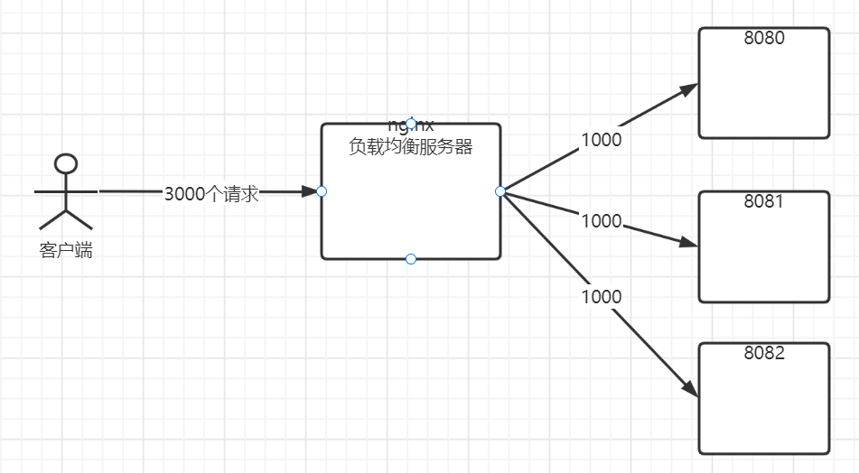
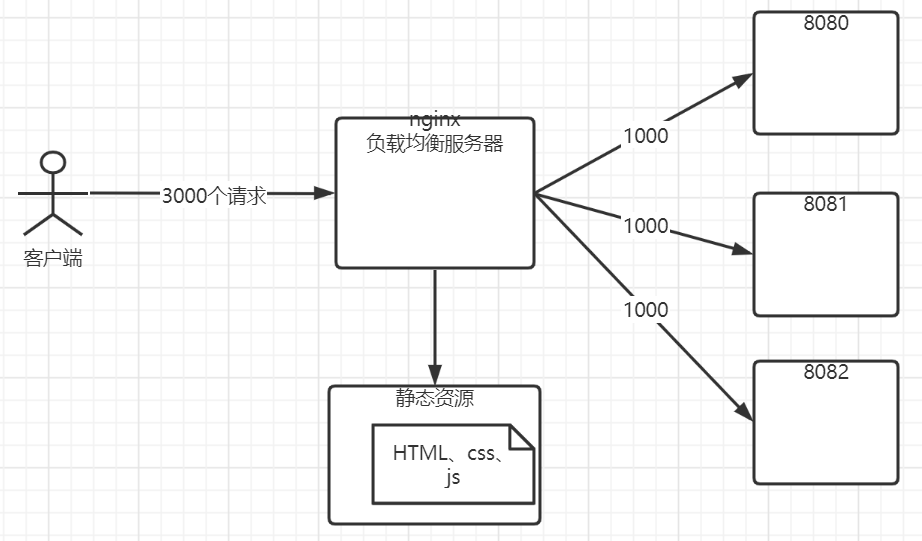
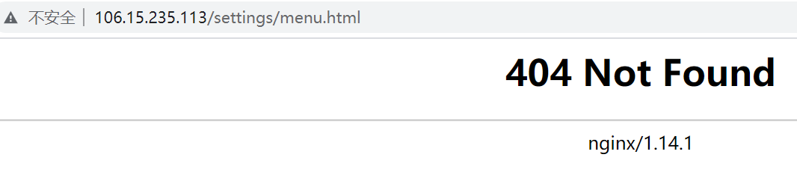
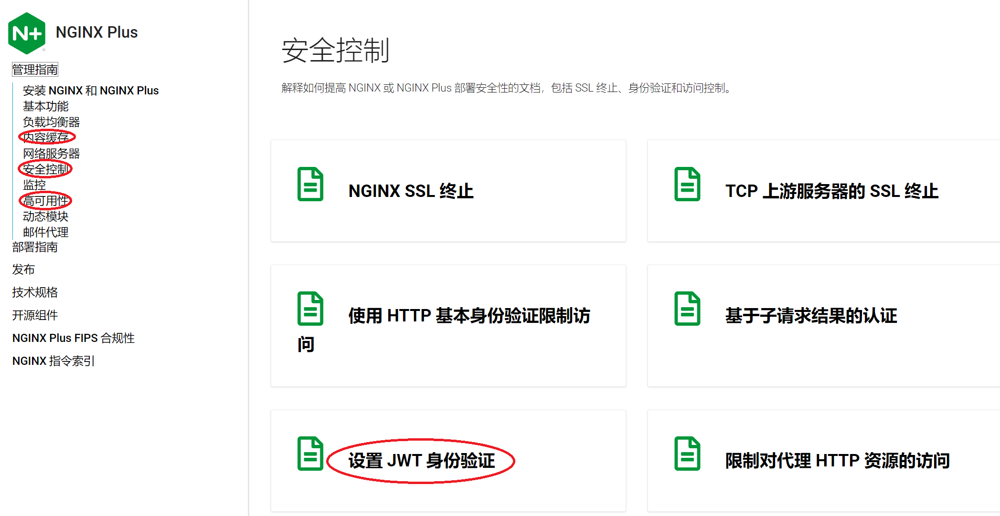

# 资料

> 官网文档：https://nginx.org/en/docs/
>
> 这是我见过最离谱的文档......
>
> 尚硅谷的b站视频教程
>
> NGINX指南：https://docs.nginx.com/nginx/admin-guide/

# nginx学习

## 概述

Nginx ("engine x") 是一个高性能的 HTTP 和反向代理服务器,特点是占有内存少，并发能力强，事实上 nginx 的并发能力确实在同类型的网页服务器中表现较好，中国大陆使用 nginx 网站用户有：百度、京东、新浪、网易、腾讯、淘宝等(来自百度百科)。

Nginx 是高性能的 HTTP 和反向代理的服务器，处理高并发能力是十分强大的，能经受高负载的考验,有报告表明能支持高达 50,000 个并发连接数。

**应用场景**

1、正向代理、反向代理

2、负载均衡

3、动静分离

**正向代理**

正向代理：如果把局域网外的 Internet 想象成一个巨大的资源库，则局域网中的客户端要访问 Internet，则需要通过代理服务器来访问，这种代理服务就称为正向代理。


**反向代理**

反向代理，其实客户端对代理是无感知的，因为客户端不需要任何配置就可以访问，我们只需要将请求发送到反向代理服务器，由反向代理服务器去选择目标服务器获取数据后，在返回给客户端，此时反向代理服务器和目标服务器对外就是一个服务器，暴露的是代理服务器的地址，隐藏了真实服务器 IP 地址。

**暴露的是代理服务器地址，隐藏了真实服务器** **IP** **地址。**


**负载均衡**

增加服务器数量，将多个请求负载分发到不同服务器，就像刚学到的Redis cluster集群那样呗。



**动静分离**



## 安装

> 这必然安装在Linux了。

**centos下yum安装：**

```shell
sudo yum install epel-release
sudo yum install nginx
# sudo systemctl enable nginx	# 设置开机启动nginx
sudo systemctl start nginx	# 启动nginx
```

**nginx目录**

```shell
[root@iZuf6el32a2l9b73omo6cgZ nginx]# whereis nginx
nginx: /usr/sbin/nginx /usr/lib64/nginx /etc/nginx /usr/share/nginx /usr/share/man/man3/nginx.3pm.gz /usr/share/man/man8/nginx.8.gz
```

以下是Nginx的默认路径：

(1) Nginx配置路径：/etc/nginx/

(2) PID目录：/var/run/nginx.pid

(3) 错误日志：/var/log/nginx/error.log

(4) 访问日志：/var/log/nginx/access.log

(5) 默认站点目录：/usr/share/nginx/html

事实上，只需知道Nginx配置路径，其他路径均可在`/etc/nginx/nginx.conf` 以及`/etc/nginx/conf.d/default.conf` 中查询到。

当然，Nginx也可以手动编译安装，步骤相对要繁琐一些。手动编译安装的话，可以看菜鸟教程。

## 管理命令

(1) 启动：

```shell
nginx
```

(2) `nginx -t `测试 Nginx 配置文件是否符合要求；

```shell
[root@iZuf6el32a2l9b73omo6cgZ nginx]# nginx -t
nginx: the configuration file /etc/nginx/nginx.conf syntax is ok
nginx: configuration file /etc/nginx/nginx.conf test is successful
```

(3) `nginx -s reload` 重新加载 Nginx 配置文件；

```shell
nginx -s reload
```

该命令与以下命令类似：

```shell
kill -HUP nginx进程号
```

(4)`nginx -V `查看 Nginx 版本信息、编译参数等。

```shell
[root@iZuf6el32a2l9b73omo6cgZ nginx]# nginx -v
nginx version: nginx/1.14.1
```

(5)`nginx -s stop`停止nginx

```shell
[root@iZuf6el32a2l9b73omo6cgZ nginx]# nginx -s  stop
[root@iZuf6el32a2l9b73omo6cgZ nginx]# ps -ef|grep nginx
root      170458  169555  0 11:08 pts/0    00:00:00 grep --color=auto nginx
```

### 在运行时控制 NGINX 进程

了解处理流量的 NGINX 进程，以及如何在运行时控制它们。

NGINX 有一个主进程和一个或多个工作进程。如果 启用[缓存](https://docs.nginx.com/nginx/admin-guide/content-cache/content-caching/)，缓存加载器和缓存管理器进程也会在启动时运行。

**主进程**的主要目的是读取和评估配置文件，以及维护工作进程。

**工作进程**执行请求的实际处理。NGINX 依赖于操作系统相关的机制来有效地在工作进程之间分配请求。工作进程的数量由**nginx.conf**配置文件中的[worker_processes](https://nginx.org/en/docs/ngx_core_module.html#worker_processes) 指令定义，可以设置为固定数量，也可以配置为根据可用 CPU 内核的数量自动调整。

要重新加载您的配置，您可以停止或重新启动 NGINX，或向主进程发送信号。可以通过运行`nginx`带有`-s`参数的命令（调用 NGINX 可执行文件）来发送信号。

```shell
nginx -s <signal>

<SIGNAL>可以是以下之一：
quit – 优雅地关闭
reload – 重新加载配置文件
reopen – 重新打开日志文件
stop – 立即关机（快速关机）
```

默认情况下，主进程的进程 ID 会写入**nginx.pid**文件，该文件位于**/usr/local/nginx/logs**或**/var/run**目录中。


## 配置文件

yum安装的nginx配置文件在`/etc/nginx/nginx.conf`，可以通过命令`nginx -t`查看配置文件在哪。

nginx配置文件包含3个块：全局块、events块、http块。

**全局块**

> 从配置文件开始到 events 块之间的内容，主要会设置一些影响 **nginx 服务器整体运行的配置指令**，主要包括配置运行 Nginx 服务器的用户（组）、允许生成的 worker process 数，进程 PID 存放路径、日志存放路径和类型以及配置文件的引入等。

**events块**

> events 块涉及的指令主要影响 **Nginx 服务器与用户的网络连接**，常用的设置包括是否开启对多 work process 下的网络连接进行序列化，是否允许同时接收多个网络连接，选取哪种事件驱动模型来处理连接请求，每个 word process 可以同时支持的最大连接数等。
>
> 这部分的配置对 Nginx 的性能影响较大，在实际中应该灵活配置。

**http块**

> 这算是 Nginx 服务器配置中最频繁的部分，代理、缓存和日志定义等绝大多数功能和第三方模块的配置都在这里。
>
> 它还包含了两部分：http块和server块
>
> **http块**
>
> > http 全局块配置的指令包括文件引入、MIME-TYPE 定义、日志自定义、连接超时时间、单链接请求数上限等。
>
> **server块**
>
> > 这块和虚拟主机有密切关系，虚拟主机从用户角度看，和一台独立的硬件主机是完全一样的，该技术的产生是为了节省互联网服务器硬件成本。
> >
> > 每个 http 块可以包括多个 server 块，而每个 server 块就相当于一个虚拟主机。
> > 而每个 server 块也分为全局 server 块，以及可以同时包含多个 locaton 块。
> >
> > **全局server块**
> >
> > > 最常见的配置是本虚拟机主机的监听配置和本虚拟主机的名称或 IP 配置
> >
> > **location块**
> >
> > > 一个 server 块可以配置多个 location 块。
> > >
> > > 这块的主要作用是基于 Nginx 服务器接收到的请求字符串（例如 server_name/uri-string），对虚拟主机名称（也可以是 IP 别名）之外的字符串（例如 前面的 /uri-string）进行匹配，对特定的请求进行处理。地址定向、数据缓存和应答控制等功能，还有许多第三方模块的配置也在这里进行。

为了使配置更易于维护，建议将其拆分为一组存储在**/etc/nginx/conf.d**目录中的特定于功能的文件，并 在主**nginx.conf**文件中使用[include](https://nginx.org/en/docs/ngx_core_module.html#include)指令来引用内容特定于功能的文件。

```nginx
include conf.d/http;
include conf.d/stream;
include conf.d/exchange-enhanced;
```


## Web服务器

将 NGINX 和 NGINX Plus 配置为 Web 服务器，支持虚拟服务器多租户、URI 和响应重写、变量和错误处理。

注意：配置Web服务器，NGINX Open Source和NGINX Plus没什么区别。

概括地说，将 NGINX 配置为 Web 服务器就是定义它处理哪些 URL 以及它如何处理这些 URL 上的资源的 HTTP 请求。在较低级别，配置定义了一组*虚拟服务器*，用于控制对特定域或 IP 地址的请求的处理。有关配置文件的更多信息，请参阅[创建 NGINX Plus 配置文件](https://www.nginx.com/resources/admin-guide/configuration-files/) 。

### 设置虚拟服务器

虚拟服务器由http上下文的server指令配置，例如：可以在http中加入多个虚拟服务器

```nginx
http{
    server{
        # server configuration
        listen 127.0.0.1:80;
        server_name example.com www.example.com; # 此示例说明了一个确切的名称
        
        location /some/path/ {
            proxy_pass http://127.0.0.1:8080/some/path/;
        }
    }
    server{
        # server configuration
    }
}
```

server配置块的`listen`指令指定ip和端口。
如果省略端口，则使用标准端口80。同样，如果省略地址，服务器将侦听所有地址。

如果有多个服务器匹配请求的 IP 地址和端口（例如多个域名指向同一个IP），NGINX Plus 会 根据块`Host`中的[server_name](https://nginx.org/en/docs/http/ngx_http_core_module.html#server_name)指令测试请求的标头字段`server`。参数`server_name`可以是完整（精确）名称、通配符或正则表达式。通配符是`*`在其开头、结尾或两者都包含星号的字符串；星号匹配任何字符序列。NGINX Plus 对正则表达式使用 Perl 语法；在它们前面加上波浪号 ( `~`)。

如果多个名称与`Host`标题匹配，NGINX Plus 通过按以下顺序搜索名称并使用它找到的第一个匹配项来选择一个：

1. 确切名称
2. 以星号开头的最长通配符，例如 `*.example.org`
3. 以星号结尾的最长通配符，例如 `mail.*`
4. 第一个匹配的正则表达式（按照在配置文件中出现的顺序）

如果都不匹配，则将请求路由到默认服务器。

默认服务器是**nginx.conf**文件中列出的第一个服务器，也可以手动指定一个服务器为默认服务器：

```nginx
server {
    listen 80 default_server; # default_server 参数 指定此服务器为默认服务器
    #...
}
```

### 配置位置

NGINX Plus 可以根据请求 URI 将流量发送到不同的代理或提供不同的文件。可以使用`server`块中`location`块来配置。

```nginx
location [ = | ~ | ~* | ^~ ] uri {}
```

可以定义三个`location`块来指示虚拟服务器将一些请求发送到一个代理服务器，将其他请求发送到另一个代理服务器，并通过从本地文件系统传递文件来为其余请求提供服务。

在每个`location`块内，通常可以（除了少数例外）放置更多`location`指令以进一步细化特定请求组的处理。

`location`指令有两种类型的参数：*前缀字符串*（路径名）和正则表达式

以下带有路径名参数的示例位置匹配以**/some/path/**开头的请求 URI ，例如**/some/path/document.html**。（它与**/my-site/some/path**不匹配，因为**/some/path**没有出现在该 URI 的开头。）

```nginx
location /some/path/ {
    #...
}
```

正则表达式前面有波浪号 ( `~`) 表示区分大小写匹配，或前面加上波浪号星号 ( `~*`) 表示不区分大小写匹配。以下示例匹配在任何位置包含字符串**.html**或**.htm 的**URI 。

```nginx
location ~ \.html? {
    #...
}
```

**NGINX location 优先级**

NGINX首先使用前缀字符串参数的location进行比较，然后使用正则表达式参数的location进行比较。

正则表达式具有更高的优先级，除非使用`^~`修饰符。

请求location处理逻辑如下：

1、针对所有前缀字符串测试 URI。

2、`= `：用于不含正则表达式的 uri 前，要求请求字符串与 uri **严格匹配**，如果匹配成功，就停止继续向下搜索并立即处理该请求。

3、如果`^~`(caret-tilde) 修饰符在最长的匹配前缀字符串前面，则不检查正则表达式。

4、存储最长匹配字符串

5、根据正则表达式测试 URI。

6、当找到第一个匹配的正则表达式时停止处理并使用相应的location。

7、如果没有正则表达式匹配，则使用与存储的前缀字符串对应的位置。

`=`修饰符的典型用例是请求**/**（正斜杠）。如果对**`/` **的请求很频繁，`= /`则将其指定为`location`指令的参数会加快处理速度，因为在第一次比较后会停止对匹配项的搜索。不然检查完前缀字符串，还要去检查正则表达式字符串。

```nginx
location = / {
    proxy_pass http://myserver;
}
```
### 使用变量

您可以使用配置文件中的变量让 NGINX 根据定义的情况以不同的方式处理请求。变量是在运行时计算的命名值，用作指令的参数。变量`$`由其名称开头的（美元）符号表示。变量定义了基于 NGINX 状态的信息，例如当前正在处理的请求的属性。

有许多预定义的变量，例如[核心 HTTP](https://nginx.org/en/docs/http/ngx_http_core_module.html#variables) 变量，可以使用[set](https://nginx.org/en/docs/http/ngx_http_rewrite_module.html#set) 、[map](https://nginx.org/en/docs/http/ngx_http_map_module.html#map) 和[geo](https://nginx.org/en/docs/http/ngx_http_geo_module.html#geo) 指令定义自定义变量。大多数变量在运行时计算并包含与特定请求相关的信息。例如，`$remote_addr`包含客户端 IP 地址，`$uri`保存当前 URI 值。

可以看看核心HTTP变量：https://nginx.org/en/docs/http/ngx_http_core_module.html#variables。
在一些设置请求头的情况下很有用。

### 返回状态码

某些网站 URI 需要立即返回带有特定错误或重定向代码的响应，例如，当页面被临时或永久移动时。最简单的方法是使用[return](https://nginx.org/en/docs/http/ngx_http_rewrite_module.html#return) 指令。

```nginx
    location ~ ^/settings/{
        return 404;
    }
```



`return `指令有2个参数：

- 第一个是返回的状态码
- 第2个是可选的，主要用是重定向( `301`，`302`，`303`，`307`)或在响应体返回的文本

```nginx
location ~ ^/settings/menu.html{
    return 301 http://106.15.235.113/blog/index.html?flag=demo;
}
```


### 重写URI

`rewrite`指令可以在请求处理期间多次修改请求 URI，该指令具有一个可选参数和两个必需参数。

```nginx
location /users/ {
    rewrite ^/users/(.*)$ /show?user=$1 break;
}
```

第一个（必需）参数是请求 URI 必须匹配的正则表达式。
第二个参数是要替换匹配 URI 的 URI。

可选的第三个参数是一个标志，可以停止进一步`rewrite`指令的处理或发送重定向（代码`301`或`302`）。

有两个参数可以中断`rewrite`指令的处理：

- `last`– 停止执行当前`server`或`location`上下文中的`rewrite`指令，但 NGINX Plus 搜索与重写的 URI 匹配的位置，并`rewrite`应用新位置中的任何指令（意味着可以再次更改 URI）。
- `break`– 与[break](https://nginx.org/en/docs/http/ngx_http_rewrite_module.html#break) 指令一样，停止处理当前上下文中的`rewrite`指令并取消对与新 URI 匹配的位置的搜索。`rewrite`不执行新位置中的指令。

重写URI对于浏览器是不可见的。

您可以`rewrite`在 the`server`和`location`上下文中包含多个指令。NGINX Plus 按照指令出现的顺序一一执行。当上下文被选择时，上下文中的`rewrite`指令将`server`被执行一次。

NGINX 处理一组重写指令后，`location`根据新的 URI选择上下文。如果所选位置包含`rewrite`指令，则依次执行它们。如果 URI 匹配其中任何一个，则在处理所有定义的`rewrite`指令后开始搜索新位置。

以下示例显示`rewrite`了与`return`指令结合使用的指令。

```nginx
server {
    #...
    rewrite ^(/download/.*)/media/(\w+)\.?.*$ $1/mp3/$2.mp3 last;
    rewrite ^(/download/.*)/audio/(\w+)\.?.*$ $1/mp3/$2.ra  last;
    return  403;
    #...
}
```

### 重写HTTP响应

有时您需要重写或更改 HTTP 响应中的内容，用一个字符串替换另一个字符串。您可以使用[sub_filter](https://nginx.org/en/docs/http/ngx_http_sub_module.html#sub_filter) 指令来定义要应用的重写。该指令支持变量和替换链，使更复杂的更改成为可能。

示例将方案从 更改`http://`为`https://`并将`localhost`地址替换为请求标头字段中的主机名。该[sub_filter_once](https://nginx.org/en/docs/http/ngx_http_sub_module.html#sub_filter_once) 指令告诉nginx申请[sub_filter](https://nginx.org/en/docs/http/ngx_http_sub_module.html#sub_filter) 位置内连续指令：

```nginx
location / {
    sub_filter     'href="http://127.0.0.1:8080/'    'href="https://$host/';
    sub_filter     'img src="http://127.0.0.1:8080/' 'img src="https://$host/';
    sub_filter_once on;
}
```

请注意，如果已经被一个`sub_filter`修改过，则不会被另一个匹配的`sub_filter`修改了。

### 处理错误

可以自定义NGINX的错误页面。


## 反向代理

将 NGINX 配置为 HTTP 和其他协议的反向代理，支持修改请求标头和微调响应缓冲。

代理通常用于在多个服务器之间分配负载，无缝显示来自不同网站的内容，或通过 HTTP 以外的协议将处理请求传递给应用程序服务器。

### 请求代理

当 NGINX 代理请求时，它将请求发送到指定的代理服务器，获取响应，并将其发送回客户端。可以使用指定的协议将请求代理到 HTTP 服务器（另一个 NGINX 服务器或任何其他服务器）或非 HTTP 服务器（可以运行使用特定框架开发的应用程序，例如 PHP 或 Python）。支持的协议包括[FastCGI](https://nginx.org/en/docs/http/ngx_http_fastcgi_module.html) 、[uwsgi](https://nginx.org/en/docs/http/ngx_http_uwsgi_module.html) 、[SCGI](https://nginx.org/en/docs/http/ngx_http_scgi_module.html) 和[memcached](https://nginx.org/en/docs/http/ngx_http_memcached_module.html) 。

要将请求传递给 HTTP 代理服务器， 可以在[location 中](https://nginx.org/en/docs/http/ngx_http_core_module.html#location)指定[proxy_pass](https://nginx.org/en/docs/http/ngx_http_proxy_module.html#proxy_pass)指令 。例如：

```nginx
location /some/path/ {
    proxy_pass http://www.example.com/link/;
}
```

此示例配置导致将在此位置处理的所有请求传递到指定地址的代理服务器。该地址可以指定为域名或 IP 地址。

注意：在上面的第一个例子中，代理的服务器的地址后面是一个URI， `/link/`。如果 URI 与地址一起指定，它将替换请求 URI 中与位置参数匹配的部分。例如，这里带有`/some/path/page.html`URI的请求将被代理到`http://www.example.com/link/page.html`.

传递给非HTTP服务器的话，请参阅[参考文档](https://nginx.org/en/docs/)。

该[proxy_pass](https://nginx.org/en/docs/http/ngx_http_proxy_module.html#proxy_pass) 指令也可以指向一个[命名组](https://nginx.org/en/docs/http/load_balancing.html#algorithms) 服务器。在这种情况下，请求会根据[指定的方法](https://www.nginx.com/resources/admin-guide/load-balancer/)在组中的服务器之间分配 。（即负载均衡）

### 传递请求头

默认情况下，NGINX 重新定义了代理请求中的两个 header 字段，“Host”和“Connection”，并消除了值为空字符串的 header 字段。“Host”设置为`$proxy_host`变量，“Connection”设置为`close`。

要更改这些设置以及修改其他标头字段，请使用[proxy_set_header](https://nginx.org/en/docs/http/ngx_http_proxy_module.html#proxy_set_header) 指令。该指令可以在一个[位置](https://nginx.org/en/docs/http/ngx_http_core_module.html#location) 或更高的[位置](https://nginx.org/en/docs/http/ngx_http_core_module.html#location)指定。它也可以在特定的[服务器](https://nginx.org/en/docs/http/ngx_http_core_module.html#server) 上下文或[http](https://nginx.org/en/docs/http/ngx_http_core_module.html#http) 块中指定。

```nginx
location /some/path/ {
    proxy_set_header Host $host;
    proxy_set_header X-Real-IP $remote_addr;
    proxy_pass http://localhost:8000;
}
```

在此配置中，“Host”字段设置为[$host](https://nginx.org/en/docs/http/ngx_http_core_module.html#variables) 变量。

为了防止头字段被传递到代理服务器，请将其设置为空字符串，如下所示：

```nginx
location /some/path/ {
    proxy_set_header Accept-Encoding "";
    proxy_pass http://localhost:8000;
}
```

### 配置缓冲区

默认情况下，NGINX 会缓冲来自代理服务器的响应。响应存储在内部缓冲区中，并且在收到整个响应之前不会发送到客户端。缓冲有助于优化慢速客户端的性能，如果响应从 NGINX 同步传递到客户端，这可能会浪费代理服务器的时间。然而，当启用缓冲时，NGINX 允许代理服务器快速处理响应，而 NGINX 存储响应的时间与客户端下载它们所需的时间一样长。

负责启用和禁用缓冲的指令是[proxy_buffering](https://nginx.org/en/docs/http/ngx_http_proxy_module.html#proxy_buffering) 。默认情况下，它设置为`on`并启用缓冲。

```nginx
location /some/path/ {
    proxy_buffers 16 4k;
    proxy_buffer_size 2k;
    proxy_pass http://localhost:8000;
}
```

[proxy_buffers](https://nginx.org/en/docs/http/ngx_http_proxy_module.html#proxy_buffers) 指令控制规模和分配的请求缓冲区的数目。

来自代理服务器的响应的第一部分存储在单独的缓冲区中，其大小由[proxy_buffer_size](https://nginx.org/en/docs/http/ngx_http_proxy_module.html#proxy_buffer_size) 指令设置。

**禁用缓冲**

响应会在客户端从代理服务器接收响应时同步发送到客户端。对于需要尽快开始接收响应的快速交互式客户端，此行为可能是可取的。

```nginx
location /some/path/ {
    proxy_buffering off;
    proxy_pass http://localhost:8000;
}
```

在这种情况下，NGINX 仅使用 proxy_buffer_size 配置的[缓冲区](https://nginx.org/en/docs/http/ngx_http_proxy_module.html#proxy_buffer_size) 来存储响应的当前部分。

### 选择传出的IP

如果您的代理服务器有多个网络接口，有时您可能需要选择一个特定的源 IP 地址来连接到代理服务器或上游。如果 NGINX 后面的代理服务器被配置为接受来自特定 IP 网络或 IP 地址范围的连接，这可能很有用。

定[proxy_bind](https://nginx.org/en/docs/http/ngx_http_proxy_module.html#proxy_bind) 指令和必要网络接口的 IP 地址：

```nginx
location /app1/ {
    proxy_bind 127.0.0.1;
    proxy_pass http://example.com/app1/;
}

location /app2/ {
    proxy_bind 127.0.0.2;
    proxy_pass http://example.com/app2/;
}
```

也可以使用变量指定 IP 地址。例如，[`$server_addr`](https://nginx.org/en/docs/http/ngx_http_core_module.html#var_server_addr) 变量传递接受请求的网络接口的 IP 地址：

```nginx
location /app3/ {
    proxy_bind $server_addr;
    proxy_pass http://example.com/app3/;
}
```


## HTTP负载均衡

### 概述

使用多种算法和高级功能（如慢启动和会话持久性）对 Web 或应用程序服务器组之间的 HTTP 流量进行负载平衡。

要开始使用 NGINX Plus 或 NGINX Open Source 将 HTTP 流量负载均衡到一组服务器，首先需要使用[`upstream`](https://nginx.org/en/docs/http/ngx_http_upstream_module.html#upstream) 指令定义组。该指令放置在[`http`](https://nginx.org/en/docs/http/ngx_http_core_module.html#http) 上下文中。

可以去/etc/nginx/conf.d目录下新建`myserver.conf`文件，再去nginx.conf里的http块里面再include，一般默认情况下里面已经默认引入了conf.d目录下的所有配置文件：

```nginx
    # Load modular configuration files from the /etc/nginx/conf.d directory.
    # See http://nginx.org/en/docs/ngx_core_module.html#include
    # for more information.
    include /etc/nginx/conf.d/*.conf;
```

在myserver.conf里配置如下：最简配置

```nginx
upstream myserber {
    server 127.0.0.1:8080;
    server 127.0.0.1:8081;
    server 127.0.0.1:9090 backup; # backup 参数：在上面2个服务器都挂了之后，才会就请求分配到备用服务器
}

server {
    location / {
    	proxy_pass http://myserver;
    }
}
```

### 负载均衡算法

NGINX 开源支持四种负载均衡方法，NGINX Plus 增加了两种方法：

1、Round Robin循环 - 请求在服务器之间均匀分布，并考虑[服务器权重](https://docs.nginx.com/nginx/admin-guide/load-balancer/http-load-balancer/#weights)。默认情况下使用此方法（没有启用它的指令）：

```nginx
upstream backend {
   # no load balancing method is specified for Round Robin
   server backend1.example.com;
   server backend2.example.com;
}
```

2、最少连接 ——请求被发送到活动连接数最少的服务器，再考虑[服务器权重](https://docs.nginx.com/nginx/admin-guide/load-balancer/http-load-balancer/#weights)：
配置为`least_conn;`

3、[IP Hash](https://nginx.org/en/docs/http/ngx_http_upstream_module.html#ip_hash) – 请求发送到的服务器由客户端 IP 地址确定。在这种情况下，要么使用 IPv4 地址的前三个八位字节，要么使用整个 IPv6 地址来计算哈希值。该方法保证来自同一地址的请求到达同一服务器，可以解决 session 的问题。
配置为`ip_hash;`

4、通用[哈希](https://nginx.org/en/docs/http/ngx_http_upstream_module.html#hash) - 请求发送到的服务器由用户定义的键确定，该键可以是文本字符串、变量或组合。例如，密钥可以是成对的源 IP 地址和端口，或 URI，如本例所示：

```nginx
upstream backend {
    hash $request_uri consistent;
    server backend1.example.com;
    server backend2.example.com;
}
```

其可选`consistent`参数可启用ketama一致性哈希负载平衡。请求根据用户定义的散列键值均匀分布在所有上游服务器上。如果上游服务器添加到上游组或从上游组中删除，则只需重新映射少数密钥，从而在负载平衡缓存服务器或其他累积状态的应用程序的情况下最大限度地减少缓存未命中。

5、[Least Time](https://nginx.org/en/docs/http/ngx_http_upstream_module.html#least_time) (NGINX Plus only) 

6、Random

---

注意：如果其中一台服务器需要暂时从负载平衡轮换中移除，则可以使用[down](https://nginx.org/en/docs/http/ngx_http_upstream_module.html#down) 参数对其进行标记，以保留客户端 IP 地址的当前散列。由该服务器处理的请求会自动发送到组中的下一个服务器：

```nginx
upstream backend {
    server backend1.example.com;
    server backend2.example.com;
    server backend3.example.com down;
}
```

### 服务器权重

默认情况下，NGINX 使用 Round Robin 方法根据权重在组中的服务器之间分配请求。该 指令的[`weight`](https://nginx.org/en/docs/http/ngx_http_upstream_module.html#weight) 参数设置服务器的权重；默认是`1`：

```nginx
upstream myserver{
    server 127.0.0.1:8080 weight=5;
    server 127.0.0.1:8081;
}
```

大约每6个请求，5个到第一个。

### HTTP健康检查

通过发送定期健康检查（包括 NGINX Plus 中可自定义的主动健康检查）来监控上游组中 HTTP 服务器的健康状况。

NGINX 和 NGINX Plus 可以持续测试您的上游服务器，避免出现故障的服务器，并将恢复的服务器优雅地添加到负载均衡组中。

NGINX OPEN SOURCE支持被动健康检查
NGINX PLUS支持被动健康检查和主动健康检查。

#### 被动健康检查

对于被动健康检查，NGINX 和 NGINX Plus 会在事务发生时对其进行监控，并尝试恢复失败的连接。如果事务仍然无法恢复，NGINX Open Source 和 NGINX Plus 将服务器标记为不可用并暂时停止向其发送请求，直到它再次标记为活动状态。

```nginx
upstream myserver{
    server 127.0.0.1:8080 weight=5 max_fails=3 fail_timeout=30s;
    server 127.0.0.1:8081;
}
```

- `fail_timeout`：如果在fail_timeout时间内都无法连接上服务器，则将其标记为不可用。该时间同时也是标记为不可用的时间长度。(默认10s)

- `max_fails`：在fail_timeout需要尝试max_fails次才能标记为不可用。默认1次

在上面这个例子中：如果NGINX无法向8080服务器发请求或者30s内没有收到3次响应，则将其标记为不可用30s。
注意：如果只有一台服务器，那么这两个参数将被忽略，服务器不会被标记为不可用。

#### 服务器慢启动

最近恢复的服务器很容易被连接淹没，这可能会导致服务器再次被标记为不可用。慢启动允许上游服务器在恢复或可用后逐渐从零恢复其权重到其标称值。这可以通过上游[`server`](https://nginx.org/en/docs/http/ngx_http_upstream_module.html#server) 指令 的参数[`slow_start`](https://nginx.org/en/docs/http/ngx_http_upstream_module.html#slow_start)来完成：

```nginx
upstream backend {
    server backend1.example.com slow_start=30s;
    server backend2.example.com;
    server 192.0.0.1 backup;
}
```

请注意，如果组中只有一个服务器，`slow_start`则忽略该参数并且该服务器永远不会标记为不可用。**慢启动是 NGINX Plus 独有的。**(离谱，当然NGINX Plus也是可以下载的)

## 提供静态内容

Nginx 动静分离简单来说就是把动态跟静态请求分开，不能理解成只是单纯的把动态页面和静态页面物理分离。严格意义上说应该是动态请求跟静态请求分开，可以理解成使用 Nginx 处理静态页面，Tomcat 处理动态页面。

通过 location 指定不同的后缀名实现不同的请求转发。通过 expires 参数设置，可以使浏览器缓存过期时间，减少与服务器之前的请求和流量。

具体 Expires 定义：是给一个资源设定一个过期时间，也就是说无需去服务端验证，直接通过浏览器自身确认是否过期即可，所以不会产生额外的流量。此种方法非常适合不经常变动的资源。（如果经常更新的文件，不建议使用 Expires 来缓存），比如设置 3d，表示在这 3 天之内访问这个 URL，发送一个请求，比对服务器该文件最后更新时间没有变化，则不会从服务器抓取，返回状态码304，如果有修改，则直接从服务器重新下载，返回状态码 200。

### 图床实现

在静态内容上，NGINX比Tomcat更强大，也比Tomcat更方便配置。这里通过SpringMVC实现文件上传以及Base64字符串转图片的方式，然后将文件保存到NGINX配置的静态内容目录下，可实现图片外网访问。

#### Nginx配置

> NGINX相应的文档：https://docs.nginx.com/nginx/admin-guide/web-server/serving-static-content/

root指令用于指定文件搜索的根目录，可以放置在HTTP块、server块或者location上下文.
这里的案例是用location块配置：

```nginx
   location /images/ {
        client_max_body_size 10M; # 配置请求体大小，不配置的话，文件超过默认值会被NGINX拒绝
        root /opt/mynginx; # 静态内容配置这个目录下
        autoindex on;
        try_files $uri /images/404.jpg; # 没有则返回配置的404页面
        expires 7d; # 静态内容改动少的情况下，可以让浏览器缓存更久一点，7天 
   }
```

配置静态内容代理远远没有这么简单，可以去官网看看更多细节。

> 注意：权限问题，我自己测试发现在文件夹的权限为666的时候居然无法访问，日志显示拒绝访问。755的权限可以正常访问。

#### SpringMVC处理

有两种方式，一个是传统的表单文件上传，一个是js将图片转为base64之后发给服务器。
SpringBoot项目的话，引入的依赖如下：

```xml
        <!--Hutool工具-->
        <dependency>
            <groupId>cn.hutool</groupId>
            <artifactId>hutool-all</artifactId>
            <version>5.7.14</version>
        </dependency>
		<!--Spring WebMVC 依赖-->
        <dependency>
            <groupId>org.springframework.boot</groupId>
            <artifactId>spring-boot-starter-web</artifactId>
        </dependency>
```

代码如下：

```java
/**
 * @author fzk
 * @date 2021-11-10 17:14
 */
@RestController
@RequestMapping("/file")
public class FileController {
    @Value("${my.file.pic.format}")
    private HashSet<String> format;
    @Value("${my.file.pic.type}")
    private HashSet<String> type;
    @Value("${my.file.pic.picRootPath}")
    private String picRootPath;
    @Value("${my.file.pic.picAccessPath}")
    private String picAccessPath;
    @Value("${my.file.pic.toCompressSize}")
    private long toCompressSize;

    /**
     * 传统方式文件上传
     *
     * @param picFile 文件
     * @return result
     */
    @PostMapping("/pic/upload")
    public Result upload(MultipartFile picFile,
                         @RequestParam("picType") String picType,
                         @RequestParam(name = "isCompress",defaultValue = "true") boolean isCompress) {
        // 1.参数检查
        if (picFile == null || picFile.isEmpty())        // 判断是否上传了文件
            return Result.error(CodeEum.PARAM_MISS);
        // 判断是否图片
        String filename = picFile.getOriginalFilename();//获取上传的⽂件名
        if (filename == null)
            return Result.error(CodeEum.PARAM_ERROR, "没有文件名");

        int lastIndex = filename.lastIndexOf('.');
        if (lastIndex < 0)
            return Result.error(CodeEum.PARAM_ERROR, "只能上传图片，如这些格式：" + format);
        String suffixName = filename.substring(lastIndex + 1).toLowerCase();
        if (!format.contains(suffixName))
            return Result.error(CodeEum.PARAM_ERROR, "只能上传图片，如这些格式：" + format);

        if (!type.contains(picType))
            return Result.error(CodeEum.PARAM_ERROR, "图片类型仅能选择：" + type);

        // 2.文件目录处理
        String relativePath = picType + "/" + MyDateTimeUtil.getNowDateOrTime("yyyy-MM");
        String path = picRootPath + "/" + relativePath + "/";
        File dir_file = new File(path);
        if (!dir_file.exists()) dir_file.mkdirs();

        // 3.文件名称处理
        filename = picType + UUID.randomUUID() + "." + suffixName;
        File img_file = new File(path, filename);
        img_file.deleteOnExit();//删除旧文件

        // 4、将文件写入到磁盘
        try (
                InputStream in = picFile.getInputStream();
                OutputStream out = new FileOutputStream(img_file)
        ) {
            if (isCompress)
                isCompress = picFile.getSize() > toCompressSize; // 大于1MB进行压缩

            myTransferTo(in, out, isCompress);
            // 5.返回访问路径
            return Result.success(picAccessPath + "/" + relativePath + "/" + filename);
        } catch (IOException e) {
            Result result = Result.error(CodeEum.ERROR);
            result.addMsg(e.getMessage());
            return result;
        }
    }


    /**
     * 将base64字符串转为图片
     *
     * @param picBase64Str 字符串
     * @param picFormat    图片格式
     * @param picType      图片类型
     * @return result
     */
    @PostMapping(path = "/pic/base64StrToPic")
    public Result base64StrToPic(
            @RequestParam("picBase64Str") String picBase64Str,
            @RequestParam(name = "picFormat", required = false, defaultValue = "png") String picFormat,
            @RequestParam("picType") String picType,
            @RequestParam(name = "isCompress", required = false, defaultValue = "true") boolean isCompress) {

        // 1.参数检查
        if (!type.contains(picType))
            return Result.error(CodeEum.PARAM_ERROR, "图片类型仅能选择：" + type);
        if (picBase64Str.length() > 4194304)
            return Result.error(CodeEum.PARAM_ERROR, "图片base64字符串不能大于4MB, 这将要求图片不能大于3MB");

        // 1.1 js处理的base64图片有前置信息，需要处理一下
        if (picBase64Str.startsWith("data:")) {
            // 1.1.1 文件后缀类型获取
            picFormat = picBase64Str.substring(picBase64Str.indexOf("/") + 1, picBase64Str.indexOf(";"));
            // 1.1.2 删除js处理的base64字符前置信息
            picBase64Str = picBase64Str.substring(picBase64Str.indexOf("base64,") + 7);
        }
        if (picFormat.startsWith(".")) picFormat = picFormat.substring(1);
        if (!format.contains(picFormat))
            return Result.error(CodeEum.PARAM_ERROR, "只能上传图片，如这些格式：" + format);


        // 1.2 base64处理
        byte[] buffer = Base64.getDecoder().decode(picBase64Str);
        picBase64Str = null;
        System.gc();


        // 2.文件目录处理
        String relativePath = picType + "/" + MyDateTimeUtil.getNowDateOrTime("yyyy-MM");
        String path = picRootPath + "/" + relativePath + "/";
        File dir_file = new File(path);
        if (!dir_file.exists()) dir_file.mkdirs();

        // 3.文件名处理
        /* 根据不同文件类型，文件名生成策略应该不同
         * articleImage：
         * userIcon：userIcon+userId
         * productImage：productImage+productId */
        String filename = picType + UUID.randomUUID() + "." + picFormat;// 目前暂时先用UUID
        File img_file = new File(path, filename);
        img_file.deleteOnExit();//删除旧文件

        // 4、将文件写入到磁盘
        Result result;
        try (
                ByteArrayInputStream in = new ByteArrayInputStream(buffer);
                FileOutputStream out = new FileOutputStream(img_file)
        ) {
            if (isCompress) isCompress = buffer.length > toCompressSize;// 大于1MB需要压缩

            myTransferTo(in, out, isCompress);
            // 5.返回访问路径
            result = Result.success(picAccessPath + "/" + relativePath + "/" + filename);
        } catch (Exception e) {
            result = Result.error(CodeEum.ERROR, e.getMessage());
        }
        return result;
    }


    /*注意：此方法自动关闭流*/
    private int myTransferTo(InputStream in, OutputStream out, boolean isCompress) throws IOException {
        if (in == null || out == null)
            throw new IllegalArgumentException("流不能为空");
        int total = 0;

        try (in; out) {
            // 大于1MB将进行压缩处理，这里的压缩调用了Hutool工具
            if (isCompress) {
                ImgUtil.scale(in, out, 0.5f);
            }
            // 否则不会压缩
            else {
                byte[] buffer = new byte[4096];
                for (int len; (len = in.read(buffer)) != -1; total += len) {
                    out.write(buffer);
                }
                out.flush();
            }
        }
        return total;
    }
}
```

配置文件如下：

```yaml
my:
  file:
    pic:
      toCompressSize: 1024000                            # 图片大小达到此值，将进行0.5压缩，单位byte
      format: "jpeg,jpg,png,gif,svg,bmp,ico,tiff"            # 图片格式
      type: "articleImage,userIcon,productImage,customerIcon"        # 图片类型
      picRootPath: "/opt/mynginx/images"   # 指向的必须是nginx配置的存放静态资源的根目录
      picAccessPath: "https://xxxx/images" # 需要以协议开头，在NGINX配置中，此访问路径指向的必须是在nginx的配置的静态资源存放目录
```

同时需要注意的是，默认情况下，Tomcat有接受的文件大小限制，默认是1MB，这里可以配置一下：

```yaml
spring:
  servlet:
    multipart:
      max-request-size: 10MB
      max-file-size: 10MB # 配置Tomcat能接受的最大文件大小
```


## 后期展望

到此，记录了NGINX的基础使用，其他特性暂时不做深究。

根据其官网文档可以发现，它的特性非常多且非常强大。比如内容缓存，安全控制中的禁IP等。



NGINX是一个功能强大的服务器，不过我目前只用得到其中的反向代理和负载均衡。