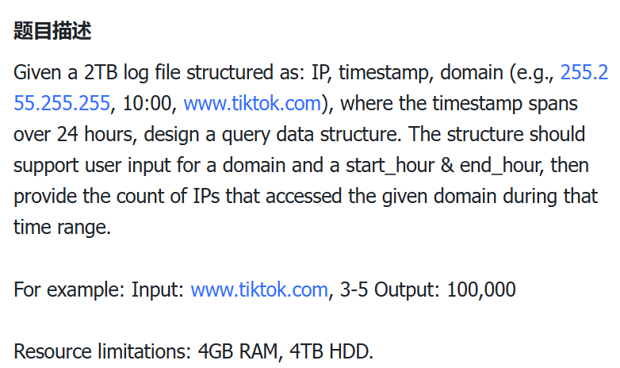
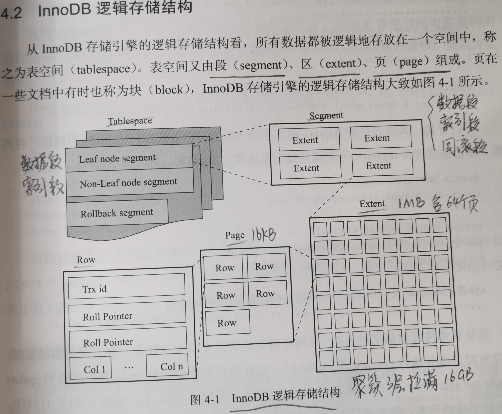
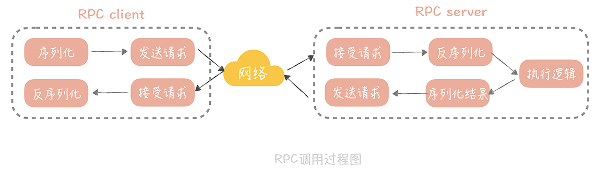
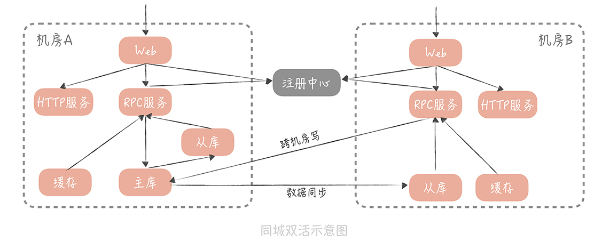

# 自我介绍

面试官您好，我叫冯稚科，目前就读于电子科技大学，专业是软件工程。在校期间学习成绩还可以，拿过一些奖学金，在实验室给老师做过1个scrm的项目。

在开发语言上比较熟悉Java和Go，对Java更熟悉一点，对Java的集合、并发比较了解，以及Java中最常用的Spring框架也看过一些源码。

今年2月到7月在大疆车载中台部实习，用Go开发，参与了高精地图标注管理平台和IAM统一认证授权中心的开发和维护，主要做了一些功能开发和索引优化。

我个人比较喜欢学习和写笔记，在大二开发了一个简陋的个人博客网站，我会将自己最近学的东西写到网站中。比如我写过一些对RocketMQ源码的分析，面试官感兴趣的话可以稍微看一下。


面试您好，我叫冯稚科，毕业于电子科技大学软件工程专业。

之前在度小满信贷系统平台部工作了两年，负责线下信贷业务开发，线下信贷是在线上信贷的基础上新增销售实地考察、辅助授信的模式，主要涉及线下用户的授信全流程、销售端授信补录补件、老客经营、活动发券，脚本维护数据，以及销售相关的功能如业绩、佣金、考勤这些。我主要负责销售端授信、活动发券、脚本维护数据这些。在度小满拿过最佳新人奖，23年末拿过M+的好绩效。

平常自己也不仅仅只局限于业务需求，在闲暇时间有作为前后端开发和维护个人博客，会记录自己闲暇时间看过的一些源码分析和设计，像Spring框架，中间件Tomcat、Netty和Rocketmq这些，学到了不少的代码设计。也会经常学习公司的一些经验文档、线上问题复盘文档。


HR面：

**1、你的优势？**

从经历、技能和个性中挑选出与这个**职位最相关的优势**。使用具体例子支持。

比如拼多多这个是隐私合规平台开发，**我在处理客户隐私上有一些经验**，dxm信贷部门是非常注重客户隐私的，尤其是在涉及到客户还款催收的时候各种数据安全性要求非常严格，比如像虚拟手机号、客户数据加密、临时url访问客户数据。不管是在数据存储、数据传输、甚至我们日志中都严格落实安全合规的。之前我们系统的日志合规改造就是我去做的。

其次我的**团队协作沟通能力比较好**，我主要是做授信流程，会涉及多个系统协同开发，(授信系统/用户中心/风控/策略/规则平台/信审/offer中心/模型)大约和10个左右系统有过合作，差不多信贷部门一半吧(另一半主要是用信还款相关的)，产品和详设阶段和不同系统负责人的沟通、开发和测试阶段的多个系统联调配合，这些我都算是比较有经验的。

再然后吧，目前比较年轻，**对技术和架构还抱有一定热情专研**，平常在公司的时候喜欢看一些自研框架设计，学习整个系统架构流程，经常去学习技术分享。周末在家晚上没事的时候会按照计划性的学一些开源框架设计，大厂技术博客。保持技术新鲜度吧。之前不管是实习还是正式工作，组员或leader都觉得我技术挺好的，上手项目非常快。

**2、你的劣势？**

我的**经验还是有一点欠缺**，比如之前我有次详设的时候(扫码二维码时效设置过期时间和redis有效期一样30s)，主管说我的方案设计实现上没什么问题，但是可以另一种设计(redis有效期更长1天，里面放个过期字段30s)，这两种方案都能实现功能，但是另一种我们后续更好定位问题。当时主管就说我这属于线上问题处理经验不够多。

我认为这个设计经验，要提升的话可以从两个方面努力，一个是多学，学习同事的优秀设计经验，同时如果是自己设计会怎么做再进行比较。另一个自己多练，花时间去积累经验嘛。

**3、这一段工作成长？**

**协作沟通能力**：团队内部协作、外部沟通(PM/QA/FE/其它团队)

**全局视野提升**：会去**关注整个业务链路**。因为我们这边会调用很多系统嘛，在做业务的时候，我会思考负责的系统在链路所处的角色，以及我系统的改造实现方案是否对其它系统有影响？

技术上：更多是**架构视野提升**。一个大的项目，在合理架构设计下，各个系统各司其职，就像拼接木，拼好后就能有条不紊的运行。只要架构设计合理，各个系统能稳定运行，系统里的参与者是谁并不重要。感觉和社会一样，各个阶级有机组合，阶级内谁都一样，缺了谁都转。

心理上：**抗压能力提高了**，严格按照排期执行。做自己的事情也许能推延。

**4、对新工作期待？**

短期的，希望通过自己努力工作和业务理解上能有一些正面反馈，比如好绩效、拿奖、晋升这些。同时也是希望能学到技术或架构，也想学到不同的业务理解。

中长期，自己能在业务理解上，吃透一块业务，负责一个系统，能有机会晋升到高级开发工程师吧。

梦想一点，架构师！

**5、最有成就感的事情？**

当时我通过提前实习去了解自身系统业务，在试用期跟着导师努力学习每个业务功能涉及的其它业务系统，逐步梳理整个业务链路流程、并参与线上问题值班，同时也做了一些项目的技术优化，最后在转正答辩的时候得到了主管、经理和部长的好评。最后也是顺利的拿到了年末的好绩效和最佳新人，确实挺开心的。


**用户同步功能设计介绍：**

需求背景：高精地图项目人员管理功能需要用户信息，用户管理在IAM系统，就需要有一种方式把用户同步过来。

方案设计：要求：信息准确，**及时更新**。像同步功能一般都是全量同步+增量更新嘛。

考虑了几种方案：

方案1：以Http请求先做1次全量同步，然后定时发送Http请求获得更新数据。这个方案更新不及时，而且它增量更新不好做，新用户可以直接拿到，但是比如老用户改名或离职了，就无能为力了，除非去修改IAM数据库，给它加个版本号，这改数据库就不好。

方案2：既然高精地图去拉不好做，就让IAM推过来。就用MQ，全量同步则由高精地图发一个消息，IAM收到后就把所有用户信息分批次发到MQ，并给每个消息1个序列号和是否结束标记，方便高精地图这边做全量比对；增量更新则由IAM在新增用户、修改或删除用户时发消息到MQ即可。

用MQ方案做的话增量更新就很方便而且及时性很好，但是全量同步的全量比对有一点复杂了。

**全量比对设计：**

消息里的用户以工号为唯一标识，在本地数据库找到并更新，并把此用户在本地数据库的id收集起来，当所有消息更新完成后，就能知道本地数据库哪些id更新了，然后把id排序并找到不连续的id，如1,2,4，缺了3说明被删了就把本地的逻辑删除。

# 日常实习

## 资料

掘金：https://juejin.cn/post/6844904127047139335?utm_campaign=sembaidu&utm_medium=sem_baidu_jj_pc_dc01&utm_source=bdpcjjwz04779

### 面试题

1、浏览器输入一个url到整个页面显示出来经历了哪些过程？
https://segmentfault.com/a/1190000017184701

2、DNS过程
分为迭代查询和递归查询，一般是迭代查询：浏览器缓存->本机缓存->本地DNS服务器  ------>分为迭代和递归

3、tcp的三次握手 - 数据包丢失处理
https://blog.csdn.net/qq_45788043/article/details/120399740

4、基于TCP或UDP有哪些协议？


5、HTTPS的建立过程
https://blog.csdn.net/xiaoming100001/article/details/81109617


6、Cookie和Session的区别？
https://www.cnblogs.com/l199616j/p/11195667.html

## 百度

质量能效研发部

2021-12-22一面

2021-12-24二面

2021-12-27三面

2021.12.30 通知三面挂了

幸好挂了...

## 华邑技术有限公司

2021-12-30

1.HTTP报文格式
2.TCP3次握手，4次挥手
3.浏览器输入一个URL到页面出现的过程
4..DNS过程
5.聊天室设计过吗？图像处理会吗？Netty看过吗？
6.Linux查看内存命令？top、htop、free
7.操作系统的阻塞和Java的阻塞有什么区别？
8.算法题：其中分割单词用到正则表达式；包含计算素数：要求埃氏筛？更近一步线性筛？

 拒绝了

## 字节跳动

### 抖音电商一面

2021.12.24

算法题是力扣的k个一组翻转链表，没做出来...挂了

### 字节大数据一面

1、自我介绍
2、项目遇到的问题？项目并发量？你们这个小项目为什么要用微服务呢？
3、类加载过程
4、多线程了解吗？讲讲Java的锁。用过多线程吗？synchronized的实现原理？
5、讲讲序列化？有哪些序列化方式？
6、讲讲ConcurrentHashMap？如何解决hash冲突？
7、Spring源码了解吗，讲讲IOC？
8、数据结构题：实现MyArrayList，主要写add()和get()方法，扩容？

9、算法题：一个数组，先非降序排列，再非升序排列，找出最大值。
如[1,2,3,5,5,7,4,2]，最大值应为7
要求：时间复杂度：O(lgN)
我的思路：
二分之后得mid，从mid-1，mid，mid+1这3个数进行分别处理；有4种情况，在这3个相同的情况下，两边都要去递归二分查找。面试官进一步要求：不用递归，要求循环，即O(1)空间复杂度

> 心得：项目确实太简单了，在项目没啥好问的时候，Spring源码一定要懂！

### **字节懂车帝一面**

2022.1.14

1、自我介绍、项目介绍、解释项目、你做了哪些功能？

2、为什么用微服务？怎么进行的服务调用？RPC和REST有什么区别？

3、你们项目是单机的吗？NGINX用来干嘛的？解释一下反向代理？

4、Redis怎么用的？如何解决缓存一致性？如果客户端这边发送请求要访问客户任意天数的浏览记录，你怎么做？ZSET了解吗？为什么不用ZSET来做呢？

5、一个MySQL场景设计题

6、SELECT * FROM xxx WHERE id in xxx AND start_time<=xxx AND end_time<=xxx ；索引为(id,start_time,end_time)，这种查询会走索引吗？怎么走？

7、垃圾回收算法有哪些，讲一个你最熟悉的？Java内存分为哪些？堆的话有哪些部分？新生代对象什么时候会去老年代？

8、HTTP和HTTPS区别？HTTP报文结构？GET和POST区别？TCP和UDP区别？

9、进程和线程的区别？什么是死锁？如何避免死锁？

10、做题：

一个数组，给一个n和sum，要求找到数组中和为sum 的n个数

如[2,3,1,10,4,30]，n为2，sum为31，则返回[1,31].


### 字节懂车帝二面

2022.1.16

1、自我介绍

2、做题，合并区间，比较简单

3、你用的哪些微服务组件？你知道哪些微服务组件？

4、服务注册中心是干什么的？

5、负载均衡是什么？知道哪些负载均衡算法？

6、你们登录验证怎么做的？JWT是自己实现的吗？Cookie是什么？Cookie和Session有什么区别？Session存在哪的？如果是分布式部署应用，如何存储Session？

7、设计一个评论模块？如果评论内容中有HTML或者JS代码，存在一些攻击行为，怎么解决？

答：关键字检测，将HTML或者jS中一些关键字检测一下，发现则拒绝评论内容插入。

问：如果说就是一些人在讨论代码呢？

追问：XSS攻击了解吗？那讲一下SQL注入？

8、大致写一下这个评论的的增删改查？

2022.1.17 下午2点HR面，晚上通知oc并且立刻收到了offer

## 腾讯

### TEG一面

2022.1.7

1.面试官部门介绍
2.自我介绍
3.做题
题目1：shell编程；如何检测apoll用户下的/usr/ppp程序是否运行，没有运行给出警告消息，再启动程序。
题目2：有手就行。
4.C++和go会吗？k8s了解过吗？解释一下链表；单链表，如何快速找到中间结点：快慢指针
5.如果此链表是升序，如何快速找到其中某个值--->提示：跳表
6.TCP3次握手；如果第一次握手包丢失，会怎么样？第二次握手包丢失，怎么样？第3次丢失怎么样？DDOS攻击如何解决？除了这一种方式还有其它的吗？
7.线程间通信方式？有哪些锁？synchronized和Lock什么区别？读多写少怎么搞，还有比读写锁更快的吗，你实现一下？读写锁怎么实现的？在读写锁中，如果一直有新线程来读，写线程会被一直阻塞，如何解决？如果读非常多，写很少，并且对于数据正确性没有特别高的要求，如何实现高吞吐量？提示读写分离
8.操作文件的方式？这些方式的区别，就这些API底层有什么不一样？
9.用过redis嘛，Redis有什么用？如果你修改了某个数据，缓存一致性怎么解决？如果说删除缓存操作因网络波动失败了，怎么办？
答：失败重试？
问：网络波动了重试也失败了呢？
10.项目情况，项目难点？你和师兄师姐他们开发有遇到什么团队问题吗？
11.你有啥子问题没得？
问：为什么要考shell编程呢
答：这是作为程序员应该掌握的一种技能。

### TEG电话二面

2022.1.14

没印象了

### TEG 的HR面

2022.1.18
1、自我介绍、项目介绍、难题解决、部门详情以及业务情况
2、未来规划？校招计划？
3、学习情况？如何学习，更喜欢哪种方式学习？

## 快手

### 一面

2022.01.11

1、自我介绍、项目介绍、解释一下SCRM。了解过其它出名的CRM吗？网易互客
2、你如何管理的access_token的生命周期？是每个用户一个token还是全局的？
失效加锁去获取的话，如果这个时候用户并发量很高怎么办？那你后台线程如何去更新呢？

3、如果在更新的时候，可能微信那边出了一点小问题，导致你的token其实是不能用的，怎么办呢？

答：获取到之后，先去测试一下能不能用，不能用就等一会会再去重新获取。

追问：如果这个可能是由于第三方接口那边的缓存导致在某个时间段内不能用，比如5分钟，应该怎么办？

答：这种情况下，可以考虑去降低影响的时间，比如它这个5分钟，就可以考虑去降低到1分钟或者半分钟这样一个可以接受的范围内，后台线程可以每隔半分钟就去检查是否有效，无效就更新。

4、图片怎么保存的，字符串还是文件？为什么这么做？接口不是应该后端来定义吗？图片流处理和base64字符串哪个更好？了解过CDN吗？

5、websocket如何获取到阅读时长的？为什么这么做呢？socket连接的最长时长？长连接资源消耗其实比正常发请求更大，每个长连接就要有一个线程在那处理连接情况，你有其他不用这个方法的方案吗？

答：轮询。

接着问：轮询其实每秒10次请求也还好，可以去参考一些直播网站或者文章网站，看看他们怎么处理的。

6、做题：最长无重复子串

7、==和equals()的区别？

8、序列化？有什么用？深拷贝？你平常有用到序列化吗？

9、你有什么想问的？

问：北京？如果进了的话，大概做什么业务呢？这样的话就是说有比较高的并发量？

### 二面

2022.1.13

1、自我介绍、拿了哪些奖学金？

2、项目详细介绍？有多少人开发？代码量？什么架构？并发量？为什么选择微服务？项目打开给他看看？依赖管理工具？版本管理有哪些方式?挨着挨着介绍项目模块代码？WebSocket协议了解吗？你这个websocket哈，你们有做分布式吗，就在分布式下你这个websocket还能用吗？(我草，好像还真不能)你们的配置是如何怎么做的？

3、你们数据库有考虑多大数据量吗？索引怎么建的？MySQL读写分离怎么保证一致性？除了MySQL有用到其他存储吗？

4、做题：
String str = "1+2*3-4/5+6-7";
一串字符串，计算它的最终结果，无括号，只有这4中运算符。

5、你博客中的Redis集群那篇文章自己写的还是copy的？Redis集群有哪些方式？cluster集群实现原理？

6、除了Redis，有研究过其他技术吗？Spring源码看了哪些呢？你看了Spring源码的感受？

7、你有啥子问题？没得。

2022.1.14 快手通过啦！
2022.1.17快手已发offer

## 华为云计算

### 一面

2022.1.12

1、自我介绍、成绩咋样、项目介绍、项目技术栈、项目工期、你的代码量、如何做的测试、那你postman用的咋样，会写脚本吗？微服务之间有调用吗，怎么调用的？用过OpenFeign吗？SpringCloudGateway用来做什么？

2、上一周机考的题你感觉咋样？详细讲下第二题的思路？

3、你是怎么建立索引的？

4、接口和抽象类的区别？你在项目中怎么用的？

5、多线程了解吗，乐观锁悲观锁？

6、docker了解吗？消息队列了解吗？

7、Redis拿来干什么的？缓存一致性怎么解决的？

8、前端传来一些文件这些怎么处理的？图片是怎么处理的？

9、有哪些响应码？有做登录认证这些吗？怎么做的？

10、数据校验怎么做的？restful风格？幂等性？

11、题，有手就行。你在力扣或者牛客网上刷了多少题？

12、你有什么问题：

问：我入职的话，会去哪？具体是做什么呢？	

## 大疆创新

### 智能驾驶一面

2022.1.13

1、自我介绍、你的学习规划？想转正是嘛

2、你对大疆怎么看？你对智能驾驶怎么看？

3、项目从头到尾介绍一遍，有什么问题，技术栈？

4、为什么用websocket呢？socket连接中出现的问题，你是如何过滤的？

5、在用Redis过程中有什么问题，如何解决的？Redis有哪些数据结构？zset的底层数据结构了解过吗？缓存击穿和缓存雪崩了解吗？如何解决缓存击穿的？Redis持久化了解吗？RDB和AOF分别在什么情况下使用？

6、在项目中对MySQL可能一些慢查询是如何解决的？MySQL的索引为什么用B+树？有哪些事务隔离级别？MySQL默认是哪一种？

7、HashMap如何解决hash冲突？HashTable和ConcurrentHashMap有什么区别？synchronized和Lock有什么区别？AQS有哪些实现的锁？wait()和sleep()有什么区别？冒泡排序和快速排序的时间复杂度？异常和错误有什么相同点？OOM一般是什么原因造成的？

8、TCP和UDP区别？他们实现了哪些应用层协议？HTTPS协议的连接过程？

9、有哪些垃圾回收算法？为什么Survivor区有两个？CMS和G1的区别？

10、你平常学习大概每天花多少时间来学习技术呢？

11、你有啥子问题？

问：面试流程？两轮技术面吗？业务？

 

### 智能驾驶二面

2022.1.18

1、面试官自我介绍、我的自我介绍

2、你对智能驾驶怎么看，有哪些了解？

3、8分钟，详细介绍项目，用最熟悉的画图工具，画图进行介绍？

4、项目遇到过性能瓶颈吗？

5、职业规划？

6、你有什么问题？
具体业务？待遇？

## **阿里云电话一面**

2022.1.18

当时还和女朋友在外面玩，突然一个骚扰电话打过来，接了居然是阿里云直接就要电话面试，我服了。

1、自我介绍、项目介绍、项目难点

2、登录认证用的JWT？解释一下JWT的实现原理？如果有服务器拦截了JWT，用它进行一些恶意操作，如何解决？

答：一些常规操作用JWT，一些安全风险高的操作就要求必须手机号验证。

3、了解过K8s和docker吗？

4、ConcurrentHashMap的数据结构，实现原理？链表和红黑树有什么不同？ConcurrentHashMap内有copyonwrite逻辑存在吗？

5、你刚才提到synchronized和volatile，这两个有什么关联不？synchronized实现原理是什么？

6、 Lock的实现原理是什么？

7、用过那些中间件？Redis的高可用方案有哪些？Redis的cluster集群实现原理？一致性Hash了解吗？

8、Spring的AOP实现原理？如何解决循环依赖？你是看文章还是看源码？

9、最近有学什么技术吗？有开源项目或者写过框架吗？参加过竞赛吗？

10、你有啥子问题？

感想：不愧是阿里云，没写过框架，没有复杂的项目，想进去太难太难了

# 2023秋招

## 投递状态

| 公司                                                         | 投简历     | 笔试       | 面试                                                         | 状态   |
| ------------------------------------------------------------ | ---------- | ---------- | ------------------------------------------------------------ | ------ |
| 滴滴                                                         | 2022-08-26 | 2022-09-04 | 一面：2022-09-20<br />二面：2022-09-20                       | 二面挂 |
| 百度                                                         |            | 2022-09-13 |                                                              | x      |
| OPPO                                                         |            | 2022-09-02 | 一面：2022-10-13                                             |        |
| 绿盟科技                                                     | 2022-08-26 |            |                                                              | x      |
| 度小满                                                       |            | 2022-08-31 | 一面：2022-09-03<br />二面：2022-09-03<br />三面：2022-09-17<br />沟通：2022-10-10<br />offer：2022-11-04 | offer  |
| 4399                                                         |            |            | 一面KPI：2022-09-01                                          | x      |
| 比亚迪                                                       | 2022-08-26 |            | 没接电话                                                     | x      |
| shein                                                        | 2022-08-26 |            |                                                              | x      |
| 猿辅导                                                       |            | 2022-08-22 |                                                              | 笔试挂 |
| 完美世界                                                     | 2022-08-26 |            |                                                              | x      |
| 小红书                                                       |            | 2022-09-04 |                                                              | 笔试挂 |
| 美的                                                         |            | 2022-08-28 |                                                              | 感谢信 |
| 京东                                                         |            | 2022-08-27 | 京东科技一面：2022-08-30<br />京东科技二面：2022-09-01<br />京东物流1面电话面：2022-09-07<br />京东物流2面：2022-09-14 | 二面挂 |
| 中兴                                                         |            | 2022-08-29 | 一面：2022-09-04<br />二面：2022-09-06                       | 池子挂 |
| 龙湖集团                                                     | 2022-08-28 |            | 一面：2022-09-23<br />二面：2022-09-29<br />三面：2022-10-20 | offer  |
| 创维                                                         |            | 2022-09-15 | 一面：2022-09-20<br />二面：2022-09-24<br />HR：2022-09-25   | 感谢信 |
| 携程                                                         | 2022-08-22 | 2022-08-30 | 一面：2022-09-01<br />二面：2022-09-05<br />HR面：2022-09-19<br />意向：2022-10-10<br />offer：2022-11-07 | offer  |
| 东方财富                                                     | 2022-08-28 |            |                                                              | x      |
| 博世                                                         | 2022-08-28 |            |                                                              | x      |
| 蔚来NIO                                                      | 2022-08-28 |            |                                                              | x      |
| 微众银行                                                     | 2022-08-22 | 2022-09-13 |                                                              | x      |
| 北京卡路里Keep                                               | 2022-08-28 | 2022-08-30 | 一面：2022-09-04<br />二面：2022-09-04<br />HR面：2022-09-04 | 池子挂 |
| 恒生                                                         | 2022-08-28 | 2022-09-14 | 一面：2022-09-17<br />二面：2022-09-18                       | 二面挂 |
| 电信天翼云                                                   | 2022-08-19 | 2022-09-14 | 一面：2022-10-12<br />二面：2022-10-14                       | 池子挂 |
| 电信翼支付                                                   | 2022-08-28 |            |                                                              | x      |
| 卡方科技                                                     | 2022-08-28 |            |                                                              | x      |
| ZOOM                                                         | 2022-08-28 |            |                                                              | x      |
| TCL                                                          | 2022-08-28 | 2022-08-31 | 一面：2022-09-22<br />                                       | x      |
| 中国人寿                                                     | 2022-08-28 |            |                                                              | x      |
| 金证科技                                                     | 2022-08-28 | 2022-09-06 | 一面：2022-09-30<br />二面：2022-10-12                       | offer  |
| 万集                                                         | 2022-08-07 |            |                                                              | x      |
| 贝壳找房                                                     | 2022-08-28 |            |                                                              | x      |
| 中国一汽                                                     | 2022-08-28 | 2022-08-30 |                                                              | x      |
| 广联达                                                       | 2022-08-22 | 2022-08-31 | 一面：2022-09-27<br />二面：2022-09-30                       | x      |
| 马上消费                                                     | 2022-08-28 |            |                                                              | 放弃   |
| 上海商米科技                                                 | 2022-08-28 |            |                                                              | x      |
| 迈普通信                                                     | 2022-08-28 | 2022-09-09 |                                                              | 感谢信 |
| 同花顺                                                       | 2022-08-28 | 2022-09-05 | 一面：2022-09-17<br />二面：2022-10-09<br />HR面：2022-10-13 | 池子挂 |
| 同程旅行                                                     | 2022-08-28 | 2022-09-07 |                                                              | x      |
| 去哪儿                                                       |            | 2022-09-07 | 1/2/3面：2022-10-17                                          | offer  |
| 经纬恒润                                                     |            |            | 一面：2022-09-15<br />二面：2022-09-23<br />三面：2022-09-28 | offer  |
| 茄子科技                                                     | 2022-08-22 |            |                                                              | x      |
| 深信服                                                       |            | 2022-09-01 |                                                              | 放弃   |
| Aibee爱笔                                                    | 2022-08-23 |            |                                                              | x      |
| 六方云                                                       | 2022-08-31 | 2022-09-02 |                                                              | 感谢信 |
| 玄武科技                                                     | 2022-08-31 |            |                                                              | x      |
| 中国民生银行                                                 | 2022-08-31 |            |                                                              | 测评挂 |
| 蓝月亮                                                       | 2022-08-31 |            |                                                              | 感谢信 |
| 科华数据                                                     | 2022-08-31 |            |                                                              | 感谢信 |
| 广州诗悦网络                                                 | 2022-08-31 | 2022-09-09 |                                                              | 笔试挂 |
| 趋势科技                                                     | 2022-08-31 | 2022-09-19 |                                                              | 笔试挂 |
| [招商银行-信用卡中心](https://career.cmbchina.com/index.html) | 2022-08-31 | 2022-09-08 |                                                              | x      |
| [招银网络科技](https://cmbntjob.cmbchina.com/)               | 2022-08-11 | 2022-09-05 | 一面：2022-09-13<br />二面：2022-09-16<br />HR面：2022-09-19 | 池子挂 |
| 奇安信                                                       |            | 2022-08-25 | 一面：2022-09-01<br />二面：2022-09-08<br />三面：2022-09-15<br />HR面：2022-09-17 | 池子挂 |
| 阿里Lazada                                                   | 2022-09-01 | 2022-09-20 |                                                              | 感谢信 |
| 星环科技                                                     | 2022-09-01 |            |                                                              | x      |
| 满帮集团                                                     | 2022-09-01 | 2022-09-06 | 一面：2022-09-14<br />二面：2020-09-21                       | 二面挂 |
| 9号公司                                                      | 2022-09-01 |            |                                                              | 感谢信 |
| 云和墨恩                                                     |            | 2022-09-02 |                                                              | x      |
| cvte                                                         |            | 2022-09-21 |                                                              | 笔试挂 |
| 高途集团                                                     | 2022-09-02 | 2022-09-16 |                                                              | 感谢信 |
| 中国电信                                                     | 2022-09-03 | 2022-10-15 |                                                              | x      |
| 中信银行                                                     | 2022-09-03 |            |                                                              | x      |
| 中国系统                                                     | 2022-09-03 | 2022-09-14 |                                                              | x      |
| 极米科技                                                     | 2022-09-04 |            |                                                              | x      |
| 安踏                                                         | 2022-09-04 |            | AI面：2022-09-06                                             | x      |
| 网龙                                                         | 2022-09-04 |            |                                                              | 感谢信 |
| 中国农业银行(成都)                                           | 2022-09-05 |            |                                                              | x      |
| 华信设计院                                                   | 2022-09-05 | 2022-09-06 | 一面：2022-09-13                                             | offer  |
| 杭州迪普科技                                                 | 2022-09-05 |            |                                                              | x      |
| 联易融招聘                                                   | 2022-09-05 |            | 一面：2022-09-24<br />二面：2022-09-24<br />沟通：2022-10-08<br />offer：2022-10-13 | offer  |
| 来也科技                                                     | 2022-09-05 | 2022-09-29 |                                                              | 笔试挂 |
| 信也科技                                                     | 2022-09-05 |            |                                                              | x      |
| 新希望金融科技                                               | 2022-09-06 |            |                                                              | 感谢信 |
| 集度汽车                                                     | 2022-09-06 | 2022-09-07 |                                                              | x      |
| 南瑞轨道交通                                                 | 2022-09-06 |            |                                                              | x      |
| 广州立白                                                     | 2022-09-06 |            | 一面：2022-09-30                                             | x      |
| 阿里菜鸟                                                     |            | 2022-09-16 | 一面：2022-09-07<br />二面：2022-09-11<br />三面：2022-09-23<br />HR面：2022-09-23 | 4面挂  |
| 蚂蚁金服                                                     |            | 2022-09-27 | 一面：2022-09-14                                             | 笔试挂 |
| 兴业数金                                                     |            |            | 一面：2022-09-07                                             | x      |
| 广发银行                                                     |            | 2022-09-07 | 一面：2022-09-30                                             | x      |
| 方太                                                         | 2022-09-08 |            |                                                              | x      |
| 中国工商银行                                                 | 2022-09-09 |            | 一面：2022-10-06                                             |        |
| H3C                                                          | 2022-09-13 | 2022-09-24 |                                                              | x      |
| tplink                                                       |            | 2022-09-13 | 一面：2022-09-28<br />二面：2022-10-10<br />HR面：2022-10-18 |        |
| 阅文                                                         | 2022-09-15 |            |                                                              | x      |
| 黑格科技                                                     | 2022-09-15 | 2022-09-22 |                                                              | x      |
| 得物                                                         | 2022-09-15 |            |                                                              | x      |
| 苏宁                                                         | 2022-09-15 |            |                                                              | x      |
| 康佳集团                                                     | 2022-09-19 | 2022-09-20 |                                                              | 感谢信 |
| 中国联通                                                     | 2022-09-19 |            |                                                              | x      |
| 得到                                                         | 2022-09-21 |            |                                                              | x      |
| 亚新安全                                                     | 2022-09-21 |            |                                                              | x      |
| 四川联通                                                     | 2022-09-22 |            |                                                              | x      |
| 中移动金融                                                   | 2022-09-22 |            |                                                              | x      |
| 海能达成都                                                   | 2022-09-22 |            | 1/2面：2022-10-12                                            | 放弃   |
| 云账户                                                       | 2022-09-22 |            |                                                              | x      |
| 华为                                                         |            |            | 1/2/3面：2022-09-26                                          | 池子挂 |
| 中信银行                                                     | 2022-09-26 |            |                                                              | x      |

## 秋招总结

2023届秋招确实非常的难，自己也是大厂全寄咯。

字节百度是提前批挂了，字节这边设计题没做好，操作系统知识也薄弱，百度则是Mysql没准备好，当然今年这么寒冷的情况下还投成都大厂确实找死。

美团则是表现的太差了，没有自信，自己八股文也准备还不够完善。

阿里菜鸟其实真是自己表现最好的一个大厂，也确实通过了3轮技术面，可惜排序优先级太低了。

京东这边则是不会JVM参数等各种调优经验欠缺、高并发项目经验不行，分布式如rpc、raft不了解。

其它如滴滴、用友、蚂蚁则是算法题/笔试没做出来，还得多练练，在8月末9月初时八股不够熟练、面试经验不足，又是大厂面试集中的时候；后期9月中旬至10月基本技术面都能通过。

后续泡池子，大概20个池子，出来了11个。最好的阿里菜鸟挂了，华为/OPPO/招银等属于学历不够。

总结：大疆实习不行、高并发项目没有、调优经历没有、分布式菜鸡、前期面试经验不足且八股不熟、力扣不熟练；在今年环境下，学历非常重要，研究生不仅找工作排序高，工资也高一点。

## ~~字节懂车帝(2面挂)~~

一面

1. 如何解决的事务问题、mvcc原理、隐藏字段有哪些
2. 布隆过滤器实现原理
3. 进程、线程、协程区别，Go协程调度模型，GPM中为什么要有全局队列，偷取怎么实现的？
4. IAM怎么做的，RBAC和ABAC区别，你在里面做的哪些，用户同步讲一讲，为什么用kafka？
5. SCRM项目讲一下，rest讲一讲？HTTP协议和WebSocket的区别？
6. 设计一下微信的扫码登录？经过提醒：登录页和微信后台长连接，并以唯一的二维码映射到此长连接，手机扫码告诉后台此唯一二维码允许登录，后台找到该长连接，将token发过去。面试官说勉强算是合格吧。
7. 算法题：循环链表的判断、二叉树的z字形遍历

二面

1. 算法题1：n个筛子，投掷1次和为k的概率。
2. 敏感词服务设计题：
   大概10w个敏感词，一篇文章最多1w字；
   敏感词允许crud，文章能判断是否有敏感词。
   我：字典树匹配，敏感词放数据库，服务启动加载构建字典树，curd的时候先改字典树，后改数据库
   面试官：后台服务一般是多个的情况怎么搞
   我：把匹配树放Redis，更改的时候先分布式锁，改完在存入redis
   面试官：消耗太大了。提示后台服务运行有一定延迟的。
   我：那接收到修改的服务先改本地字典树，改数据库，再以MQ发送更改的情况给其它服务。
   面试官：有点复杂了。
3. 协程发生panic会发生什么？map是线程安全的吗？
4. kill pid，这个进程会经历什么？
   答：https://blog.csdn.net/longyu_wlz/article/details/108990092
5. 进程通信方式？信号和信号量区别？
   https://www.cnblogs.com/gcczhongduan/p/3999800.html

我是菜鸡。已挂。

## ~~百度(2面挂)~~

**一面：2022-07-27**

1. 微信的access_token如何保存，为什么保存在本地而不是Redis，这样和保存在Redis有什么不同？
2. 长连接如何统计的时长，开始时间保存在哪的？像微信切到后台这种情况，如何统计呢？
3. Spring Bean的注册过程？
4. 看过Spring源码？你觉得Spring设计的好的地方是哪些？不好的地方呢？FactoryBean和bean的区别？
5. 你常用的Linux命令有哪些？哪个命令用来查看日志？如何查看日志中需要的关键信息？

**二面：2022-08-02**

1. 服务端执行一条查询SQL语句的全过程？优化器优化时如何选择索引？索引选择性如何得到的？数据或索引是如何存储的？为什么用B+树而不用B树或者二叉树呢？咋学MySQL的？看的书不深入诶？如果遇到书上不懂的怎么办？
2. 一条URL的全流程？DNS解析过程？HTTP请求和响应报文格式？为什么要有ip路由层和运输层？路由层不能可靠传输吗？TCP咋实现可靠传输的？路由层如何找到接受主机的？最短路劲？子网划分？怎么找到套接字的？HTTP请求放到服务器这边怎么做的呢？如果是一个文件下载请求呢？多个服务端的时候怎么解析？
3. 单点登录咋做的？客户端有哪些地方可以存token？cookie和Session的本质上的区别？怎么联合使用？登录的时候咋验证的？怎么加密的？RBAC和ABAC区别？

## ~~美团(1面挂)~~

**一面：2022-8-16**

1. 用的MySQL哪个版本，默认什么隔离级别，如何实现的？事务有哪些特性，如何实现的？可重复读能解决幻读，为什么还要序列化级别呢，那分布式事务如何实现的？
2. MySQL为什么建议自增id，为什么用B+树而不是B树？
3. Java创建线程方式？线程池咋用的，如何设置参数最好？
4. 同步和互斥的区别？同步的方式有哪些？
5. 用的Java哪个版本，默认什么垃圾回收器，它会full gc吗，有哪些参数？启动的时候传入哪些参数？
6. Spring如何解决循环依赖？事务@Transaction用过哪些参数？
7. 异常的体系？平常怎么用异常的？遇到过OOM吗？
8. 浅拷贝和深拷贝区别？如何实现深拷贝？
9. 在上个团队你觉得最有价值的一件事

## ~~用友(2面挂)~~

一面：2022-08-17

1. mybatis的$和#区别？一级缓存和二级缓存？

二面：2022-08-27

1. Java和其它语言上的区别，优势？字节码如何做到一次编译，处处运行？
2. Java中锁的实现？Java线程有哪些状态，如何转换？
3. Spring事务传播级别？
4. 算法题：给一个数组arr[]，每次合并相邻两个，并将其和作为m，直至合并为一个堆，每次的m加起来，m和最大为？

2022-09-13已感谢信。

## ~~京东(2面挂)~~

一面：2022-08-30

1. Java8的内存结构？Java7和Java8在内存结构上有什么区别？
2. 单例模式怎么实现？有哪些可能会违反单例设计(提示：外部)答：外部反射调用构造器。
3. 序列化和反序列化机制了解哪些？protobuf有什么特点？JSON和jdk序列化的区别？序列化是干什么的？
4. MySQL的索引类型hash和b+树区别？SQL优化设计？分页查询会越来越慢，为什么，如何优化(前端传主键id，再limit)。为何阿里推荐设置NOT NULL，NULL和NOT NULL在存储上谁占用更多(提示说NULL 更多下去多看看).
5. **MySQL5.8有缓存，如何多命中缓存？如果范围查询>函数(字段)，如何优化？你用MySQL8知道它有哪些新特性吗？**
6. Redis数据结构？Redis同时有多个需要写的操作，怎么做(提示管道、lua脚本)？Redis持久化机制？
7. Redis多路复用和非阻塞IO如何实现？
8. SpringBoot了解吗？SpringMVC请求执行流程？SpringIOC和AOP？SpringBean生命周期？Spring有哪些scope？
9. 前端了解什么？session和cookie区别？forward和redirect区别？

二面：2022-09-01

1. **平常怎么了解新技术发展趋势的**，通过哪些途径？
2. **像秒杀抢购，单个redis扛不住热点key了，如何优化**？
   这个秒杀这些可以**单独走一套系统**，并从多个层级进行优化，在秒杀时：**限流**+**分流**
   - 首先**前端限制用户多次点击**(如点击1次将按钮置灰)，然后**Nginx这边限制单ip多次访问**。然后**网关均匀分发请求**到各个微服务。
   - 然后分发到各个微服务后，各个微服务可以提前在本地内存中**保留一份秒杀商品的数量备份**，然后每个秒杀请求到来，先判断本地这个是否为0，为0则直接返回失败，否则自减1后再以**Lua脚本方式**执行Redis内商品库存判断，大于0则减一并向Set结构中add用户id(去重)，并返回剩余商品数量。若Lua脚本执行成功了得到了剩余库存，首先更新本地备份，然后**发MQ消息**，让其它服务异步去做数据库的库存-1；
   - 这样的话经过前面的各种限流，其实Redis的流量已经控制的比较客观了(每个商品key的流量最大是库存*微服务数)，但是若此时是很多很多商品都在进行秒杀，那还是有可能存在单点故障。
     Redis这边的思想就不能是限流了，而应该是分流。
     Redis**搭建Cluster集群方式**，不同的商品库存key分片到不同的Redis节点，每个Redis节点内存尽量大，可以提前在测试环境下根据业务需求场景以Redis的`info memory`命令测出内存最低要求。
   - **针对流量短时波峰长期波谷的情况呢**，就可以平常的时候微服务节点和Redis节点都限制的较少，再秒杀之前先**扩容节点**，并进行**预热**，将各个商品库存拷贝到各个微服务以等待流量洪峰，并提前访问Redis各个商品key以保证其slot槽迁移完成。
3. 用过哪些设计模式？
4. **JVM优化过吗？有哪些参数？如何频繁触发FullGC？现在比如一个4核8G的服务器，如何设置参数让它频繁FullGC？**

如果想频繁触发FullGC，则需要**从老年代无足够内存可分配出发**：

首先要控制堆内存较小，以`-Xms`和`-Xmx`控制较小的堆；

然后让新生代足够小，比如参数`-XX:NewRatio`，使得其频繁发生YoungGC，快速晋升对象到老年代；

新生代内Eden区和Survivor区，让Survivor足够小，参数`-XX:SurvivorRatio`，这样YoungGC时Survivor装不下的对象就会立刻晋升老年代；

让对象的晋升年龄尽可能小，参数`-XX:MaxTenuringThreshold`默认15，改为1，这样对象可能很快晋升老年代。

同时以Java11为例，收集器为G1，它收集时将按照最大停顿时间优先收集回收价值大的Region区，参数`-XX:MaxGCPauseMills`，默认200ms，可以改成20ms，这样内存清理速度追不上内存分配速度，就会频繁触发FullGC。


**京东物流1面：2022-09-07**

1. 项目难点介绍、全量同步以Kafka做那么在消息重复情况下如何处理的？以int值表示状态，如果最后一条消息它很快到来处理了，你怎么解决？那如果超过你所设置的15s呢？
2. 如果在全量同步时，忽然有一条增量消息，你如何处理的？(我没做这个处理，如果让我现在来做的话，我会模仿redis那样，全量同步时，将增量消息累计起来，实现方式就是全量同步时设个全局锁，增量消息到来后弦检查有无锁，有锁则不处理，不commit消息，这样就相当于由kafka替我将增量修改累计起来了。当锁释放后再去进行处理)。
3. 乐观锁了解哪些？**全局乐观锁怎么做呢？(用Redis里面的事务中，结合Watch命令监视某个key是否变化)**

京东物流2面：2022-09-14

1. RocketMQ你觉得设计的最大亮点是什么？和kafka比较有什么区别？
2. redis分布式锁有什么缺点？了解其它分布式锁吗？
3. MySQL怎么优化的？Redis怎么优化的？

555，我好菜，京东又挂了...

## ~~奇安信(池子挂)~~

一面：2022-09-01

1. 单点登录？用户同步实现？ES了解吗？
2. 实习的开发流程？用什么做代码管理？Git原理了解吗？
3. Spring常用注解，如何实现的？
4. MySQL如果有一条查询很慢的SQL，如何解决？MySQL索引建立原则？
5. 从操作系统出发为何使用多线程？
6. Java类加载流程？
7. Linux常用命令？如何分析Java线程状态，如有米有死锁这些？遇到过OOM吗？
8. SQL注入了解吗？安全知识了解吗，网络攻击流程？**对称加密和非对称加密如何实现的？**
9. 反问：业务：监控感知平台，日志分析预警。建议了解一下大数据。流程：2轮技术+1轮业务+1轮主管。

二面：2022-09-08

1. postgresql了解多少？它的MVCC和MySQL类似，讲一下？
2. 分布式锁？Redis的lua脚本用过吗？

三面：2022-09-15

1. **用户同步处理的时候，如果时延要求不高，为什么不只做HTTP的全量同步呢？每次通过update_time获取到更新的那些数据就可以了呀？**
   **全量同步完全可以直接HTTP+版本号(或update_time字段)简单的实现，根据update_time也能实现旧数据删除。**
2.  **图片存储服务如何保证高可用？**让你来设计分布式存储，如何做呢？
3. **Spring的DI是什么，解决什么问题，如何解决？IOC解决了什么问题，为什么要IOC？IOC如何解耦合？**
4. 实现一下谷歌浏览器的书签收藏夹的后台服务实现？表的设计？
   收藏分类表(树形设计)：id, userid, typeName, parentid(父目录), rootid(根目录), level(层高)
   收藏网址表：id, typeid, url

## ~~4399(1面KPI)~~

一面：2022-09-01

1. Go里面的协程和线程有什么区别？
2. 排序算法有哪些？希尔排序是怎么样的？
3. 一个数组有很多字符串，如何找到相同的字符串？我：HashMap、构造字典树、低位优先字符串排序

## 携程(offer)

一面：2022-09-01

1. 算法题：求n的开根号；链表翻转
2. JVM垃圾收集算法，收集器？
3. 分布式锁？
4. **String为什么不可变，为什么这么设计呢？**
5. **Java是单继承的，为什么这么设计？**

二面：2022-09-05

1. SpringIOC、AOP，动态代理？**代理对象的原始方法调用另一个方法会被代理吗，另一个方法执行的是代理方法还是原本方法？**
   **答：JDK代理的内部调用将调用原始方法，毕竟invoke反射调用其方法时不会有任何更改；但是cglib的内部调用就将被拦截，因为多态的存在，调用的方法版本最终会指向子类实例，即代理方法版本！**
2. 做题：一张纸，对折n次，打印？
   左神讲解视频，最后部分：

   https://www.bilibili.com/video/BV13g41157hK?p=8&vd_source=720927c3438ca7684ac755bff733f4ff


```java
    /* 前3次折叠：0表示凹，1表示凸
            0
        0   0   1
      0 0 1 0 0 1 1
      若以二叉树来看：不就是中序遍历吗？每个新折痕其左孩子为凹，右孩子为凸
            0
        0       1
      0   1   0   1
     */
    // k表示当前第k层，n表示最大折叠次数
    static void print(int k, int n, boolean ao) {
        if (k > n) return;
        print(k + 1, n, true);
        System.out.printf("%c ", ao ? '0' : '1');
        print(k+1,n,false);
    }
```

HR面：2022-09-19

了解携程的业务吗？

会有1个**英语口语测评**，准备一下。

题型：https://zhuanlan.zhihu.com/p/423721644

2022-10-10 OC

2022-11-07 offer 21k*15(但是据说发不出来年终奖) 酒店部门 公积金7%

## 度小满(offer)

一面：2022-09-03

1. 全量同步和增量同步咋做的？如何保证的Kafka消费幂等性？消息的可靠性如何保证？全量同步的频率如何？用户量如何？如果是to c的业务，用户量很大，怎么设计同步？(这就必须减少全量同步次数，从增量同步出发，保证增量同步的每条消息都能正确处理)那如何保证其正确处理呢？
2. 项目写的优化查询，怎么优化的？Redis用来做了哪些功能？**Redis实现的分布式锁原理，以及它的优缺点？**
3. Java相关：synchronized实现原理，和Lock区别？乐观锁和悲观锁以及各自应用场景？HashMap原理？ConcurrentHashMap原理？ThreadLocal有什么用，在哪些地方用到？**什么是反射，用在什么地方，性能为什么不好？ThreadLocal引起的内存泄漏了解吗，如何避免？**
4. MySQL相关：索引类型，优缺点？走聚族索引查询和普通索引查询的区别？为什么聚族索引建议用自增id？

二面：2022-09-03

1. 写快排
3. 一个用户购物网站、商家服务、以及支付服务，有哪些安全需要考虑？结合淘宝或京东思考？

三面：2022-09-17

1. MQ的作用？哪些场景下能解耦，哪些场景下不能解耦？MQ的topic、partition、replica是什么？kafka和RocketMQ的区别？kafka中ISR？
2. SpringBoot启动流程？
3. IAM的登录流程？如果用户请求量很大，如何处理？能一直扩容吗？(不能，数据库连接会成为瓶颈)那如果用户量很大怎么解决？（瓶颈来到MySQL的话，可以垂直切分，对用户id做hash或范围切分，然后主从读写分离）
4. 比如要查询某个用户某段时间内的订单信息，如何建立索引

HR面：2022-10-10

2022-11-04 offer 北京 信贷系统平台部门 21k*15 满额社保公积金 早晚餐免费 中午餐补20 

## ~~Keep(池子挂)~~

一面/二面：2022-09-04

1. synchronized支持可重入吗？
2. 分布式锁如何支持可重入？(将机器号+线程号作为值以setnx存入，重入时需判断该值)
3. RocketMQ架构设计？延迟消息实现？
4. ThreadPool的execute()和submit()方法区别？
   前者传入Runnable任务，无结果返回；后者可以传入Runnable或Callable，返回FutureTask结果(这个玩意如果延迟得到结果的可以简单看看，也是一个int表示状态)。
5. Redis什么时候会很慢？大key是什么？如何解决大key问题？
   https://mp.weixin.qq.com/s/o-GYGj-0u2baqbCQ5oucpg

HR面：2022-09-04

## ~~中兴(池子挂)~~

一面：2022-09-04

1. Java面向对象？
1. 有女朋友？
1. 成绩排名，绩点？

二面：2022-09-06

1. 目前有offer吗？大疆考虑转正？期望薪资？未来几年职业规划？
2. 评价一个最好的室友和一个最差的室友？
3. 考研吗，为什么？相比于研究生优势和劣势是什么？
4. 参与过学校活动吗？
5. 对自己的编码能力的评价？
6. 自我评价？

## ~~阿里菜鸟(4面挂)~~

一面电话面：2022-09-07

1. 做用户数据同步为什么延迟要求咋样？为什么用MQ而不是如RPC呢？MQ的一些如消息重复、乱序以及消息丢失问题如何解决？
2. Java和Go的一些区别？Java里面也能实现协程调度，了解吗？
3. 中间件了解哪些，原理了解哪些？分布式一致性算法？它在Go里面有哪些实现案例？

二面电话面：2022-09-11

1. 项目难点、**如果用户量很大上亿的话，如何同步**？(全量同步只进行1次，之后**严格保证增量同步的成功**，生产者必须如Kafka必须ACK=all，保证消息到达所有的leader和follower，同时对于出现网络波动而消息发送失败时，将消息保存到MySQL或Redis中，由1个后台线程定时轮询将其处理。为了保证幂等性，最好给用户表字段添加版本号字段，修改时放入当前时间戳，之后的消费者拿到消息先比较时间戳，如果时间戳小于等于数据库字段则不处理此消息) **忽然发现，没必要改IAM表，只需要发消息时给个时间戳，接入微服务的数据库里面加个version字段好像也能行！**
2. 了解过一些MySQL的binlog同步吗？MySQL主从架构了解哪些？为什么不考虑主从复制来实现用户同步呢？
3. Redis分布式锁如何实现的
6. 类加载机制、双亲委派模型、**引导类加载器加载的什么、平台类加载器加载的什么、为什么这么设计？**

三面：2022-09-23

1. **消息丢失如何补偿？**

2. 保证消息不丢失的策略？落盘策略，为何同步落盘影响性能？

3. **关于某个用户的消息，如果乱序了怎么办，如修改、删除等操作，即使是发到一个分区或队列上也会因为不同的生产者而产生乱序呢？(增加字段version，只有版本号一致时才处理该消息，若不一致可以考虑将该消息id保存到数据库，定时去回溯该消息，直至达到能处理该消息的version，再处理并从数据库删除)**

4. **数据库乐观锁和悲观锁实现？**
   **悲观锁如表锁、行锁；乐观锁如MVCC。相对应的有一致性读和非一致性读(快照读)。**

5. Java的多线程安全如何保证？**乐观锁和悲观锁在java中实现，以及它们各自的优缺点？**

6. **RBAC是什么，RBAC的变种有哪些？**
   **角色**即为 **操作（API）** 的聚合 ，**RBAC**通过给用户绑定某个角色，使用户具备了某些操作的能力，这是最简单的RBAC模型，学术上也称为RBAC0，与之对应的还有**RBAC1**、**RBAC2**、**RBAC3**，**RBAC1**是引入了**角色继承**的关系，角色继承很容易理解，即角色B继承了角色A，那么当用户绑定了角色B的时候，也就具备了角色A的操作能力；**RBAC2**是引入了**角色互斥**的关系，比如如果用户绑定了角色A就不能绑定角色B，这是因为考虑到现实世界中如果是运动员就不能是裁判这样的业务场景；**RBAC3**则是结合了**RBAC1**和**RBAC2**的能力，同时拥有角色互斥和角色继承的功能。

   在有的权限系统的中，为了方便用户的使用，还衍生出了**权限组**或者是**用户组**的实体模型，**权限组**是一类API的聚合，比如用户操作权限组就可以包含对用户数据的增删查改操作，使用权限组的时候，角色不是和api去绑定，而是去和权限组绑定；**用户组**是将某一类用户分组，这个分组和角色去绑定，而不是用户和角色绑定，这样只要用户加入了这个组，就具备了某些操作权限，现实世界中这个组也有可能是公司部门等实体。

   我们可以看出来，在**RBAC**中，不管实体怎么变，**角色（Role）** 的本质其实就是一系列**API操作**的聚合，**通过用户与角色的直接或者间接绑定，使用户具备了某些操作的能力，这也是RBAC的本质**。

7. Java和Go的区别？
   - 使用上区别
   - 平台移植性区别
   - 性能区别(线程VS协程)

HR面：2022-09-23

1. 你性格的优缺点？

## ~~兴业数金(1面KPI)~~

一面：2022-09-07

1. Java和Go的区别？

## ~~招银网络(池子挂)~~

一面：2022-09-13

1. Java和Go的区别？
3. 如何搭建SpringBoot应用？

二面：2022-09-16

1. 用户数据同步这里，为什么不每次使用的时候去调用，而是要去同步过来，这样不是更复杂了吗？
2. MQ的消息重复、消息丢失问题？
3. **微服务的优缺点？**服务间调用涉及的分布式事务怎么做？两阶段提交性能太低了？其实服务间调用可以用事务消息来做？
4. **设计一下微信扫码登录？**
   经过我的观察，微信那个单点登录页以**长轮询方式轮询微信后台**，查看当前状态。
   https://cloud.tencent.com/developer/article/1589934

下面这图不一定准确哈：


[原图](https://www.processon.com/view/link/6324a1b707912955b2f1469b)

6、**HTTP协议为什么是无状态的？如何让其有状态呢？**
HTTP无状态是指**每次请求都是独立的，互不影响**，在http涉及之初，http只是用来拉取一些静态HTML文件，没有考虑后期的交互场景，以及在b/s和c/s模型中使用。
因为无状态，在做一些交互场景如登录验证、业务场景记忆时，就要通过cookie和session手段实现。
cookie就是客户端保存交互状态，session就是服务端保存交互状态。

## 华信设计(offer)

国企、电信集团下面的，主接政府项目，业务稳定。创新研究院。

一面：2022-09-13

1. 成绩、六级、薪资要求、职业规划
2. 前端会哪些？
3. NoSQL和NewSQL是什么？
   - NoSQL：泛指非关系型的数据库，区别于[关系数据库](https://baike.baidu.com/item/关系数据库/1237340?fromModule=lemma_inlink)，它们不保证关系数据的ACID特性。追去大数据、高性能。
   - NewSQL：NewSQL 是对各种新的可扩展/高性能数据库的简称，这类数据库不仅具有[NoSQL](https://baike.baidu.com/item/NoSQL?fromModule=lemma_inlink)对海量数据的存储管理能力，还保持了传统[数据库](https://baike.baidu.com/item/数据库?fromModule=lemma_inlink)支持[ACID](https://baike.baidu.com/item/ACID?fromModule=lemma_inlink)和[SQL](https://baike.baidu.com/item/SQL?fromModule=lemma_inlink)等特性。

## ~~满帮集团(2面挂)~~

一面：2022-09-14

1. Redis源码设计了解吗？它的多路复用怎么做的？**Linux的select/epoll了解原理吗？**
2. **Java反射原理？**

## ~~蚂蚁金服(笔试挂)~~

一面：2022-09-14

1. Spring各个包的作用，有哪些类？Spring事务怎么做的？嵌套事务如何实现的？
2. IOC的发展历程？有哪些其它IOC框架？
3. 单机RocketMQ的写入并发度可以如何来提高呢？(单节点部署多个RocketMQ服务)
4. Java的同步机制？**在操作系统层面内核态如何实现锁升级**？**Java的同步机制其实是假的？**
5. 哪些类的属性被设置为final？(除了String，其实还有Integer、Long)
6. AQS的公平与非公平区别？
7. **操作系统文件块和索引结点，为何这么设计？**

面试官边面试边评价我：学习路线有点偏了，看了很多源码，但是**只是知其然不知其所以然**，比如像String、Integer这些为什么设计为final的？知道的东西很多，但是没有归纳？**理论东西太少了！**

比如IOC，它的发展历程，之前还有其他的IOC框架，为何输给了Spring，因为Spring的DI机制以及测试驱动开发这些东西。

平常要多归纳总结、多看书、了解一些大局上的规范。要明白计算机所谓的技术，最终都是落实在一些基础上，比如操作系统、计算机组成原理、计网。

## 经纬恒润(offer)

一面：2022-09-15 纯八股

二面：2022-09-23

1. 自我介绍、看过哪些源码？
2. 你准备PPT了吗、体现你能力的PPT
   我把RocketMQ的源码分析PPT给他讲了20分钟左右
3. 了解经纬恒润吗？广投是吗？

经纬恒润是汽车零件一级供应商、在北京、主要做自动驾驶相关的、有一些商用车如货车、快递车的自动驾驶

中台、Java微服务、整个公司有5000+人、数据部分这边200+人

三面：2022-09-28

1. 高考数学、语文、英语成绩；大学高数成绩
2. 讲个故事或者其它的展示自己的能力

offer：成都 16k*13 如果是15薪还可能会考虑。

## ~~恒生(2面挂)~~

已挂

一面：2022-09-17

1. **注册中心的服务发现怎么实现的？**

二面：2022-09-18

1. 实习期间有什么成长吗？有哪些offer，这些大厂挂了有什么总结没有？
2. 你还有什么可以展示的优势吗？

## ~~同花顺(池子挂)~~

一面：2022-09-17  只面了10分钟 怀疑KPI

1. CMS和G1的区别？
2. **Servlet处理流程？**
3. TCP和UDP区别？
4. GET和POST区别？
5. Redis常用优化？Redis的基本数据结构？
6. **token和session的区别？**
   因为HTTP无状态，各个请求独立，对于有状态交互如登录这些就得自己实现，比如存在客户端的token/cookie，比如存在服务端的session。
7. 3个词形容自己。

二面：2022-10-09

面了挺久的，八股基本都问了。

## ~~创维(池子挂)~~

一面：2022-09-20

一些Java八股文。

二面综合面：2022-09-24

Java需求有，但是更多是安卓，sdk开发相关的。

可能要转安卓。

HR面要18k

2022-10-13 感谢信

## ~~滴滴(2面挂)~~

一面：2022-09-20

1. kafka有哪些可以提高吞吐量却又提高了时延的操作？
4. 读一段英文文档并翻译。

二面：2022-09-20

1. Java阻塞队列实现原理？
2. **JavaNIO底层原理？为什么NIO资源消耗低？**
3. 孤儿进程和僵尸进程？
4. 题：https://leetcode.cn/problems/rotate-array/
   力扣189 轮转数组。

题没做出来，秒挂。

## ~~TCL(1面KPI)~~

一面：2022-09-22，面试官来自阿里，参与过RocketMQ的开发

1. 看过哪些源码，讲一讲SpringMVC处理流程？application/json和application/form这些不同的content-type是同样的处理逻辑吗？为什么？
2. 聊一聊RocketMQ的设计？你觉得你从RocketMQ中学到了哪些东西？**长轮询相比短轮询、长连接的优缺点？**

## 龙湖(offer)

一面：2022-09-23

1. 项目难点、**权限设计应该动态，根据URL、参数、用户、角色动态判断，提供自定义接口实现**。
2. 你和mentor、leader以及组长这些的差距？
3. 你如何达到你们leader的水平呢？
4. 你的技术优势？
5. RocketMQ的读写性能如何比较高的？
6. **对于kafka，比如3个消费者组消费位移非常接近，此时某个消费者拉去到的消息是拷贝内存等待一会提供共享还是直接发送返回？**

二面：2022-09-29

1. 你还有哪些研究的东西可以讲一下，我讲了Tomcat的架构设计
2. 代码量、遇到过的bug

三面：2022-10-20

要培养两年，然后自己选岗。

## 联易融(offer)

一面：2022-09-24

MySQL八股、Redis八股、MQ八股

二面：2022-09-24

MySQL八股、Java八股、设计模式

沟通：2022-10-08

发offer：2022-10-13 武汉 14*15 在成都那将绝杀 可惜可惜。

## 华为(offer)

一面：2022-09-26

1. **计组：计算机体系架构、指令分类、指令流水线、**
2. 操作系统：操作系统是干什么的、提供给哪些用户、read操作的过程、内存如何管理、分页的好处、磁盘对换区作用
3. 计网：为什么要分层？TCP3次握手。

二面：2022-09-26

1. **1个文件存储了10亿个名字，如何设计数据结构或算法使得能够快速的查询使用率最高的前100个名字呢？**
2. **如果仅有**1w个名字，那又如何查出使用率最高的10个名字呢？
3. 算法题：二叉树路径和

三面：2022-09-26

1. 如何看待末位淘汰
2. 我们经常加班到11点多，能接受吗

## ~~广联达(池子挂)~~

成都或西安

一面：2022-09-27

1. 让你实现IOC，怎么做？

二面：2022-09-30

1. 自动驾驶相关的问题

## 金证科技(offer)

一面：2022-09-30

1. docker的作用是什么？

2. Java反射、有哪些使用案例？

3. MyBatis让你来设计，如何在Spring中实现调用dao的bean而执行SQL语句？延迟SQL执行知道吧，这个你觉得如何实现的？

4. **一个场景：GET请求中所有参数加密存储到1个参数中，如何不改变业务接口而能获取到参数呢？**

   - SpringMVC的拦截器，在拦截器中将参数解析和解密完成后通过Request对象将参数设置进去。
   - Servlet规范的Filter，同样处理上述操作

   **那如果是POST请求，参数加密放在请求体内，而且不用Spring相关的东西如何操作呢？**

   - 在Filter内通过调用request.getInputStream()将请求体解析解密后参数设置回去

   这种二进制流读取后无法回退，那如果业务接口有用到请求体怎么办呢，就比如业务接口就是用@RequestBody注解标注参数，你把流读了，它怎么解析呢？

   - 因为要对请求体内参数解密，则提前必须读流，而后续的@RequestBody解析也是调用request.getInputStream()，那么可以考虑使用**包装器模式**，将其request.getInputStream()指向已经内存解析好的ByteBuffer即可，实现如下：

```java
public void doFilter(ServletRequest request, ServletResponse response,
                     FilterChain chain) throws IOException, ServletException {
	// 1.首先读取请求体流，解密后放入ByteBuffer中
    
    // 2.然后自己实现一个HttpServletRequest的子类包装类，将原始request对象包装
    // 将其getInputStream()方法指向该ByteBuffer即可
    // 其它方法直接调用该原始对象即可
    
    // 3.将这个包装类传递给过滤器链继续向后执行即可
    chain.doFilter(request, response);
    return;
}
```

5. 如果要将Session保存在Redis，怎么做呢？
   采用类似上面的处理逻辑，在Filter中自定义Request对象包装类，覆盖其getSession()的实现，创建session时将sessionid设置到cookie内，并保存到redis。
   获取则从Redis获取。
   或者用一些库吧。

二面：2022-10-12

1. 在大疆项目的结构，为什么网关用APISIX，一般Go开发的网关不是更好吗？

谈薪：2022-10-20

深圳 月薪14k

9.30上班--弹性打卡 1-4个月年终奖 
免费住宿：2人间 第1年免费 第二年每个月500 第3年不让住
每季度前50%绩效奖金0.2-0.8月薪

社保全额，公积金5%

## 科大讯飞(offer)

一面HR：2022-10-03

一轮技术面：2022-10-05 八股。

二轮技术面：2022-10-21

1. 让你实现Spring的IOC和AOP如何做？设计这些的过程中你会用到哪些设计模式？
2. **一个文件，存储有1亿int整数，如何最快的统计出每个数字的个数？**
   我设计用位图，每个整数用4个bit位统计，大概需要2GB内存。追问：还有更快的吗？我？？？
3. **一个表盘和时针与分针，开始是在0时0分，记录24h内每次时针和分针相遇的位置？**
   我：只要计算出第1次相遇的位置，记录其和0时0分之间的角度，之后的位置就是这个角度一直相加。

## TPLINK(offer)

3轮技术面

谈薪2022-10-26：19k*16


试用期4个月 工资9折 调薪3月/9月，调薪比例5-30% 年终奖平均4个月

社保深圳非深圳户口 个人8% 公司交16%
公积金 深圳 个人5% 公司5%
早上8.30上班？？？， 下午6点下班

深圳有班车 租房是自己租

不能提前实习捏 没有餐补和房补
当天加班有补贴 30块钱捏！
周末加班补贴60！

班车晚上是9点发车 所以是标准的995

## ~~天翼云(池子挂)~~

一面：2022-10-12

1. 长轮询的这个socket一直被轮询，不是更耗费资源吗
2. select、poll、epoll这些的区别？
3. Redis的集群方案如何故障迁移？
4. 反问：你们业务？
   主要**做存储相关的服务**，提供给其它公司。

二面：2022-10-14

## ~~海能达(放弃3面)~~

一面：2022-10-12

聊的业务。

二面：2022-10-14

1. 业务难点
2. **讲将你熟悉的一个技术，它的设计美感？**

三面在成都线下，不想去

## ~~OPPO(池子挂)~~

一面：

1. 5000w数据如何排序？如果是5000w数字？5000w字符串呢？
2. 内存泄漏是什么？

二面：2022-10-18

1. 项目难点？你这个全量比对如果某条消息处理失败或者延时到达，则没有完全实现一致性啊？如果要你每次同步的时候都能实现一致性，怎么做？(全量比对时发现某条序列号消息不存在，做消息回溯查询，对消息的key做唯一识别，主动查询该消息进行消费)。
2. RocketMQ的学习？**长连接和长轮询的区别和优缺点？**
   长连接反而性能消耗低，因为创建套接字比维护套接字开销大。
   长轮询相比于短轮询保证了低时延，降低了资源消耗，相比于长连接同时将拉取消息主动权掌握在消费者手中，比如消息积压时可以不拉取消息(而如果长连接由服务端主动推送的话可能造成消息积压)，比如再平衡时可以直接向新broker请求某个queue的消息，而无须考虑连接维护。

HR：排序按照学历、项目、实习综合考虑，看出来对我兴趣不高。最后果然寄咯。

## 去哪儿(Offer)

一面：2022-10-17

1. Tomcat启动SpringMVC的过程？Listener启动Spring容器，DispatcherServlet#init()方法启动MVC容器，这两个容器的区别？
2. SpringMVC处理请求的流程？有哪些组件？如何根据URL找到handler的？
3. Kafka相关：引入Kafka的优点和缺点？消费者启动时的初始消费位移咋设置的？消费位移是手动提交还是自动提交的？

二面：2022-10-17

1. 计网相关：**TCP粘包和拆包？HTTP1、HTTP1.1和HTTP2的区别？epoll和poll的区别？**
3. MySQL的隔离级别？可重复读如何实现的？**间隙锁是什么，怎么处理的？如果查询`a>2 and a<10`，并且这中间范围没有任何数据行，间隙锁如何加锁？**
4. 你的项目难点？消费失败如何处理的？同步的时候，如果某个用户的新增消息消费失败了，那之后的更新消息岂不是也会消费失败？(消费失败不做处理，依赖后期的全量同步；新增消息消费失败了，更新消息处理时如果发现用户不存在，可以判断为之前出现消息丢失，我会直接插入该用户)。

HR面：2022-10-17

2022-11-09 谈薪 2w*16 北京 社保公积金全额缴纳

## 苏宁(offer)

综合面：2022-10-21 3个面试官 微信视频直接面

1. Spring是干什么的？单例模式是什么？
2. SpringMVC对一个请求的处理流程？
3. 一些HR问题，了解苏宁吗，对苏宁的现状如何看待？有哪些offer？
4. 业务：供应链、商城、物流、风控、交易

## offer选择


# 2024年末社招

## 清研智库

一面：2024-12-13

1. 感觉**工作比较零散**，很多脚本工作，说个亮点？
   说了优化脚本。感觉也可以说值班问题case解决。
   反思回答：因为我们客户表核心数据都依赖kafka发送的用户授/用/还消息来处理客户数据状态，这些都是通过脚本监听kafka处理的。

2. 快速排序和基数排序。
   快排是二分，基数排序是对元素进行分类(桶)，比如字符串的高位优先排序。

3. 设计模式用过吗？

4. 数据库自增id优缺点？**在业务上自增id有什么风险？**
   单纯mysql讲，自增id只是指向某条数据唯一序列号，不具备业务含义。用来指向某条数据的话，自增序列号就是最简单有效的，相比于UUID或雪花ID它小且递增，结合mysql B+树组织数据文件，自增id插入在数据末尾，减少页分裂。同时作为二级索引的值，它8B很小，二级索引就小查询更快。
   对于一个没有业务含义的序列号，越小越好。
   如果在业务上用到自增id，不好维护(数据迁移id可能变)，因为这个id是递增的，传给前端后，直接就能看出你的用户业务规模，而且手动+1+2是不是还能访问其它用户数据？

5. 数据库设计3范式？如果来了个业务，**你怎么设计数据库**？
   **整体到局部**：
   先分析业务模块，是否需要多个系统以及对应的多个数据库，进行数据隔离？
   单业务模块分析，先分析有哪些功能，抽象出数据表，再根据基本功能点需要哪些基本字段以及字段大小，分析高变化需求是否需要扩展字段(json格式或varchar)。
   再根据查询要求设计索引。
   再分析数据量，是否需要分库分表，一般是64/128分表。

6. **如果某个接口很慢，怎么排查？**

   看监控：

   - 先看接口监控，确定接口具体一直慢还是抖动。
   - 机器监控各项指标是否出现抖动，主要是CPU突刺和内存突刺。
   - 看一下依赖系统调用时延是否增加或抖动，主要是平响和最大响应时间。
   - 看mysql或redis是否存在抖动。可能是mysql的redolog写满了向前推checkpoint刷盘，redis可能是一些大key操作阻塞后续请求了。
   
   
   再分析日志：确认是调用依赖系统慢还是数据库查询慢。如果是依赖系统慢，可以看监控群或通报群是否出现该服务异常报警或上线操作，并咨询负责人。
   如果是数据库慢，比如某条sql慢查，可以先直接看sql是数据查多了，还是索引问题。可以将其拿到备库上查看执行计划和执行耗时。如果sql没问题，可以看下mysql监控是否那一时刻存在抖动。

反问：


公司和项目简介：

研发团队：几十个人(rd/qa/pm)。接政府项目。也有自己产品https://diaoyan001.com/。

早9晚6，加班可申请调休。

反思：项目就让我自己描述个亮点就没问了，自己项目描述那里应该怎么处理呢？


## 瓴岳科技(offer)

一面：2024-12-13

1. 有遇到什么难点吗？
2. 为什么优化的时候发现单线程redis pipeline反而更快呢？
   估计是联调环境网络带宽不足了，因为竞争带宽导致每个线程的数据包都没发完，redis搁那一直等着。反而不如单线程发一批处理一批。再加上redis是单线程处理的，多线程发送过去了，redis也只能一批批处理再返回。返回流量可能也竞争带宽了。
   首先是多线程优化业务处理，其次优化执行流程，将业务处理和redis调用分开，以channel传递数据，单线程
3. 扫码时间长是如何发现的，怎么解决的？
4. 脚本是一直运行吗，消费kafka数据。如果脚本中断了，如何处理？
   脚本异常中断有监控报警，脚本1分钟自动重启。
   消息没处理完成可以重复消费，将有用消息落盘，事务保证消息状态。同时重复处理的时候客户数据状态变迁前后有校验，可以过滤重复处理。
5. 如果发生用户问题了，怎么解决呢？
   先看用户回访，定位问题接口和系统，找到对应系统模块负责人处理。一般情况下是撤销重走。
6. 算法题：找到中序遍历下一个节点

大团队是做还款的。

反思：似乎只问项目经历


二面：2024-12-16 

感觉面得不好，问的偏实际业务处理以及一些实现设计。

1. 消息发送如果乱序了，状态扭转会有问题吗？
   不会，状态扭转有前后检查，结合授信id，如果该授信已到终态则接受到中间态消息只记录流水。
2. 状态扭转时事务是怎么处理的？**如果从一开始就开启事务，那么变为长事务了怎么处理？**
3. 有发生过状态覆盖吗？怎么处理的？


反思：在面试过程中，如果某个问题回答不好，可以先记着，反问环节看能不能问下面试官。


三面：2024-12-19

1. Tomcat的请求全流程
2. **多线程消费kafka时，如果某个partition消息积压严重，可能是什么原因？如何解决？**
   如果是线程寄了，可能是消息消费报错了，自动重试且超过次数会自动跳过(RocketMQ的话有死信队列)。
   也可能是消息处理流程太长了，可以考虑多线程处理，或者对不重要消息采取超时跳过，或者将其存到DB再异步处理。
3. **分布式锁设定的时候到期了，但是请求还没有执行完，有什么办法解决？**
   经典解决办法：再启一个协程在指定时间后，检查整个链路是否执行完，未完成则去redis将锁续期。
4. **算法：给定随机数组 data[]，寻找指定k个数的和为m的所有组合**

问下ai怎么做：回朔+递归

```java
public static List<List<Integer>> combinationSumK(int[] nums, int k, int target) {
    List<List<Integer>> result = new ArrayList<>();
    Arrays.sort(nums); // 排序有助于提前终止搜索（剪枝）
    backtrack(nums, k, target, 0, new ArrayList<>(), result);
    return result;
}

private static void backtrack(int[] nums, int k, int target, int start, List<Integer> tempList, List<List<Integer>> result) {
    if (tempList.size() == k && target == 0) {
        result.add(new ArrayList<>(tempList));
        return;
    }
    if (tempList.size() >= k || target < 0) {
        return;
    }
    for (int i = start; i < nums.length; i++) {
        tempList.add(nums[i]);
        backtrack(nums, k, target - nums[i], i + 1, tempList, result); // 注意这里要从i+1开始，避免重复使用同一个元素
        tempList.remove(tempList.size() - 1); // 回溯，撤销选择
    }
}

public static void main(String[] args) {
    int[] nums = {2, 3, 6, 7, 8};
    int k = 3;
    int target = 15;
    List<List<Integer>> combinations = combinationSumK(nums, k, target);
    for (List<Integer> combination : combinations) {
        System.out.println(combination);
    }
}
```

HR面：2024-12-25

1. 离职原因？绩效情况？
2. 你认为相比于其它候选者你的优势是什么？
3. 这一段工作对你来说有什么成长？

offer：26*14，绩效A:B:C=3:6:1，每年两次绩效，每拿1次A年终奖加1个月，C年终奖少1个月，总体来看2~4个月年终奖。公积金12%。包午饭晚饭(订餐)。年假10天，每年+1天。


## 方图数据(拒offer)

一面：2024-12-16 

1. 你从事的项目架构、项目负责内容、项目难点讲一下

2. **JVM结构？**参数分配在哪？方法内变量分配在哪？返回值分配在哪？

3. Java访问文件的方式有哪些？

4. Servlet规范？你评价一下Tomcat和Servlet规范？你认为Tomcat和Netty这两种设计，哪种更好？

5. 比如用户一个提交订单请求到响应页面，整个流程是哪些？**从安全方面考虑，这个请求流程下你会怎么设计安全检查呢？**
   用户数据安全：登录、鉴权、数据加密存储
   服务安全：自身服务监控、限流

6. 索引是什么？你认为索引也相当于一种表，为什么不将他们分开呢？mysql order by如何实现的？

7. **mysql行锁怎么实现的？让你如何实现呢？**explain实现原理？

8. **mysql事务和业务事务如支付付款，有什么异同？**

   都会实现原子性和一致性。mysql事务由于是单系统，所以保证强一致性，在写请求到达和返回后一定事务完成且一致性。而多个系统调用一般难以在一个请求的短时间内实现强一致性，一般会有一个中间状态和幂等id，通过轮询和异步回调，从而将订单从中间态扭转到终态，达到最终一致性，这就要求多个系统必须实现幂等性。

9. 协程是什么？

10. 有转C++意愿吗？

二面：2024-12-24

1. **10台机器，1个数据库，如何实现分布式锁？**
   不引入外部依赖情况下：
   - 插入唯一键：一张专门用于锁的表，其中包含一个唯一索引的标识符（例如任务ID）
   - mysql的Get_Lock()函数
2. 不用其它服务存储，如何将2000个用户信息存储并支持内存的快速查询？
   用户信息存到文件，有用户id和偏移量，内存维护这个哈希表。

有面向用户项目写Java和Spring，也有面向企业的数据管理基于原生Java。

企业EPM，健康指标、数据治理、分析、可视化。原生Java开发、性能高要求。

offer: 15K 12%公积金

## 汉迪科技

一面：2024-12-16

1. 你从事的项目架构、项目负责内容、项目难点讲一下
2. Java和go的异同点。go的gmp调度？gc？
3. redis源码看过吗？redis从io、存储、持久化、架构聊一下为什么这么快？
4. 写go过程中有遇到什么坑吗？
   channel、切片、map并发写或读直接重启，无法捕获异常。
5. 如果你要学一个东西，怎么做呢？


游戏后端，操作人物，基本按key操作redis数据。


## 快看漫画(拒2面)

一面：2024-12-16

1. 问了下简历上文件存储服务的哈希索引设计和B+树索引设计？解决哈希冲突为什么不用探测法？
   删除的时候探测法需要rehash，对于文件来说需要移动数据。
   下次可以用processon画的图讲。
2. redis为啥这么快？分布式锁的使用
3. mysql一般怎么选索引？间隙锁是什么？


## 省钱快报(2面挂)

一面(CTO)：2024-12-17

1. 像我们这种折扣券场景，可能每天数据库的量都会突增或突减。如果某个库需要下掉，比如从8个库，减少1个，怎么操作数据移动最少？
   一致性hash。
2. hashmap实现原理，其真正的时间复杂度是多少？
   理论O(1)，冲突时，链表法O(n)，红黑树O(logn)，达到8树化，少于6再转回链表。
3. 如果将1亿用户存到内存hashmap中，怎么效率最高？
   将引用位图，大约是几十MB。

反问：为什么先来CTO面呢？
这样虽然会占用时间，但是效率最高，并不希望团队无序扩张，对每个入职者都要求严格。

团队很小，几十个人，在快速增长。


二面：2024-12-19

1. **Redis用的什么架构？主从读写分离会不会有问题？**
   面试官：之前用主从读写分离，后来出了一些数据问题，全改为读写都在主节点了。
   面完后的我：在redis proxy服务，如果发现此时主从同步无延迟，即从节点数据与主节点数据一致，可以从节点承接读。那么同理mysql proxy服务也可以这么实现，当然也可以在业务代码这边控制代理去强制查主库。
2. 了解哪些微服务组件
3. redis的各个数据结构？为什么用跳表实现zset，而不是红黑树？
4. RocketMQ的发送和消费流程？消息存储的一个架构实现？consumeQueue文件小和kafka的parition文件大各有什么优劣？
5. Tomcat和Netty的I/O模型区别？
6. 哈希索引文件存在容量上限，还有哪些方式可以用于根据key查询呢？
   b+树索引文件。
7. mysql的插入sql执行流程？binlog、undolog、redolog的作用和实现原理？
8. **主从mysql的怎么同步的？从节点中继日志的事务并发处理是怎么实现的？组提交优化原理？**

反问：

1. 业务快速迭代，业务试错不行后，保持维护状态。产品和研发一起转其它业务。


## 经纬恒润(拒2面)

一面：2024-12-17

1. 介绍项目，你的工作，项目难点？为什么不用分布式事务呢？
2. 还有其它工作吗？毕竟时间这么长？单个需求最长时间是多少？
3. KMP算法了解吗？

反思：工作太碎片化了，没有连续性。没有很突出的亮点工作。

这个团队是做工业软件的。


## 小黑盒(1面挂)

一面：2024-12-17

1. 项目难点？

2. 统计文章UV阅读用户数量，可以有误差？
   redis的hyperloglog命令可以直接用。或者用布隆过滤器方式统计不一样的用户数。位图统计准确用户数。

3. redis pipeline和批量操作命令如MGET有什么异同？
   pipeline执行过程中，redis会执行其它命令吗？

4. **热key的造成redis压力过大，怎么解决？**
   加机器：主从读写分离(一般都有)

   redis的proxy代理节点(一般都有)或者Java服务进行本地缓存，这需要识别热key，可以根据业务情况用脚本预热，也可以采用一些开源方案如京东的实时发现热key。
   https://javaguide.cn/database/redis/redis-questions-02.html#redis-hotkey-%E7%83%AD-key

5. **ping命令的原理？**
   ICMP协议

6. docker的容器隔离怎么实现的？

上班时间：早10晚10.

## 元宝集团(2面挂)

一面：2024-12-18

1. **线程池核心参数？如果访问量突增，用有界队列满了，怎么处理？**
   方案1：监控+可调控线程池和阻塞队列，监控发现队列满了，可以考虑加机器，也可以考虑动态调控这几个参数，比如加线程数量，增加阻塞队列容量这些。
   方案2：降级，在发现线程池处理能力满了后，接口限流返回稍后重试，同时拒绝策略这边抛异常业务兜底降级返回稍后重试或者让提交者自己处理。
2. **线程池异步操作请求和MQ方式异步操作请求，有什么异同？**
   线程池处理的一般是一个请求开始到结束，多个异步操作都需要完成，返回给用户一个结果。
   MQ方式一般是存在中间态，返回给用户处理中，用户需轮训操作，MQ消息这边异步处理完将中间态扭转到终态，并发送通知告知用户成功。
3. Java hashmap实现原理？
4. 什么是序列化和反序列化，有哪些常见的？什么时候必须实现Java的序列化接口？
5. **用docker和k8s上线发布的时候，如果容器内服务线程池任务未跑完就被覆盖了新版本，怎么处理？**
   分级发布，对此阶段发布的容器，可以先用k8s进行流量屏蔽，监控到线程池任务都执行完成后，再进行发布上线。


二面：2024-12-24 体验非常不好。

1. Mysql的数据插入具体过程？
2. JVM的CMS工作流程？什么情况下发生FullGC？
   https://cloud.tencent.com/developer/article/2060413
3. ConcurrentHashMap的实现原理？插入的详细过程？为什么要保证桶为2的幂次方？
4. 监控发现流量的突增突降，如何定位问题？

反问：

1. 短信、短链、外呼
2. 有B端有C端。智能客户和智能质检。4轮面试。2面可能会问框架原理。
3. 客服业务：客诉、理赔、投诉、外部对接


## 非凸科技(拒3面)

线下两轮技术面：2024-12-18

1. 现场代码题
2. Netty的I/O实现，与Tomcat相比异同，为什么Tomcat不这么设计呢？
3. Netty的内存管理实现？为什么要单独实现而不是直接用JVM堆内存？
   IO操作都是大批量网络数据读写，避免GC回收和复制移动。
4. 当netty接收到一个请求数据相当大的时候，netty如何优化的？
5. Netty的NIO是基于epoll，这个是什么原理？
6. RocketMQ的设计
7. **Proactor和Reactor模型的异同？Reactor是什么意思？**
   https://zhuanlan.zhihu.com/p/713686346
   https://cloud.tencent.com/developer/article/1769945
   https://www.zhihu.com/column/p/101419040
8. Netty的Channel和Pipeline是什么？


交易系统、量级日交易100亿元、TO B分库分表。


3面负责人面


## 好未来(2面挂)

一面：2024-12-19

算法题：单链表排序：https://leetcode.cn/problems/sort-list/description/

1. 讲讲项目经历？kafka这边本身可以启动多个消费者去消费，为什么反而用单个脚本呢，还手动去分区多线程处理？
2. 流量迁移有灰度吗？

二面：2024-12-24

算法题：困难 k次买卖股票：https://leetcode.cn/problems/best-time-to-buy-and-sell-stock-iv/description/

1. 问了下项目
1. 感觉对我写go不是很感兴趣。他们招Java

做大模型相关的后端业务。


## 腾讯IMA(3面挂)

https://ima.qq.com

一面：2024-12-19

1. 算法题：买卖股票的最佳时机(中等)，https://leetcode.cn/problems/best-time-to-buy-and-sell-stock-ii/description/
   运气好，刚好刷完这题。

2. **redis有序集合zset为什么用跳表，不用红黑树？**
   https://javaguide.cn/database/redis/redis-skiplist.html#redis-%E4%BD%9C%E8%80%85%E7%BB%99%E5%87%BA%E7%9A%84%E7%90%86%E7%94%B1

3. go的map和Java的hashmap实现上有什么不同？

4. **go的new和make有什么区别？**
   new是分配内存，设置零值，返回指针。
   make是初始化map、slice、channel这3种特殊类型的，它会相应调用各自的构造函数，如makemap函数会先new一个hmap结构体，并执行一些数据初始化如创建hash桶。
   https://studygolang.com/articles/30199

5. **go的channel死锁是什么，如何发生**？
   两个协程A,B，两个channel 如C1,C2，A等C1有信号再向C2发信号，B等C2有信号再往C1发信号。就可能发生死锁。
   避免：通过select监听channel并配置default分支或超时控制

   ```go
   select {
   case v := <-c:
       fmt.Println("Received", v, "from c")
   case <-time.After(1 * time.Second):
       fmt.Println("Timed out waiting for c")
   }
   ```

   

6. **go的协程间通信方式有哪些？**
   channel、共享内存加锁机制sync.Mutex？**还有Context！**waitgroup

7. 数组和链表的区别？**数组是分配在虚拟内存还是物理内存上的？**

8. **如果软件占用内存太高，频繁发生缺页中断，会发生什么？是软件卡还是操作系统卡？此时有什么特征？**
   操作系统卡顿，CPU忙于页置换而飙升，内存占用一直高。

9. 哪些Linux命令可以查看进程占用内存？
   ps看进程号，top看占用比例，free可以看总体内存。

10. **go的切片是堆上分配还是栈上分配？什么时候切片从栈上分配变为堆上分配？**
    go的数组一般是栈上分配。
    切片扩容、闭包、逃逸分析其作用域在函数之外也是堆上分配。

11. **服务器进程突然消失了，怎么排查呢？**
    查看进程启动输出的日志是否有panic。
    查看系统日志(如/var/log/messages)看下，`cat /var/log/messages |grep kill`，	看下是因为什么原因杀死进程，很可能是内存耗尽触发了OOM Killer机制。

    ```shell
    [root@k8s-master ~]# cat /var/log/messages|grep -i kill
    Nov 28 21:02:58 k8s-master systemd: nginx.service stop-sigterm timed out. Killing.
    Nov 28 21:02:58 k8s-master systemd: nginx.service: main process exited, code=killed, status=9/KILL
    ```

    排查案例和OOMkiller机制详解：

    https://cloud.tencent.com/developer/article/1701569

    https://blog.csdn.net/weixin_47533244/article/details/128595690

12. 什么是内存泄漏？发生内存泄漏会发生什么？
    内存泄漏造成进程内存使用率大幅上升，会被操作系统OOM kill掉。

13. TCP为什么有time wait状态？出现在哪一端？
    主动断开连接的一方有，一般是客户端。
    https://blog.csdn.net/wwh578867817/article/details/46625125
    https://javaguide.cn/cs-basics/network/tcp-connection-and-disconnection.html


二面：2024-12-21

1. **浏览器输入一个地址，到页面输出，经过了哪些协议？**
   url(HTTP协议) -> DNS -> TCP/IP协议 -> NAT -> 路由层(转发和路由 OSPF协议 和 BGP协议) -> 链路层(ARP协议)

2. http协议的报文格式？响应码有哪些？

   - 请求行(method url version)
   - 请求头
     内容协商：Content-Type、Content-Length、Accept
     连接相关：Cookie、Connection
     文件下载和缓存相关：Content-Dispositon、IfModifiedSince和expire和Date(修改时间相关)、IfMatch. (etag相关)、范围请求Range
     来源：Host、Server
   - 请求体/响应体

3. TCP断开连接过程？**如果服务端有较多的time_wait状态，什么原因？怎么解决？**
   https://zhuanlan.zhihu.com/p/415307243

   https://blog.csdn.net/m0_70651612/article/details/131435645

   https://www.cnblogs.com/whx7762/p/9413787.html
   一般情况下连接是客户端主动断开，因此由客户端维持time_wait状态。
   服务端存在大量time_wait状态可能原因：

   - HTTP请求头connection设置为 close(如http1.0)，基本都由「服务端」发起主动关闭连接。
     这种情况呢，可以改客户端设置为keep-alive保持连接存活复用(http1.1默认设置)，由客户端主动关连接。现在浏览器都会设置Connection为keep-alive，出现这种情况一般可能是故意攻击了。
   - 存在大量短连接，服务端主动发起大量调用，如nginx反向代理、对后续依赖服务的请求(http/rpc)、爬虫服务器
     发起端关闭连接时维护time_wait状态，默认2 MSL(报文的最大生存时间)，此状态TCP连接端口无法复用，到达上限(65535, 2B)时新建 TCP 连接会出错，address already in use : connect 异常

   服务端解决方法：

   - 服务端调用下游服务时，短连接改为长连接，维护连接池(网关基本都会实现)

   - 修改内核参数，让time_wait状态的端口可以直接复用

     ```shell
     net.ipv4.tcp_tw_reuse = 1 #开启重用。允许将TIME-WAIT sockets重新用于新的TCP连接，默认为0，表示关闭
     net.ipv4.tcp_tw_recycle = 1 #开启TCP连接中TIME-WAIT sockets的快速回收，默认为0，表示关闭
     ```

   - 修改内核参数，缩减 time_wait 时间，如设置为1 MSL(**RFC 793中规定MSL为2分钟，实际应用中常用的是60s**)

   查服务端存在的time_wait连接：netstat命令

   ```shell
   # 查看time_wait状态的连接
   [root@k8s-master ~]# netstat -nat |grep TIME_WAIT
   tcp6       0      0 127.0.0.1:9090          127.0.0.1:53036         TIME_WAIT  
   tcp6       0      0 127.0.0.1:9090          127.0.0.1:53030         TIME_WAIT  
   
   # 统计各种状态连接数
   [root@k8s-master ~]# netstat -n | awk '/^tcp/ {++S[$NF]} END {for(a in S) print a, S[a]}'  
   SYN_RECV 5
   ESTABLISHED 177
   TIME_WAIT 7
   
   #查看默认的MSL值，默认60s
   [root@k8s-master ~]# cat /proc/sys/net/ipv4/tcp_fin_timeout
   60
   ```

4. UDP报文最大size？
   受限于MTU

5. 进程、线程、协程区别？进程通信方式？

6. Java 类的初始化过程

三面：2024-12-24

1. 就问项目情况，估计是项目不太好。


5轮面试：3轮技术，负责人，HR


## minimax(待3面)

一面：2024-12-20

1. **kafka消息消费顺序性如何保证呢？**
   生产者保证同一用户同一订单分区有序性，消费者可以选择单线程消费该分区，或者多线程消费时，提前将消息按用户维度分组后，分组内单线程消费。
2. **如何设计一个短链系统，并让其支持高并发访问呢？**
   短链设计：长链hash后得一个整数，在用62进制(26小写字母,26大写字母,10个数字)缩短。若出现碰撞可以加无效参数进行扰动。
   高并发访问：先加redis设置过期时间嘛，若要求更高并发时其实大概和热key差不多思路。
3. 最近值班又遇到什么问题？怎么解决的？
4. 算法：二分查找

三面：2025-01-07

1. 最近怎么学习的？
2. 讲一个你最近学习的技术？**RocketMQ的存储设计(CommitLog文件、ConsumeQueue文件、Index文件)和kafka的存储设计(partition log文件、稀疏index文件)**。**为什么kafka吞吐量相比更高呢？**

   - 生产者RocketMQ每条消息立刻发送，kafka可以配置为滑动窗口批量发送。

   - 服务端存储，比如10条消息到RocketMQ的可能造成30次io（commonlog、cq、index），而kafka如果批量发到一个partition则1~2次io，若在不同partition则10~20次io。因为kafka每条消息不一定往稀疏索引文件写入。

   - RocketMQ所有消息存到一个commitlog文件，kafka不同partition不同存储文件，但这对吞吐量影响不大，因为对于磁盘或者SSD硬盘来说，同一时刻只能写一个位置！而且一个Log文件顺序写反而比多个log文件顺序写快呢。

   - 在同步落盘组提交优化情况下，一个log文件会比多个log文件更快吧？

3. 查询上：理论RocketMQ更快，比如当前消费位移是15，cq索引文件存储了每条消息的位置，可以定位到commitlog中消息位置。而kafka这边稀疏索引，如果最近的稀疏索引为10，则需要去partition log文件上向后遍历5条消息才能找到。其实4kb读取情况下区别不大的，都是1次io。
4. **那为什么kafka是每4k消息建1条稀疏索引呢？**因为每次io读取最少是4kb，那么要找一条消息只需要知道在哪个4k段内就行，因为这4kb段的消息都是1次io。稀疏索引还能让文件更小。
5. **那为什么RocketMQ不建稀疏索引呢？**因为RocketMQ的存储设计不支持这么做，RocketMQ所有topic下消息都在同一个log文件，1次io读取的4k内容可能是不同topic下的，找到稀疏索引的下一条消息很可能跨越很长一段文件，造成io次数多，因此cq文件必须精确定位到每条消息，才能保证1次io就拿到消息。

golang开发，海螺文本、语音、视频。娱乐方向，to B openapi 国内第三(第1字节第2阿里)。

北京 海螺生产力。

上海 娱乐方向类似小红书。


## 美团(2面挂)

一面：2024-12-20

1. 介绍整体项目流程、你的工作、难点解决
2. 介绍一下项目中用锁和多线程的例子？
3. mysql的4个隔离级别？为什么需要设置4种呢，各种有什么用？
4. MVCC实现逻辑？
5. 算法题：
   - 走迷宫：https://www.nowcoder.com/practice/cf24906056f4488c9ddb132f317e03bc?tpId=37&tqId=21266&ru=/exam/oj
   - 全排列：https://leetcode.cn/problems/permutations/description/

二面：2024-12-23 估计寄了

1. 算法题：给你一个整数如12345，将其转换为一万两千三百四十五，注意一些临界值处理？
   ```java
   // 不考虑小数点
   public static String toCNY(long money) {
       StringBuilder sb = new StringBuilder();
       long parition = 1_0000_0000;// 1亿切分
   
       long u = money / parition;
       long v = money % parition;
       if (u > 0) {
           sb.append(toCNY(u));
           sb.append('亿');
       }
       if (v > 0) {
           sb.append(toCNY8(v));
       }
       return sb.toString();
   }
   
   // 8位
   public static String toCNY8(long val) {
       StringBuilder sb = new StringBuilder();
       long u = val / 10000;
       long v = val % 10000;
       if (u > 0) {
           sb.append(toCNY4(u));
           sb.append('万');
       }
       if (v > 0) {
           sb.append(toCNY4(v));
       }
       return sb.toString();
   }
   
   // 4位
   public static String toCNY4(long val) {
       if (val == 0) return ""; // 是1亿零3元呢? 还是 1亿3元呢?
       StringBuilder sb = new StringBuilder();
       if (val >= 1000) {
           sb.append(map.get(val / 1000));
           sb.append('千');
       }
       val = val % 1000;
       if (val >= 100) {
           sb.append(map.get(val / 100));
           sb.append('百');
       } else if (sb.length() > 0) {
           sb.append('零');
       }
       val = val % 100;
       if (val >= 10) {
           // 针对特殊的如 12 这种
           if (sb.length() == 0 && val / 10 == 1) {
               sb.append('十');
           } else {
               sb.append(map.get(val / 10));
               sb.append('十');
           }
       } else if (sb.length() > 0) {
           if (sb.charAt(sb.length() - 1) != '零') {
               sb.append('零');
           }
       }
       val = val % 10;
       if (val > 0) {
           sb.append(map.get(val));
       } else if (sb.length() > 0) {
           if (sb.charAt(sb.length() - 1) == '零') {
               sb.deleteCharAt(sb.length() - 1);
           }
       }
       return sb.toString();
   }
   
   public static final HashMap<Long, String> map = new HashMap<>();
   
   static {
       map.put(0L, "零");
       map.put(1L, "一");
       map.put(2L, "二");
       map.put(3L, "三");
       map.put(4L, "四");
       map.put(5L, "五");
       map.put(6L, "六");
       map.put(7L, "七");
       map.put(8L, "八");
       map.put(9L, "九");
   }
   ```

   

2. **场景题：平常每天下单是几千万，明天要超促销，可能下单量达到1亿，如果你是系统负责人，怎么提前做一些优化？**

   - 性能评估和容量规划：看监控，查服务水位，分析是否需要扩容，预估明天的流量峰值，并留出一定的安全余量。
   - 预热，对热点数据redis和JVM内存提前预热
   - 压测演练：提前组织模拟高并发场景的压力测试，找出潜在瓶颈并及时调整。
   - 限流降级：制定业务降级方案，在极端情况下优先保证核心功能正常运作。
   - 监控预警：全面的系统监控体系，配置告警阈值，增加值班人员
   - 应急预案：准备好详细的应急响应计划，包括快速回滚版本、切换备用系统等措施。
   - 避免敏感操作，一些上线或修改配置操作

3. mysql隔离级别？你们服务用的哪个级别？

4. 为什么用kafka，与其它MQ有什么区别？

5. 项目中的难点挑战性？


## 58同城(offer)

一面：2024-12-23

1. 算法：写快排
2. Java基础，锁实现？AQS实现？
3. JVM内存结构，什么时候触发Full GC？G1实现原理？
4. Spring如何处理启动starter的？
5. MySQL索引结构，**叶子节点如何存放数据的？**
6. Redis的pipeline实现原理？事务实现？
7. 反问：业务。
   流量变现广告。

二面：2024-12-25

1. 业务介绍、难点
2. 如果让你对当前系统架构优化，怎么考虑？
3. 算法：链表翻转、实现单例模式
4. 反问：商业化广告：房、车、本地生活。业务驱动+自驱项目(OKR)

HR面：2024-12-27

1. 最有成就感的事情
2. 对你来说有什么成长？
   技术(架构认知上)、团队内部协作、团队外部沟通(PM/QA/FE/其它团队)
   关注整个链路上，我负责的系统角色，以及我系统的改造是否对其它系统的影响？
3. 工作期待？
   希望通过自己努力工作和业务理解上能有一些正面反馈，比如好绩效或拿奖晋升这些。同时也是希望能学到技术或架构更好，也想学到不同的业务理解。
4. 工作节奏不卷，工资偏保守。商业化广告系统，内部分发和外部广告。

offer 沟通：2025-01-07

22k*15 500补助 12%公积金

早10晚7

## 字节tiktok(2面挂)

一面：2024-12-23

1. 项目技术点？为什么要优化脚本，带来了什么收益？

2. kafka消息积压了怎么处理？

   - 原因：消费者跟不上生产者发送速率

   - 增加消费者数量，但是不能超过分区数。可以先考虑增加分区数，再增加消费者数。
   - 增强单消费者处理能力：
     - 如果对消费顺序无要求，可以用线程池消费(一般都要求顺序)。
     - **对消费顺序有要求，将获取的消息再按业务id分区后用多个线程消费。**
     - 对于处理耗时长的消息，可以存到DB再异步消费。

3. **监控发现，某个接口平响无变化，但是P99线响应突高？怎么定位问题？**
   平响没问题，99线突高，说明大部分正常，小部分请求响应慢.

   看监控：

   - 机器资源，是否某个机器资源满了，造成该机器请求都慢。
   - 依赖服务P99是否有突增
   - mysql和redis，连接池是否打满，导致某些请求被阻塞。

   业务考虑：可能是某一小部分请求走到了长耗时分支上，分析日志定位耗时分支，判断是否为某一类用户都慢。
   历史对比：对比当前的性能指标与之前的数据，寻找可能引起变化的时间点或事件，如新功能上线、配置更改等。

4. mysql：b+树结构？MyISAM和Innodb的b+树有什么区别？

5. 不从io考虑，用AVL树好还是红黑树好？如果是业务操作只有写入呢？如果写入和读取都有呢？

6. 算法题：加油站 https://leetcode.cn/problems/gas-station/description/

二面：2025-01-03

1. **场景设计题：如何最少io次数查询出结果呢？最坏情况下所有域名不一致怎么解决？**
   
2. 项目描述，难点？
3. 线程和协程区别？
4. 反问：团队做搜索推荐的，一般是自己设计索引结构。

## 携程(1面挂)

一面：2024-12-24

1. 算法题：两个链表求和 https://www.nowcoder.com/questionTerminal/c56f6c70fb3f4849bc56e33ff2a50b6b
2. 算法题：验证二叉搜索树 https://leetcode.cn/problems/validate-binary-search-tree/description/
3. 问项目经历


大团队：用户下单/改单/结单和商户之间的各种交互。 感觉挺好的，可惜只有1个HC。


## 滴滴(2面)

一面：2024-12-25

1. 实操题：两个线程交替打印0和1.
   我发现用协程和channel好写一点，就用go写的
2. 实操题：实现一个简单的HashMap
3. Java的CMS收集器实现？什么时候STW？
4. Go的GMP调度
5. **Go的内存模型？**

反问：类似花猪打车那种营销聚合、拉新。


二面：2024-12-27

1. **go的GC原理？如何减少停顿呢？在写法上如何减少gc呢？**
2. 算法题：不用递归实现二叉树的前序遍历 https://leetcode.cn/problems/binary-tree-preorder-traversal/description/

问二面 面试官，个人感觉应该有人三面过了，可能不会推进我或者直接挂我。


二面：2025-01-06

1. 场景题：两个文件，存的都是int64整数，不适用依赖存储服务如mysql、redis情况下，如何得到交集？
2. 反问：上个组没名额了，换到这个组继续二面，也是做营销聚合的。


## 老虎国际(待二面)

一面：2024-12-26

1. Java基础，**往泛型列表加其它类型数据的多种方式**

```java
public static void main(String[] args) throws Exception {
    // 往泛型列表加其它类型数据
    List<Integer> list = new ArrayList<>();
    // 1.直接擦泛型
    List list2 = list;
    list2.add("hello");
    // 2.反射调用
    Method addM = list.getClass().getDeclaredMethod("add", Object.class);
    addM.invoke(list, "world");
    System.out.println(list);// [hello, world]
}
```

2. **一条sql查询慢，怎么排查？**
   如果是一直慢，可能sql本身问题：

   - 静态分析，先直接看sql和表ddl语句，分析是查数据量大、还是未走索引、还是深度分页、排序问题
   - 再将sql拿到备库上去执行，分析explain的执行计划，一般就能定位到问题

   如果是偶尔慢，可能是机器资源或者锁竞争问题：

   - 看mysql监控，查看那个时间点是否出现突刺，如落盘、或缓冲池大批量页面置换(一般有cpu突刺)、大量连接请求
   - 锁竞争考虑：分析那个时刻是否出现其它sql造成行锁竞争、或者有大批量写入或ddl造成表被锁住。

3. **往redis cluster中批量操作命令，有什么办法？**
   哈希标签，但是可能造成单节点key过载。
   **redis pipeline流水线命令！**

二面：2025-01-03

1. 项目描述、难点？
2. 算法题：https://leetcode.cn/problems/er-wei-shu-zu-zhong-de-cha-zhao-lcof/description/
3. 算法题：LRU链表
4. 场景题：2w个股票，每s变更5次，如何统计股票涨跌最大的10个？


## 拼多多(待HR面)

一面：2024-12-26

1. 算法题：模式串匹配
2. 算法题：写快排
3. 项目描述，项目难点？
   感觉很简单啊？

反问：temu 拼多多海外版，工作时间：11116

做安全合规，主要欧美的安全法规，交互和数据安全。

二面：2024-12-30

1. 项目难点？处理过线上故障吗？讲一个你处理的线上客诉和线上问题？
2. 算法题：合并数组那个
3. 工作强度了解吗？老家在哪？

感觉要寄啊，就问了个项目？

PDD收留我吧！

HR面：2025-01-03

1. 有哪些在流程中？
2. 离职原因？
3. 家里情况？加班情况能接受吗？

希望能有好结果...


## 招银网络(2面挂)

一面：2024-12-31

1. Spring的事务实现机制

2. Spring的事务失效场景？

3. 线程池的工作原理？**如果一个请求分为很多子任务调用线程池触发了拒绝策略，那么如何保证这整个请求的原子性呢？**

4. 技术栈是什么？

5. mysql如何解决幻读？

6. **kafka如果要消息消费有序性，如何处理？**

   生产者：发送保证分区有序性，即某个用户某操作发到一个分区。
   消费者：单分区单线程消费是有序的，若消息积压了，可考虑将不重要消息或处理时间短的消息简单处理直接提交，需要长时间处理的消息存到数据库中间表，再将数据库内消息按用户分片后多线程消费，每个线程消费一个分片。

7. 算法题：判断一个字符串是否由cm插入组成，如cmcm返回true，ccm返回false，10分钟内完成。这个题居然没在10分钟内写出来我服了。

反思：对Spring事务不熟悉，对线程池的生产应用不熟悉。

二面线下面：2025-01-06

1. **SpringBoot自动装配原理**
2. **Spring的定时任务实现机制**，有做过Spring的工程级项目吗？
3. **Redis突然内存飙升，怎么排查？**
4. 反问：做ai语音相关

反思：go开发毕竟和Spring开发还是不太匹配。

# 面试题

## Java

1. Java为什么不支持多继承？
2. Java的String类为什么设计为不可变？
3. 为什么 wait，notify 和 notifyAll 是在 Object 类中定义的而不是在 Thread 类中定义？
   https://segmentfault.com/a/1190000019962661
4. **ThreadLocal什么情况下会内存泄漏，如何避免**？https://javaguide.cn/java/concurrent/threadlocal.html#gc-%E4%B9%8B%E5%90%8E-key-%E6%98%AF%E5%90%A6%E4%B8%BA-null
   https://cloud.tencent.com/developer/article/2355282
5. 什么是反射，用处？性能为什么不好？
   https://juejin.cn/post/6844904025607897096
   https://stackoverflow.com/questions/1392351/java-reflection-why-is-it-so-slow
6. 进程CPU占用过高，如何排查：https://time.geekbang.org/column/article/116570
   - top命令看进程CPU使用率，并获取进程PID
   - `top -H -p 进程id`查看各个线程资源消耗情况，找到哪个线程CPU使用率高
   - 以`jstack 进程id > 文件名.log`命令生成线程栈快照到文件中
   - 在文件中找到该线程的调用栈，判断是哪个方法在执行从而找到有问题的代码
   - 如果各个线程CPU使用率都不高，而线程池的线程数量很多，可以考虑是否为CPU上下文切换频繁
   - 进一步根据该日志判断各个线程是否处于blocking状态或waiting状态，若处于上诉状态，则很可能是切换频繁的原因
   - 此时以vmstat命令查看操作系统的切换次数，停止Java应用后再次以该命令查看切换次数，从而可以判断是否为该java应用的切换频繁导致CPU飙升

## 操作系统

1. 写时复制(COPY ON WRITE)
   [Linux 写时复制机制原理](https://mp.weixin.qq.com/s/e6VESPfZPPWpy2emZEGK_g)
   [linux内核源码do_fork分析](https://mp.weixin.qq.com/s/_ZFbFMc_8EYPoxG-3g1Yxw)
   进程创建调用fork()函数，子进程克隆父进程，子进程所有数据(变量、环境变量、程序计数器等)数值都和父进程一致。采用**写时复制技术**，当父进程或子进程修改某些内容时，内核才把即将修改的部分进行拷贝。
   **fork()的实际开销就是复制父进程的页表以及给子进程创建唯一的PCB。** 
   
2. do_fork()
   **进程创建函数fork()和线程创建函数clone()都调用内核函数do_fork()：**
   - 调用alloc_task_struct( )函数以获得8KB的union task_union内存区，用来存放新进程的PCB和内核栈。
   - 把父进程**PCB的内容拷贝**到刚刚分配的新进程的PCB中。
   - 集中建立子进程的新资源，并让内核知道这个新进程已经呱呱落地。
   - 子进程的状态被设置为**TASK_UNINTERRUPTIBLE**以保证它不会马上投入运行。
   - 调用get_pid()为新进程获取一个有效的**PID**。
   - **把新的PCB插入进程链表，以确保进程之间的亲属关系。**
   - 把子进程PCB的状态域设置成**TASK_RUNNING**，并调用**wake_up_process( )把子进程插入到运行队列链表。**
   - 让父进程和子进程**平分剩余的时间片**。
   - 返回子进程的PID，这个PID最终由用户态下的父进程读取。
   
3. 进程同步机制有哪些？
   - 硬件同步机制，如原子指令CMPXCHG(CAS操作)
   - 信号量机制，**用户手动wait原语和signal原语**
   - 管程(Monitor)机制，如Java的synchronized即依赖管程
     管程即**资源管理程序**，确保每次仅1个进程进入管程，**由管程自动wait原语和signal原语**。
     利用共享数据结构抽象系统的共享资源(如代码段)，将对此数据结构操作定义为一组过程，进程对共享资源的申请、释放等操作都必须通过这组过程。进程通过执行这组过程来使用共享资源。
4. 信号和信号量区别？
   https://www.cnblogs.com/gcczhongduan/p/3999800.html


5. kill pid，这个进程会经历什么？https://blog.csdn.net/longyu_wlz/article/details/108990092
    信号模拟了**硬件中断的处理流程**。cpu 在**每条指令执行完成后**检测中断引脚，判断是否有中断到来，检测到有中断发生后**打断当前执行的任务并保存现场**然后**跳转到中断服务程序开始运行。**
    而信号是在于进程**从内核态返回用户态时才进行信号处理**。

6. 进程通信方式有哪些？
    - 信号灯(semaphore)：用于提供不同进程间或某进程不同线程间的同步手段原语。

    - 共享内存
    	- 共享数据结构，如阻塞队列中的有界数组缓冲区，低级通信效率低，仅能传输少量数据；
    	- 共享存储区，先向系统申请内存分区，不需要再归还。能传输大量数据，高级通信；
    - 管道pipe，管道是用于连接一个读进程和一个写进程以**实现通信的pipe文件**。管道是特殊文件，一个固定大小的**环形缓冲区**，大小为1页即4KB。
      只能在父子进程或两个子进程间使用，如shell命令对`ls | more`管道命令解释时，执行以下操作：
      - 调用pipe()系统调用，假设返回文件描述符3(管道的读通道)和文件描述符4(管道写通道)
      - 两次调用fork()系统调用得两个子进程，第一个子进程执行ls程序，第二个子进程之心more程序。
      - 两次close()系统调用关闭文件描述符3和4
    - 消息队列(最广泛)，高级通信方式。
    	- 直接通信方式：利用OS原语send和receive直接把消息发给接受进程。
    	- 间接通信方式：共享中间实体，如消息缓冲队列
    - 套接字(网络主流)
    套接字是通信标识类型的数据结构，本机进程间或网络机器进程间都能套接字通信。

7. 分页和分段的主要区别？

   - **页是信息的物理单位**，分页是为了**实现内存离散分配**，分页是系统行为，对用户不可见；段是信息的逻辑单位，目的是满足用户需要。
   - 页大小固定且由系统决定，段长度取决于用户编写的程序。
   - 分页的用户程序地址空间的一维的，分段系统中用户程序地址空间是二维的。

8. 虚拟存储器实现原理--局部性原理？
   程序的执行总是存在局部性，在较短时间内，程序执行仅限于某个部分，访问的存储空间局限于某个区域。
   - 时间局限性：**某条指令执行后短时间内很可能再次执行**。如循环操作。
   - 空间局限性：程序访问了某个存储单元后，短时间内可能访问附近存储单元，即**程序短时间内访问地址集中在一个范围**。如程序顺序执行。
   
9. 虚拟存储器容量限制？

   - CPU指令地址字长
   - 外存对换区容量

10. 请求分页的硬件支持？

   - 请求页表机制：

| 页号 | 物理块号 | 状态位p              | 访问字段A                                    | 修改位M  | 外存地址 |
| ---- | -------- | -------------------- | -------------------------------------------- | -------- | -------- |
|      |          | 1bit，该页是否在内存 | 记录本页在一段时间内访问次数或多长时间未访问 | 是否修改 |          |

   - 缺页中断机构：地址转换时，若页表项p为0，产生缺页中断。
     缺页中断是程序性中断，在**某条指令执行期间就能发出的特殊中断**(通常CPU只能在指令间隔内响应中断)，一条指令如`COPY A TO B`最多产生6次缺页中断，即指令本身跨2页，数据块A和B也分别跨2页。
   - 地址变换机构


10. 物理块分配策略

    - 固定分配局部置换：每个进程固定数量物理块，缺页时从本进程分配的物理块选一页调出
    - **可变分配全局置换**：常用，每个进程先分配一定数量物理块，运行时动态调整。缺页时从全局的空闲物理块队列分配物理块，若**内存不足则从任一进程选一页调出**。
    - 可变分配局部置换：内存不足时仅允许从本进程页面选一页调出。频繁缺页中断时，动态调整该进程分配物理块数。

11. 页面置换算法：

    - 最佳置换算法(彼岸)

    - FIFO页面置换算法：置换最老页面

    - **LRU**(Least Recently Used)最近最久未使用置换算法：用`页面访问位`记录上次访问时间

    - LFU(Least Frequently Used)最少使用置换算法

    - Clock置换算法：内存中所有页链接为循环链表，循环检查页面，置换页后检查指针指向该页，下次置换从该指针开始循环检查。
      修改过的页置换时必须写回磁盘代价高。所以循环检查时根据访问位A和修改位M有如下步骤：

      1.寻找A=0,M=0的页面作淘汰页，若无则进入下一步
      2.寻找A=0,M=1的页面作淘汰页，且将路过的页面A=1的设置为A=0，若无则进入下一步
      3.再寻找A=0,M=0的页面，若还是没有则找A=0,M=1的页面

12. 抖动：进程大部分时间用于页面置换而使得CPU利用率直线下降即为抖动状态。
    产生原因：

    - 进程分配物理块太少
    - 置换算法选择不当
    - 全局置换使抖动传播

13. **文件的打开与关闭**：

    - 打开：open系统调用，所谓打开即指系统将指名文件的属性**从外存拷贝到内存打开文件表**的一个表目中，并将该条目编号(即索引号)返给用户。
    - 关闭：close系统调用，OS将**该文件从打开文件表中删除**。

14. 僵尸进程：子进程调用了exit()函数结束，但其父进程尚未对其调用wait或waitpid函数进行善后工作，此时子进程的状态为TASK_ZOMBIE，称为僵尸进程。

    孤儿进程：若父进程在子进程终止之前终止，则将子进程的父进程改为init进程，以保证每个进程都有父进程，之后该子进程将有init进程调用wait函数善后。此时称为孤儿进程。

## 计网

1. 超文本传输协议HTTP，无状态协议，**Http1.1默认使用带流水线持续连接**，多个文本请求将使用1个TCP连接传输。默认端口80.

1. 因为HTTP无状态，所以Cookie技术(特殊请求头)出现，记录用户信息、未登录时购物车状态啥的。

1. 条件Get，判断本地缓存是否有效，304表示未修改失效。

1. DNS域名系统，**UDP**，**端口53**。DNS服务器是分布式、层次数据库：
   - 根DNS服务器：保存顶级DNS服务器IP
   - 顶级DNS服务器：如com、org、edu、cn，保存权威DNS服务器IP
   - 权威DNS服务器：facebook.com、amazon.com，保存域名到IP记录
   - 本地DNS服务器(IPS)，默认名字服务器，每个主机通过DHCP获取本地DNS的ip，本地DNS接受各用户主机的DNS查询报文，它将以**迭代查询**或递归查询方式去上层DNS服务器获取ip。

1. CDN内容分发网络，将其Web内容如图片、视频、文档等存储在多个不同地理位置的副本中，减少长距离的延迟。

1. 运输层：解决不同主机的进程间通信问题。有TCP(传输控制协议)和UDP(用户数据报协议)。UDP套接字由二元组标识(目的IP+目的端口)；TCP套接字由四元组标识（源IP，源端口，目的IP，目的端口）

1. UDP无连接，头部开销仅8B(源端口+目的端口+长度+校验和)。 提供差错检验：对报文段所有16比特字进行累加求和(回卷)，取反码得校验和。

1. TCP：面向连接、可靠传输、流量控制、拥塞控制。3次握手(注意服务端如何解决SYN洪泛攻击)、4次挥手(FIN_WAIT_1、FIN_WAIT_2、TIME_WAIT)。
   TCP拥塞控制：
   - 慢启动：启动慢，指数增长。开始时或超时事件发生时拥塞窗口为1MSS，每收到1个正确ACK则加1，相当于每个RTT翻倍。
   - 拥塞避免：达到慢启动阈值ssthresh时每个RTT只增1个MSS
   - 快速恢复：收到3个冗余ACK时进入，ssthresh设置一半，然后没收到1个冗余ACK则拥塞窗口+1，正确ACK到来则将拥塞窗口设置ssthresh并迁移拥塞避免

1. 网络层主要功能：

   - **转发(forwarding)**: 将分组从路由器的输入端口转移到正确的路由器输出端口
   - **路由(routing)**: 确定分组从发送方传输到接收方(目的主机)所经过的路径(或路由)
   - 路由算法网路的端到端路径，转发表确定本路由器的本地转发

1. 早期将IP地址分为五类。IP地址中前5位用于标识IP地址的类别：
   

   - A类：1. 0. 0. 1－127.255.255.254；注：全0表示本地地址，全1表示在本地网络中向所有机广播
   - B类：128.0.0.1－191.255.255.254
   - C类：192.0.0.1－223.255.255.254
   - D类：224.0.0.0～239.255.255.255，注意：D类IP地址不标识网络，用于其他特殊的用途，如多播地址Multicasting。
   - E类：40.0.0.0～255.255.255.255；暂时保留用于某些实验和将来使用。

1. 特殊IP地址：

     - **本地回环地址**：127.0.0.1-127.255.255.254；表示localhost，一般用来测试。
     - **私有地址**：10.x.x.x,  172.16.x.x-172.31.x.x,  192.168.x.x，局域网所使用的地址段，在公网上不能被路由

1. 子网：设备接口的IP地址具有相同网络号的局域网；**不跨越路由器，物理上能够相互到达**

     | 网络号 | 子网号 | 主机号 |
     | ------ | ------ | ------ |
     | 子网   | 掩码   |        |

     - 子网地址：主机号全0
     - 广播地址：主机号全1
     - 可分配地址：[子网地址+1, 广播地址-1]

1. DHCP动态主机配置协议(应用层协议)，**客户端端口68，服务端端口67**
     关于DHCP的具体流程看PPT第4章85页和书上224页结合起来看更全。

1. 路由选择算法

     - 链路状态路由选择算法(LS算法)：如Dijkstra算法，缺点是振荡
     - 距离向量路由选择算法(DV算法)
     - 两者比较看书p253

1. HTTP3与HTTP2，采用ConnectId取代ip:port作连接标识好处？

## JVM

[IDEA查看字节码插件](https://blog.csdn.net/qq_26287435/article/details/123533015)：jclasslib、ASM

java命令查看字节码：`javap -v`

1. 常用的虚拟机参数设置

   - `-Xms`：初始(最小)堆空间（默认物理内存1/64）
   - `-Xmx`：最大堆空间(默认物理内存1/4)
   - `-Xmn`：设置新生代大小
   - `-XX:NewRatio`：配置新生代和老年代在堆中比例，默认老:新=2
   - `-XX:SurvivorRatio`：新生代Eden与Survivor区比例
   - `-XX:MaxMetaspaceSize`：元空间最大值(默认-1)
   - `-XX:MetaspaceSize`：元空间初始大小
   - `-XX:MinMetaspaceFreeRatio`：垃圾收集后控制元空间剩余容量百分比

2. GC日志参数：

   - `-XX:+PrintGCTimeStamps`：打印GC停顿时间
   - `-XX:+PrintGCDetails`：打印GC详细信息
   - `-Xloggc:xxx.log`：gc日志文件
   - `-XX:+PrintGCApplicationStoppedTime`：用户线程停顿时间，可以观察到用户线程从进入安全点到离开安全点总耗时
   - ` -XX:+PrintAdaptiveSizePolicy`：？

3. Java堆分配的关键是控制FullGC频率，如一天内出现少数几次甚至不出现，这样可以在深夜执行定时任务触发FullGC。
   控制FullGC频率的关键是维持老年代相对稳定，即大多数对象存活时间不能太长且不要有成批量大对象创建。

4. **建议`-Xms`和`-Xmx`一致且较大**，这样可以减少前期因为堆内存不足引发FullGC却又**无法清理较多空间**而不得不扩容堆，这些FullGC时间会造成用户线程停顿进而引起服务停顿。
   可以在应用启动和运行时以VisualVM等工具监控堆内各个空间容量变化，从而选一个最合适的堆内存。

5. 建议去看看RocketMQ的启动参数的JVM参数设置，非常有借鉴价值。
   ```shell
   # Java8以下使用CMS收集器时的参数
   JAVA_OPT="${JAVA_OPT} -XX:+UseConcMarkSweepGC -XX:+UseCMSCompactAtFullCollection -XX:CMSInitiatingOccupancyFraction=70 -XX:+CMSParallelRemarkEnabled -XX:SoftRefLRUPolicyMSPerMB=0 -XX:+CMSClassUnloadingEnabled -XX:SurvivorRatio=8 -XX:-UseParNewGC"
   
   # Java9以上使用G1的参数
   JAVA_OPT="${JAVA_OPT} -XX:+UseG1GC -XX:G1HeapRegionSize=16m -XX:G1ReservePercent=25 -XX:InitiatingHeapOccupancyPercent=30 -XX:SoftRefLRUPolicyMSPerMB=0"
   
   # 关于日志的参数
   JAVA_OPT="${JAVA_OPT} -verbose:gc -Xloggc:${GC_LOG_DIR}/rmq_srv_gc_%p_%t.log -XX:+PrintGCDetails -XX:+PrintGCDateStamps -XX:+PrintGCApplicationStoppedTime -XX:+PrintAdaptiveSizePolicy"
   
   # Java8以下关于堆的参数
   JAVA_OPT="${JAVA_OPT} -server -Xms4g -Xmx4g -Xmn2g -XX:MetaspaceSize=128m -XX:MaxMetaspaceSize=320m"
   # Java9以上关于堆的参数
   JAVA_OPT="${JAVA_OPT} -server -Xms4g -Xmx4g -XX:MetaspaceSize=128m -XX:MaxMetaspaceSize=320m"
   
   # 说明G1收集器没必要刻意去控制年轻代的容量
   ```

6. JVM常见优化参数：https://learn.lianglianglee.com/%E4%B8%93%E6%A0%8F/Java%20%E6%80%A7%E8%83%BD%E4%BC%98%E5%8C%96%E5%AE%9E%E6%88%98-%E5%AE%8C/19%20%20%E9%AB%98%E7%BA%A7%E8%BF%9B%E9%98%B6%EF%BC%9AJVM%20%E5%B8%B8%E8%A7%81%E4%BC%98%E5%8C%96%E5%8F%82%E6%95%B0.md

7. JVM OutOfMemory的常见问题分析及其解决方案：https://time.geekbang.org/column/article/113546

8. Java虚拟机运行时数据区域：

   - 线程共享：

     - 方法区：存储被虚拟机加载的类型信息、常量、静态变量、即使编译器编译后的代码缓存等。
       Java8的HotSpot在本地内存中实现的元空间代替原本的永久代设计。
       Class文件中有一项信息是**常量池表**，存放编译器生成的字面量与符号引用，这些内容将在类加载后放入方法区的运行时常量池中。
     - 堆：**唯一目的存放对象实例**

   - 线程私有：

     - 虚拟机栈：Java方法的调用直至完成对应着一个**栈帧**在虚拟机栈从入栈到出栈过程
     - 本地方法栈：为虚拟机用到的本地(Native)方法服务。HotSpot将本地方法栈和虚拟机栈合二为一了。

     - 程序计数器：字节码的行号指示器

9. 类生命周期：
   加载--》验证--》准备--》解析--》初始化--》使用--》卸载

   - 加载：
     - 通过全限定类名获取类的**二进制字节流**。这个二进制流的获取来源很灵活，如Jar、war、zip。**JDK动态代理使用ProxyGenerator.generateProxyClass()生成代理类的二进制流。**
       也可以自定义类加载器控制字节流的获取。
     - 将字节流**转化为方法区的运行时数据结构**
     - 生成一个代表**此类的Class对象**
   - 验证：确保加载的Class字节流符合规范，如验证魔数等。
   - 准备：为类中定义的**静态变量分配内存并设置初始零值**，如int为0.
   - 解析：将常量池内**非虚方法的符号引用替换为直接引用**
   - 初始化：执行类构造器`<clinit>()`方法，此方法由Javac编译器自动生成，**执行静态变量赋值动作和静态代码块**。

   如`public static int value=123`，在准备阶段为0，初始化阶段被赋值为123.
   最先执行`<clinit>()`的肯定是java.lang.Object，因为它是所有类的父类，从主类加载时必然先触发加载Object。

10. 类加载的触发时机：
   - new关键字实例化对象，调用某个类的静态方法或读取或设置静态字段(非final修饰的常量)时。
   - java.lang.reflect包对某类反射调用时
   - 初始化某类，而其父类未初始化时
   - 虚拟机启动时加载主类(main()所在类)
   - 接口子类初始化时，先初始化接口

11. 类加载器：

   - 启动类加载器(引导类加载器)：BootClassLoader，加载`<JAVA_HOME>/lib`目录
   - 平台类加载器：PlatFormClassLoader，加载`<JAVA_HOME>/lib/ext`目录
   - 应用程序类加载器：APPClassLoader，加载用户类路径(ClassPath)上所有类库，默认加载器。

   双亲委派模型：类加载器收到加载请求先交给父类加载器执行，层层上交，若父类无法加载才子类进行加载。
   作用：避免类重复加载；保护核心API运行安全。注意即使自定义类加载器去尝试加载java.lang包会报异常。
   注意：所谓父类加载器，并不是继承关系，而是组合关系，即子加载器有父加载器这个属性字段。

   自定义类加载器目的：

   - 隔离加载类
   - 修改类加载方式
   - 扩展加载源
   - **保护源码**

11. 对象创建过程：

   - 1.类加载检查
   - 2.为新生对象分配内存
   - 3.对象属性初始化零值
   - 4.设置对象头，如类型指针、GC分代
   - 5.执行构造函数

11. 对象内存布局：

   - 对象头：
     - 类型指针(指向类型元数据)
     - Mark Word(对象hash码、对象分代年龄、锁记录指针等)
   - 实例数据：对象真正存储的有效信息
   - 对齐填充：对象大小必须是8字节整数倍，因为HotSpot虚拟机要求对象其实地址必须是8字节整数倍

11. 运行时栈帧结构：
    - 局部变量表：存放方法参数和方法内局部变量，单位为变量槽，索引为0的变量为方法所属对象实例的引用，即this
    - 操作数栈
    - 动态连接
    - 方法返回地址
    - 附加信息：调试、性能收集等信息

12. 方法调用：确定被调用方法的哪个版本。
    方法调用字节码指令有5条：

    - invokestatic：调用静态方法
    - invokespecial：调用构造方法、私有方法、父类方法
    - invokevirtual：调用虚方法
    - invokeinterface：调用接口方法，将在运行时再确定实现该接口的对象
    - invokedynamic：运行时动态解析出调用点限定符引用的方法。

13. 解析：类加载的解析阶段：会替换非虚方法的符号引用为直接引用。编译器可知，运行期不可变。
      invokestatic和invokespecail指令可以在解析阶段确定调用版本，**即静态方法、私有方法、构造器、父类方法以及final方法(它被invokevirtual指令调用)这5类方法可以在类加载时就替换为直接引用。**
      这类方法统称为**非虚方法**。

14. 分派：分派调用过程是Java多态性最基本体现。
    - 静态分派：依赖**静态类型**决定方法执行版本，如**方法重载**。Javac编译器根据参数的静态类型而不是实际类型决定重载版本，它往往只能确定一个相对合适的版本。
    - 动态分派：**运行期确定方法执行版本**。Java多态性重要体现--重写。
      invokevirtual指令运行时解析过程：**多态性的根源在于虚方法调用指令invokevirtual执行逻辑！**
      1.找到操作数栈顶对象的实际类型，根据对象头类型指针
      2.根据这个类型的方法表找到调用方法的入口地址即可。
      方法表：如果子类没有重写父类方法，则方法表中该方法入口地址和父类方法表中相同。若子类重写了父类方法，则子类方法表中该方法地址替换为子类实现版本的方法入口地址。

15. 编译器：

    - 前端编译器：JDK的Javac、Eclipse JDT的增量式编译器ECJ。**编译期优化提升了程序员编程效率**，如语法糖。
    - 即时编译器：Hotspot虚拟机的C1、C2编译器，Graal编译器。**运行期优化则提升程序运行效率**。
    - 提前编译器：JDK的Jaotc。

16. Javac编译器：

    - 解析与填充符号表：构造抽象语法树、产生符号地址和符号信息
    - 注解处理：插入式注解处理器相当于是编译器插件，运行读、写抽象语法树，如Lombok根据注解自动生成getter/setter方法。
    - 分析与字节码生成：**常量折叠(Javac编译器少有的优化)**、解语法糖即将简化代码还原为原来形式。
      常量折叠如：`int a= 1+2;`将被优化为`int a=3;`
      语法糖：**泛型(编译期类型擦除)**、可变形参、自动装箱和拆箱、断言、Lambda表达式等
      字节码生成：类构造器`<clinit>()`方法和无参构造器`<init>()`方法

17. volatile具备两个特征：
    - **可见性**：每次**使用前从内存中刷新到高速缓存**
    - **禁止指令重排序**优化：赋值后多执行一个`lock addl ...`的操作，相当于一个**内存屏障**，后面的指令不能重排序到内存屏障之前。该lock的作用是**将处理器高速缓存写回内存**，该写入动作使得其它处理器对该值的高速缓存无效。
      指令重排序：处理器采用允许多条指令不按程序规定顺序分开发送给各个电路单元进行处理，处理器必须正确处理指令依赖情况保障程序能得出正确执行结果。
    - volatile变量读操作和普通变量差不多，写操作慢一些，但也比锁快。

18. GC Roots包括：**可达性分析算法**从GCRoots到某个对象不可达时证明此对象不被使用。
    引用计数算法更简单但是难以解决循环引用问题。

    - 虚拟机栈和本地方法栈中引用的对象
    - 方法区中类静态属性变量和常量引用对象
    - 虚拟机内部引用如系统类加载器
    - 被同步锁(synchronized)持有对象
    - 发生YoungGC时，**老年代中包含跨代引用的对象**

19. 引用分类：

    - 强引用：即传统引用
    - 软引用：SoftReference类实现，在系统即将发生OOM时被回收，描述有用但不是必须的对象
    - 弱引用：WeakReference类实现，对象只能生存到下次GC发生时，GC发生无论是否内存不足都将其回收。ThreadLocal的key就是这个。
    - 虚引用：PhantomReference类实现，又称“幽灵引用”或“幻影引用”。最弱引用，无法通过虚引用获得对象实例，其唯一目的：为了能在这个对象被回收时收到一个系统通知。

20. finalize()方法：可达性分析算法判断不可达对象也不是“非死不可”。一个对象真正死亡至少标记两次：

    - **可达性分析判断不可达将第一次标记**，随后进行1次筛选，若该对象未覆盖finialize()方法或之前已执行过1次则可以回收；否则放入F-Queue队列中。
    - 虚拟机会自动创建低优先级的Finalizer线程执行F-Queue中对象的finalize()方法。之后收集器对F-Queue进行第二次小规模标记，若finalize()方法使得其与GCRoots建立了引用链关联则移除即将回收集合。
    - 注意：**对象的finalize()方法仅会被系统调用执行1次**。同时finalize()不等同于C++的析构函数，它运行代价大且try/finally做的更好，官方已明确不推荐，建议忘记这个玩意。

21. 分代收集理论

    - 弱分代假说：大部分对象朝生夕灭------->新生代
    - 强分代假说：经过多次GC的对象越难消亡------>老年代
    - 跨代引用假说：跨代引用相对同代引用占比极少------>新生代记忆集：没必要为了少量跨代引用扫描整个老年代，可以在新生代建立全局数据结构记录老年代哪块内存存在跨代引用，当发送YoungGC时将存在跨代引用小块内存里的对象加入GCRoots。(空间换时间)

22. 垃圾收集分类：

    - 部分收集(Partial GC)：
      - 新生代收集(Minor GC/ Young GC)
      - 老年代收集(Major GC/ Old GC)
      - 混合收集(Mixed GC)：收集新生代和部分老年代，目前仅有G1收集器
    - 整堆收集(Full GC)：收集整个Java堆和方法区的GC

23. 标记-清除算法：首先标记出所有需要回收对象，然后统一回收掉。
    缺点：执行效率不稳定，**内存空间碎片化**。

24. 标记-复制算法：每次使用1块内存，把还存活对象赋值到另一块内存上，然后清理掉使用过的内存空间。常用于新生代。
    Appel式回收：

    - 把新生代划分为较大的Eden区，两块较小的Survivor区，默认`Eden:Survivor=8:1`
    - **每次分配内存只使用Eden和1块Survivor区**，GC时将存活对象复制到另一块未使用的Survivor区，然后清理Eden和使用的Survivor。这样仅浪费10%空间。
    - **分配担保**：当GC时存活对象1个Survivor装不下，便让这些对象直接进入老年代。
    - 缺点：**存活对象较多时复制操作过多且浪费空间大**，所以常用于新生代。

25. 标记-整理算法：首先标记不可达对象，然后让存活对象向内存一端移动，最后清理掉边界以外内存。常用于老年代。

    - 缺点：移动存活对象并更新所有引用这些对象的地方负担很重，**必须暂停所有应用程序**，**Stop the world**。
    - 与标记清除相比，移动内存则回收更复杂，不移动则内存分配更复杂。

26. 根结点枚举：**所有收集器在根结点枚举都必须暂停用户线程，stop the world**。
    在全局性引用和执行上下文中(栈帧中局部变量表)查找GCRoots节点，必须在一个能保障一致性的快照中进行。
    为了快速枚举，类加载动作完成时，HotSpot会把对象内什么偏移量上是什么数据类型的对象计算出来并放入一个叫**OopMap的数据结构**，Oop(Ordinary Object Pointer，普通对象指针)。

27. 安全点：解决如何停顿用户线程。

    - 决定了用户程序**只有执行到安全点才能暂停进行GC**，而不是指令流任何位置都能暂停。
      安全点一般**在指令序列复用地方产生**，如方法调用、循环跳转、异常跳转等。
    - **主动式中断**：如何在GC时让所有用户线程都跑到最近安全点。
      当需要GC时，设置一个标记位，各个用户线程在安全点先轮询这个标记，若标记为真则在安全点主动中断挂起。
      HotSpot使用**内存保护陷阱方式**，以一条汇编指令实现了标记轮询和触发线程中断，非常高效。HotSpot的轮询指令test在需要暂停用户线程时设置需要的内存页不可读，就会产生一个自陷异常信号，在预先注册的异常处理器中挂起线程以等待。

28. 安全区域：解决用户线程处于Sleep或Blocked状态而无法响应虚拟机中断请求，在安全点挂起的情况。

    - 安全区域指能确保在一段代码中，引用关系不会变化，**此区域内任何指令处进行GC都是安全的**，可以理解为扩展的安全点。
    - 用户线程进入安全区域会表示自己进入了，若**此段时间内虚拟机进行GC会忽略安全区内的线程**。当线程要离开安全区时先检查虚拟机是否完成根结点枚举或GC中其它需要暂停用户线程的地方，若未完成则等待，直至收到可离开安全区信号。

29. 并发的可达性分析：**三色标记法**（go的GC也是这个，很重要）

    - 背景：根结点枚举要停顿用户线程，但GCRoots相对于整个Java堆毕竟算少数，停顿很短。但可达性分析遍历对象图时，其停顿时间必然会与Java堆容量成正比了。

    - 三色标记：

      - 小问题：本该消亡对象误标记为存活，等下次GC即可；
      - 大问题：本该存活对象误标记为消亡，如并发扫描时，用户线程可能将灰色对象的某个未扫描白色引用改为了黑色对象的白色引用，将发生**对象消失现象**。

      - 白色：未被收集器访问过。扫描完要删剩余白色对象。
      - 黑色：收集器访问过且扫描完所有引用
      - 灰色：收集器访问中，但其引用未扫描完

    - **对象消失两个必要条件**：
      - **删除了全部灰色对象到白色对象引用或间接引用**
      
      - **插入了黑色对象到白色对象新引用**
      
    - 对象消失两个解决方案：

      - **原始快照**：灰色对象要删除白色对应引用时将此引用记录下来，并发扫描结束后重新扫描该引用。即无论是否删除，都将按GC开始时对象图扫描。如G1、Shenandoah收集器。
      - **增量更新**：黑色对象插入白色对象新引用时，将新引用记录，并发扫描结束再重新扫描一次。相当于黑色对象变灰色对象。 如CMS收集器。

30. CMS收集器(Concurrent Mark Sweep)：获取**最短回收停顿时间**为目标的收集器。老年代收集器，只能和ParNew配合使用。

    - 初始标记：stop，短；仅标记GCRoots直接关联对象。
    - **并发标记**：并发，长；从直接关联对象**遍历整个对象图过程**，并**记录黑色对象插入白色对象的新引用**。
    - 重新标记：stop，短；并发标记期间对增量更新保存记录的修正标记。
    - 并发清除：并发，长；清理删除标记的消亡对象。
    
    - 缺点：
      - CMS收集器无法处理“浮动垃圾”，有可能出现“Concurrent Mode Failure”失败进而导致Stop the world的FullGC产生。
        并发失败指CMS运行GC期间，预留内存无法满足程序分配新对象需要，出现并发失败。此时虚拟机冻结用户线程，临时启用Serial Old收集器进行老年代收集。在jdk6 CMS老年代默认启动阈值为92%，即预留了8%内存。
      - 存在大量空间碎片，若空间碎片过多，连续空间不足也会产生FullGC。

31. **引起FullGC的情况**：https://cloud.tencent.com/developer/article/2060413

    - **Concurrent Mode Failure并发失败**，在并发回收期间，预留空间不足(CMS是8%)对象分配，将FullGC
    - **提升失败（promotion failed）**：youngGC存活对象在Survivor放不下将直接提升到老年代(叫过早提升Premature Promotion)，若老年代也放不下，触发FullGC
    - 分配巨型对象时在老年代无法找到足够的连续分区
    - 分配担保机制失败：老年代的连续空间大于新生代对象总大小或历次晋升平均大小则进YoungGC，否则进行FullGC。

32. **如何避免频繁FullGC**：这个要根据不同收集器、不同FullGC原因具体针对处理，如下是G1

    - 例子：https://blog.csdn.net/lhy18235303007/article/details/115774839
    - 如并发失败，可以提高GC线程数量，缩短并发标记阶段时间，或降低老年代GC启动阈值，预留更多内存。
      如CMS是92%，而G1是45%。
    - 提升失败，可以调整堆大小，缩短youngGc触发周期
    - 分配巨型对象(大于一个region50%)造成，调整堆大小，代码优化。

33. Garbage First收集器：简称G1，jdk11默认。
    G1可以面向堆内存任何部分组成**回收集(Collection Set)**，衡量标准不再是分代，**G1是Mixed GC模式**。
    G1**将连续的Java堆划分为大小相等的独立区域Region**，每个Region根据需要扮演新生代Eden、Survivor区，或老年代。

    每个Region大小为2的N次幂，范围1MB~32MB。
    Region有一类特殊的Humongous区域专门存储大对象，超过Region一半容量的判断为大对象，超大对象会放在N个连续的Humongous Region中。
    G1跟踪各Region内垃圾堆积价值大小，即回收得到空间大小与回收时间的经验值，维护一个优先队列，**根据用户设定的收集停顿时间优先处理回收价值高的Region**。

34. G1如何保证GC期间收集线程和用户线程互不干扰：

    - 对于对象消失问题，G1使用**原始快照(SATB)算法**记录用户线程删除的灰色对象对白色对象引用；
    - 对于程序新对象内存分配问题，G1为每个Region设计了两个(起始和当前分配指针)名为TAMS(Top at Mark Start)的指针，**将Region一部分空间划分出来用于并发回收过程中新对象分配**，G1默认该地址以上对象存活，不回收。
    - 同CMS**若内存回收速度赶不上内存分配速度，G1也会冻结用户线程进行长时间暂停用户线程的FullGC**。

35. G1运行步骤：

    - 初始标记：仅标记GCRoots直接关联对象，**并修改Region的TAMS指针值**，让下一阶段用户线程与GC线程并发运行时正确在Region分配对象。
    - 并发标记：**对堆中对象进行可达性分析**，耗时长但可与**用户线程并发执行**。同时以原始快照(SATB)算法记录删除的灰色对象对白色对象的引用。
    - 最终标记：处理并发标记阶段留下的SATB记录。
    - 筛选回收：更新Region统计数据并对各Region的回收价值和成本**排序**，根据用户期望停顿时间**制定回收计划**。**将回收Region存活对象复制到空Region中**，清理旧Region。
    
    - 注意：G1根据用户设定收集**停顿时间(参数-XX:MaxGCPauseMills，默认200ms)**选出回收集，若太小如20ms则每次仅选很小回收集，导致分配速度超过回收速度，最终引起FullGC反而性能下降。

36. CMS与G1对比：

    - CMS基于标记-清除算法，G1整体看标记-整理，局部(两个Region间)看基于标记-复制算法。
    - G1为了垃圾收集产生的内存占用和程序运行额外负载比CMS更高。

37. 内存分配与回收策略：

    - 对象**优先在Eden分配**，Eden区内存不足则发生YoungGC，若GC期间存活对象无法全部放入Survivor区则通过分配担保机制提前转移到老年代。
    - **大对象直接进入老年代**，典型如庞大字节数组，可通过`-XX:PretenureSizeThreshold`指定阈值，避免大对象在Eden和Survivor来回复制。
    - **长期存活对象进入老年代**，每个对象的对象头中有年龄计数器，每熬过1次YoungGC则加1岁，默认15岁晋升老年代。可通过参数`-XX:MaxTenuringThreshold`设置
    - **动态对象年龄判断**，Survivor中相同年龄对象大小超过Survivor空间一半，则大于等于该年龄对象直接 进入老年代。
    - **空间分配担保**：老年代的连续空间大于新生代对象总大小或历次晋升平均大小则进YoungGC，否则进行FullGC。

38. 方法内联：即时编译器最重要优化手段，优化之母。
    目的：**去除方法调用成本**；为其它优化建立良好基础。
    内联即把目标方法代码原封不动"复制"到调用方法内，避免真实方法调用。
    非虚方法直接内联即可，百分百安全。
    虚方法引入了类型继承关系分析(CHA)技术，确定加载的接口、类是否存在子类及子类覆盖了哪些方法。
    **守护内联**：若CHA只查到某方法只有1个调用版本，则将其内联，并预留逃生门：若加载了导致继承关系发生变化的新类，必须抛弃已经编译的代码，退回到解释执行。
    **内联缓存**：若某虚方法有多个调用版本，第1次调用时记录接受者版本信息，之后每次调用都比较接受者版本，若一致则是单态内联缓存，通过缓存调用比直接查虚方法表更快。若不一致则为超多态内联缓存，真正查找虚方法表进行方法分派。

39. 逃逸分析：分析对象动态作用域，方法内定义却传入其它方法则为方法逃逸；甚至能被其它线程访问时则为线程逃逸。

40. 轻量级锁和重量级锁看书p484，偏向锁看书p484

## MySQL

1. MySQL为什么用B+树做索引结构？
   https://juejin.cn/post/7081065180301361183
   需求：

   - 满足增删改查，适合范围查询
   - 尽可能减少磁盘I/O

   从两个方面回答：那么多数据结构为何选择树？那么多树结构为何选择B+树？
   支持快速查询的有哈希表和跳表，哈希表不支持范围查询，跳表支持范围查询但索引层级过高造成IO次数多。
   树天然支持范围查询，其中如二叉查找树或AVL树存在层级高的IO次数多问题；
   B树支持crud，支持范围查询，多分支使得层级不高，但是因为非叶子结点存有数据，在做范围查询时只能用中序遍历，父节点和子节点也就需要不断的来回切换涉及了多个节点会给磁盘I/O带来很多负担。
   B+树中的叶子节点存储数据，而非叶子结点只作为索引，同时叶子节点之间构建了有序的双向链表，相比于B树既能支持高效的区间查询，插入和删除都比B树更加出色。
   其次全表扫描上B树只能中序遍历递归，而B+树的叶子节点构成双向链表，遍历速度更快。

2. MySQL为什么推荐自增id而不是UUID作主键？雪花id如何？
   插入随机时MySQL采取页中间记录作为分裂点，若自增顺序插入则分裂点为插入记录本身向右分裂。

3. 事务ACID如何实现？

   - A-原子性：redolog保证事务提交则一定执行成功，undolog保证事务提交失败则一定回滚到原来样子
   - C-一致性：undolog，保证事务失败也能回滚到原来样子
   - I-隔离性：锁+MVCC解决脏读、不可重复读、幻读从而避免事务之间影响
   - D-持久性：redolog：Write Ahead Log策略，事务提交时先写重做日志并刷盘redolog，再提交，若数据库崩了则以redolog对表进行修复，保证事务提交是可靠的。

4. 日志文件：

   - 错误日志(err log)：MySQL不能启动时第一个必须查找的文件就是err log。
     `SHOW VARIABLES LIKE 'log_error';`可以查看err log位置。

   - 慢查询日志(slow query log)：DBA可根据它监控查询慢或未使用索引的SQL
     当文件很大不好直接看的时候可借助`mysqldumpslow`指令分析该文件

   - 二进制日志(bin log)：记录了数据库执行的所有更改操作。

     - 复制：主从同步
     - 审计：通过记录日志判断是否存在注入攻击。

     `binlog_format=ROW`日志格式：

     - STATEMENT：记录逻辑SQL，可能造成主从不一致，如不确定函数`CURRENT_TIMESTAMP()`
     - ROW(默认)：记录表的行更改情况，会使得binlog更大
     - MIXED：默认STATEMENT方法记录SQL，遇到不确定函数使用ROW记录

     `sync_binlog=N`同步参数：表示每写缓冲N次就刷盘binlog

     - 1：同步刷盘
     - 0(默认)：不刷盘

     `mysqlbinlog`二进制日志文件查看工具。
     关于binlog写入：https://javaguide.cn/database/mysql/mysql-logs.html#%E4%B8%A4%E9%98%B6%E6%AE%B5%E6%8F%90%E4%BA%A4

5. 重做日志文件redo log：记录了Innodb引擎的事务日志，记录哪个表空间的哪页的物理修改操作。
      **事务Commit时必须先写redolog**，并fsync持久化，由参数`innodb_flush_log_at_trx_commit=1`控制：

      - 1表示每次事务提交必须同步(默认)，注意：为保证事务A和D，必须每次提交就同步
      - 0表示由masterThread每1s同步
      - 2表示不同步

6. LSN与checkpoint：看书p303

7. Innodb存储结构：
    
    简单粗暴算一下：
    3层聚集索引：索引页1页可以指向大约1000页，3层则大约100w页，1行1.6KB数据的话，每页放10行，差不多1000w条数据，此时表空间16GB。

8. 表空间：`innodb_file_per_table`是否每张表一个表空间，默认开启。
    表空间中存放：数据、**索引**、插入缓存Bitmap页。
    独立表空间命名：`表名.ibd`，该文件可随使用量增长。
    注意：**从这可知索引没有单独文件**，就是和数据一起的。

9. 页：默认16KB，参数`innodb_page_size`设置，每页中应至少存放2条行记录

      - 数据页

      - undo页

      - 未压缩的二进制大对象页(存放行溢出数据如blob,text,varchar)


9. 行：
    
    **行记录记录在页中是链表方式组织**的(若是顺序插入且不删除则自然也是顺序存储的)。
    RecordHeader中还有1bit用于表示是否删除delete_flag，用于实现MVCC。
    
10. Innodb数据页结构：
    
    从FileHeader可知**叶子节点是双向链接的，目的在于快速范围查找或全表扫描**。

11. 主键查找过程：书p124

	- 1.**B+树索引本身只能找到行记录所在页**，将**页加载到内存**

	- 2.通过页的**page directory二分查找**到一个区间起始行记录，此行记录RecordHeader的n_owned字段指示该区间有几个行记录

	- 3.根据行记录Record Header中的**next_record遍历**查找行。


12. 水平分区类型：

    - RANGE分区：一个给定连续区间的列值放入一个分区；一般用于**日期列**
    - LIST分区：和RANGE分区类型，但值是离散的
    - HASH分区：用户自定义表达式返回值分区，优点分布均匀，缺点只能等值查询
    - KEY分区：MySQL的哈希函数分区

    分区列必须是唯一索引或其组成部分。
    分区后，表由多个表空间文件ibd组成。
    `EXPLAIN PARTITION + sql`可查看查询搜索了哪些分区。
    NULL处理：RANGE将其视为小于任何列，所以放入0号分区；LIST必须指明放入哪个分区；HASH和KEY对NULL计算返回0，则放入0号分区。

13. 子分区：MySQL支持在RANGE和LIST分区上再进行HASH或KEY子分区，每个子分区数量相同且子分区名字要求唯一。**子分区用于特别大的表**。

14. 分区性能：每次查询时必须以分区列过滤分区如`xxx WHERE 分区列<xx`，否则会查询所有分区N，原本的3层聚集索引3次IO就会变成3*N次IO，性能下降N倍。

15. Innodb和MyISAM的区别？
    可能是错的：Innodb以主键聚集索引B+树组织数据，MyISAM数据按堆表组织数据(即行数据存储按插入顺序排放)

16. 索引选择性Cardinality：`SHOW INDEX FROM 表`可得知表上索引的Cardinality值，它代表了**索引中唯一值数目估计值**。
    Cardinality是预估值，建议在非高峰时对核心表执行`ANALYZE TABLE 表`以更新Cardinality信息。
    索引选择性可根据Cardinality/总行数判断。

17. 如何统计Cardinality：采样。

    - 更新Cardinality策略：该值只会在insert和update中改变，但不可能每有这两操作就改变

    	- 表中1/16数据发生变化
    	- stat_modified_counter>2000 000 000，在修改集中与某些热点数据时前一条策略不可行，故**内部维护一个计数器统计上次统计Cardinality以来发生变化次数**

    - 采样策略：不可能全表遍历统计该值，故**默认采样8个叶子节点**，参数`innodb_stats_transient_sample_pages=8`控制采样数

    	- 取得B+树叶子节点树A
    	- 随机取得B+树索引的8个叶子节点，统计每个页内索引唯一值数目，得p1...p8
    	- **Cardinality≈(p1+...+p8)*A/8**

18. 锁类型：

    - 表锁(意向锁)：
      - 意向共享锁IS
      - 意向排它锁IX
    - 行锁：innodb以每个事务访问的每个页的行记录加锁时以**位图**进行管理，开销很低。
      - 共享锁：S
      - 排它锁：X

19. 一致性锁定读：手动加锁，**读取行记录本身而不是其快照版本**

    - `SELECT xxx FOR UPDATE`：对读取行加X锁
    - `SELECT xxx LOCK IN SHARE MODE`：对读取行加S锁

20. 一致性非锁定读(默认)：由MVCC+undolog实现，不加锁，无开销

    - 如果某行正在UPDATE或DELETE，此时读取操作不会等锁释放，而是根据行记录的undo字段读取其快照数据。
    - REPEATABLE READ级别下，每次**读本事务开始时的行记录快照版本**，前后读取一致
    - READ COMMITED级别下，每次**读取行记录最新快照版本**，前后可能读取不一致而产生不可重复读问题，违背了隔离性

21. 行锁3种算法：建议看书p270

    - Record Lock：单个行记录的锁
    - Gap Lock：间隙锁，锁定一个范围，不包含行记录本身，防止多个事务将记录插入到同一范围内导致幻读问题。
    - Next-Key Lock：Gap+Record Lock，锁定一个范围并包含行记录本身
    - 注意：间隙锁解决幻读是这种`SELECT xxx LOCK IN SHARE MODE`方式，即一致性锁定读；默认情况下一致性非锁定读依靠MVCC解决幻读。

22. **MVCC实现**：https://javaguide.cn/database/mysql/innodb-implementation-of-mvcc.html#%E4%B8%80%E8%87%B4%E6%80%A7%E9%9D%9E%E9%94%81%E5%AE%9A%E8%AF%BB%E5%92%8C%E9%94%81%E5%AE%9A%E8%AF%BB

    - `DB_TRX_ID（6字节）`：表示最后一次插入或更新该行的事务 id。此外，`delete` 操作在内部被视为更新，只不过会在行记录头 `Record header` 中的 `deleted_flag` 字段将其标记为已删除
    - `DB_ROLL_PTR（7字节）` 回滚指针，指向该行的 `undo log` 。如果该行未被更新，则为空
    - ReadView
    - undolog

23. Innodb可重复读级别如何解决不可重复读和幻读：

    - 一致性非锁定读：依靠MVCC和undolog快照读避免了其它事务的更新、删除引起的不可重复读，同时解决了幻读
    - 一致性锁定读：**Next-Key Lock**解决了对锁定读的幻读

24. 为什么字段推荐设置为NOT NULL：

25. 主从复制：https://learn.lianglianglee.com/%E4%B8%93%E6%A0%8F/%E9%AB%98%E5%B9%B6%E5%8F%91%E7%B3%BB%E7%BB%9F%E8%AE%BE%E8%AE%A140%E9%97%AE/08%20%20%E6%95%B0%E6%8D%AE%E5%BA%93%E4%BC%98%E5%8C%96%E6%96%B9%E6%A1%88%EF%BC%88%E4%B8%80%EF%BC%89%EF%BC%9A%E6%9F%A5%E8%AF%A2%E8%AF%B7%E6%B1%82%E5%A2%9E%E5%8A%A0%E6%97%B6%EF%BC%8C%E5%A6%82%E4%BD%95%E5%81%9A%E4%B8%BB%E4%BB%8E%E5%88%86%E7%A6%BB%EF%BC%9F.md
    

## Redis

1. Redis为啥这么快？
   - https://mp.weixin.qq.com/s/a2hTUHr37WOy9qI2jfnSqg
   - 单线程基于内存操作
   - I/O多路复用（select/poll/epoll）
     - **select**就是轮询，在Linux上限制个数一般为1024个
     - **poll**解决了select的个数限制，但是依然是轮询
     - **epoll**解决了个数的限制，同时解决了轮询的方式

2. Redis什么时候会很慢？
   https://knife.blog.csdn.net/article/details/106184505

3. 大key是什么？如何解决大key问题？
   https://mp.weixin.qq.com/s/o-GYGj-0u2baqbCQ5oucpg

4. Redis性能问题排查：
   

## 高并发

资料：https://learn.lianglianglee.com/%E4%B8%93%E6%A0%8F/%E9%AB%98%E5%B9%B6%E5%8F%91%E7%B3%BB%E7%BB%9F%E8%AE%BE%E8%AE%A140%E9%97%AE/00%20%E5%BC%80%E7%AF%87%E8%AF%8D%20%20%E4%B8%BA%E4%BB%80%E4%B9%88%E4%BD%A0%E8%A6%81%E5%AD%A6%E4%B9%A0%E9%AB%98%E5%B9%B6%E5%8F%91%E7%B3%BB%E7%BB%9F%E8%AE%BE%E8%AE%A1%EF%BC%9F.md

极客时间：https://time.geekbang.org/column/intro/100035801

### 并发概述

1、高并发系统通用设计，在应对高并发大流量时会采用类似**抵御洪水**的方案，归纳起来共有三种方法：

- Scale-out（**横向扩展**）：分而治之是一种常见的高并发系统设计方法，采用分布式部署的方式把流量分流开，让每个服务器都承担一部分并发和流量。
- **缓存**：使用缓存来提高系统的性能，就好比用“拓宽河道”的方式抵抗高并发大流量的冲击。
- **异步**：在某些场景下，未处理完成之前，我们可以让请求先返回，在数据准备好之后再通知请求方，这样可以在单位时间内处理更多的请求。

2、高并发系统设计的三大目标：高并发、高性能、高可用

- 高并发：指运用设计手段让系统能够处理更多的用户并发请求，也就是承担更大的流量。
- 高性能：表示系统使用体验，要求响应时间毫秒级
- 高可用：表示系统具备较高的无故障运行的能力，要求如5个9（99.999%）的可用性
- 可扩展性：指短时间内可扩容

3、性能度量指标：一般以系统**接口响应时间**做指标：

- 平均值：敏感度差，只能作参考
- 最大值：过于敏感
- 分位值：**一般95%分位和99%分位很重要**，即99%的接口响应时间在200ms以内

4、响应时间要求：从用户角度而言：200ms内无延迟；1s内能感受延迟但能接受；1s外则有明显等待感觉，越长体验越差。

因此正常系统应该支持99%分位在200ms内，99.99%在1s内。


一般核心业务系统至少要求4个9，非核心至少3个9。而5个9以上则完全不能依赖人工恢复，必须由系统容灾和自动恢复才能达到。

5、提升可用性从开发和运维角度看：

- 开发：注重如何处理故障，关键是冗余和取舍

  - 冗余：备用节点、集群，故障迁移

  - 取舍：丢卒保车，保障主体服务安全

    - 响应时间分位设置：如RPC调用超时时间可以设置为99%分位响应时间(通过日志记录调用时间)，避免长期占用连接

    - 降级：高流量来时，某些非核心操作如检查可暂时降级
    - 限流：极端并发下的无奈之举

- 运维：注重如何避免故障发送，如灰度发布、版本回退、故障演练

6、如何让系统容易扩展：无状态服务如各个后端处理服务当然随便扩，可有状态的如数据库节点、缓存节点等

高可扩展性的设计思路就是**拆分**！

- 一个大的服务**按业务功能模块拆分**，存储层按业务功能模块垂直分库。

- 若单库请求量超过单机限制，第2次拆分，水平分库、分表。

### MySQL优化

1、借助**池化技术**减少频繁创建数据库连接，这个目前都有一些数据库连接池。每次连接的建立都会经历TCP3次握手，MySQL登录验证等，如果仅仅查1条SQL就断开连接，很可能建立连接用时几ms，而查SQL不足1ms，那时间都浪费在连接建立上了。

2、**主从读写分离**

MySQL 的主从复制是依赖于 `binlog` 的。主从复制就是将 binlog 中的数据从主库传输到从库上，一般这个过程是异步的，即主库上的操作不会等待 binlog 同步的完成。

**主从复制过程：**从库在连接到主节点时会创建一个 IO 线程，请求主库更新的 binlog，并且把接收到的 binlog 信息写入一个叫做 `relay log` 的日志文件中，而主库也会创建一个 log dump 线程来发送 binlog 给从库；同时，从库还会创建一个 SQL 线程读取 relay log 中的内容，并且在从库中做回放，最终实现主从的一致性。这是一种比较常见的主从复制方式。

在这个方案中，使用独立的 log dump 线程是一种异步的方式，可以避免对主库的主体更新流程产生影响，而从库在接收到信息后并不是写入从库的存储中，是写入一个 relay log，是避免写入从库实际存储会比较耗时，最终造成从库和主库延迟变长。


**1个主库最多挂3~5个从库**，从库越多，主库就需要创建越多的log dump线程处理复制请求，对主库资源消耗多且挤占主库网络带宽。

**主从同步的延迟**可能会给业务带来一定问题：


若通知审核的服务在从库未读取到内容，会有一定的异常出现，解决方式：

- **数据冗余发送**：MQ不仅仅发送微博博文id，顺便发内容。缺点是消息体较大，可能发送较慢
- 缓存：写数据库的同时将博文内容写入缓存，审核服务优先查询缓存，这个要结合业务分析
- 查主库：有点挫

> 需将**主从时延作为重要的数据库监控指标**，正常应在ms级，s级则需要报警。

3、**分库分表**：当单表数据超过5kw，写入/查询性能下滑

- 即使使用索引，但由于索引太大而无法全部放入内存从而影响查询性能
- 数据库备份和恢复时间太长

4核8G云服务器的MySQL5.7 做 Benchmark，大概可以支撑 500TPS 和 10000QPS，可以看到数据库对于写入性能要弱于数据查询的能力，那么随着系统写入请求量的增长，**数据库系统如何来处理更高的并发写入请求呢？**

3.1、**垂直拆分**：

垂直拆分的原则一般是**按照业务类型来拆分**，核心思想是**专库专用**，将业务耦合度比较高的表拆分到单独的库中。

3.2、**水平拆分：**

- Hash拆分：适合用户ID主键
- Range拆分：适合时间字段

3.3、**分库分表的问题**：分库分表引入的一个最大的问题就是**引入了分库分表键，也叫做分区键，**也就是我们对数据库做分库分表所依据的字段。

比如以ID进行Hash拆分后，之后的所有查询必须带上ID以定位库/表，那如果要以名称name查询呢？

办法是再建个`name-->ID的映射表`，这个表以name进行拆分。

一些其它问题如join无法使用、count()比较麻烦，count()也可以选择将计数单独存储在一张表中。

4、**全局唯一主键**

分库分表后，主键如何唯一？

- 业务主键：如手机号、email、身份证号。但是如评论表很难有业务主键，而用户表可能会出现手机号/邮箱变更。身份证虽然唯一，但它属于隐私。
- 唯一ID：如雪花id、UUID

一般用雪花ID，UUID的缺点：由32个16进制数字组成的字符串太费空间了，因其随机性在MySQL中插入引起页分裂，对于磁盘而言，顺序写可减少寻道时间。


41 位的时间戳大概可以支撑 pow(2,41)/1000/60/60/24/365 年，约等于 69 年，对于一个系统是足够了。12 位的序列号代表着每个节点每毫秒最多可以生成 4096 的 ID。可以根据业务对Snowflake算法做一些调整。

**算法部署实现：一般单独部署**

- 各个业务服务器独立发号：优点是减少网络调用，性能稍好，缺点是必须维护机器ID唯一性，需借助Zookeeper等分布式一致性组件保证机器重启都能获得唯一id。
- **单独的发号器服务**：各业务服务器调用发号器服务获得唯一id，缺点是多1次网络调用，但内网调用性能损耗有限。优点是可以减少机器ID位数，由于发号器服务数量有限，完全可以配置文件中保证机器ID唯一。

**雪花ID优缺点：**

- 简洁、唯一、有序，具有业务含义
- 最大缺点：是依赖系统时间戳，一旦系统时间不准，就有可能生成重复的 ID。所以如果我们发现系统时钟不准，就可以让发号器暂时拒绝发号，直到时钟准确为止。
- 若QPS不高，则序列号末尾永远是1，**分库分表时以雪花ID做分区键可能会分配不均匀**，解决办法：
  - QPS不高则时间戳以s为单位记录，单时间分区内尽可能多发几个号
  - 单个时间分区内序列号的起始号可以用随机值，不一定以1开始

大厂除了采取 Snowflake 算法之外，还会选用一些其他的方案，比如滴滴和美团都有提出基于数据库生成 ID 的方案，只要根植于业务即可。

### 缓存

缓存，是一种存储数据的组件，它的作用是**让对数据的请求更快地返回**。

缓存≠内存，凡是位于速度相差较大的两种硬件之间，用于协调两者数据传输速度差异的结构，均可称之为缓存。

某些场景下可能会使用 SSD 作为冷数据的缓存，比如 360 开源的 Pika 就是使用 SSD 存储数据解决 Redis 的容量瓶颈的。

#### 常见硬件延迟


注意到内存寻址大概100ns，而磁盘查找大概10ms。

#### 缓存分类：多级缓存！

- **静态缓存**：一般通过生成 Velocity 模板或者**静态 HTML 文件**来实现静态缓存
  比如博客网站的每篇文章在录入的时候渲染成静态页面，放置在所有的前端 Nginx 或者 Squid 等 Web 服务器上，这样用户在访问的时候会优先访问 Web 服务器上的静态页面，在对旧的文章执行一定的清理策略后，依然可以保证 99% 以上的缓存命中率。
- **分布式缓存**：如Redis，通过分布式方案组建集群突破单机限制。
- **热点本地缓存**：遇到**极端的热点数据查询**的时候，热点本地缓存主要部署在应用服务器的代码中，用于阻挡热点查询对于分布式缓存节点或者数据库的压力。优势是不需要跨网络调度，速度极快，所以可以来阻挡短时间内的热点查询。

本地缓存方案有HashMap、Guava Cache或Ehcache，比如**电商系统的首页推荐商品**，这些商品信息是由编辑在后台录入和变更。你分析编辑录入新的商品或者变更某个商品的信息后，在页面的展示是允许有一些延迟的(如30s)，首页请求量最大，即使使用分布式缓存也很难抗住，所以你决定使用 Guava Cache 来将所有的推荐商品的信息缓存起来，并且设置每隔 30 秒重新从数据库中加载最新的推荐商品。

**缓存不足**：

- 只适合读多写少、有热点数据
- **数据不一致风险**（可采用Cache Aside+延迟双删处理），最优美的处理方式是WriteBack回写，如操作系统写文件的PageCache。

**分布式缓存高可用**：

- **客户端方案**就是在客户端配置多个缓存的节点，通过缓存写入和读取算法策略来实现分布式，从而提高缓存的可用性。
- **中间代理层方案**是在应用代码和缓存节点之间**增加代理层**，客户端所有的写入和读取的请求都通过代理层，而代理层中会内置高可用策略，帮助提升缓存系统的高可用。如Codis
- **服务端方案**就是Redis的Sentinel或Cluster方案

##### 一致性hash

在客户端方案中，涉及到数据分片的问题，一般有Hash分片和一致性Hash分片。一致性Hash分片的缺点是效率稍低，优点是增加或删除节点时rehash较少，只会有少量的key发生**漂移**。

一致性Hash的问题：

- 若缓存节点在环上分布不均，会造成部分节点压力较大。这个可以引入虚拟节点解决。
- 脏数据问题
  如在集群中有两个节点 A 和 B，客户端初始写入一个 Key 为 k，值为 3 的缓存数据到 Cache A 中。这时如果要更新 k 的值为 4，但是缓存 A 恰好和客户端连接出现了问题，那这次写入请求会写入到 Cache B 中。接下来缓存 A 和客户端的连接恢复，当客户端要获取 k 的值时，就会获取到存在 Cache A 中的脏数据 3，而不是 Cache B 中的 4

```java
/**
 * 一致性hash实现
 * 我个人觉得，用数组模拟环，二分查找效率绝对比TreeMap高
 * [-100, 123 , 245 , 900 ]， 这种数组模拟情况下，根据hash值二分查找效率更高
 *
 * @author fzk
 * @datetime 2022-09-11 10:10
 */
public class MyConsistentHash {
    /**
     * 插入虚拟节点的目的是使得节点在环上尽可能的分布均匀，避免部分节点压力过大
     *
     * @param podNodes        key-->hostname value--> ip:port
     * @param visualNodeCount 虚拟节点数量，需>=1
     */
    public MyConsistentHash(Set<PodNode> podNodes, int visualNodeCount) {
        assert visualNodeCount >= 1;
        treeMap = new TreeMap<>();
        for (PodNode pod : podNodes) {
            // 插入真实节点
            int hash = hash(pod.hostname);
            treeMap.put(hash, pod);
            // 插入虚拟节点
            for (int i = 1; i < visualNodeCount; i++) {
                hash = hash(pod.hostname + "_visual_" + i);
                treeMap.put(hash, pod);
            }
        }
        //System.out.println(treeMap.keySet());
    }

    public PodNode getPodNode(String key) {
        // 环形匹配
        int hash = hash(key);
        SortedMap<Integer, PodNode> tailMap = treeMap.tailMap(hash);
        if (tailMap.size() != 0) return treeMap.get(tailMap.firstKey());
        return treeMap.firstEntry().getValue();
    }

    public static class PodNode {
        public String hostname;
        public String ip;
        public int port;

        public PodNode(String hostname) {
            this.hostname = hostname;
        }
    }

    // 一致性哈希环
    private final TreeMap<Integer, PodNode> treeMap;

    public static void main(String[] args) {
        Set<PodNode> set = new HashSet<>();
        for (int i = 0; i < 10; i++) {
            set.add(new PodNode("node" + i));

        }
        MyConsistentHash hashSet = new MyConsistentHash(set, 3);
        for (int i = 0; i < 10; i++) {
            System.out.println(hashSet.getPodNode("user:" + i+"_2022").hostname);
            System.out.println(hashSet.getPodNode("blog:" + i+"_2022").hostname);
        }
    }

    // 默认情况未重写Hashcode方法时，其hashCode()返回地址，很可能是连续的
    private static int hash(String key) {
        CRC32 crc32 = new CRC32();
        crc32.update(key.getBytes());
        return (int) crc32.getValue();
    }
}
```

我觉得还是不够均匀，而且这玩意增加和删除节点可没那么容易。

> 用数组模拟环性能更优，辅之以二分查找
>
> 数组以volatile修饰，在增加或删除节点时，可以先拷贝数组，再对拷贝数组进行增加或删除节点，然后直接替换原变量即可。

#### 布隆过滤器

解决缓存穿透一般可以存储空值或者用布隆过滤器。

2^32^个bit槽的情况下布隆过滤器仅仅约占用512MB空间。

布隆过滤器的缺陷：

- 存在误判：但它是false positive，判断不存在则一定不存在，非常适合解决缓存穿透

  - 若哈希码为32位，值空间约为42亿，存储20亿用户的话，碰撞几率接近50%。

  - 解决方法**用多种Hash算法得出多个hash值**，只有所有 Hash 值对应的数组中的值都为 1 时，才会认为这个元素在集合中。

- 不支持删除元素

如果确实想支持元素删除功能，则**考虑将bit槽换为byte槽**，原本的1/0表示有/无，改为每个槽记录元素数量，删除元素时则-1。缺点就是空间暂用扩大8倍。

> 其实，如果用户id是自增id或雪花id这种整数的情况下，**直接用位图表示**是最合适的，无需Hash计算、无误判、支持删除。

#### 缓存击穿

当有一个极热点的缓存key，它一旦失效会有大量请求穿透到数据库，这会对数据库造成瞬时极大的压力，我们把这个场景叫做“dog-pile effect”（狗桩效应），这是典型的缓存并发穿透的问题，**那么，我们如何来解决这个问题呢？**解决狗桩效应的思路是尽量地减少缓存穿透后的并发，方案也比较简单：

- 在代码中，控制在某一个热点缓存项失效之后启动一个后台线程，穿透到数据库，将数据加载到缓存中，在缓存未加载之前，所有访问这个缓存的请求都不再穿透而直接返回。
- 分布式锁：通过在Redis 中设置分布式锁，只有获取到锁的请求才能够穿透到数据库。
- 热点Key不设置过期时间，Redis设置最大内存限制并选择key驱逐策略为volatile-lru或volatile-lfu

### CDN

静态资源如JS文件、CSS文件、HTML文件、图片、视频、流媒体等一般放在Nginx服务器上，读请求量巨大时可能会占满带宽，如何对她们加速呢？

静态资源访问的关键点是**就近访问，**即北京用户访问北京的数据，杭州用户访问杭州的数据，这样才可以达到性能的最优。

CDN（Content Delivery Network/Content Distribution Network，内容分发网络）。简单来说，CDN 就是将静态的资源分发到位于多个地理位置机房中的服务器上，因此它能很好地解决数据就近访问的问题，也就加快了静态资源的访问速度。

更多细节上网搜吧。

### MQ

#### 1、如何保证消息幂等

- 1.1 **生产者幂等**：在Kafka中支持`producer idempotency`的特性，即生产端幂等，即消息可能会重复发，但是broker只保存1份。

先将生产者客户端参数`enable.idempotence`设置true以开启生产者消息幂等。Kafka引入了producerId和序列号两个概念。

生产者在初始化时会分配一个PID，消息发送到每个分区都会有个序列号，序列号从0开始递增，生产者每发送1条消息就将`<PID, 分区>`对应的序列号值加1.

broker端在内存中为每对`<PID, 分区>`维护一个序列号，收到的消息只有在其序列号值(SN_new)比broker端维护的序列号值(SN_old)大1时才能接受。

**如果SN_new<SN_old+1，说明消息重复发送，直接丢弃；**

**如果SN_new>SN_old+1，说明中间尚有消息未发送成功，可能出现消息丢失，会让生产者抛出OutOfOrderSequenceException，这是严重异常。**

- 1.2 **消费者幂等**：有2种方式
  - 发号器：唯一id
  - 乐观锁：版本号

- 1.2.1 **发号器：唯一id**

此方式类似于生产者幂等方案，在消息被生产的时候，使用发号器给它生成一个全局唯一的消息 ID，消息被处理之后，把这个 ID 存储在数据库中，在处理下一条消息之前，先从数据库里面查询这个全局 ID 是否被消费过，如果被消费过就放弃消费。

存在问题：如果消息处理了，但是写入数据库时消费者挂了，将会出现重复消息。解决办法是引入事务机制，消息处理过程一般会有其它业务上的数据库修改，将其和最后的消息全局ID的插入放在一个事务中处理。

- 1.2.2 **乐观锁：版本号**

这种属于业务层面处理，需要**消息中存在业务唯一标识键**，如订单号、用户工号等，在数据表中增加字段version，生产者发送消息时将版本号一并发过去，消费者更新时先比对版本号，如以下SQL：

```sql
-- 参数#{version}来自消息
update user set amount = amount + 20, version=version+1 where user_id=1 and version=#{version};
```

为了保证version每次都是自增1，必须严格保证业务消息相关顺序，即user_id=1的必须顺序消费，结合MQ的分区消息有序性，则**消息必须以业务唯一标识键hash选择固定分区进行负载均衡**。

注：这个版本号还可以选择时间戳，做法类似。

#### 2、如何避免消息丢失

消息的丢失可以通过生产端的重试、消息队列配置集群模式，以及消费端合理处理消费进度三个方式来解决。

如kafka可以在生产者端配置参数`acks=all`保证leader和所有follower都收到消息再返回ACK。

保证了消息不丢失就肯定会产生消息重复问题。

允许消息丢失时MQ的性能将会更好，方案设计也将简单许多，像日志处理场景就完全能接受消息丢失。

#### 3、消息消费时延监控

关注消费性能的前提是获得消息消费时延，方式有2种：

- 消息队列提供的工具监控消息堆积情况
- 发送自定义监控消息获取消息处理时延情况

3.1 **官方监控工具**--监控消息堆积

Kafka提供了一个`kafka-consumer-groups.sh`工具，可以查看指定消费者组对每个topic的每个分区的消费位移情况，从而判断其消息堆积。

当然也有一些GUI监控工具如EFAK。

这样的话可以用shell程序定时监控，当消息堆积较大时发送警报。

3.2 **自定义监控消息**--监控消费时延

这个其实更多是获取消费时延，生产者定时发送监控消息并将发送时间放入消息体内，消费者获取到监控消息时则计算消费时延，若超过设置阈值则报警。


#### 4、减少消费时延

从消费者出发：

- **增强单个消费者处理能力**，比如优化代码，硬件增强
- **增加消费者数量**

4.1 **增强单个消费者消费能力**

最简单的是消息消费时以**线程池**进行处理，在RocketMQ的Java客户端中默认以20个core线程的线程池进行消费。

4.2 **增加消费者数量**

从增加消费者数量出发：Kafka或者RocketMQ这些MQ会将topic下的分区/队列分配到每个消费者，1个分区/队列只能有1个消费者消费，所以增加消费者数量时应该**先考虑增加topic的分区/队列数量**。

### 微服务

1、一体化结构在后期越来越大的问题：

- 数据库连接数可能成为系统的瓶颈
  一体式应用会对每个垂直分库都进行连接，随着请求量增大应用扩容，数据库连接数也会大增。
- **抑制研发效率**
  **开发团队越大，沟通成本越高**，代码提交冲突越多，功能模块耦合严重。修复1个bug可能引发多个bug。
- **影响运维，部署成本高**
  项目越大，代码量越多，几十万行甚至百万行，编译、单元测试、打包、**启动运行都可能很慢**。
  任何小的修改都要重构整个项目，项目上线很麻烦。**1个小bug，整个项目版本都会回滚，影响版本迭代**。

2、服务拆分原则

- 单一服务要高内聚、低耦合
- 初期先粗略拆分，再逐渐细化
- 尽量避免影响产品日常功能迭代，不断剥离业务独立部署：
  - 优先玻璃独立边界业务(如短信服务、地理位置服务)
  - 多个服务存在依赖关系时，优先拆分被依赖服务
- 服务接口定义要具备**可扩展性**，如参数类型最好是封装类，别时不时3个参数变4个参数这种

3、微服务化带来的问题和解决思路

- 服务接口调用：**跨进程网络调用，增加响应时间**。同时需要知道服务ip:port，就得有个分布式一致性存储，即**注册中心**
- 服务间错综复杂的依赖关系，**若某个服务出现性能问题产生大量慢请求，会导致依赖它的各个服务相继出现性能问题**。此时需要**引入服务治理体系**，采用熔断、降级、限流、超时控制等。
- **跨服务调用出现响应时间长难以知道调用链路上哪个服务出问题**。需要引入分布式追踪工具和细致的服务端监控报表。

#### RPC

RPC（Remote Procedure Call，远程过程调用），指的是通过网络，调用另一台计算机上部署服务的技术。

大致过程如下：

在一次 RPC 调用过程中，客户端首先会将调用的类名、方法名、参数名、参数值等信息，序列化成二进制流；

然后客户端将二进制流，通过网络发送给服务端；

服务端接收到二进制流之后，将它反序列化，得到需要调用的类名、方法名、参数名和参数值，再通过动态代理的方式，调用对应的方法得到返回值；

服务端将返回值序列化，再通过网络发送给客户端；

客户端对结果反序列化之后，就可以得到调用的结果了。



可以看到RPC会有2次网络传输和2次序列化和2次反序列化，如果要提升RPC性能就得从**网络传输**和**序列化**出发。

1、**优化网络传输性能**

- **高性能I/O模型**，最被广泛使用的是**多路 I/O 复用**，Linux 系统中的 select、epoll 等系统调用都是支持多路 I/O 复用模型的，Java 中的高性能网络框架 Netty 默认也是使用这种模型。
- **网络参数调优**，比如可以通过`tcp_nodelay`参数**关闭Nagle`s 算法以减少TCP时延**。

TCP协议包头20B，ip协议包头20B，如果仅仅传输1B数据将是对效率和带宽严重浪费，所以在 1984 年的时候，John Nagle 提出了以他的名字命名的 Nagle`s 算法：

如果是连续的小数据包，大小没有一个 MSS（Maximum Segment Size，最大分段大小），并且还没有收到之前发送的数据包的 Ack，那么这些小数据包就会在发送端暂存起来，直到小数据包累积到一个 MSS，或者收到一个 Ack 为止。

这原本是为了减少不必要的网络传输，但是如果接收端开启了 DelayedACK（延迟 ACK 的发送，这样可以合并多个 ACK，提升网络传输效率），那就会发生，发送端发送第一个数据包后，接收端没有返回 ACK，这时发送端发送了第二个数据包，因为 Nagle`s 算法的存在，并且第一个发送包的 ACK 还没有返回，所以第二个包会暂存起来。而 **DelayedACK 的超时时间，默认是40ms**，所以一旦到了 40ms，接收端回给发送端 ACK，那么发送端才会发送第二个包，**这样就增加了延迟。**

**解决的方式非常简单：**只要在 socket 上开启 tcp_nodelay 就好了，这个参数关闭了 Nagle`s 算法，这样发送端就不需要等到上一个发送包的 ACK 返回，直接发送新的数据包就好了。这对于强网络交互的场景来说非常的适用，基本上，如果你要自己实现一套网络框架，tcp_nodelay 这个参数最好是要开启的。

2、**合适的序列化方式**

从性能和跨语言出发，有以下几种：

- JSON
- Thrift
- Protobuf

JSON简单可读，后面两个性能更好但是需要引入 IDL（Interface description language）的，也就是需要按照约定的语法写一个 IDL 文件，然后通过特定的编译器将它转换成各语言对应的代码，从而实现跨语言的特点。

#### 注册中心

基本功能就两点：

- 服务地址存储
- 存储内容变更时推送变更内容

常见的有zookeeper、etcd、nacos、eureka。


注册中心为每一个连接上来的 RPC 服务节点，记录最近续约的时间，RPC 服务节点在启动注册到注册中心后，就按照一定的时间间隔（比如 30 秒），向注册中心发送心跳包。注册中心在接受到心跳包之后，会更新这个节点的最近续约时间。然后，注册中心会启动一个定时器，定期检测当前时间和节点，**最近续约时间的差值，如果达到一个阈值（比如说 90 秒），那么认为这个服务节点不可用**。

#### 分布式Trace

分布式微服务应用中慢请求如何排查呢，哪个环节出了问题？

##### 如何打日志

简单方式就是在每次长耗时操作前计时，之后打印日志，同时给**日志打上唯一标识**，如RequestId。

为了**快速开发**，计时日志可以采用AOP方式：

- 静态代理，AspectJ，编译器切面代码注入，性能好
- 动态代理，SpringAOP，运行期切面代码注入，性能稍差

一次请求可能打印十几条日志，若QPS过高，对磁盘IO压力大，如何解决：

- **日志采样**：如采样率10%的话只打印RequestId%10==0的日志

分布式应用中1个请求的日志可能分布在不同机器上，如何快速方便的排查：

- 把日志不打印到本地文件中，而是**发送到消息队列**里，再由消息处理程序**写入到集中存储中**，比如 Elasticsearch。


##### 如何分布式Trace

在分布式应用中，单个请求跨越多个RPC请求，仅仅依靠RequestId难以清晰表达服务调用关系。

采用` traceId + spanId `这两个数据维度来记录服务之间的调用关系（这里 traceId 就是 requestId），也就是使用 traceId 串起单次请求，用 spanId 记录每一次 RPC 调用。

比如服务A调用服务B，则服务A打印日志的唯一标识可以表示为：`<traceId, A.B>`，服务B再调用服务C则其日志标识可为`<traceId, A.B.C>`

spanId如何传递呢？

首先，A 服务在发起 RPC 请求服务 B 前，先从线程上下文中获取当前的 traceId 和 spanId，然后，依据上面的逻辑生成本次 RPC 调用的 spanId，再将 spanId 和 traceId 序列化后，装配到请求体中，发送给服务方 B。

服务方 B 获取请求后，从请求体中反序列化出 spanId 和 traceId，同时设置到线程上下文中，以便给下次 RPC 调用使用。在服务 B 调用完成返回响应前，计算出服务 B 的执行时间发送给消息队列。

> 引入了分布式追踪中间件后，对磁盘IO、网路IO都有很大影响：
>
> - 要么**设置开关**，方便线上随时关闭日志。
>
> - 或者**设置较低的日志采样率**，根据系统性能情况调整。

因此，分布式服务追踪的需求就能解决了：

- 代码无侵入---> 代理
- 性能低损耗---> 日志采样

### 负载均衡

负载均衡器分类：

- 代理类负载均衡器：如Nginx，LVS(在 OSI 网络模型中的第四层，传输层工作，将流量分发到多个 Nginx 服务器上，性能很强)
- 客户端负载均衡器：如注册中心、网关等

负载均衡策略：

- **静态策略**：不考虑后端服务运行情况
  - 轮询
  - 带权重轮询(可以用虚拟节点实现)
  - ip_hash/url_hash
  - 一致性hash(可以用虚拟节点实现)
- **动态策略**：在负载均衡服务器上会**收集对后端服务的调用信息**，比如从负载均衡端到后端服务的活跃连接数，或者是调用的响应时间，然后从中选择连接数最少的服务，或者响应时间最短的后端服务。
  - Dubbo提供的LeastActive策略，优先选择活跃连接数最少的服务；
  - Spring Cloud 全家桶中的 Ribbon 提供了 WeightedResponseTimeRule 是使用响应时间

### API网关

网关可谓是系统的门面！任何请求都应该先走网关。

网关分类：

- 入口网关
- 出口网关

入口网关主要功能：

- 请求动态路由
- 服务治理，如熔断、降级、流控、分流
- 认证授权
- 黑白名单
- 访问日志记录，如分布式日志追踪的RequestId可由网关生成

出口网关功能：在系统开发中，会依赖很多外部的第三方系统，比如典型的例子：第三方账户登录、使用第三方工具支付等等。可以在应用服务器和第三方系统之间，部署出口网关，在出口网关中，对调用外部的 API 做统一的认证、授权，审计以及访问控制。

### 多机房

1、**多机房部署的含义是：**在不同的 IDC 机房中，部署多套服务，这些服务共享同一份业务数据，并且都可以承接来自用户的流量。

当其中某一个机房出现网络故障、火灾，甚至整个城市发生地震、洪水等大的不可抗的灾难时，你可以随时将用户的流量切换到其它地域的机房中，从而保证系统可以不间断地持续运行。

2、**跨机房数据读取/同步**：


3、**机房延迟和距离息息相关**：

- 北京同地双机房专线时延1ms~3ms
- 国内异地双机房专线时延50ms内
- 国际双机房时延高达100ms~200ms

4、**多机房部署方案**

- **同城双活**

它只能做到机房级别的容灾，无法做到城市级别的容灾。不过机房网络故障、掉电出现的概率比城市灾害情况要大的多。



一旦 A 机房发生故障，可以通过主从切换的方式，将 B 机房的从库提升为主库，达到容灾的目的。

使用了同城双活架构之后，可以实现机房级别的容灾，服务的部署也能够突破单一机房的限制，但是，还是会存在**跨机房写数据的问题**，不过鉴于**写数据的请求量不高，所以在性能上是可以容忍的**。

- **异地多活**

同城双活基本够用，若量级达到淘宝京东，则必须采用异地多活。

异地多活一般将机房部署距离拉得较远，避免自然灾害波及，那延迟就很高了，**不能再像上面同步双活那样直接跨机房写数据库了**。 

那么此时的数据同步方案有2种：

- **存储系统自身的主从复制**，如MySQL和Redis的主从同步
- **基于MQ**，一个机房产生写入请求后，会写一条消息到消息队列，另一个机房的应用消费这条消息后，再执行业务处理逻辑，写入到存储服务中


### 服务端监控

道路千万条，监控第一条，监控不到位，领导两行泪。

1、**监控指标**：谷歌给出的4个黄金信号：

- **延迟**：请求响应时间、数据库响应时间等
- 通信量：**吞吐量**，单位时间内请求量大小
- **错误**：如4xx，5xx
- 饱和度：**资源利用率**，如CPU使用率，内存使用率

一些常见组件的监控指标：


2、**如何采集监控数据**

- Agent：定时给服务端中间件发送**其提供的监控命令**，如redis的info命令获取到监控数据发给监控服务器
- **代码埋点**：如使用AOP或执行回调等方式计算时延、请求量等发给监控服务器
- 日志

3、**监控数据处理**

采集到监控数据后，先进行处理和存储，一般先用MQ承接数据，削峰填谷，防止过多的监控数据压垮监控服务。


监控系统中一般会形成一下几个报表：

- 访问趋势报表：用来展示服务的整体运行情况
- 性能报表：用来分析资源或者依赖的服务是否出现问题
- 资源报表：用来追查资源问题的根本原因

## 场景设计

1、多租户隔离,在大用户的数据量比较大时，怎么做隔离。

2、螺旋矩阵,在矩阵中心从1开始以逆时针方向绕行，逐圈扩大,直到n行n列填满数字请输出该n行n万工方形6陈

3、设计题: 1分钟有60w人次的用户登陆，如何快速的判断一个用户5分钟内是否登陆过?

感觉用redis维护-个string key就可以了，每个用户搞一个key, 加个过期时间，或者过期时间作为value,没必要搞那么复杂。

http://www.cppblog.com/zhgw01/archive/2009/05/11/80180.html

开始时，保留当前时间戳，作为哈希轮的起始时间。可以搞两个HashMap,一一个是时间维度的HashMap,大小为300，每秒个桶;另外一个是用户维度的timeHashMap,大小为300w左右。

- 每次用户登录时,插入到userHashMap进行更新 (value为userld,imestamp) ，同时如果存在的话,找到上一一个时间戳(根据开始时间，得到哈希桶) , 把该用户从timeHashMap删除掉 (取消task),重新插入(当前时间+300-开始时间，得到哈希桶，实就是当前指针上一个位置)一条数据到timeHashMap。查询时从userHashMap看是否存在。

- 另外有个时间线程,每秒执行次,将当前指针指向的桶上的所有用户删除掉,避免过期时间太多造成内存泄漏，类似哈希时间轮。

https://www.infoq.cn/article/erdajpj5epir65iczxzi

4、5000w数据如何排序？如果是字符串？如果是数字？ 
